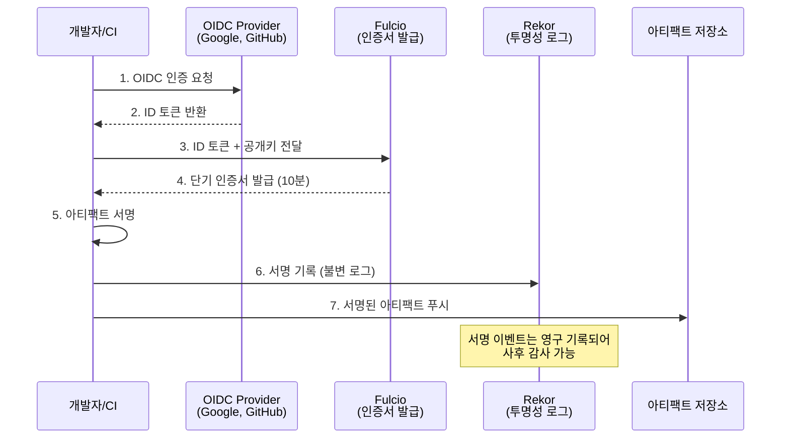

## 왜 지금 이게 문제인가

2021년 12월 Log4Shell(CVE-2021-44228)이 터졌을 때, 전 세계 보안팀이 가장 먼저 한 일은 "우리 시스템에 Log4j가 어디에 들어가 있는지" 파악하는 것이었다. 그리고 대부분 실패했다. 직접 의존성에는 없더라도, 3단계·4단계 전이 의존성(transitive dependency) 깊숙이 박혀 있는 Log4j를 찾아내는 것은 사실상 불가능했다.

이 사건은 단순한 취약점 하나가 아니라, **소프트웨어 공급망 전체의 투명성 부재**를 드러냈다. 우리가 빌드하고 배포하는 아티팩트에 정확히 무엇이 포함되어 있는지, 누가 빌드했는지, 빌드 프로세스가 변조되지 않았는지—이 기본적인 질문에 답할 수 없었다.

미국은 바로 움직였다. 2022년 바이든 행정부의 EO 14028(사이버보안 강화 행정명령)은 연방 정부에 납품하는 모든 소프트웨어에 SBOM 제출을 의무화했다. 유럽은 CRA(Cyber Resilience Act)로 응답했다. 한국도 예외가 아니다.

- **KISA 소프트웨어 공급망 보안 가이드라인**(2024): 공공기관 납품 소프트웨어의 SBOM 제출 권고
- **디지털플랫폼정부 보안 프레임워크**: 공급망 무결성 검증을 핵심 요건으로 포함
- **과기정통부 SW 공급망 보안 체계 로드맵**: 2026년까지 단계적 의무화 추진

규제가 따라오고 있다. 이제 SBOM, Sigstore, SLSA는 "알면 좋은 것"이 아니라 **시스템을 운영하는 사람이 반드시 이해해야 할 인프라**다.

## 어떻게 동작하는가

### SBOM — 소프트웨어 부품 명세서

SBOM(Software Bill of Materials)은 소프트웨어에 포함된 모든 컴포넌트의 목록이다. 자동차의 부품 명세서와 동일한 개념이다. 표준 포맷은 두 가지: **SPDX**(Linux Foundation)와 **CycloneDX**(OWASP).

`syft`로 컨테이너 이미지의 SBOM을 생성하는 것은 한 줄이면 된다:

```bash
# 컨테이너 이미지에서 SBOM 생성 (CycloneDX JSON)
syft packages registry.example.com/myapp:v1.2.3 -o cyclonedx-json > sbom.json

# 생성된 SBOM에서 알려진 취약점 스캔
grype sbom:sbom.json --only-fixed
```

SBOM 자체는 단순한 목록이다. 진짜 가치는 **취약점 발생 시 영향 범위를 수 분 내에 파악**할 수 있다는 점이다. Log4Shell 때 몇 주가 걸렸을 작업이 `grype` 한 번이면 끝난다.

### Sigstore 키리스 서명

전통적인 코드 서명의 문제는 **키 관리**다. PGP 키를 생성하고, 안전하게 보관하고, 유출 시 폐기하고, 팀원이 바뀌면 키를 로테이션하고—이 부담 때문에 대부분의 프로젝트가 서명을 포기한다.

Sigstore는 이 문제를 **키리스 서명(keyless signing)**으로 해결한다. 핵심 아이디어: 임시 인증서를 발급하고, 서명 이벤트를 변조 불가능한 투명성 로그에 기록한다.



실제 사용은 놀라울 정도로 간단하다:

```bash
# 컨테이너 이미지 서명 (GitHub Actions OIDC 자동 인증)
cosign sign --yes registry.example.com/myapp:v1.2.3

# 서명 검증
cosign verify registry.example.com/myapp:v1.2.3 \
  --certificate-identity=build@example.com \
  --certificate-oidc-issuer=https://token.actions.githubusercontent.com

# SBOM을 이미지에 첨부하고 함께 서명
cosign attest --predicate sbom.json --type cyclonedx \
  registry.example.com/myapp:v1.2.3
```

키를 생성할 필요가 없다. CI/CD 파이프라인의 OIDC 토큰이 곧 신원 증명이 되고, Rekor에 남는 로그가 "누가, 언제, 무엇을" 서명했는지의 영구적 증거가 된다.

### SLSA 프레임워크

SLSA(Supply-chain Levels for Software Artifacts, "살사"로 발음)는 **빌드 프로세스의 무결성을 단계적으로 보장**하는 프레임워크다. Google이 내부 시스템(Borg)에서 수년간 사용하던 방식을 공개한 것이다.

| 레벨 | 요구사항 | 의미 | 현실적 난이도 |
|------|---------|------|-------------|
| **SLSA 1** | 빌드 프로세스 문서화, provenance 생성 | "어떻게 빌드했는지 기록은 있다" | 낮음 (GitHub Actions만으로 가능) |
| **SLSA 2** | 호스팅된 빌드 서비스, 서명된 provenance | "빌드 환경이 관리되고 출처가 서명됨" | 중간 |
| **SLSA 3** | 격리된 빌드, 변조 방지된 provenance | "빌드 프로세스를 누구도 조작할 수 없다" | 높음 (전용 인프라 필요) |
| **SLSA 4** | 2인 리뷰, 재현 가능한 빌드 | "완전한 신뢰 체인" | 매우 높음 (대부분 미달성) |

대부분의 조직에서 현실적 목표는 **SLSA 2**다. GitHub Actions의 `slsa-github-generator`를 사용하면 별도 인프라 없이 달성 가능하다.

## 실제로 써먹을 수 있는가

### 도입하면 좋은 상황

- **공공기관·금융권 납품 소프트웨어**: KISA 가이드라인이 곧 의무화로 전환될 것이다. 선제 대응이 합리적
- **컨테이너 기반 배포 환경**: `cosign` + `syft`는 컨테이너 이미지 중심의 파이프라인과 자연스럽게 통합된다. Kubernetes admission controller로 서명 검증을 강제할 수 있다
- **오픈소스 프로젝트 메인테이너**: npm, PyPI 등 주요 패키지 레지스트리가 Sigstore 기반 서명을 지원하기 시작했다. 사용자 신뢰 확보에 직접적 효과가 있다

### 굳이 도입 안 해도 되는 상황

- **내부 전용 도구**: 배포 범위가 한정되고 빌드 파이프라인이 이미 통제된 환경이라면, SBOM·서명의 ROI가 낮다
- **프로토타이핑 단계**: MVP 검증 중에 공급망 보안 인프라를 세팅하는 것은 과잉 엔지니어링이다
- **레거시 빌드 시스템**: Ant, Make 기반의 오래된 빌드 시스템에 SLSA를 적용하려면 빌드 시스템 자체를 먼저 현대화해야 한다. 순서가 바뀌면 안 된다

### 운영 리스크

**1. SBOM 품질의 환상**: SBOM을 생성했다고 끝이 아니다. `syft`는 패키지 매니저가 인식하는 의존성만 추출한다. 벤더링된 코드, 정적 링크된 C 라이브러리, 빌드 타임에 다운로드되는 바이너리는 빠진다. KISA 감사에서 "SBOM 있습니다"라고 제출했는데 실제 구성과 불일치하면 오히려 신뢰를 잃는다.

**2. Sigstore 의존성 리스크**: Fulcio, Rekor 모두 Google이 주도하는 인프라다. 서비스 장애 시 CI/CD 파이프라인이 멈출 수 있다. 프로덕션 환경에서는 `sigstore-scaffolding`으로 프라이빗 인스턴스 운영을 검토해야 한다. 한국 기업의 경우 데이터 주권 관점에서도 자체 호스팅이 권장된다.

**3. 규제와 현실의 간극**: 한국의 소프트웨어 공급망 보안 규제는 아직 "권고" 단계지만, 공공 조달 시장에서는 사실상 필수 요건이 되어가고 있다. 문제는 대부분의 국내 SI 업체가 이 체계를 갖출 인력과 예산이 없다는 점이다. 규제가 강화되면 형식적 SBOM 제출만 난무하고 실질적 보안은 개선되지 않는 **컴플라이언스 극장**이 될 위험이 있다.

## 한 줄로 남기는 생각

> 소프트웨어 공급망 보안은 결국 "내가 배포하는 것이 정확히 무엇인지 증명할 수 있는가"라는 질문이며, 이 질문에 답하지 못하는 조직은 다음 Log4Shell에서도 똑같이 허둥댈 것이다.

---

*참고자료*
- [Sigstore 공식 문서](https://docs.sigstore.dev/)
- [SLSA 프레임워크 사양](https://slsa.dev/spec/v1.0/)
- [NIST SBOM 가이드라인 (SP 800-218)](https://csrc.nist.gov/Projects/ssdf)
- [KISA 소프트웨어 공급망 보안 가이드라인](https://www.kisa.or.kr/)
- [syft - SBOM 생성 도구](https://github.com/anchore/syft)
- [cosign - 컨테이너 서명 도구](https://github.com/sigstore/cosign)
- [Google SLSA GitHub Generator](https://github.com/slsa-framework/slsa-github-generator)
- [EO 14028 - 미국 사이버보안 행정명령](https://www.whitehouse.gov/briefing-room/presidential-actions/2021/05/12/executive-order-on-improving-the-nations-cybersecurity/)
