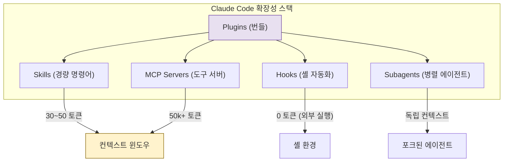

## 왜 지금 이게 문제인가

AI 코딩 도구 시장이 "누가 더 똑똑한 모델을 쓰느냐"에서 **"누가 더 유연하게 확장되느냐"**로 전선이 이동하고 있다. GitHub Copilot은 VS Code 익스텐션 생태계 위에 올라탔고, Cursor는 자체 에디터에 MCP를 통합했다. 그런데 Anthropic은 2025년 10월 9일, 전혀 다른 방향을 선택했다. **앱스토어 없이**, Git 저장소 기반의 분산형 플러그인 시스템을 퍼블릭 베타로 공개한 것이다.

핵심 질문은 이것이다: 중앙 마켓플레이스 없이 플러그인 생태계가 성립할 수 있는가?

- **락인의 문제**: VS Code Marketplace에 올린 익스텐션은 VS Code 밖에서 못 쓴다. Cursor의 MCP 설정은 Cursor 밖에서 재활용이 어렵다. 도구에 종속된 확장성은 결국 개발자의 자유도를 갉아먹는다.
- **토큰 경제학**: AI 코딩 도구에서 컨텍스트 윈도우는 곧 비용이다. 무거운 플러그인 하나가 50k 토큰을 먹으면, 정작 코드 분석에 쓸 토큰이 줄어든다. 확장성과 효율성 사이의 트레이드오프를 어떻게 설계하느냐가 기술적 분기점이다.
- **신뢰 경계**: CLI 도구에 서드파티 코드를 실행시키는 것은 본질적으로 위험하다. 샌드박싱 없이 `npm install`을 돌리는 플러그인이 나오면 그건 보안 사고다.

## 어떻게 동작하는가

### 확장성 아키텍처: Skills vs MCP vs Plugins

Claude Code의 확장성 레이어는 세 가지로 나뉜다. 각각의 무게와 역할이 명확히 다르다.



| 구분 | Skills | MCP Servers | Plugins |
|------|--------|-------------|---------|
| **토큰 비용** | 30~50 토큰 | 50,000+ 토큰 | 번들에 따라 가변 |
| **로딩 방식** | 온디맨드 (슬래시 커맨드) | 세션 시작 시 전체 로드 | 설치 시 구성요소 등록 |
| **배포 단위** | 단일 마크다운 파일 | 프로세스 (stdio/SSE) | Git 저장소 |
| **주요 용도** | 반복 워크플로우 템플릿 | 외부 시스템 연동 (DB, API) | Skills+MCP+Hooks 묶음 배포 |
| **보안 경계** | 프롬프트 주입만 가능 | 프로세스 격리 필요 | 전체 샌드박스 정책 적용 |

Skills가 혁신적인 이유는 **토큰 효율성** 때문이다. MCP 서버는 연결 시점에 도구 스키마 전체를 컨텍스트에 주입하므로 최소 수천 토큰을 소모한다. 반면 Skills는 사용자가 `/skill-name`으로 명시적으로 호출할 때만 30~50 토큰 분량의 명령어 세트가 로드된다. 10개의 MCP 서버 대신 10개의 Skills를 쓰면 컨텍스트 예산을 90% 이상 절약할 수 있다.

### Hooks와 Subagents: 자동화의 두 축

**Hooks**는 Claude Code 워크플로우의 핵심 지점에서 자동 실행되는 셸 커맨드다. LLM을 거치지 않기 때문에 토큰 비용이 0이고, 결정론적(deterministic)이다.

```json
{
  "hooks": {
    "PreToolUse": [
      {
        "matcher": "Bash",
        "command": "test \"$TOOL_INPUT\" != *'rm -rf'* || echo 'DENY: 위험한 명령어 차단'"
      }
    ],
    "PostToolUse": [
      {
        "matcher": "Write",
        "command": "npx prettier --write \"$TOOL_INPUT_FILE_PATH\""
      }
    ],
    "Notification": [
      {
        "matcher": "",
        "command": "terminal-notifier -message \"$NOTIFICATION_MESSAGE\" -title 'Claude Code'"
      }
    ]
  }
}
```

`PreToolUse` 훅으로 위험한 Bash 명령어를 사전 차단하고, `PostToolUse`로 파일 작성 후 자동 포맷팅을 걸 수 있다. CI/CD 파이프라인의 Git Hooks와 같은 사고방식이다.

**Subagents**는 메인 에이전트가 작업을 병렬 분기할 때 쓰인다. 예를 들어 대규모 리팩토링에서 "테스트 코드 분석"과 "의존성 그래프 분석"을 동시에 처리하는 식이다. 각 Subagent는 독립된 컨텍스트를 가지므로, 메인 에이전트의 토큰 예산을 잡아먹지 않는다.

### CLAUDE.md: 프로젝트 컨텍스트의 중심

`CLAUDE.md`는 프로젝트 루트에 두는 마크다운 파일로, Claude Code가 세션 시작 시 자동으로 읽는다. 코딩 컨벤션, 아키텍처 결정 기록, 금지 패턴 등을 선언한다. `.cursorrules`나 GitHub Copilot의 instructions 파일과 유사하지만, Plugins/Skills와 직접 연동된다는 점이 차별점이다.

```yaml
# CLAUDE.md 예시
# 프로젝트: 결제 서비스 v2

## 아키텍처
- Hexagonal Architecture 사용
- 모든 외부 의존성은 Port/Adapter 패턴으로 격리

## 코딩 규칙
- 에러 핸들링: panic 금지, Result<T, E> 패턴 필수
- 테스트: 모든 public 함수에 단위 테스트 필수

## 금지 패턴
- ORM의 raw SQL 직접 사용 금지
- 환경 변수 하드코딩 금지

## 활성 플러그인
- @anthropics/claude-code-eslint: 코드 작성 시 자동 린팅
- @internal/payment-domain-skills: 결제 도메인 전용 Skills
```

## 실제로 써먹을 수 있는가

### 도입하면 좋은 상황

- **반복적 워크플로우가 명확한 팀**: PR 리뷰 → 린트 → 테스트 → 커밋 메시지 생성이 매번 같은 패턴이라면, Skills + Hooks 조합이 시간을 절약한다.
- **다수의 외부 시스템과 연동하는 백엔드**: DB 스키마 조회, API 문서 참조, 로그 검색 등을 MCP 서버로 묶으면 Claude Code가 컨텍스트를 직접 가져온다.
- **사내 도구를 표준화하고 싶은 플랫폼 팀**: 플러그인을 내부 Git 저장소에 배포하면, 팀 전체가 동일한 자동화 환경을 공유할 수 있다.

### 굳이 도입 안 해도 되는 상황

- **소규모 개인 프로젝트**: CLAUDE.md 하나면 충분하다. 플러그인 오버헤드가 생산성 이득을 초과한다.
- **GUI 기반 워크플로우 중심 팀**: Claude Code는 CLI 도구다. VS Code나 JetBrains를 주력으로 쓰는 팀이라면 Copilot이나 Cursor가 더 자연스럽다.

### 운영 리스크

| 리스크 | 상세 | 완화 방안 |
|--------|------|-----------|
| **Anthropic 종속** | 플러그인 포맷이 Claude Code 전용 | Skills는 마크다운이라 이식성 높음 |
| **보안** | 서드파티 플러그인의 악성 Hooks | PreToolUse 훅으로 명령어 화이트리스트 운영 |
| **생태계 파편화** | 중앙 마켓플레이스 부재로 검색/발견이 어려움 | awesome-claude-plugins 같은 커뮤니티 목록 의존 |
| **학습 곡선** | Skills/MCP/Hooks/Subagents 각각의 개념 학습 필요 | 팀 내 챔피언 지정, 점진적 도입 |

솔직히 말해, 분산형 마켓플레이스라는 철학은 아름답지만 **발견 가능성(discoverability) 문제**를 정면으로 안고 있다. npm이 중앙 레지스트리 없이 성장했을까? Homebrew가 Tap만으로 충분했을까? Anthropic이 결국 어떤 형태의 인덱스나 레지스트리를 만들지 않으면, 생태계 성장 속도에 병목이 생길 것이다.

한국 개발자 커뮤니티 관점에서는 **네이버 클라우드, 카카오 i 등 국내 API와의 MCP 서버 연동**, 그리고 **한국어 코딩 컨벤션을 반영한 Skills 제작**이 실질적인 기여 포인트가 될 수 있다. 특히 한국어 주석/커밋 메시지 생성, 사내 Jira/Confluence 연동 Skills 같은 것들이 먼저 나올 가능성이 높다.

## 한 줄로 남기는 생각

> 확장성의 핵심은 얼마나 많은 플러그인을 설치할 수 있느냐가 아니라, 얼마나 적은 토큰으로 얼마나 많은 일을 자동화할 수 있느냐다 — Skills의 30토큰 설계가 그 답을 보여준다.

---
*참고자료*
- [Anthropic 공식 플러그인 발표](https://www.anthropic.com/news/claude-code-plugins)
- [Claude Code 플러그인 문서](https://code.claude.com/docs/en/plugins)
- [anthropics/claude-code GitHub](https://github.com/anthropics/claude-code)
- [Model Context Protocol 사양](https://modelcontextprotocol.io/)
- [Claude Code Hooks 문서](https://docs.anthropic.com/en/docs/claude-code/hooks)
