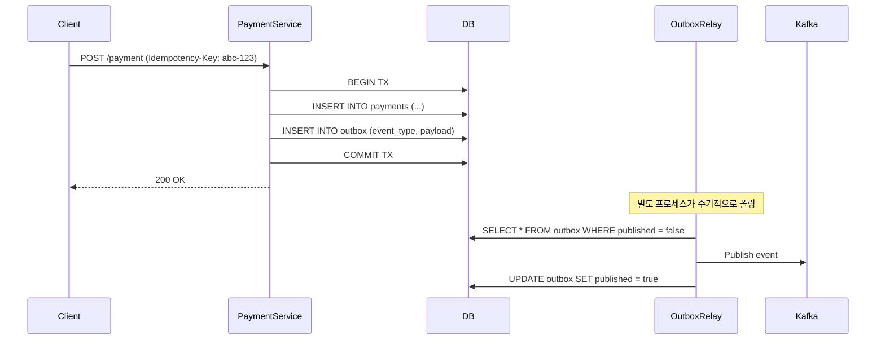

## 왜 지금 이게 문제인가

결제 시스템에서 "정확히 한 번 처리(exactly-once processing)"는 분산 시스템 엔지니어링의 성배(Holy Grail)다. 네트워크 타임아웃이 발생했을 때 요청을 재시도하면 이중 결제가 되고, 재시도하지 않으면 결제가 누락된다. Uber는 하루 수천만 건의 결제를 수백 개의 마이크로서비스가 처리하면서 이 문제를 극한까지 경험했다.

"결제가 두 번 되었습니다"라는 고객 컴플레인은 단순한 버그 리포트가 아니다. 토스나 카카오페이 같은 한국 핀테크도 동일한 문제에 직면한다. PG사 연동에서 타임아웃이 걸렸을 때, 그 결제가 성공한 건지 실패한 건지 확인하는 로직 하나가 수억 원의 차이를 만든다.

핵심 문제는 다음과 같다:

- **네트워크는 신뢰할 수 없다**: TCP 커넥션이 끊겨도 서버 측에서 처리가 완료됐을 수 있다. 클라이언트는 알 수 없다.
- **Dual-Write 문제**: DB에 결제 상태를 저장하고 → 메시지 큐에 이벤트를 발행하는 두 단계가 원자적으로 실행되지 않는다. DB 커밋은 됐는데 카프카 발행이 실패하면? 데이터 불일치가 발생한다.
- **마이크로서비스 체인의 복잡성**: Uber의 결제 흐름은 인증 → 캡처 → 정산 → 알림까지 여러 서비스를 거친다. 어느 한 지점에서라도 실패하면 전체 트랜잭션의 일관성이 깨진다.

Uber가 2019년부터 공개해 온 결제 시스템 아키텍처는 이 문제를 세 가지 메커니즘—**멱등성 키, Cadence 워크플로 엔진, Outbox 패턴**—으로 해결한다. 각각이 독립적으로도 가치 있지만, 셋을 조합했을 때 비로소 "exactly-once" 시맨틱에 가까워진다.

## 어떻게 동작하는가

### 멱등성 키(Idempotency Key): 재시도를 안전하게 만드는 첫 번째 방어선

멱등성의 원리는 단순하다. 같은 요청을 여러 번 보내도 결과가 동일해야 한다. Uber는 모든 결제 API 호출에 클라이언트가 생성한 고유한 `Idempotency-Key`를 포함하도록 강제한다.

```go
// 멱등성 키를 활용한 결제 처리 (Go 예시)
func ProcessPayment(ctx context.Context, req PaymentRequest) (*PaymentResult, error) {
    // 1. 멱등성 키로 이전 처리 결과 조회
    existing, err := idempotencyStore.Get(ctx, req.IdempotencyKey)
    if err == nil && existing != nil {
        // 이미 처리된 요청 → 저장된 결과를 그대로 반환
        return existing.Result, nil
    }

    // 2. 비관적 락 획득 (동시 요청 방지)
    lock, err := idempotencyStore.AcquireLock(ctx, req.IdempotencyKey, 30*time.Second)
    if err != nil {
        return nil, ErrConcurrentRequest
    }
    defer lock.Release(ctx)

    // 3. 결제 처리 (외부 PG사 호출 포함)
    result, err := executePayment(ctx, req)
    if err != nil {
        // 재시도 가능한 에러만 기록하지 않음 → 다음 재시도 허용
        if isRetryable(err) {
            return nil, err
        }
        // 비재시도 에러는 결과로 기록 → 같은 키로 재시도해도 같은 에러 반환
        idempotencyStore.Save(ctx, req.IdempotencyKey, &IdempotencyRecord{
            Result: nil, Error: err,
        })
        return nil, err
    }

    // 4. 성공 결과 저장
    idempotencyStore.Save(ctx, req.IdempotencyKey, &IdempotencyRecord{
        Result: result,
    })
    return result, nil
}
```

여기서 놓치기 쉬운 포인트가 있다. **3번 단계에서 PG사 호출은 성공했는데 4번의 Save가 실패하면?** 다음 재시도 시 1번에서 기존 결과를 찾지 못하고, 3번을 다시 실행해 이중 결제가 발생한다. 멱등성 키만으로는 부족한 이유가 여기에 있다.

### Outbox 패턴: Dual-Write 문제의 해결

Uber는 **Transactional Outbox 패턴**으로 DB 쓰기와 이벤트 발행의 원자성을 보장한다. 핵심 아이디어는 간단하다: 이벤트를 카프카로 직접 보내지 않고, **DB의 outbox 테이블에 같은 트랜잭션으로 함께 기록**한다.



이 패턴의 핵심은 **결제 상태 변경과 이벤트 기록이 하나의 DB 트랜잭션**으로 묶인다는 것이다. DB 커밋이 성공하면 이벤트도 반드시 존재하고, 실패하면 둘 다 롤백된다. Outbox Relay가 카프카 발행에 실패해도 DB에 이벤트가 남아 있으므로 재시도하면 된다. 결과적으로 "at-least-once delivery"가 보장되고, 소비자 측 멱등성 처리와 결합하면 "exactly-once"를 달성한다.

### Cadence/Temporal: 장기 실행 워크플로의 오케스트레이션

Uber가 자체 개발한 **Cadence**(현재는 오픈소스 포크인 **Temporal**로 더 유명하다)는 결제처럼 여러 단계를 거치는 장기 실행 워크플로를 안정적으로 관리한다. 핵심 특성은 다음과 같다:

| 특성 | 전통적 사가 패턴 | Cadence/Temporal |
|------|-----------------|-----------------|
| 상태 관리 | 개발자가 직접 DB에 저장 | 프레임워크가 자동 영속화 |
| 재시도 정책 | 각 서비스가 개별 구현 | 워크플로 레벨에서 선언적 설정 |
| 타임아웃 처리 | 크론잡 + 상태 머신 | 네이티브 타이머 (수일~수개월 가능) |
| 보상 트랜잭션 | 수동 구현, 누락 위험 | 워크플로 코드에서 try-catch로 처리 |
| 관측 가능성 | 로그 추적이 어려움 | 워크플로 히스토리 전체 조회 가능 |

Cadence가 해결하는 가장 큰 문제는 **"프로세스가 죽어도 워크플로가 이어진다"**는 것이다. 결제 승인 후 서버가 재시작되어도, Cadence는 마지막으로 완료된 액티비티 이후부터 워크플로를 재개한다. 각 액티비티의 결과가 이벤트 소싱 방식으로 영속화되기 때문에, 이미 실행된 단계는 다시 실행하지 않는다.

## 실제로 써먹을 수 있는가

### 도입하면 좋은 상황

- **결제·정산·송금처럼 금전적 정확성이 필수인 시스템**: 토스의 송금 시스템, 쿠팡이츠의 정산 파이프라인 같은 곳에서 Outbox + 멱등성 조합은 이미 사실상 표준이다.
- **여러 외부 시스템을 순차적으로 호출하는 워크플로**: PG사 승인 → 포인트 차감 → 쿠폰 사용 처리처럼 보상 트랜잭션이 필요한 흐름이라면 Temporal 도입을 고려할 가치가 있다.
- **하루 수십만 건 이상의 트랜잭션을 처리하는 규모**: 멱등성 키 저장소의 운영 부담을 감수할 만한 규모여야 한다.

### 굳이 도입 안 해도 되는 상황

- **단일 DB에서 모든 것을 처리할 수 있는 규모**: 모놀리스 + 단일 트랜잭션으로 충분하다면 Outbox 패턴은 과잉 엔지니어링이다. 한국 스타트업의 80%는 여기에 해당한다.
- **결과적 일관성(eventual consistency)이 허용되는 도메인**: 알림, 로그, 추천 같은 시스템에서 exactly-once를 추구하는 것은 비용 대비 효과가 낮다.
- **Temporal 클러스터 운영 인력이 없는 팀**: Temporal 자체가 Cassandra + Elasticsearch + 복수 서비스로 구성된 분산 시스템이다. 운영할 팀이 없으면 Temporal Cloud SaaS를 쓰거나 차라리 사가 패턴을 직접 구현하는 편이 낫다.

### 운영 리스크

1. **멱등성 키 저장소의 핫스팟**: 블랙프라이데이, 쿠팡 로켓와우 세일 같은 트래픽 급증 시 멱등성 키 조회가 병목이 된다. Redis를 쓴다면 클러스터 샤딩 전략이 필수이고, TTL을 너무 짧게 잡으면 멱등성이 깨지고 너무 길게 잡으면 메모리가 폭발한다. Uber는 7일 TTL을 사용하는 것으로 알려져 있다.

2. **Outbox Relay의 지연과 순서 보장**: Outbox 테이블을 폴링하는 Relay 프로세스가 지연되면 다운스트림 서비스가 오래된 상태를 참조하게 된다. CDC(Change Data Capture) 기반—Debezium 같은—으로 전환하면 지연은 줄지만, 운영 복잡도가 한 단계 올라간다. 카카오페이 규모에서는 CDC가 사실상 필수다.

3. **Temporal 워크플로의 논결정적(non-deterministic) 버그**: Temporal 워크플로 코드에서 `time.Now()`를 호출하거나 랜덤 값을 사용하면 리플레이 시 다른 경로를 타게 된다. 이 버그는 **프로덕션에서만** 나타나고 디버깅이 극도로 어렵다. 한국 팀들이 Temporal을 도입할 때 가장 많이 겪는 함정이 이것이다.

## 한 줄로 남기는 생각

> Exactly-once는 단일 메커니즘으로 달성되는 것이 아니라, 멱등성·Outbox·워크플로 엔진이라는 세 겹의 안전장치가 각각의 실패 모드를 보완할 때 비로소 가능해진다.

---
*참고자료*
- [Uber Engineering: Avoiding Double Payments in a Distributed Payments System](https://eng.uber.com/distributed-payments/)
- [Uber Cadence: Fault-Tolerant Workflow Orchestration](https://cadenceworkflow.io/)
- [Temporal.io Documentation](https://docs.temporal.io/)
- [Martin Kleppmann - Designing Data-Intensive Applications, Chapter 11](https://dataintensive.net/)
- [Microservices Patterns: Transactional Outbox by Chris Richardson](https://microservices.io/patterns/data/transactional-outbox.html)
- [Debezium CDC Documentation](https://debezium.io/documentation/)
