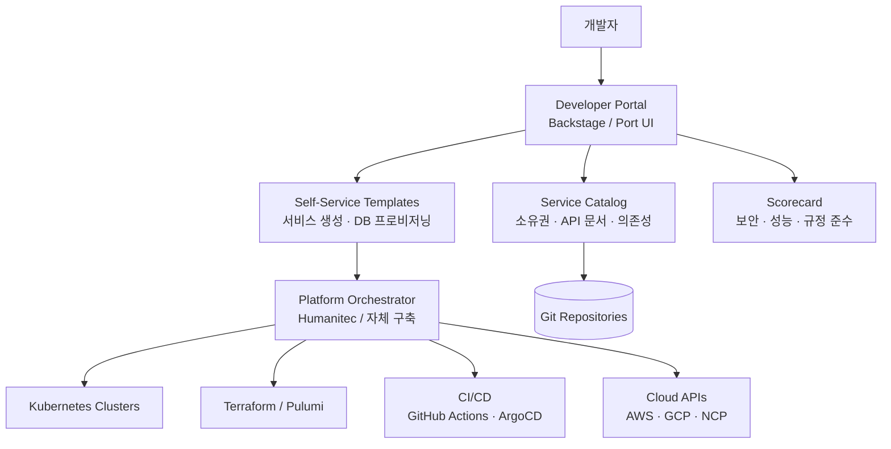

## 왜 지금 이게 문제인가

"개발자가 YAML 100줄 안 쓰고 서비스를 배포할 수 있어야 한다." Spotify가 Backstage를 오픈소스로 공개하면서 던진 이 문장이 업계를 관통했다. 2024년부터 Platform Engineering은 단순 유행어를 넘어 조직 설계의 핵심 의제가 됐다. Gartner는 2026년까지 대형 소프트웨어 조직의 80%가 플랫폼 엔지니어링 팀을 운영할 것으로 전망했고, 실제로 그 수치에 근접하고 있다.

문제의 본질은 간단하다. 마이크로서비스, Kubernetes, GitOps, 다중 클라우드 — 클라우드 네이티브 스택이 복잡해질수록 **개발자의 인지 부하(cognitive load)** 가 한계를 넘기 시작했다. 백엔드 개발자가 Helm 차트를 이해하고, Terraform 모듈을 수정하고, ArgoCD 싱크 상태를 모니터링해야 하는 상황은 "풀스택"이 아니라 **풀스트레스**다.

- **DevOps의 역설**: "You build it, you run it"이라는 원칙이 실제로는 "너도 인프라 알아야 해"로 변질됐다. DevOps 엔지니어를 채용하려 해도 시장 자체가 말라있다.
- **온보딩 비용의 폭발**: 신규 입사자가 첫 PR을 올리는 데까지 걸리는 시간이 2주를 넘기면 조직 효율이 급격히 떨어진다. 사내 위키와 Slack 히스토리를 뒤지는 시간이 코딩 시간보다 많다.
- **한국적 맥락**: 배민(우아한형제들), 토스(비바리퍼블리카), 당근은 각각 수백 명의 개발자를 운용하면서 이 문제에 직면했다. 특히 토스는 500개 이상의 마이크로서비스를 운영하며, 플랫폼팀 없이는 개발 속도 자체가 유지 불가능한 구조다.

Internal Developer Platform(IDP)은 이 문제에 대한 업계의 대답이다. 핵심 아이디어는 단순하다: **인프라 복잡성을 추상화하고, 개발자에게 "황금 경로(Golden Path)"를 제공하라.**

## 어떻게 동작하는가

### IDP 아키텍처의 핵심 구조

IDP는 크게 세 레이어로 나뉜다: 개발자 포털(UI), 오케스트레이터(비즈니스 로직), 인프라 통합 레이어.



이 구조에서 개발자는 Portal만 바라본다. "Spring Boot 서비스 하나 띄워줘"라고 템플릿을 실행하면, 뒤에서 레포 생성 → CI 파이프라인 연결 → Kubernetes 네임스페이스 할당 → 모니터링 대시보드 생성까지 자동으로 처리된다.

### Backstage catalog-info.yaml 예시

Backstage는 모든 소프트웨어 자산을 `catalog-info.yaml`로 관리한다. 이 파일이 레포 루트에 있으면 Backstage가 자동으로 인식한다.

```yaml
apiVersion: backstage.io/v1alpha1
kind: Component
metadata:
  name: payment-service
  description: 결제 처리 핵심 서비스
  annotations:
    github.com/project-slug: myorg/payment-service
    backstage.io/techdocs-ref: dir:.
    pagerduty.com/service-id: P3BZ1K9
  tags:
    - java
    - spring-boot
    - critical
spec:
  type: service
  lifecycle: production
  owner: team-payment
  system: checkout-system
  dependsOn:
    - resource:payment-db
    - component:user-service
  providesApis:
    - payment-api-v2
```

이 선언 하나로 소유권, 의존성 그래프, API 문서, 온콜 연동까지 자동 연결된다. 핵심은 **코드 옆에 메타데이터를 두는 것** — 별도 CMDB를 관리하지 않아도 된다.

### 주요 IDP 솔루션 비교

| 항목 | Backstage (Spotify) | Port | Humanitec |
|------|-------------------|------|-----------|
| **라이선스** | 오픈소스 (Apache 2.0) | 상용 (무료 티어 있음) | 상용 |
| **핵심 강점** | 플러그인 생태계, 커뮤니티 | 즉시 사용 가능한 UI/UX | Platform Orchestrator |
| **서비스 카탈로그** | 강력 (핵심 기능) | 강력 + 스코어카드 | 기본 수준 |
| **셀프서비스** | Scaffolder 플러그인 | 액션 엔진 내장 | Score 기반 추상화 |
| **인프라 오케스트레이션** | 직접 구현 필요 | Webhook/자동화 연동 | 네이티브 지원 (핵심) |
| **도입 난이도** | 높음 (React 개발 필요) | 낮음 | 중간 |
| **한국 도입 사례** | 카카오, 라인 계열 일부 | 아직 드묾 | 거의 없음 |
| **적합 조직** | 200명+ 대규모 엔지니어링 | 50~200명 중규모 | 인프라 추상화가 급한 조직 |

솔직히 말하면, Backstage는 "프레임워크"에 가깝고 Port는 "제품"에 가깝다. Backstage를 제대로 운영하려면 전담 프론트엔드 개발자가 최소 1~2명 필요하다. 이 점을 간과하고 도입했다가 반쯤 완성된 포털만 남은 팀을 여럿 봤다.

## 실제로 써먹을 수 있는가

### 도입하면 좋은 상황

- 개발자 200명 이상, 마이크로서비스 50개 이상인 조직
- "이 서비스 누가 담당이지?" 질문이 Slack에서 주 3회 이상 발생하는 환경
- 신규 서비스 생성 시 인프라팀 티켓을 끊고 3일 이상 기다리는 구조
- 배민처럼 배포 파이프라인 표준화로 개발 속도를 측정 가능하게 만들고 싶은 조직

### 굳이 도입 안 해도 되는 상황

- 개발자 30명 이하, 모놀리스 또는 서비스 10개 미만
- 이미 Terraform 모듈 + 잘 관리된 Cookiecutter 템플릿으로 충분히 돌아가는 팀
- "플랫폼팀"에 배정할 시니어 엔지니어가 2명 미만인 경우 — IDP 구축 자체가 프로젝트가 돼버린다

### 운영 리스크

**1. Golden Path가 Golden Cage가 되는 순간.** 표준 경로를 강제하면 개발자 자율성이 훼손된다. 토스는 이 문제를 "가드레일(Guardrail)" 접근으로 풀었다 — 표준 경로를 권장하되 벗어나는 것도 허용하고, 대신 보안/성능 스코어카드로 가시성을 확보한다. **강제하면 반발하고, 방치하면 혼돈.** 이 균형을 못 잡으면 IDP는 실패한다.

**2. 플랫폼팀의 "내부 제품" 함정.** IDP를 만드는 플랫폼팀은 사실상 내부 SaaS를 운영하는 것이다. 사용자(개발자)의 피드백을 수집하고, 로드맵을 관리하고, SLA를 보장해야 한다. 당근의 플랫폼팀은 분기마다 내부 NPS를 측정하고, 개발자 인터뷰를 정기적으로 수행한다. 이걸 "그냥 인프라 도구 만드는 팀"으로 접근하면 아무도 안 쓰는 포털이 된다.

**3. 메타데이터 부패(Metadata Rot).** `catalog-info.yaml`을 처음에는 열심히 작성하지만, 시간이 지나면 실제 아키텍처와 괴리가 발생한다. CI에서 메타데이터 유효성 검증을 강제하거나, 런타임 디스커버리와 동기화하는 메커니즘이 없으면 서비스 카탈로그는 6개월 안에 쓰레기가 된다.

## 한 줄로 남기는 생각

> IDP는 도구가 아니라 조직의 결정이다 — "개발자에게 어디까지 맡기고, 어디부터 플랫폼이 책임질 것인가"라는 질문에 대한 답이 먼저다.

---
*참고자료*
- [Backstage.io 공식 문서](https://backstage.io/docs/overview/what-is-backstage)
- [CNCF Platform Engineering Maturity Model](https://tag-app-delivery.cncf.io/whitepapers/platform-eng-maturity-model/)
- [Humanitec Platform Orchestrator 문서](https://developer.humanitec.com/introduction/overview/)
- [Port - Internal Developer Portal](https://www.getport.io/)
- [Team Topologies — Matthew Skelton, Manuel Pais](https://teamtopologies.com/)
- [Gartner: Top Strategic Technology Trends 2024 — Platform Engineering](https://www.gartner.com/en/articles/gartner-top-10-strategic-technology-trends-for-2024)
- [토스 기술 블로그 — 플랫폼 엔지니어링](https://toss.tech/)
- [우아한형제들 기술 블로그](https://techblog.woowahan.com/)
