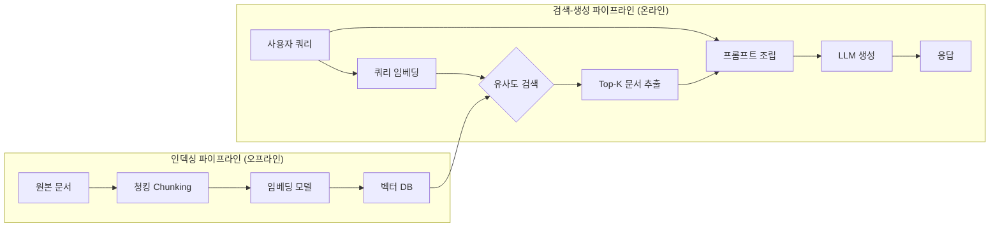

## 왜 지금 이게 문제인가

LLM을 프로덕션에 올린 팀이라면 반드시 한 번은 이 질문과 마주친다. "우리 도메인 데이터를 모델에 주입하려면, RAG를 쓸까 Fine-tuning을 할까?" 그리고 대부분은 **직감으로 결정한 뒤 나중에 후회한다.**

문제는 두 접근법이 해결하는 문제 자체가 다르다는 점이다. RAG는 "모델이 모르는 최신 정보를 실시간으로 보충"하는 것이고, Fine-tuning은 "모델의 행동 패턴과 출력 형식을 바꾸는 것"이다. 법률 AI에 판례 검색이 필요한 건 RAG 영역이고, 법률 문서 특유의 어투와 형식으로 답변하게 만드는 건 Fine-tuning 영역이다. 하지만 실무에서는 이 구분이 깔끔하지 않다.

- **RAG가 만능이라는 착각**: 컨텍스트 윈도우에 문서를 때려 넣으면 다 된다고 생각하지만, 청크 분할이 잘못되면 핵심 맥락이 잘리고, 임베딩 모델이 한국어를 제대로 처리 못 하면 검색 품질이 바닥을 친다.
- **Fine-tuning 비용의 함정**: A100 GPU 수십 시간 돌리는 비용보다 더 큰 건 **학습 데이터 큐레이션 비용**이다. 한국 법률 데이터를 정제하는 데 변호사 인건비가 GPU 비용의 3~5배가 든다.
- **하이브리드가 정답이라는 뻔한 결론**: 맞다, 대부분 하이브리드가 낫다. 하지만 **어떤 비율로, 어떤 순서로** 조합하느냐가 진짜 질문이다.

## 어떻게 동작하는가

### RAG 파이프라인의 실체

RAG는 단순해 보이지만 파이프라인 전체를 직접 운영하면 복잡도가 폭발한다.



벡터 DB 선택부터가 전쟁이다:

| 구분 | Pinecone | Weaviate | pgvector |
| :--- | :--- | :--- | :--- |
| **관리 부담** | 완전 매니지드 | 셀프 호스팅 가능 | 기존 PostgreSQL 확장 |
| **스케일** | 수십억 벡터 | 수억 벡터 | 수백만 벡터 |
| **비용 (월)** | $70~$700+ | 인프라 비용 | PostgreSQL 비용만 |
| **한국어 지원** | 임베딩 모델 의존 | 커스텀 토크나이저 | 임베딩 모델 의존 |
| **추천 시나리오** | 빠른 PoC, 스케일 중요 | 온프레미스 필수 | 이미 PostgreSQL 사용 중 |

**청킹 전략**이 RAG 품질의 80%를 결정한다. 한국어는 특히 까다롭다. 영어처럼 문단 단위로 자르면 한국어 법률 문서의 "제1조 내지 제5조를 준용한다"같은 참조 구조가 깨진다. **시맨틱 청킹**(의미 단위 분할)과 **오버래핑 윈도우**(앞뒤 128토큰 중첩)를 병행해야 한다.

```python
from langchain.text_splitter import RecursiveCharacterTextSplitter
from openai import OpenAI
import numpy as np

# 한국어 법률 문서용 청킹 설정
splitter = RecursiveCharacterTextSplitter(
    chunk_size=512,
    chunk_overlap=128,  # 한국어 참조 구조 보존
    separators=["\n\n", "\n", "다.", "요.", " "],  # 한국어 종결어미 기준
)

client = OpenAI()

def retrieve_and_generate(query: str, chunks: list[str], top_k: int = 5):
    # 1. 쿼리 임베딩
    q_emb = client.embeddings.create(
        model="text-embedding-3-large", input=query
    ).data[0].embedding

    # 2. 코사인 유사도 기반 검색
    chunk_embs = [
        client.embeddings.create(model="text-embedding-3-large", input=c)
        .data[0].embedding for c in chunks
    ]
    scores = [np.dot(q_emb, c) for c in chunk_embs]
    top_indices = np.argsort(scores)[-top_k:][::-1]
    context = "\n---\n".join([chunks[i] for i in top_indices])

    # 3. 컨텍스트 주입 후 생성
    response = client.chat.completions.create(
        model="gpt-4o",
        messages=[
            {"role": "system", "content": f"다음 문서를 참고하여 답변하세요:\n{context}"},
            {"role": "user", "content": query},
        ],
    )
    return response.choices[0].message.content
```

### Fine-tuning의 실체

Fine-tuning은 모델의 가중치를 직접 수정한다. LoRA(Low-Rank Adaptation)가 사실상 표준이 되면서 전체 파라미터를 건드릴 필요는 없어졌지만, 핵심 비용은 **데이터 준비**에 있다.

한국 실무에서 Fine-tuning이 빛나는 순간은 명확하다:
- **출력 형식 고정**: 금융 리포트를 항상 특정 양식으로 생성해야 할 때
- **도메인 어투 학습**: 법률 자문 답변이 "~입니다"가 아니라 "~할 것으로 사료됩니다"여야 할 때
- **소규모 분류 태스크**: 고객 문의를 15개 카테고리로 정확히 분류할 때

### 하이브리드: 둘 다 쓰는 전략

실무에서 가장 효과적인 패턴은 **Fine-tuned 모델 + RAG 파이프라인** 조합이다. Fine-tuning으로 도메인 어투와 출력 형식을 학습시키고, RAG로 최신 데이터를 주입한다. 뤼튼(Wrtn)이나 업스테이지(Upstage)의 법률/금융 서비스가 이 패턴을 쓴다.

## 실제로 써먹을 수 있는가

### 의사결정 매트릭스

| 상황 | RAG | Fine-tuning | Hybrid | 근거 |
| :--- | :---: | :---: | :---: | :--- |
| 최신 정보 반영 필수 | **◎** | ✕ | ○ | 모델 재학습 없이 DB만 업데이트 |
| 출력 형식/어투 통일 | ✕ | **◎** | ○ | 프롬프트만으로는 일관성 한계 |
| 대규모 문서 검색 | **◎** | ✕ | ○ | Fine-tuning으로 지식 주입은 비효율 |
| 분류/태깅 정확도 | △ | **◎** | ○ | 소규모 태스크는 Fine-tuning이 압도적 |
| 법률 AI (판례 기반) | ○ | △ | **◎** | 판례 검색(RAG) + 법률 어투(FT) |
| 금융 리포트 생성 | ○ | ○ | **◎** | 실시간 시세(RAG) + 리포트 양식(FT) |
| 고객 상담 봇 | **◎** | △ | ○ | FAQ DB 검색이 핵심, 어투는 프롬프트로 충분 |

### 한국 실무 사례별 분석

**법률 AI**: 리걸테크 스타트업들이 판례 검색에 RAG를 쓰지만, 한국 법률 문서의 참조 구조("동법 제3조 제2항 참조")가 청킹 시 끊기는 문제가 반복된다. **계층적 청킹**(조-항-호 단위)과 메타데이터 필터링을 병행해야 실용 수준에 도달한다.

**금융 AI**: 실시간 시장 데이터는 RAG로, 애널리스트 리포트 형식은 Fine-tuning으로 해결하는 하이브리드가 사실상 유일한 선택이다. 업스테이지 Solar 기반으로 금융 특화 모델을 Fine-tuning한 후 RAG를 얹는 패턴이 늘고 있다.

**고객 상담 봇**: 카카오 채널 연동 상담 봇은 FAQ 데이터베이스가 자주 바뀌므로 RAG가 적합하다. Fine-tuning까지 가는 건 과잉 투자인 경우가 많다.

### 비용 현실 체크

| 항목 | RAG | Fine-tuning (LoRA) | Hybrid |
| :--- | :--- | :--- | :--- |
| **초기 구축** | 벡터 DB 세팅 2~4주 | 데이터 큐레이션 4~8주 | 6~12주 |
| **인프라 (월)** | $200~$2,000 (벡터 DB + 임베딩 API) | $0 (학습 후 추론만) | $200~$2,000 |
| **GPU 학습 비용** | $0 | $500~$5,000 (A100 기준, 1회) | $500~$5,000 |
| **데이터 준비 인건비** | 낮음 (문서 수집) | **높음** (라벨링, 검수) | 높음 |
| **업데이트 주기** | 실시간 가능 | 재학습 필요 (주~월 단위) | 혼합 |
| **숨겨진 비용** | 임베딩 API 호출량 폭증 | 학습 데이터 품질 관리 | 양쪽 다 |

### 운영 리스크

RAG의 최대 리스크는 **검색 실패의 무음 전파(Silent Propagation)**다. 관련 문서를 못 찾아도 LLM은 자신 있게 답변한다. 검색 품질 모니터링 없이 RAG를 운영하면, 환각을 RAG로 줄이겠다던 원래 목표가 무색해진다.

Fine-tuning의 리스크는 **데이터 드리프트**다. 학습 시점의 데이터와 실제 서비스 데이터가 괴리되면 성능이 서서히 열화된다. 한국 법률은 매년 수백 건의 개정이 일어나는데, 분기마다 재학습하지 않으면 모델이 폐지된 조항을 인용하는 사고가 발생한다.

## 한 줄로 남기는 생각

> RAG는 "무엇을 아는가"의 문제를 풀고, Fine-tuning은 "어떻게 말하는가"의 문제를 푼다 — 둘을 혼동하는 순간 비용만 두 배가 된다.

---

*참고자료*
- [Retrieval-Augmented Generation for Knowledge-Intensive NLP Tasks (Lewis et al.)](https://arxiv.org/abs/2005.11401)
- [LoRA: Low-Rank Adaptation of Large Language Models](https://arxiv.org/abs/2106.09685)
- [Pinecone Documentation - Chunking Strategies](https://docs.pinecone.io/guides/data/chunking-strategies)
- [Upstage Solar 기술 블로그](https://www.upstage.ai/blog)
- [LangChain RAG Tutorial](https://python.langchain.com/docs/tutorials/rag/)
- [pgvector GitHub Repository](https://github.com/pgvector/pgvector)
