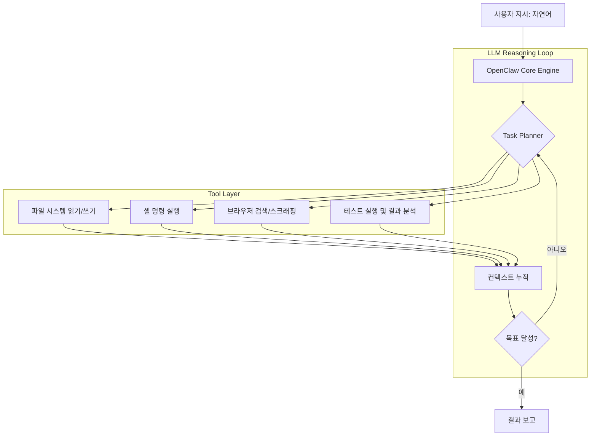

## 왜 지금 이게 문제인가

2025년 11월, 오스트리아 개발자 Peter Steinberger가 "Clawdbot"이라는 이름으로 오픈소스 AI 에이전트를 공개했다. 터미널에서 코드를 읽고, 브라우저를 돌리고, 테스트를 실행하는 -- 말 그대로 **'행동하는' AI 에이전트**였다. 이름이 Anthropic의 Claude와 너무 유사하다는 법적 경고를 받아 "OpenClaw(오픈클로)"로 리브랜딩한 뒤, 2026년 1월 말 갑자기 바이럴을 탔다. **72시간 만에 GitHub 60,000 스타.** 2026년 3월 3일 기준 **250,829 스타**로, React가 10년에 걸쳐 쌓은 기록을 3개월 만에 넘어섰다.

그런데 진짜 사건은 그 이후에 터졌다. 2026년 2월 14일, Sam Altman이 직접 트위터에서 Peter Steinberger의 OpenAI 합류를 발표했다. 오픈소스 AI 에이전트의 상징적 인물이 가장 공격적인 상용 AI 기업으로 이직한 것이다. 프로젝트는 독립 오픈소스 재단으로 이전됐지만, 커뮤니티에는 불안감이 퍼지고 있다.

스타 숫자는 인상적하다. 하지만 시니어 엔지니어가 물어야 할 질문은 다르다: **이 프로젝트는 창시자 없이 살아남을 수 있는가?**

## 어떻게 동작하는가

### 아키텍처: 대화가 아닌 '행동'하는 에이전트

OpenClaw의 핵심 차별점은 LLM을 "대화 상대"가 아니라 **"실행 엔진의 두뇌"**로 사용한다는 점이다. 사용자가 자연어로 작업을 지시하면, OpenClaw는 이를 구체적인 도구 호출 시퀀스로 변환하여 실행한다.



설치와 사용은 직관적이다:

```bash
# 설치
npm install -g openclaw

# API 키 설정
export ANTHROPIC_API_KEY="sk-..."  # 또는 OPENAI_API_KEY

# 프로젝트 디렉토리에서 실행
cd my-project
openclaw

# 자연어로 작업 지시
> 이 프로젝트의 테스트를 전부 실행하고, 실패하는 테스트를 분석해서 수정해줘
> src/auth 모듈의 보안 취약점을 점검해줘
> README.md를 프로젝트 구조에 맞게 업데이트해줘
```

핵심은 **에이전트 루프(Agentic Loop)**다. 한 번의 프롬프트-응답이 아니라, "계획 -> 실행 -> 관찰 -> 재계획"을 반복하며 복잡한 작업을 자율적으로 완수한다. 파일을 읽다가 의존성이 빠져있으면 스스로 설치하고, 테스트가 실패하면 에러 메시지를 분석해서 코드를 수정한다.

### Claude Code와의 차이점

가장 자주 받는 질문이다. 둘 다 CLI 기반 AI 에이전트인데, 뭐가 다른가?

| 구분 | OpenClaw | Claude Code | Cursor |
| :--- | :--- | :--- | :--- |
| **라이선스** | Apache 2.0 (오픈소스) | 독점 (Anthropic) | 독점 (Anysphere) |
| **LLM 백엔드** | 멀티 프로바이더 (Claude, GPT, Gemini, 로컬 모델) | Claude 전용 | 멀티 프로바이더 |
| **인터페이스** | CLI | CLI | GUI (VS Code 포크) |
| **확장성** | 플러그인 시스템, 커스텀 도구 추가 가능 | 제한적 | 확장 가능하나 폐쇄적 |
| **비용** | API 비용만 (도구 자체 무료) | Pro 구독 + API 비용 | 월 $20 구독 + API 비용 |
| **오프라인/로컬** | Ollama 등 로컬 모델 지원 | 불가 | 제한적 |
| **거버넌스** | 오픈소스 재단 | Anthropic 단독 | Anysphere 단독 |

핵심 차이는 **벤더 종속(Vendor Lock-in)**이다. Claude Code는 Anthropic 생태계에 완전히 묶여 있고, Cursor는 자체 에디터를 강제한다. OpenClaw는 어떤 LLM이든 꽂을 수 있고, 기존 워크플로우에 끼워 넣기가 쉽다. 대신 Claude Code는 Anthropic이 자사 모델에 최적화한 만큼 **Claude 모델과의 궁합이 압도적으로 좋다.** 결국 "자유도를 취할 것인가, 최적화를 취할 것인가"의 문제다.

### 오픈소스 재단 모델: 지속 가능성의 실험

Peter Steinberger가 OpenAI로 떠나면서 프로젝트는 독립 오픈소스 재단(OpenClaw Foundation)으로 이전됐다. 재단 모델 자체는 Linux Foundation이나 Apache Foundation의 선례가 있으니 새롭지 않다. 문제는 **타이밍과 맥락**이다.

프로젝트가 폭발적으로 성장하는 시점에 핵심 메인테이너가 빠졌다. 코드베이스에 대한 가장 깊은 이해를 가진 사람이 경쟁사로 간 것이다. 재단에 남은 코어 컨트리뷰터가 이 속도의 성장을 감당할 수 있을지, 그리고 OpenAI가 내부적으로 OpenClaw의 아이디어를 흡수한 경쟁 제품을 내놓을 때 재단이 버틸 수 있을지는 아직 미지수다.

## 실제로 써먹을 수 있는가

### 도입하면 좋은 상황

- **멀티 LLM 전략이 필요한 팀**: 프로젝트마다 Claude, GPT, Gemini를 선택적으로 쓰고 싶다면 OpenClaw의 멀티 프로바이더 지원이 결정적이다.
- **사내 보안 정책으로 로컬 모델이 필수인 경우**: Ollama와 연동하여 코드가 외부로 나가지 않는 환경을 구축할 수 있다.
- **CI/CD 파이프라인에 에이전트를 통합하려는 경우**: CLI 기반이라 GitHub Actions, Jenkins 등에 자연스럽게 끼워 넣을 수 있다.
- **바이브 코딩으로 프로토타이핑 속도를 높이려는 스타트업**: 자연어로 "이 API에 rate limiting 추가해줘"를 던지면 실제로 구현까지 해주는 워크플로우는 초기 스타트업에서 생산성을 극적으로 높인다.

### 굳이 도입 안 해도 되는 상황

- **이미 Claude Code나 Cursor에 팀이 안착한 경우**: 도구를 바꾸는 전환 비용이 OpenClaw의 자유도가 주는 이점보다 클 수 있다.
- **단순 코드 자동완성만 필요한 경우**: 에이전트 루프가 필요 없는 수준의 작업이라면 GitHub Copilot으로 충분하다.
- **엔터프라이즈 SLA가 필요한 경우**: 오픈소스 재단이 24/7 지원을 보장하지는 않는다.

### 운영 리스크

**1. 창시자 이탈의 그림자**
Peter Steinberger는 단순한 메인테이너가 아니라 프로젝트의 비전을 정의한 사람이었다. 오픈소스 역사에서 창시자 이탈 후 프로젝트가 성공적으로 이어진 사례(Node.js의 Ryan Dahl)도 있지만, 방향을 잃고 포크 전쟁에 빠진 사례(io.js 분열기)도 있다. 현재 OpenClaw 재단의 거버넌스 구조가 얼마나 견고한지가 향후 1년을 결정할 것이다.

**2. 기업 포획(Corporate Capture) 위험**
OpenAI가 Steinberger를 데려간 것은 그의 역량을 원한 것이기도 하지만, 오픈소스 경쟁자를 약화시키는 전략적 효과도 있다. 이것이 의도적이든 아니든, 결과적으로 OpenClaw 커뮤니티는 가장 중요한 기여자를 잃었다.

**3. 한국 커뮤니티의 빠른 도입**
한국에서의 반응은 뜨겁다. **OpenClaw KR** 커뮤니티가 형성되었고, 위키독스에 한국어 설치/활용 가이드가 올라왔으며, 코딩애플 채널에서 설치 가이드 영상이 수십만 뷰를 기록했다. 한국어 문서의 품질이 빠르게 올라오고 있다는 것은 도입 장벽이 낮아지고 있다는 의미이지만, 동시에 프로젝트의 안정성이 검증되기 전에 프로덕션 도입이 서두르는 팀이 나올 수 있다는 리스크이기도 하다.

## 한 줄로 남기는 생각

> 25만 스타는 기대의 크기를 보여줄 뿐이고, 오픈소스 AI 에이전트의 진짜 시험은 창시자가 떠난 뒤 재단이 첫 번째 메이저 릴리스를 제 시간에 내놓을 수 있느냐에서 시작된다.

---
*참고자료*
- [OpenClaw 공식 문서](https://docs.openclaw.ai/)
- [Peter Steinberger 블로그](https://steipete.me/posts/2026/openclaw)
- [TechCrunch - OpenClaw Creator Joins OpenAI](https://techcrunch.com/2026/02/15/openclaw-creator-peter-steinberger-joins-openai/)
- [OpenClaw GitHub Repository](https://github.com/nicepkg/openclaw)
- [OpenClaw KR 커뮤니티](https://openclaw-kr.dev/)
