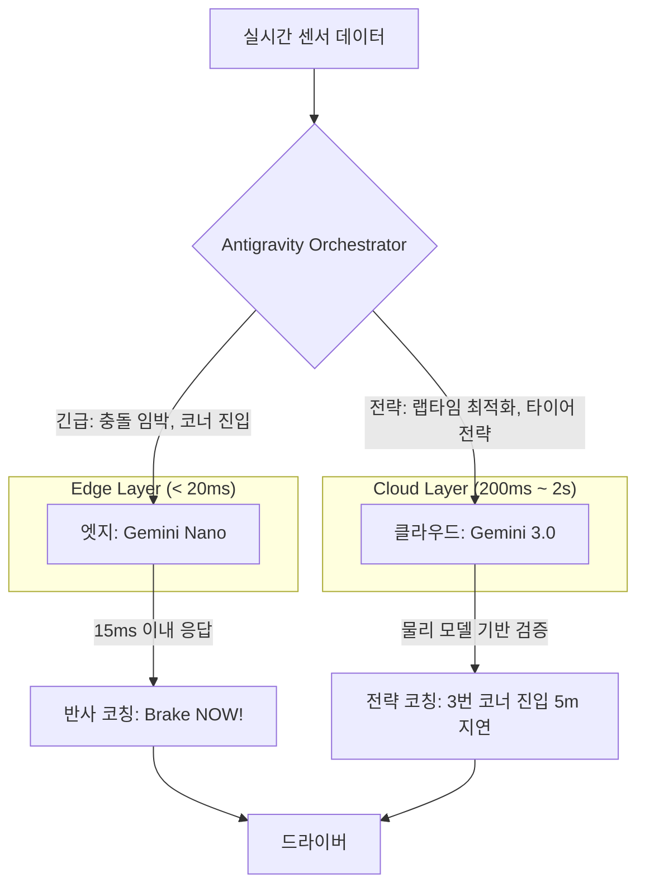

## 왜 지금 이게 문제인가

LLM을 프로덕션에 투입하는 팀이 늘어나면서 두 가지 근본적인 문제가 동시에 터지고 있다. 첫째, **지연 시간(Latency)**. 거대 모델에 모든 요청을 던지면 응답이 느려서 실시간 시스템에 쓸 수 없다. 둘째, **신뢰성(Reliability)**. 빠른 경량 모델만 쓰면 복잡한 추론에서 환각(Hallucination)이 터진다. "빠르면 부정확하고, 정확하면 느리다"는 딜레마 속에서 대부분의 팀은 하나를 포기한다.

구글이 고속 레이싱 환경에서 실험한 **스플릿-브레인(Split-Brain) 아키텍처**는 이 딜레마를 정면으로 공략한다. 시속 160km로 달리는 차량에서 AI가 실시간 코칭을 하는 극단적인 시나리오에서 검증된 설계다.

- **단일 모델의 함정**: 클라우드 LLM 하나로 모든 것을 처리하면, 네트워크 지연만으로도 0.5초가 소모된다. 레이스카에서 0.5초는 50m를 의미하고, 금융 트레이딩에서 0.5초는 수억 원의 차이를 만든다.
- **경량 모델의 한계**: 온디바이스 모델은 빠르지만, "지난 3개 랩의 타이어 마모율을 고려했을 때 다음 코너의 최적 진입 각도"를 계산할 추론 능력이 없다.
- **조합의 복잡성**: 두 모델을 그냥 붙여놓는 것만으로는 안 된다. 어떤 요청을 누구에게 보낼지, 결과가 충돌하면 누구의 판단을 신뢰할지를 결정하는 **오케스트레이션 레이어**가 핵심이다.

## 어떻게 동작하는가

스플릿-브레인 아키텍처는 인간의 신경계를 모방한다. 뜨거운 프라이팬을 만지면 대뇌의 판단을 기다리지 않고 척수 반사로 손을 뗀다. 전략적 사고는 그 이후에 한다. AI 시스템도 마찬가지다.

### 이종 모델의 역할 분리



| 구분 | 엣지 모델 (Gemini Nano) | 클라우드 모델 (Gemini 3.0) |
| :--- | :--- | :--- |
| **응답 시간** | ~15ms | 200ms ~ 2s |
| **추론 깊이** | 패턴 매칭, 분류, 즉각 반응 | 다단계 추론, 시뮬레이션, 최적화 |
| **검증 방식** | 규칙 기반 가드레일 | 물리 법칙 기반 수학적 검증 |
| **실패 모드** | 복잡한 맥락 놓침 | 지연으로 인한 타이밍 실패 |
| **비용** | 거의 무료 (온디바이스) | API 호출 비용 |

### Antigravity 오케스트레이션 프레임워크

핵심은 **Antigravity(AGY)**라는 오케스트레이션 레이어다. AGY는 세 가지 핵심 기능을 수행한다.

1. **요청 분류(Routing)**: 들어온 데이터가 즉각 반응이 필요한 '반사 영역'인지, 깊은 분석이 필요한 '전략 영역'인지 판단하여 적절한 모델로 라우팅한다. 이 판단 자체는 규칙 기반이라 환각의 여지가 없다.

2. **결과 충돌 해소(Conflict Resolution)**: 엣지와 클라우드 모델이 상충하는 조언을 내놓을 때, AGY는 물리 법칙 기반의 검증 레이어를 통해 어느 쪽이 맞는지 판단한다. "AI가 말한 것을 AI가 검증하는" 순환 함정을 피하기 위해, 검증 레이어는 LLM이 아니라 **결정론적 시뮬레이션 모델**을 사용한다.

3. **점진적 위임(Graduated Delegation)**: 처음에는 보수적으로 동작하다가, 특정 시나리오에서 모델의 정확도가 검증되면 점차 자율성을 높인다.

```python
# 개념 예시: AGY 오케스트레이터의 라우팅 로직
class AntigravityOrchestrator:
    def __init__(self, edge_model, cloud_model, physics_engine):
        self.edge = edge_model        # Gemini Nano (온디바이스)
        self.cloud = cloud_model      # Gemini 3.0 (클라우드)
        self.verifier = physics_engine # 결정론적 물리 시뮬레이션

    def route(self, sensor_data: SensorFrame) -> CoachingAction:
        urgency = self._classify_urgency(sensor_data)

        if urgency == Urgency.IMMEDIATE:
            # 반사 영역: 엣지에서 15ms 이내 응답
            action = self.edge.predict(sensor_data)
            # 규칙 기반 가드레일로 최소한의 안전 검증
            return self.verifier.safety_check(action)

        elif urgency == Urgency.STRATEGIC:
            # 전략 영역: 클라우드에서 깊은 추론
            action = self.cloud.analyze(sensor_data, context=self._get_lap_history())
            # 물리 엔진으로 수학적 검증 (LLM이 아님)
            verified = self.verifier.simulate(action)
            if not verified.is_safe:
                return CoachingAction.NO_OP  # 검증 실패 시 개입하지 않음
            return action

    def _classify_urgency(self, data: SensorFrame) -> Urgency:
        # 규칙 기반 분류 — LLM 추론 아님, 환각 불가
        if data.time_to_collision < 2.0 or data.corner_entry_imminent:
            return Urgency.IMMEDIATE
        return Urgency.STRATEGIC
```

### 검증 가능한 AI (Verifiable AI)

이 아키텍처의 가장 차별화된 지점은 **"AI의 출력을 AI가 아닌 것으로 검증한다"**는 원칙이다. AI가 "브레이크를 20피트 늦게 밟으세요"라고 조언하면, 물리 시뮬레이션 엔진이 해당 시나리오를 수학적으로 시뮬레이션하여 안전 여부를 판단한다. LLM이 다른 LLM을 검증하는 순환 구조를 의도적으로 피한 것이다.

## 실제로 써먹을 수 있는가

레이싱이라는 극한 환경의 사례이지만, 이 아키텍처 패턴은 한국의 여러 산업 도메인에 직접 대입할 수 있다.

### 도입하면 좋은 상황

| 도메인 | 반사 영역 (엣지) | 전략 영역 (클라우드) | 검증 레이어 |
| :--- | :--- | :--- | :--- |
| **금융 트레이딩** | 이상 거래 즉시 차단 | 포트폴리오 리밸런싱 전략 | 리스크 계산 엔진 |
| **스마트 팩토리** | 장비 이상 징후 즉시 정지 | 생산 라인 최적화 | 공정 시뮬레이션 |
| **실시간 추천** | 사용자 클릭에 즉시 반응 | 장기 취향 분석 및 개인화 | A/B 테스트 지표 |
| **자율주행/모빌리티** | 장애물 회피 | 경로 재계획 | HD Map + 물리 엔진 |

### 굳이 도입 안 해도 되는 상황
- **배치 처리 중심 시스템**: 실시간 응답이 불필요하면 클라우드 모델 하나로 충분하다. 스플릿-브레인의 복잡성이 오버헤드만 된다.
- **단일 모달리티 챗봇**: 사용자와 텍스트로만 대화하는 서비스라면 응답 시간 200ms와 2초의 차이는 UX에 큰 영향을 주지 않는다.
- **데이터 볼륨이 낮은 경우**: 초당 수천 건의 이벤트를 처리하는 것이 아니라면 엣지 모델을 별도로 배포·관리하는 비용이 더 크다.

### 운영 리스크와 트레이드오프

**1. 이종 모델 관리의 복잡성**
엣지와 클라우드 모델은 업데이트 주기, 학습 데이터, 성능 특성이 모두 다르다. 한쪽만 업데이트했을 때 두 모델 간의 판단이 충돌하는 "모델 드리프트(Model Drift)" 문제가 발생할 수 있다. 모델 버전 관리와 호환성 테스트를 위한 별도의 파이프라인이 필요하다.

**2. 결정론적 검증 레이어의 구축 비용**
물리 엔진이나 시뮬레이션 모델은 도메인 전문가가 직접 설계해야 한다. 레이싱에서는 물리 법칙이 명확하지만, "금융 규제 준수 여부"나 "의료 진단의 정확성"처럼 규칙이 복잡하고 변동성이 높은 도메인에서는 검증 레이어 자체의 구축과 유지보수가 프로젝트의 가장 어려운 부분이 될 수 있다.

**3. 바이브 코딩의 양면성**
구글은 AGY 프레임워크를 통해 "이 에이전트는 안전을 최우선으로 고려해야 한다"와 같은 자연어로 시스템 동작을 설계하는 **바이브 코딩(Vibe Coding)**이 가능하다고 소개했다. 3개월 걸릴 개발을 2주로 단축했다는 수치는 매력적이다. 하지만 이는 양날의 검이다. 자연어 명세는 모호성을 내포하고, "안전을 최우선"이라는 지시가 구체적으로 어떤 파라미터로 변환되는지를 추적하기 어렵다. 프로덕션 장애가 발생했을 때 "프롬프트가 잘못됐는지, 모델이 프롬프트를 잘못 해석한 건지"를 디버깅하는 것은 기존의 코드 디버깅과는 차원이 다른 난이도다.

**4. 한국 규제 환경과의 접점**
금융위원회의 AI 활용 가이드라인, 개인정보보호위원회의 자동화된 의사결정 관련 규정 등을 고려하면, AI가 실시간으로 판단을 내리는 시스템은 "설명 가능성(Explainability)"이 필수다. 스플릿-브레인의 검증 레이어가 "왜 이 판단을 내렸는가"를 로그로 남길 수 있다면, 이는 단순한 기술적 장치를 넘어 규제 대응의 핵심 인프라가 된다.

## 한 줄로 남기는 생각
> AI의 신뢰는 더 큰 모델이 아니라, '반사'와 '이성'을 분리하고 그 출력을 LLM이 아닌 결정론적 시스템으로 검증하는 아키텍처 설계에서 시작된다.

---
*참고자료*
- [Google Developers Blog: Building Trustable AI Agents](https://developers.googleblog.com/en/building-trustable-ai-agents-lessons-from-the-track/)
- [Google Cloud Next '26: Agentic AI Architecture Keynote](https://cloud.google.com/next)
- [Antigravity Framework Overview](https://developers.googleblog.com/en/building-trustable-ai-agents-lessons-from-the-track/)
