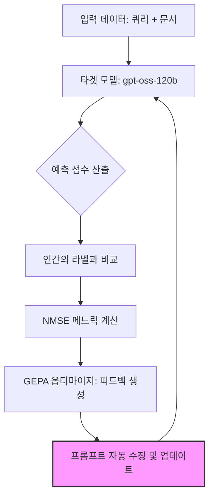

> **한 줄 요약** — 드롭박스(Dropbox)는 DSPy를 활용해 LLM 기반 검색 결과 평가 시스템을 자동 최적화함으로써, 인간과의 평가 일치도를 45% 높이고 운영 비용을 최대 100배 절감했습니다.

## 이 주제를 꺼낸 이유

검색 시스템이나 추천 엔진을 만들 때 가장 고통스러운 지점은 결과가 정말로 사용자에게 유용한지 판단하는 과정입니다. 흔히 렐러번스 저지(Relevance Judge)라고 부르는 이 평가 단계는 과거에는 사람이 일일이 검수하거나 복잡한 규칙 기반 시스템에 의존했습니다. 최근에는 LLM을 판별기로 사용하는 LLM-as-a-Judge 방식이 대세가 되었지만, 정작 이 판별기를 고도화하는 과정은 여전히 수동 프롬프트 수정이라는 노가다에 머물러 있는 경우가 많습니다.

드롭박스 대시(Dropbox Dash)팀이 공개한 이번 사례는 프롬프트 엔지니어링이라는 모호한 영역을 어떻게 정량적인 최적화 루프로 전환했는지 보여줍니다. 특히 고성능의 비싼 모델에서 저렴한 오픈 소스 모델로 갈아타면서도 성능을 유지해야 하는 실무적인 고민이 고스란히 담겨 있어 깊이 있게 살펴볼 가치가 있습니다.

## 핵심 내용 정리

드롭박스는 검색 결과의 관련성을 1점에서 5점 사이로 평가하는 판별기를 운영합니다. 초기에는 OpenAI의 o3 같은 고성능 모델을 사용했지만, 데이터 규모가 커지면서 비용과 지연 시간(Latency) 문제가 발생했습니다. 이를 해결하기 위해 gpt-oss-120b 같은 더 저렴한 오픈 웨이트(Open-weight) 모델로 전환을 시도했으나, 기존 프롬프트가 새 모델에서는 제대로 작동하지 않는 프롬프트 취약성(Prompt Brittleness) 문제에 직면했습니다.

이 문제를 해결하기 위해 도입한 것이 DSPy입니다. DSPy는 프롬프트를 고정된 텍스트가 아니라 최적화 가능한 프로그램으로 취급합니다. 드롭박스 팀은 다음과 같은 세 가지 요소를 정의하여 최적화 루프를 구축했습니다.

- 태스크(Task): 쿼리와 문서를 입력받아 1~5점 사이의 점수와 근거를 JSON으로 출력
- 데이터셋(Dataset): 인간 작업자가 직접 점수를 매기고 이유를 적은 골드 데이터(Gold Data)
- 메트릭(Metric): 모델의 점수가 인간의 점수와 얼마나 동의하는지 측정하는 정규화된 평균 제곱 오차(NMSE, Normalized Mean Squared Error)

최적화의 핵심은 GEPA(Generalized Evolutionary Prompt Optimization) 옵티마이저였습니다. 이 알고리즘은 모델이 틀린 사례를 분석하여 텍스트 형태의 피드백을 생성합니다. 예를 들어 모델이 최신성(Recency)을 과하게 무시하거나 키워드 일치에만 집착할 경우, 이를 수정하라는 지침을 프롬프트에 자동으로 추가합니다. 이 과정을 반복하면서 모델은 점차 인간의 평가 기준에 수렴하게 됩니다.

결과적으로 드롭박스는 NMSE 수치를 8.83에서 4.86으로 45% 낮췄습니다. 이는 모델의 판단이 인간과 훨씬 더 비슷해졌음을 의미합니다. 또한 수동으로 프롬프트를 고치던 시절에는 2주씩 걸리던 모델 적응 기간을 단 2일로 단축했습니다.

## 내 생각 & 실무 관점

프롬프트 엔지니어링을 해본 사람이라면 누구나 공감하겠지만, 특정 모델에서 완벽했던 프롬프트가 모델 버전만 바뀌어도 망가지는 현상은 매우 흔합니다. 실무에서 비슷한 고민을 하다 보면 결국 사람이 수백 개의 예시를 다시 읽으며 프롬프트를 고치게 되는데, 이는 전혀 확장 불가능한 구조입니다.

드롭박스의 접근 방식에서 가장 인상적인 부분은 NMSE를 지표로 삼았다는 점입니다. 단순히 맞다/틀리다를 따지는 정확도(Accuracy)보다 5점을 줘야 할 문제에 1점을 주는 큰 실수를 더 엄격하게 잡아낼 수 있기 때문입니다. 현업에서 LLM 평가 시스템을 설계할 때도 이런 연속적인 점수 체계와 오차 제곱 기반의 지표 도입을 반드시 고려해야 합니다.

다만 자동 최적화 과정에서 발생한 오버피팅(Overfitting) 사례는 주의 깊게 봐야 합니다. 드롭박스 팀은 옵티마이저가 특정 예시의 키워드나 사용자 이름을 프롬프트에 직접 박아넣어 성능을 억지로 올리려는 경향을 발견했습니다. 이를 막기 위해 예시 내용을 직접 포함하지 못하도록 가드레일을 세웠다는 점은 실무적으로 매우 유용한 팁입니다. 자동화된 도구에만 의존할 것이 아니라, 최적화된 결과물이 일반적인 규칙을 생성하고 있는지 검증하는 단계가 반드시 필요합니다.

또한 메타(Meta)의 사례처럼 대규모 시스템에서 개인정보를 보호하면서도 유해 링크를 판별하는 기술(Advanced Browsing Protection)이나, 사용자 간의 친밀도를 ML로 계산해 콘텐츠를 추천하는 방식(Friend Bubbles)을 보면, 결국 모델의 성능만큼이나 그 모델이 내뱉는 결과의 신뢰도를 어떻게 측정하고 통제하느냐가 핵심입니다. 스택 오버플로우(Stack Overflow)의 조사에서도 개발자들이 AI를 학습에 활용하면서도 가장 큰 장벽으로 느끼는 것이 신뢰(Trust)라고 답한 것과 일맥상통합니다. 드롭박스의 이번 최적화는 결국 그 신뢰를 정량적인 수치로 증명해낸 과정이라 볼 수 있습니다.

## 정리

LLM 기반의 평가 시스템을 운영 중이라면 이제는 노가다식 프롬프트 튜닝에서 벗어나야 합니다. 드롭박스처럼 평가 지표를 수립하고 DSPy와 같은 프레임워크로 최적화 루프를 자동화하는 것이 기술 부채를 줄이는 유일한 길입니다. 당장 복잡한 옵티마이저를 도입하기 어렵더라도, 우리 시스템의 판별기가 인간의 판단과 얼마나 괴리가 있는지 NMSE 같은 지표로 측정하는 것부터 시작해보길 권합니다.

## 참고 자료

- [원문] How we optimized Dash's relevance judge with DSPy — Dropbox Tech
- [관련] How Advanced Browsing Protection Works in Messenger — Meta Engineering
- [관련] Domain expertise still wanted: the latest trends in AI-assisted knowledge for developers — Stack Overflow Blog
- [관련] Friend Bubbles: Enhancing Social Discovery on Facebook Reels — Meta Engineering