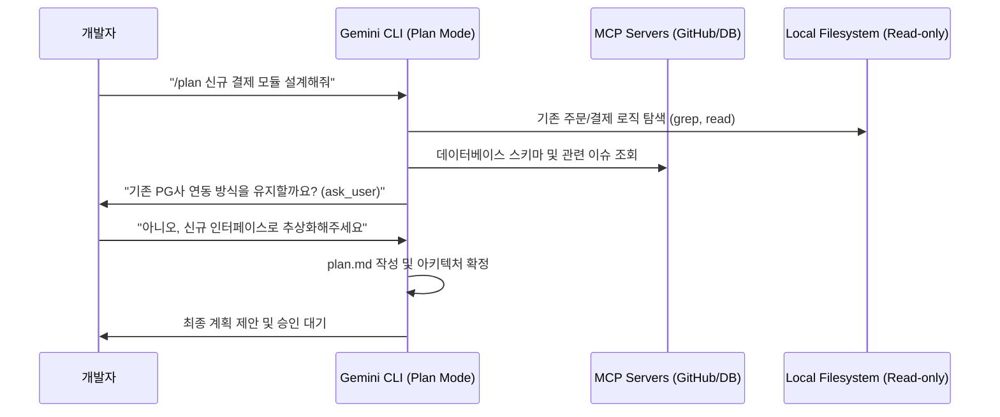

## 왜 지금 이게 문제인가
LLM 기반의 코딩 에이전트가 코드를 직접 수정하는 'Auto-Edit' 방식은 초기 도입 시 높은 생산성을 보여주지만, 복잡도가 높은 레거시 시스템에서는 치명적인 리스크를 동반한다. 에이전트가 전체 아키텍처를 오해한 상태에서 파일을 수정하기 시작하면 의존성 그래프가 깨지거나 비즈니스 로직에 결함이 생기는 일이 빈번하다. 특히 한국의 대규모 이커머스나 금융권 시스템처럼 도메인 로직이 파편화된 환경에서는 단순한 코드 생성이 아니라 '정확한 영향도 분석'이 선행되어야 한다.

기존의 CLI 도구들은 사용자의 프롬프트를 즉시 실행으로 옮기려는 경향이 강해, 대규모 마이그레이션이나 복잡한 기능 구현에서 제어력을 잃기 쉬웠다. 구글이 Gemini CLI에 **Plan Mode**를 도입한 배경은 에이전트의 실행력을 억제하고 '읽기 전용' 상태에서 아키텍처를 먼저 설계하도록 강제하기 위함이다. 이제 에이전트는 코드를 고치기 전에 질문을 던지고, 계획을 세우며, 사용자의 승인을 기다리는 단계를 거친다.

- **실행 리스크 차단**: 읽기 전용 도구 세트(`read_file`, `grep_search`, `glob`)만 사용하여 코드베이스를 탐색하므로 예기치 않은 파일 손상을 방지함.
- **모호성 해결**: `ask_user` 도구를 통해 에이전트가 임의로 판단하지 않고 사용자에게 아키텍처 선택지나 설정 파일 위치를 확인받음.
- **컨텍스트 확장**: 로컬 파일 시스템을 넘어 MCP(Model Context Protocol)를 통해 GitHub 이슈, DB 스키마, 문서 등의 외부 데이터를 계획 단계에 통합함.

## 어떻게 동작하는가
Plan Mode의 핵심은 에이전트에게 부여된 '도구의 권한'을 제한하는 것에 있다. 에이전트가 `/plan` 모드에 진입하면 쓰기 권한이 박탈된 상태에서 `codebase_investigator`와 같은 하위 에이전트를 가동하여 시스템 의존성을 파악한다. 이 과정에서 에이전트는 내부적인 `plan.md` 파일을 생성하며, 이는 실제 소스 코드에 반영되기 전의 중간 설계 산출물 역할을 한다.



동작 원리를 구체적으로 보면, 에이전트는 먼저 전체 구조를 훑는 `glob` 도구로 프로젝트 구조를 파악한 뒤 `grep_search`로 핵심 키워드를 찾는다. 이때 에이전트가 확신할 수 없는 지점이 생기면 `ask_user`를 호출하여 실행 흐름을 일시 정지한다. 사용자의 답변이 입력되면 이를 컨텍스트에 포함하여 계획을 수정하며, 이 모든 과정은 실제 소스 코드를 단 한 줄도 건드리지 않고 진행된다.

## 실제로 써먹을 수 있는가
결론부터 말하자면, 이 기능은 **'시니어의 검토가 필요한 주니어 에이전트'**를 다루는 표준 운영 절차(SOP)가 될 가능성이 높다. 하지만 모든 상황에서 만능은 아니다.

### 도입 시나리오별 판단

| 구분 | 도입 권장 상황 | 도입 비권장 상황 |
| :--- | :--- | :--- |
| **시스템 복잡도** | 마이크로서비스 간 복잡한 호출 관계가 얽힌 경우 | 단일 컴포넌트의 단순 UI 수정 또는 유틸 함수 작성 |
| **작업 성격** | DB 마이그레이션, 라이브러리 메이저 버전 업데이트 | 신규 프로젝트의 보일러플레이트 생성 |
| **팀 역량** | 코드 리뷰 문화가 정착되어 설계 단계를 중시하는 팀 | 속도 중심의 프로토타이핑이 우선인 초기 스타트업 |
| **인프라 환경** | 보안 이슈로 인해 AI의 직접 수정을 제한해야 하는 환경 | 개발자가 모든 변경 사항을 즉시 제어할 수 있는 개인 프로젝트 |

### 실무 운영 리스크와 트레이드오프
가장 큰 리스크는 **러닝커브와 속도의 저하**다. 계획 수립 단계가 추가됨에 따라 개발자가 AI와 대화해야 하는 물리적 시간이 늘어난다. 또한 `ask_user` 도구가 잦아지면 개발자는 AI를 쓰는 것이 아니라 AI에게 과외를 해주는 듯한 피로감을 느낄 수 있다. 한국의 빠른 배포 주기 속에서 "계획부터 세우자"는 제안이 팀 전체의 병목이 될 가능성도 배포 전략에 따라 고려해야 한다.

반면, 구글이 함께 발표한 **FunctionGemma(270M)**와 같은 온디바이스 모델의 발전은 흥미롭다. 270M이라는 초경량 파라미터로 기기 내부의 하드웨어를 제어하거나 게임 로직을 실행하는 '에이전틱'한 경험을 제공한다는 점은, 네트워크 연결이 불안정한 환경이나 레이턴시에 민감한 모바일 앱 개발에서 큰 강점이 된다. 한국의 배달 앱이나 뱅킹 앱처럼 복잡한 디바이스 권한과 로직이 섞인 환경에서, 서버를 거치지 않는 온디바이스 펑션 콜링은 개인정보 보호와 비용 절감 측면에서 실질적인 대안이 될 수 있다.

### MCP와 보안의 연결고리
Data Commons MCP가 GCP에서 호스팅되는 형태로 전환된 것은 엔터프라이즈 환경에서의 시사점이 크다. 로컬 파이썬 환경에 의존하던 기존 방식은 한국 금융권의 망분리 환경이나 엄격한 보안 정책이 적용된 사내망에서 도입하기 매우 까다로웠다. 클라우드 기반의 호스팅 서비스로 전환되면서, 기업은 별도의 서버 관리 부담 없이 공공 데이터나 내부 데이터를 에이전트에게 안전하게 공급할 수 있는 통로를 확보하게 되었다.

```json
{
  "mcpServers": {
    "datacommons-mcp": {
      "httpUrl": "https://api.datacommons.org/mcp",
      "headers": {
        "X-API-Key": "개념 예시를 위한 API KEY"
      }
    }
  }
}
```
위와 같은 설정만으로 외부 데이터 소스를 에이전트의 지식 베이스에 편입시킬 수 있다는 점은 개발 생산성을 한 단계 높인다. 다만, 공공 데이터를 활용한 인사이트 도출 시 데이터의 최신성과 신뢰도를 에이전트가 어떻게 검증할 것인지에 대한 운영 정책은 여전히 개발자의 몫으로 남는다.

### Conductor를 통한 자동화된 리뷰의 가치
마지막으로 주목할 점은 **Conductor의 Automated Reviews** 기능이다. AI가 짠 코드를 다시 AI가 리뷰한다는 점이 아이러니할 수 있지만, 이는 CI/CD 파이프라인의 '게이트키퍼' 역할을 수행한다. 특히 한국의 네카라쿠배와 같이 대규모 개발 조직에서는 스타일 가이드 준수 여부와 보안 취약점 스캔이 필수적인데, 이를 에이전트가 `plan.md`와 대조하여 검증한다는 점은 코드 리뷰 비용을 획기적으로 줄여줄 수 있다.

## 한 줄로 남기는 생각
> AI에게 '쓰기' 권한보다 '생각할 시간'과 '질문할 권리'를 먼저 주는 것이 시스템 붕괴를 막는 유일한 안전장치다.

---
*참고자료*
- [Plan mode is now available in Gemini CLI](https://developers.googleblog.com/plan-mode-now-available-in-gemini-cli/)
- [On-Device Function Calling in Google AI Edge Gallery](https://developers.googleblog.com/on-device-function-calling-in-google-ai-edge-gallery/)
- [Conductor Update: Introducing Automated Reviews](https://developers.googleblog.com/conductor-update-introducing-automated-reviews/)