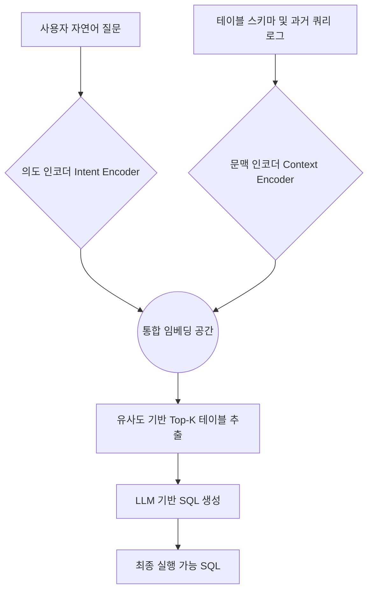

데이터 웨어하우스에 수만 개의 테이블이 쌓여 있는 환경에서 사용자의 질문을 정확한 SQL로 변환하는 작업은 단순히 LLM 성능에만 의존할 수 없는 고난도 과제입니다. 핀터레스트(Pinterest)는 10만 개가 넘는 분석 테이블과 수천 명의 사용자가 공존하는 복잡한 데이터 생태계에서 텍스트 투 SQL(Text-to-SQL)의 한계를 극복하기 위해 통합 컨텍스트-의도 임베딩(Unified Context-Intent Embeddings) 기술을 도입했습니다.

> **한 줄 요약** — 핀터레스트는 대규모 데이터 환경에서 정확한 SQL 생성을 위해 사용자의 질문 의도와 테이블의 구조적 문맥을 하나의 벡터 공간에 매핑하여 검색 정확도를 극대화했습니다.

## 수만 개의 테이블 사이에서 길을 잃는 이유

사내 데이터 플랫폼에서 특정 지표를 확인하고 싶을 때, 가장 먼저 마주하는 벽은 어떤 테이블을 참조해야 하는가입니다. 핀터레스트와 같은 대규모 엔지니어링 환경에서는 테이블 이름이 유사하거나, 동일한 지표를 계산하더라도 도메인에 따라 소스 테이블이 다른 경우가 빈번합니다. 기존의 검색 방식인 키워드 매칭이나 단순한 테이블 요약 정보(Table Summary)만으로는 사용자가 질문 속에 숨긴 분석 의도를 파악하기 어렵습니다.

예를 들어 국가별 유기적 콘텐츠 참여율을 묻는 질문이 들어왔을 때, 시스템은 단순히 engagement나 country라는 단어가 포함된 테이블을 찾는 수준을 넘어서야 합니다. 실제 분석가들이 해당 지표를 계산할 때 어떤 조인(Join) 로직을 사용하고 어떤 필터를 적용했는지에 대한 맥락이 필요합니다. 핀터레스트는 이 문제를 해결하기 위해 과거에 분석가들이 작성했던 수많은 SQL 쿼리를 데이터 자산으로 바라보았습니다. 분석가들이 이미 작성해 놓은 쿼리야말로 가장 완벽한 프롬프트(Prompt)라는 점에 착안한 것입니다.

실무에서 데이터 카탈로그를 관리하다 보면 메타데이터 업데이트가 실제 데이터 변경 속도를 따라가지 못하는 현상을 자주 봅니다. 테이블 설명(Description)은 비어 있거나 낡았는데, 정작 쿼리 로그에는 살아있는 정보가 가득한 경우가 많습니다. 핀터레스트의 접근 방식은 이러한 현실적인 데이터 관리의 허점을 과거의 실행 기록으로 보완했다는 점에서 매우 전략적입니다.

## 통합 컨텍스트-의도 임베딩의 작동 원리

핀터레스트가 제안한 핵심은 사용자의 자연어 질문(Intent)과 테이블의 스키마 및 활용 사례(Context)를 동일한 벡터 공간에서 비교 가능하도록 만드는 것입니다. 이를 위해 RAG(Retrieval-Augmented Generation) 기반의 테이블 선택 프로세스를 고도화했습니다. 전체 과정은 크게 의도 추출, 문맥 인코딩, 그리고 통합 임베딩 공간에서의 검색으로 나뉩니다.

복잡한 검색 과정을 단계별로 시각화하면 다음과 같은 흐름을 가집니다.

이 시스템의 차별점은 단순히 테이블 구조만 보는 것이 아니라, 해당 테이블이 과거에 어떤 질문에 답변하기 위해 사용되었는지를 학습한다는 점입니다. 문맥 인코더(Context Encoder)는 테이블의 컬럼 이름, 타입뿐만 아니라 해당 테이블을 활용해 작성되었던 고품질의 SQL 쿼리 패턴을 임베딩에 녹여냅니다. 결과적으로 사용자가 질문을 던지면, 시스템은 과거에 유사한 질문을 해결했던 테이블 세트를 더 정확하게 찾아낼 수 있습니다.

## 검색 정확도를 높이는 두 가지 축

Pinterest의 아키텍처에서 눈여겨볼 부분은 스키마 기반 그라운딩(Schema-grounded)과 검색 증강 테이블 선택(Retrieval-augmented table selection)의 결합입니다. 10만 개가 넘는 테이블을 한 번에 LLM의 컨텍스트 윈도우에 넣는 것은 비용적으로나 기술적으로 불가능합니다. 따라서 첫 번째 단계인 테이블 선택(Table Selection)의 정확도가 전체 파이프라인의 성능을 결정짓는 병목 지점이 됩니다.

여기서 통합 임베딩은 두 가지 역할을 수행합니다.

- 질문의 추상적 의도 파악: 사용자가 국가별이라고 말했을 때, 이것이 ISO 코드인지 국가 이름인지, 혹은 특정 지역 그룹핑인지에 대한 의도를 과거 쿼리 패턴에서 유추합니다.
- 구조적 적합성 판단: 질문에 포함된 지표를 계산하기 위해 필요한 조인 대상 테이블들을 묶음(Set) 단위로 검색 후보에 올립니다.

현업에서 유사한 고민을 하다 보면, 단일 테이블 검색에는 성공해도 조인이 필요한 복합 질문에서 실패하는 경우를 자주 봅니다. 핀터레스트는 과거 쿼리 로그를 임베딩 프로세스에 통합함으로써, 특정 질문이 들어왔을 때 함께 자주 사용되는 테이블 군집을 통째로 검색 결과에 반영할 수 있는 구조를 만들었습니다. 이는 결과적으로 LLM이 쿼리를 생성할 때 잘못된 테이블을 조인하는 환각(Hallucination) 현상을 현저히 줄여줍니다.

## 실무적 시각에서 본 트레이드오프와 주의점

핀터레스트의 방식은 매우 강력하지만, 실제 도입을 고려할 때는 몇 가지 현실적인 제약 사항을 따져봐야 합니다. 가장 먼저 고민해야 할 지점은 과거 쿼리 로그의 품질입니다. 분석가들이 작성한 모든 SQL이 정답은 아닙니다. 잘못된 로직으로 작성된 쿼리나, 임시로 테스트하기 위해 만든 쿼리가 임베딩에 포함될 경우 오히려 검색 품질을 떨어뜨리는 노이즈로 작용할 수 있습니다.

따라서 쿼리 로그를 임베딩하기 전에 반드시 정제 과정이 선행되어야 합니다.
- 실행 성공 여부: 실제로 에러 없이 실행된 쿼리인가?
- 사용 빈도: 특정 기간 동안 반복적으로 활용된 신뢰할 수 있는 쿼리인가?
- 최신성: 스키마 변경 이후에도 유효한 쿼리인가?

또한, 임베딩 모델의 업데이트 주기 역시 중요합니다. 데이터 웨어하우스의 스키마는 살아있는 유기체처럼 변합니다. 새로운 테이블이 생성되고 기존 테이블이 폐기(Deprecated)될 때마다 임베딩 공간을 어떻게 효율적으로 업데이트할 것인지에 대한 엔지니어링적 고민이 필요합니다. 핀터레스트처럼 대규모 환경이라면 실시간 업데이트보다는 배치(Batch) 처리를 통한 점진적 업데이트 방식이 비용 효율적일 것입니다.

비슷한 맥락에서 에어비앤비(Airbnb)의 여행지 추천 모델 사례를 보면, 사용자의 모호한 탐색 의도를 구체적인 목적지로 좁혀주는 과정이 핀터레스트의 테이블 선택 과정과 닮아 있습니다. 사용자는 자신이 정확히 무엇을 원하는지 모르거나 모호하게 표현하지만, 시스템은 과거의 패턴과 현재의 맥락을 결합해 최적의 후보군을 제안해야 합니다. 텍스트 투 SQL 역시 데이터 탐색의 한 형태라는 점을 상기하면, 이 기술은 단순한 코드 생성을 넘어 데이터 발견(Data Discovery)의 문제를 해결하는 열쇠가 됩니다.

## 데이터 자산의 재발견

핀터레스트의 사례가 주는 가장 큰 교훈은 새로운 모델을 만드는 것보다 이미 가지고 있는 데이터(과거 쿼리 로그)를 어떻게 지능적으로 활용하느냐가 더 중요하다는 점입니다. 많은 조직이 텍스트 투 SQL 성능을 높이기 위해 더 비싼 LLM을 쓰거나 프롬프트 엔지니어링에만 매달리지만, 정작 해답은 데이터 창고 안에 쌓여 있는 분석가들의 흔적 속에 있었습니다.

성공적인 텍스트 투 SQL 시스템을 구축하고 싶다면, 현재 우리 조직의 쿼리 로그가 얼마나 잘 관리되고 있는지부터 점검해 보아야 합니다. 잘 정제된 쿼리 로그는 그 어떤 튜토리얼보다 훌륭한 학습 데이터가 됩니다. 독자 여러분도 사내 SQL 저장소에서 가장 자주 사용되는 쿼리 100개를 뽑아보세요. 그 쿼리들이 담고 있는 의도와 문맥을 분석하는 것이 통합 임베딩으로 가는 첫걸음이 될 것입니다.

결국 기술의 핵심은 화려한 알고리즘이 아니라, 사용자의 질문과 데이터의 실제 구조 사이의 간극을 얼마나 촘촘하게 메우느냐에 달려 있습니다. 핀터레스트의 통합 컨텍스트-의도 임베딩은 그 간극을 메우기 위해 인간 분석가의 지혜를 벡터화한 영리한 접근 방식입니다.

## 참고 자료
- [원문] [Unified Context-Intent Embeddings for Scalable Text-to-SQL](https://medium.com/pinterest-engineering/unified-context-intent-embeddings-for-scalable-text-to-sql-793635e60aac?source=rss----4c5a5f6279b6---4) — Pinterest Engineering
- [관련] Recommending Travel Destinations to Help Users Explore — Airbnb Tech
- [관련] Domain expertise still wanted: the latest trends in AI-assisted knowledge for developers — Stack Overflow Blog