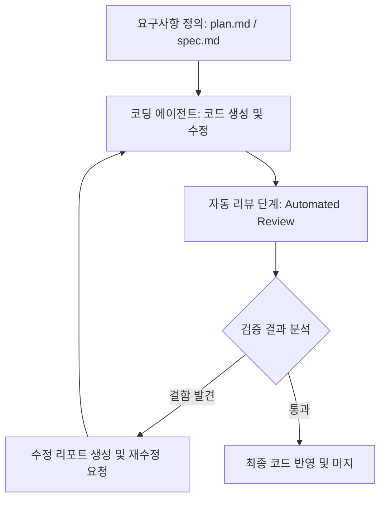

AI 에이전트가 코드를 작성하는 시대에서 가장 큰 병목 현상은 생성된 결과물의 신뢰성을 검증하는 과정입니다. 구글이 최근 Gemini CLI의 확장 도구인 컨덕터(Conductor)에 추가한 자동 리뷰(Automated Reviews) 기능은 이러한 검증 과정을 자동화하여 AI 협업의 안전성을 높이는 데 초점을 맞추고 있습니다.

> **한 줄 요약** — 컨덕터의 자동 리뷰 기능은 AI가 생성한 코드가 원래의 계획과 일치하는지 확인하고, 보안 취약점과 로직 오류를 자동으로 검사하여 개발자의 검토 부담을 줄여줍니다.

## 이 주제를 꺼낸 이유

AI를 활용한 코딩은 속도 면에서 혁신적이지만, 결과물이 프로젝트의 아키텍처나 기존 스타일 가이드를 준수하는지 확인하는 작업은 여전히 개발자의 몫으로 남아 있습니다. 특히 대규모 코드 수정이 일어날 때 모든 변경 사항을 수동으로 검토하는 것은 매우 피로도가 높은 작업입니다. 

컨덕터의 이번 업데이트는 단순한 코드 생성을 넘어 검증(Verify) 단계를 개발 워크플로우에 통합했다는 점에서 의미가 큽니다. 실무에서 AI 에이전트를 도입할 때 가장 우려되는 불확실성을 시스템적으로 해결하려는 시도이기 때문입니다.

## 컨덕터 자동 리뷰의 핵심 메커니즘

컨덕터는 이전 업데이트에서 도입된 플랜 모드(Plan mode)를 기반으로 동작합니다. 대화 기록처럼 사라지는 정보가 아니라 버전 관리 시스템(VCS)에 저장되는 markdown 파일을 참조하여 코드의 일관성을 유지합니다. 이번에 추가된 자동 리뷰는 이 기록된 계획을 기준으로 결과물을 대조합니다.

### 주요 검증 프로세스

- 코드 분석: 정적 분석과 로직 분석을 동시에 수행합니다. 비동기 블록에서의 레이스 컨디션(Race conditions)이나 널 포인터(Null pointer) 위험처럼 실행 시점에 발생할 수 있는 잠재적 결함을 사전에 식별합니다.
- 계획 준수 확인: 구현된 코드가 프로젝트 내의 plan.md 및 spec.md 파일에 명시된 요구사항을 모두 충족했는지 자동으로 체크합니다. 개발자가 놓치기 쉬운 세부 구현 사항을 AI가 역으로 검토하는 구조입니다.
- 가이드라인 강제: 프로젝트별로 정의된 스타일 가이드나 커스텀 가이드라인 파일을 준수하는지 확인합니다. 이는 코드의 가독성과 유지보수성을 장기적으로 유지하는 데 필수적인 요소입니다.
- 보안 스캔: 하드코딩된 API 키, 개인정보(PII) 유출 가능성, 인젝션 공격에 취약한 입력 처리 등을 스캔하여 보안 사고를 미방지합니다.
- 테스트 통합: 단순히 코드를 읽는 것에 그치지 않고 기존 유닛 테스트와 통합 테스트를 직접 실행하여 결과와 커버리지 데이터를 리포트에 포함합니다.

### 컨덕터 자동 리뷰 워크플로우

## 실무 관점에서 바라본 AI 자동 리뷰의 가치

현업에서 AI 에이전트에게 작업을 맡기다 보면 가장 곤혹스러운 순간이 있습니다. AI가 코드는 그럴듯하게 짰는데 프로젝트의 전반적인 맥락이나 보안 정책을 무시하고 구현했을 때입니다. 컨덕터의 자동 리뷰는 이런 상황을 시스템적으로 방어할 수 있는 안전장치 역할을 합니다.

### 계획 중심 개발의 중요성

실제로 복잡한 기능을 구현할 때 가장 먼저 해야 할 일은 구현이 아니라 설계입니다. 컨덕터가 plan.md라는 영구적인 문서를 요구하는 방식은 매우 바람직합니다. 휘발성 채팅에 의존하는 AI 도구들은 문맥이 길어지면 초기 요구사항을 잊어버리는 경향이 있습니다. 문서화된 계획을 바탕으로 결과물을 대조하는 자동 리뷰는 AI의 환각(Hallucination) 현상을 억제하는 실질적인 해법이 됩니다.

### 보안과 테스트의 시프트 레프트(Shift-left)

보안 검토와 테스트 실행이 개발 마지막 단계가 아닌 AI 생성 직후에 이루어진다는 점에 주목해야 합니다. 실무에서 보안 취약점은 발견이 늦어질수록 수정 비용이 기하급수적으로 늘어납니다. 컨덕터가 API 키 노출이나 unsafe한 입력 처리를 즉시 잡아준다면 개발자는 더 고차원적인 비즈니스 로직에 집중할 수 있습니다.

### 에이전트 모드와 자동 승인의 조화

최근 Gemini Code Assist에 추가된 에이전트 모드(Agent Mode)와 자동 승인(Auto Approve) 기능을 함께 사용하면 시너지가 극대화됩니다. 여러 파일에 걸친 반복적인 작업을 에이전트에게 맡기고, 컨덕터의 자동 리뷰로 결과물의 품질을 보증받는 방식입니다. 이는 개발자가 일일이 코드를 수정하는 노동에서 벗어나 아키텍처 설계와 최종 의사결정에만 집중하는 구조로의 변화를 의미합니다.

## 도입 시 고려할 트레이드오프와 주의사항

자동 리뷰가 만능은 아닙니다. 시스템이 생성하는 리포트의 정확도는 결국 프로젝트가 보유한 가이드라인 문서와 테스트 코드의 품질에 의존합니다.

- 가이드라인의 구체성: 프로젝트의 코딩 스타일이나 보안 규칙이 명확하게 문서화되어 있지 않으면 자동 리뷰 시스템도 정확한 판단을 내리기 어렵습니다.
- 테스트 커버리지: 테스트 세트 통합 기능은 강력하지만, 정작 테스트 코드가 부실하다면 자동 리뷰 리포트의 신뢰도는 떨어질 수밖에 없습니다.
- 인간의 최종 검토: 자동 리뷰가 High, Medium, Low 등급으로 문제를 분류해 주더라도 최종적인 비즈니스 임팩트를 판단하는 것은 여전히 사람의 영역입니다. AI를 감시하는 도구로 AI를 쓰되 최종 결정권은 개발자가 쥐어야 합니다.

## 실무 적용을 위한 첫걸음

컨덕터를 활용해 자동 리뷰를 시작하려면 먼저 Gemini CLI 환경을 구축해야 합니다. 아래 명령어를 통해 확장을 설치할 수 있습니다.

`gemini extensions install https://github.com/gemini-cli-extensions/conductor`

설치 후에는 단순히 코드를 짜달라고 요청하기보다 프로젝트 루트에 plan.md를 작성하는 습관을 들이는 것이 좋습니다. 구글에서 운영하는 웬즈데이 빌드 아워(Wednesday Build Hour) 같은 세션에 참여해 실제 AI 에이전트가 어떻게 복잡한 워크플로우를 처리하는지 사례를 살펴보는 것도 큰 도움이 됩니다.

## 정리

구글 컨덕터의 자동 리뷰 업데이트는 AI 기반 개발 환경이 도구 중심에서 프로세스 중심으로 진화하고 있음을 보여줍니다. 계획(Plan), 실행(Execute), 검증(Verify)으로 이어지는 체계적인 워크플로우는 AI가 생성한 코드에 대한 막연한 불안감을 해소해 줍니다. 

단순히 코드를 대신 써주는 비서를 넘어 품질을 관리하고 보안을 점검하는 동료로서 AI를 활용하고 싶다면, 컨덕터가 제시하는 문서 중심의 검증 방식을 적극적으로 검토해 보길 권장합니다.

## 참고 자료
- [원문] [Conductor Update: Introducing Automated Reviews](https://developers.googleblog.com/conductor-update-introducing-automated-reviews/) — Google Developers
- [관련] Introducing Wednesday Build Hour — Google Developers
- [관련] Making Gemini CLI extensions easier to use — Google Developers
- [관련] Unleash Your Development Superpowers: Refining the Core Coding Experience — Google Developers