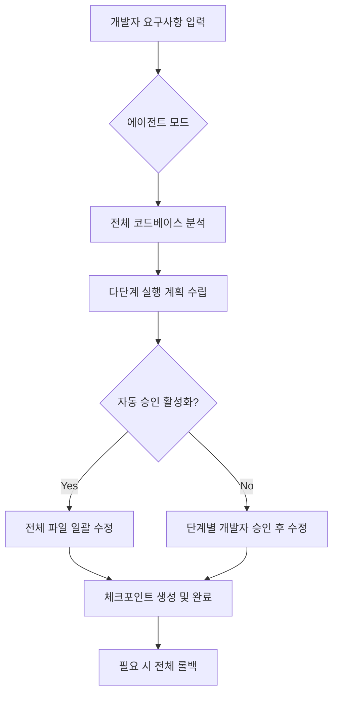

구글 제미나이 코드 어시스트(Gemini Code Assist)가 단순한 코드 추천 도구를 넘어 에이전트 모드(Agent Mode)와 정교한 컨텍스트 제어 기능을 도입하며 개발자의 업무 흐름을 근본적으로 바꾸고 있습니다.

> **한 줄 요약** — 제미나이 코드 어시스트는 에이전트 기반의 자동화와 정교한 컨텍스트 관리 기능을 통해 개발자가 프롬프트 작성에 쓰는 에너지를 줄이고 실제 로직 설계에 집중하게 돕습니다.

## 이 주제를 꺼낸 이유

도구의 성능이 아무리 좋아도 개발자의 흐름(Flow)을 깨뜨린다면 현업에서 환영받기 어렵습니다. 기존의 AI 도구들은 긴 프롬프트를 작성해야 하거나, 생성된 코드를 일일이 복사해서 붙여넣어야 하는 번거로움이 있었습니다. 구글이 최근 발표한 업데이트는 이러한 마찰 지점을 제거하는 데 집중하고 있습니다. 특히 에이전트가 스스로 계획을 세우고 실행하는 방식이나, IDE 내에서 컨텍스트를 시각적으로 관리하는 기능은 실무적인 생산성 직결되는 지점이라 자세히 살펴볼 가치가 있습니다.

## 에이전트 모드와 자동 승인으로 복잡한 작업 단순화하기

이번 업데이트의 핵심은 에이전트 모드(Agent Mode)입니다. 과거에는 여러 파일을 수정해야 할 때 개발자가 각 파일에 대해 개별적으로 질문하거나 가이드를 줘야 했습니다. 이제 제미나이는 전체 코드베이스를 이해하고 다단계 계획을 스스로 수립합니다.

예를 들어 새로운 API 엔드포인트를 추가하는 상황을 가정해 보겠습니다. 에이전트는 컨트롤러를 수정하고, 서비스 레이어를 업데이트하며, 필요한 데이터 모델을 생성하는 과정을 하나의 플랜으로 제안합니다. 여기서 자동 승인(Auto Approve) 기능을 켜면 개발자가 매 단계마다 승인 버튼을 누를 필요 없이 에이전트가 계획된 작업을 끝까지 완수합니다. 지루한 반복 작업이나 대규모 리팩토링에서 물리적인 시간을 획기적으로 줄여주는 장치입니다.

단순히 코드를 짜주는 것을 넘어 작업의 단위를 관리한다는 점이 인상적입니다. 실무에서 대규모 코드 수정은 늘 사이드 이펙트의 위험을 동반하는데, 이를 구조적으로 해결하려는 시도가 엿보입니다.

## 코드 리뷰의 효율을 높이는 인라인 디프와 체크포인트

AI가 제안한 코드를 검토하는 과정도 훨씬 직관적으로 변했습니다. 인라인 디프 뷰(Inline Diff Views)를 통해 별도의 창을 띄우지 않고도 현재 코드 위에서 수정 사항을 바로 확인하고 편집할 수 있습니다. 맘에 들지 않는 줄은 즉시 수정하고, 나머지만 수락하는 식의 세밀한 제어가 가능합니다.

가장 눈에 띄는 기능 중 하나는 체크포인트 복구(Revert to Checkpoint)입니다. AI의 제안을 여러 번 적용하다 보면 코드가 꼬여서 이전 상태로 돌아가고 싶을 때가 있습니다. 이때 단 한 번의 클릭으로 AI 수정이 시작되기 전의 깨끗한 상태로 모든 파일을 되돌릴 수 있습니다. 이 기능은 개발자가 실험적인 리팩토링을 시도할 때 심리적인 안전망 역할을 합니다.

## AI가 보는 범위를 조절하는 컨텍스트 관리 기법

AI에게 어떤 정보를 줄 것인가를 결정하는 컨텍스트 관리는 답변의 정확도와 직결됩니다. 제미나이 코드 어시스트는 컨텍스트 드로어(Context Drawer)를 도입하여 개발자가 현재 대화에 포함할 파일과 폴더를 시각적으로 선택할 수 있게 했습니다. 수천 개의 파일이 있는 거대 프로젝트에서 버그와 관련된 서너 개의 파일만 딱 집어서 AI에게 보여줄 수 있는 것입니다.

또한 .aiignore 파일을 통해 빌드 결과물이나 민감한 키 파일, node_modules처럼 AI가 학습하거나 참고할 필요가 없는 경로를 영구적으로 제외할 수 있습니다. 이는 단순히 정확도를 높이는 것을 넘어 보안과 프라이버시 측면에서도 필수적인 장치입니다. 터미널의 에러 로그를 클릭 한 번으로 채팅창에 첨부하는 기능 역시 디버깅 루프를 짧게 만들어 줍니다.

## 실무 관점에서 본 변화와 트레이드오프

실제로 복잡한 비즈니스 로직을 다루다 보면 AI가 제안하는 코드가 문법적으로는 맞지만 도메인 맥락과는 맞지 않는 경우가 자주 발생합니다. 이런 상황에서 프롬프트를 길게 쓰는 것 자체가 또 다른 업무(Prompt Engineering)가 되어버리곤 합니다. 구글이 도입한 피니시 체인지(Finish Changes) 기능은 프롬프트 없이도 현재 작성 중인 코드와 주석을 바탕으로 의도를 파악하여 코드를 완성합니다. 말로 설명하기보다 코드로 보여주는 방식이 개발자에게는 훨씬 자연스럽습니다.

하지만 에이전트의 자동 승인 기능은 주의해서 사용해야 합니다. 아무리 똑똑한 에이전트라도 프로젝트 고유의 컨벤션이나 테스트 코드와의 정합성을 완벽히 보장하기는 어렵기 때문입니다. 처음에는 단계별 승인을 거치며 에이전트의 성향을 파악하고, 단순 보일러플레이트 코드 생성이나 대규모 이름 변경 같은 안전한 작업부터 자동화를 적용하는 것이 현명한 접근입니다.

CLI 도구의 개선도 눈여겨볼 만합니다. API 키를 환경 변수로 일일이 설정하던 방식에서 벗어나, 설치 시점에 설정을 유도하고 시스템 키체인에 보안 정보를 저장하는 방식은 실무 환경에서의 설정 오류를 크게 줄여줍니다. 도구 자체가 견고해질수록 개발자는 환경 설정이 아닌 로직 구현에 더 많은 시간을 할애할 수 있습니다.

## 정리

제미나이 코드 어시스트의 이번 업데이트는 개발자가 IDE를 떠나지 않고도 AI의 능력을 최대한 활용할 수 있도록 마찰을 줄이는 데 집중되어 있습니다. 에이전트 모드로 생산성을 높이고, 컨텍스트 드로어로 정확도를 챙기며, 체크포인트로 안전성을 확보하는 흐름입니다.

지금 바로 시도해 볼 만한 것은 프로젝트 루트에 .aiignore 파일을 설정하는 것입니다. AI에게 보여주지 말아야 할 범위를 명확히 규정하는 것만으로도 코드 추천의 품질이 눈에 띄게 달라지는 것을 경험할 수 있습니다. 도구에 끌려다니는 것이 아니라, 도구가 보는 세상을 개발자가 직접 통제할 때 AI는 비로소 진정한 슈퍼파워가 됩니다.

## 참고 자료
- [원문] [Unleash Your Development Superpowers: Refining the Core Coding Experience](https://developers.googleblog.com/unleash-your-development-superpowers-refining-the-core-coding-experience/) — Google Developers
- [관련] Introducing Finish Changes and Outlines in Gemini Code Assist — Google Developers
- [관련] Making Gemini CLI extensions easier to use — Google Developers