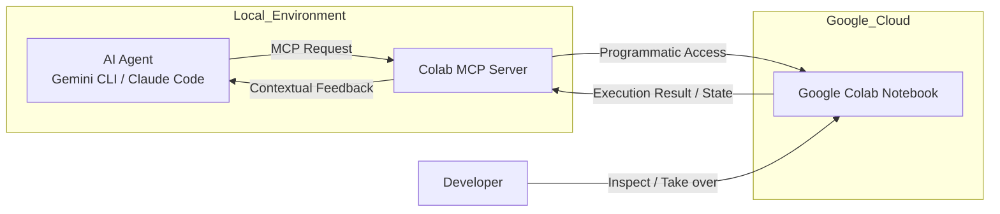

로컬 환경에서 AI 에이전트(AI Agent)를 활용해 코드를 작성하다 보면 곧 하드웨어의 한계나 보안 문제에 부딪히게 됩니다. 구글이 최근 발표한 코랩 MCP 서버(Colab MCP Server)는 이러한 제약을 해결하기 위해 로컬의 AI 에이전트와 클라우드의 구글 코랩(Google Colab) 환경을 직접 연결하는 다리를 놓았습니다.

> **한 줄 요약** — 로컬 AI 에이전트가 구글 코랩의 클라우드 컴퓨팅 자원을 직접 제어하고 노트북 파일을 자동 생성하게 해주는 오픈소스 MCP 서버가 공개되었습니다.

## AI 에이전트를 위해 구글 코랩 환경을 개방한 이유

최근 Gemini CLI나 Claude Code 같은 도구들이 로컬 터미널에서 강력한 성능을 보여주고 있습니다. 하지만 복잡한 데이터 분석이나 대규모 의존성 설치가 필요한 작업을 로컬 머신에서 직접 수행하는 것은 부담스럽습니다. 특히 에이전트가 생성한 코드를 내 컴퓨터에서 직접 실행할 때 발생할 수 있는 보안 리스크도 무시할 수 없습니다.

구글은 이런 페인 포인트를 해결하기 위해 모델 컨텍스트 프로토콜(MCP, Model Context Protocol)을 선택했습니다. MCP는 AI 모델이 외부 도구나 데이터 소스와 상호작용하는 방식을 표준화한 규격입니다. 이번 발표의 핵심은 코랩을 단순한 웹 기반 노트북이 아니라, AI 에이전트가 프로그램 방식으로 접근하여 제어할 수 있는 오픈된 호스트로 탈바꿈시킨 점에 있습니다.

실무에서 데이터 과학자나 개발자들이 터미널의 실행 결과를 복사해서 코랩 노트북에 붙여넣고, 다시 시각화 코드를 짜달라고 요청하는 번거로운 과정이 사라지는 것입니다. 에이전트가 직접 코랩 세션에 접속해 셀을 만들고 코드를 실행하며 결과를 시각화까지 마친 결과물을 우리에게 전달합니다.

## 코랩 MCP 서버의 핵심 동작 원리와 구조

코랩 MCP 서버는 로컬 에이전트와 클라우드 노트북 사이의 중계자 역할을 합니다. 에이전트가 명령을 내리면 MCP 서버가 이를 해석해 코랩의 API로 전달합니다. 단순히 코드 실행만 하는 것이 아니라 노트북의 구조 자체를 조작할 수 있다는 것이 특징입니다.

에이전트는 다음과 같은 작업을 수행할 수 있습니다.
- 새로운 .ipynb 파일을 생성하고 마크다운 셀로 작업 과정을 설명
- pandas, matplotlib 등 필요한 라이브러리를 설치하고 Python 코드를 작성 및 실행
- 논리적인 흐름에 맞게 셀 순서를 재배치하여 읽기 좋은 보고서 형태 구축
- 실시간으로 실행 결과를 확인하며 오류가 발생하면 즉시 수정

다음 다이어그램은 로컬 에이전트와 코랩이 MCP를 통해 어떻게 상호작용하는지 보여줍니다.



이 구조의 장점은 에이전트가 작업을 마친 뒤에도 코랩 노트북이라는 실행 가능한 유물이 남는다는 점입니다. 터미널에서 사라지는 일회성 코드가 아니라, 언제든 다시 열어보고 수정할 수 있는 클라우드 기반의 재현 가능한 환경이 구축됩니다.

## 실제 설정 방법과 코드 스니펫

코랩 MCP 서버를 사용하기 위해서는 몇 가지 사전 준비가 필요합니다. Python과 git이 설치되어 있어야 하며, 패키지 관리자로 uv를 권장하고 있습니다.

먼저 로컬 환경에 uv를 설치합니다.

```bash
pip install uv
```

그 다음, 사용 중인 AI 에이전트의 설정 파일(예: Claude Desktop의 config.json 등)에 코랩 MCP 서버를 등록해야 합니다. 아래는 MCP 서버 설정을 위한 JSON 예시입니다.

```json
{
  "mcpServers": {
    "colab-proxy-mcp": {
      "command": "uvx",
      "args": ["git+https://github.com/googlecolab/colab-mcp"],
      "timeout": 30000
    }
  }
}
```

설정이 완료되면 에이전트에게 자연어로 명령을 내릴 수 있습니다. "최근 매출 데이터를 로드하고 다음 달 판매량을 예측해서 시각화해줘"라고 요청하면, 에이전트는 자동으로 코랩 노트북을 열고 관련 라이브러리 설치부터 차트 생성까지 일련의 과정을 직접 수행합니다.

## 실무자의 시각으로 본 가능성과 트레이드오프

현업에서 AI 에이전트를 도입할 때 가장 고민되는 지점은 환경의 격리(Sandboxing)입니다. 에이전트가 로컬 파일 시스템을 망가뜨리거나 중요한 환경 변수를 유출하지 않을까 걱정하는 경우가 많습니다. 코랩을 백엔드로 활용하면 자연스럽게 격리된 클라우드 환경에서 코드가 실행되므로 보안 안정성이 크게 향상됩니다.

또한 컨텍스트 스위칭 비용을 획기적으로 줄여줍니다. 데이터 분석 업무를 하다 보면 터미널에서 전처리를 하고, 시각화는 노트북에서 하며, 결과 보고는 다시 문서로 정리하는 파편화된 과정을 겪습니다. 코랩 MCP는 이 모든 과정을 에이전트가 하나의 노트북 안에서 완결 짓게 만듭니다.

다만 실제 도입 시 고려해야 할 몇 가지 의문과 주의사항도 있습니다.

첫째, 네트워크 레이턴시와 타임아웃 문제입니다. 로컬에서 직접 실행하는 것보다 클라우드 세션을 연결하고 통신하는 과정에서 지연이 발생할 수 있습니다. 위 설정 코드에서 timeout을 30,000ms로 길게 잡은 이유도 복잡한 작업을 수행할 때 발생할 수 있는 지연을 고려한 것으로 보입니다.

둘째, 상태 관리의 복잡성입니다. 에이전트가 셀을 마음대로 생성하고 삭제하는 과정에서 노트북의 실행 순서가 꼬이면 디버깅이 어려워질 수 있습니다. 따라서 에이전트에게 작업을 맡기더라도 중간중간 사람이 개입해 상태를 점검하는 과정이 필요합니다.

셋째, 비용 문제입니다. 코랩의 무료 티어는 리소스 제한이 있으며, 고성능 GPU나 더 긴 런타임이 필요한 경우 코랩 유료 플랜을 사용해야 합니다. 기업 차원에서 대규모로 도입할 때는 이 비용 구조가 로컬 인프라 활용 대비 효율적인지 따져봐야 합니다.

## 마치며

구글 코랩 MCP 서버의 등장은 AI 에이전트가 단순한 코드 생성기를 넘어 실제 실행 인프라를 소유하게 되었음을 의미합니다. 이는 Gemini CLI의 훅(Hooks) 기능이나 구글 클라우드의 Wednesday Build Hour 같은 활동과 궤를 같이하며, 개발자가 인프라 설정보다 비즈니스 로직에 집중할 수 있는 환경을 지향합니다.

당장 시도해볼 수 있는 것은 평소 로컬에서 돌리기 부담스러웠던 대용량 데이터 처리 스크립트를 에이전트에게 코랩에서 실행해달라고 요청해보는 일입니다. 에이전트가 만든 노트북 결과물을 보며 내가 직접 짠 코드와 비교해보는 것만으로도 워크플로우 개선에 큰 도움이 될 것입니다.

## 참고 자료
- [원문] [Announcing the Colab MCP Server: Connect Any AI Agent to Google Colab](https://developers.googleblog.com/announcing-the-colab-mcp-server-connect-any-ai-agent-to-google-colab/) — Google Developers
- [관련] Unleash Your Development Superpowers: Refining the Core Coding Experience — Google Developers
- [관련] Tailor Gemini CLI to your workflow with hooks — Google Developers