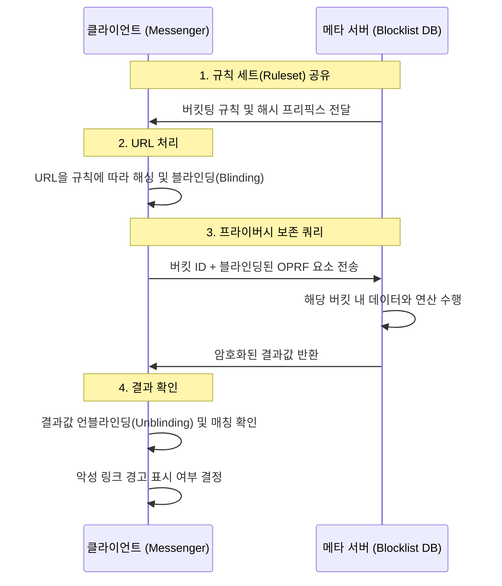

메타 메신저의 종단간 암호화(E2EE) 환경에서 사용자의 개인정보를 보호하면서도 악성 링크를 사전에 차단하는 기술적 메커니즘인 고급 브라우징 보호(Advanced Browsing Protection, ABP)의 핵심 설계 원칙을 분석한다. 서버가 사용자가 어떤 링크를 클릭했는지 알 수 없게 하면서도 수백만 개의 유해 사이트 목록과 대조하는 이 기술은 프라이버시와 보안이라는 상충하는 가치를 공존시키려는 시도다.

> **한 줄 요약** — 메타 메신저는 프라이빗 정보 검색(PIR)과 규칙 기반 버킷팅 기술을 활용해 서버에 사용자 데이터를 노출하지 않고도 실시간으로 악성 링크를 탐지한다.

## 종단간 암호화 환경에서 보안 기능을 구현할 때의 딜레마
종단간 암호화(End-to-End Encryption)가 적용된 메신저에서는 메시지 발신자와 수신자 외에는 그 내용을 누구도 알 수 없다. 이는 보안 측면에서는 훌륭하지만, 피싱이나 악성 코드 유포를 목적으로 하는 유해 링크를 서버 차원에서 필터링하기 어렵게 만든다. 서버가 링크를 검사하려면 필연적으로 사용자의 대화 내용이나 클릭 로그에 접근해야 하기 때문이다.

기존의 세이프 브라우징(Safe Browsing)은 기기 내부의 온디바이스(On-device) 모델을 활용해 유해성을 판단했다. 하지만 실시간으로 생성되고 사라지는 수백만 개의 악성 도메인을 기기에 모두 저장하고 업데이트하는 것은 모바일 환경의 저장 공간과 네트워크 대역폭 한계로 인해 불가능에 가깝다.

이러한 제약을 극복하기 위해 도입된 것이 고급 브라우징 보호(ABP)다. 이 시스템은 서버가 보유한 방대한 유해 사이트 데이터베이스를 활용하면서도, 사용자가 쿼리하는 특정 URL이 무엇인지는 서버가 알 수 없도록 설계되었다.

## 프라이빗 정보 검색(PIR)의 실무적 한계와 해결책
고급 브라우징 보호의 기술적 토대는 프라이빗 정보 검색(Private Information Retrieval, PIR)이다. PIR은 클라이언트가 서버의 데이터베이스에서 특정 정보를 조회할 때, 서버가 클라이언트가 무엇을 찾는지 알 수 없도록 보장하는 암호화 프로토콜이다.

이론적으로 가장 완벽한 PIR 방식은 서버가 데이터베이스 전체를 클라이언트에게 보내는 것이다. 하지만 데이터베이스 용량이 기가바이트 단위로 커지면 모바일 기기에서 이를 처리하기란 불가능하다. 반대로 클라이언트가 매번 쿼리를 보낸다면 서버는 사용자의 행태를 파악할 수 있게 된다. 메타는 이 간극을 메우기 위해 비의도적 의사 난수 함수(Oblivious Pseudorandom Function, OPRF)와 데이터베이스 샤딩(Sharding) 기술을 결합했다.

데이터베이스를 여러 개의 버킷(Bucket)으로 나누고, 클라이언트는 자신이 찾는 데이터가 포함될 가능성이 있는 특정 버킷만 요청한다. 이때 서버는 클라이언트가 요청한 버킷 식별자만 볼 수 있으며, 그 안에 담긴 구체적인 URL 경로나 쿼리 파라미터는 알 수 없다.

## URL 접두사 매칭과 버킷 불균형 문제
실무에서 가장 까다로운 부분은 URL이 정확히 일치하지 않아도 차단해야 한다는 점이다. 예를 들어 `malicious.com`이 차단 목록에 있다면, `malicious.com/login`이나 `malicious.com/stolen/data` 같은 하위 경로도 모두 차단 대상이 되어야 한다. 이를 접두사 매칭(Prefix Matching)이라고 한다.

단순하게 생각하면 URL의 모든 상위 경로를 각각 쿼리할 수 있지만, 이는 서버에 노출되는 정보 비트(Bits)를 늘려 사용자를 식별할 위험을 초래한다. 또한 도메인 단위로만 해싱하여 버킷을 나누면 특정 유명 도메인(예: 단축 URL 서비스)에 데이터가 쏠려 버킷 크기가 비정상적으로 커지는 불균형 문제가 발생한다.

메타는 이를 해결하기 위해 서버에서 미리 계산된 규칙 세트(Ruleset)를 클라이언트에 배포하는 방식을 선택했다. 서버는 반복적인 시뮬레이션을 통해 버킷 크기가 일정 임계치를 넘지 않도록 데이터를 쪼개는 최적의 해싱 규칙을 생성한다.

- 서버는 초기 버킷을 생성한 뒤 가장 큰 버킷을 식별한다.
- 해당 버킷에서 가장 빈번하게 등장하는 도메인을 찾아 더 세부적인 경로까지 포함하도록 해싱 규칙을 추가한다.
- 모든 버킷이 균일한 크기를 가질 때까지 이 과정을 반복한다.
- 클라이언트는 이 규칙 세트를 미리 다운로드하여, 자신이 조회하려는 URL을 몇 단계의 해시로 변환할지 스스로 결정한다.

## 실무 관점에서 바라본 트레이드오프와 고려사항
이러한 복잡한 아키텍처를 도입할 때 가장 먼저 고민해야 하는 것은 레이턴시(Latency)와 사용자 경험(UX)이다. 사용자가 링크를 클릭하는 순간 서버와 여러 단계의 암호화 통신을 주고받아야 한다면, 페이지 로딩 속도가 느려져 사용자는 불편을 느낄 수밖에 없다.

실제로 비슷한 기능을 구현하다 보면 보안을 강화할수록 네트워크 패킷의 크기가 커지는 현상을 목격하게 된다. 메타의 설계에서 흥미로운 점은 요청과 응답의 길이를 일정하게 맞추는 패딩(Padding) 기법을 사용했다는 것이다. 버킷의 크기가 제각각이면 응답 패킷의 크기만 보고도 사용자가 어떤 사이트를 조회했는지 유추할 수 있기 때문이다. 보안을 위해 의도적으로 네트워크 대역폭을 더 점유하는 결단을 내린 셈이다.

또한 OPRF를 사용한 암호화 연산은 CPU 자원을 소모한다. 저사양 모바일 기기에서는 이러한 연산 과정이 배터리 소모나 발열에 영향을 줄 수 있다. 실무적으로는 모든 링크에 대해 이 과정을 거치기보다, 신뢰할 수 없는 발신자가 보낸 링크나 생성된 지 얼마 안 된 도메인 등 특정 조건에서만 ABP를 활성화하는 식의 최적화 전략이 필요할 것으로 보인다.

## 기술적 완성도를 높이는 데이터 전처리 전략
규칙 세트를 생성할 때 서버가 수행하는 전처리 과정은 시스템의 효율성을 결정짓는 핵심이다. 해시 충돌(Hash Collision)이 발생하면 엉뚱한 사이트가 차단되는 오탐(False Positive)이 발생할 수 있다. 메타는 규칙 세트 생성 시 차단 목록 내의 중복 항목을 제거하고 충돌 가능성을 최소화하는 불변성(Invariant)을 유지하도록 설계했다.

현업에서 대규모 블랙리스트를 관리하다 보면 데이터의 신선도(Freshness) 문제에 직면한다. 악성 사이트는 수 분 내에 생성되었다가 사라지기도 한다. 따라서 규칙 세트와 버킷 데이터를 얼마나 자주 업데이트할 것인지, 그리고 업데이트 시 발생하는 클라이언트의 트래픽 부하를 어떻게 관리할 것인지가 운영의 묘미가 된다. 델타 업데이트(Delta Update) 방식을 사용하여 변경된 부분만 전송하는 기법이 필수적으로 수반되어야 한다.

## 프라이버시 중심의 보안 아키텍처가 나아갈 방향
메타의 고급 브라우징 보호 사례는 데이터 가용성과 프라이버시가 반드시 제로섬(Zero-sum) 관계는 아님을 보여준다. 암호화 기술과 지능적인 데이터 구조 설계를 결합하면, 서버가 원본 데이터를 보지 않고도 충분히 가치 있는 보안 서비스를 제공할 수 있다.

격리된 환경(Confidential Computing)이나 격자 기반 암호(Lattice-based Cryptography) 같은 더 진보된 기술들이 실무에 적용되기 시작하면, 지금보다 더 적은 대역폭으로도 강력한 익명성을 보장하는 검색 시스템이 가능해질 것이다. 현재 시스템에서 버킷 크기를 맞추기 위해 추가하는 더미 데이터(Dummy Data) 비중을 줄이는 것이 다음 단계의 과제가 될 것으로 보인다.

이 글을 읽는 개발자라면 자신이 운영하는 서비스에서 사용자 식별 정보를 서버로 보내는 지점이 어디인지 점검해볼 필요가 있다. 단순한 URL 조회 기능이라도 PIR이나 OPRF 같은 개념을 부분적으로 도입한다면, 사용자 신뢰를 높이는 동시에 데이터 유출 리스크를 원천적으로 차단하는 아키텍처를 설계할 수 있다.

## 참고 자료
- [원문] [How Advanced Browsing Protection Works in Messenger](https://engineering.fb.com/2026/03/09/security/how-advanced-browsing-protection-works-in-messenger/) — Meta Engineering
- [관련] Friend Bubbles: Enhancing Social Discovery on Facebook Reels — Meta Engineering