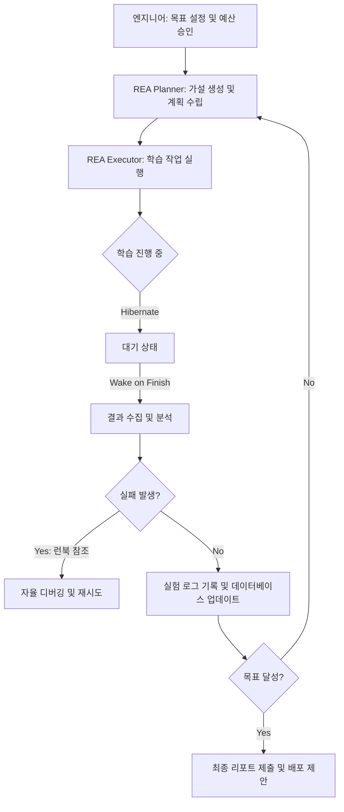

광고 랭킹 모델처럼 거대하고 복잡한 머신러닝(ML) 시스템을 운영하다 보면, 엔지니어의 시간 중 상당 부분이 실험 가설 수립, 학습 작업(Training Job) 모니터링, 로그 분석, 그리고 인프라 장애 대응에 소모된다는 것을 알 수 있습니다. 메타(Meta)가 공개한 랭킹 엔지니어 에이전트(Ranking Engineer Agent, 이하 REA)는 이러한 반복적인 ML 실험 사이클을 자율적으로 수행하여 엔지니어링 생산성을 5배 이상 끌어올린 사례를 보여줍니다. 단순히 코드를 짜주는 보조 도구를 넘어, 며칠에서 몇 주씩 걸리는 긴 호흡의 실험 과정을 스스로 관리하는 자율형 에이전트의 구조와 실무적 시사점을 정리했습니다.

> **한 줄 요약** — 메타의 REA는 하이버네이트-앤-웨이크(Hibernate-and-Wake) 메커니즘을 통해 수주 단위의 ML 실험을 자율적으로 수행하며, 모델 정확도를 2배 높이고 엔지니어 생산성을 5배 향상시켰습니다.

## ML 실험의 병목 현상을 해결하는 자율형 에이전트

메타의 광고 시스템은 페이스북, 인스타그램 등 수십억 명의 사용자에게 개인화된 경험을 제공하기 위해 고도로 분산된 ML 모델을 사용합니다. 모델이 성숙해질수록 의미 있는 성능 향상을 찾아내기는 점점 더 어려워지며, 엔지니어는 가설 검증을 위해 수많은 수동 작업을 반복하게 됩니다. 기존의 AI 어시스턴트들이 특정 코드 작성이나 로그 해석 같은 단발성 작업에 그쳤다면, REA는 실험의 전 과정을 엔드투엔드(End-to-End)로 주도한다는 점에서 차이가 있습니다.

REA는 메타 내부의 AI 에이전트 프레임워크인 컨퓨셔스(Confucius)를 기반으로 구축되었습니다. 이 프레임워크는 복잡한 다단계 추론과 코드 생성 능력을 갖추고 있으며, 작업 스케줄러나 실험 트래킹 시스템 같은 내부 인프라와 유연하게 통합됩니다. 이를 통해 에이전트는 사람이 개입하지 않아도 실험 계획을 세우고, 학습을 실행하며, 결과에 따라 다음 단계를 결정합니다.

## REA의 핵심 아키텍처와 작동 원리

REA가 장기적인 워크플로우를 유지하면서도 높은 품질의 가설을 생성할 수 있는 이유는 크게 세 가지 메커니즘 덕분입니다.

### 하이버네이트-앤-웨이크(Hibernate-and-Wake) 메커니즘

ML 학습은 보통 몇 시간에서 며칠씩 소요됩니다. 에이전트가 이 시간 동안 계속 활성화되어 자원을 낭비할 필요는 없습니다. REA는 학습 작업을 실행한 뒤 자신의 상태와 메모리를 저장하고 잠들었다가, 작업이 완료되면 자동으로 깨어나 이전 맥락을 복원합니다. 이 방식 덕분에 에이전트는 수주에 걸친 긴 실험 과정을 끊김 없이 관리할 수 있습니다.

### 이중 소스 가설 엔진(Dual-Source Hypothesis Engine)

실험의 성패는 가설의 질에 달려 있습니다. REA는 다음 두 가지 소스를 결합하여 창의적이고 실효성 있는 아이디어를 도출합니다.

- 과거 통찰 데이터베이스(Historical Insights Database): 이전 실험의 성공과 실패 패턴을 학습한 저장소입니다.
- ML 리서치 에이전트(ML Research Agent): 최신 연구 결과와 베이스라인 모델 구성을 분석하여 새로운 최적화 전략을 제안합니다.

이 두 흐름이 합쳐지면서 엔지니어 한 명이 떠올리기 어려운 복합적인 아키텍처 개선안이 나오기도 합니다.

### 3단계 계획 프레임워크

REA는 무작정 실험을 던지는 것이 아니라, 엔지니어가 승인한 예산 범위 내에서 전략적으로 움직입니다.

1. 검증(Validation): 여러 가설을 병렬로 테스트하여 기본 품질을 확인합니다.
2. 조합(Combination): 유망한 가설들을 결합하여 시너지 효과를 탐색합니다.
3. 활용(Exploitation): 가장 성과가 좋은 후보군에 자원을 집중 투입하여 결과를 극대화합니다.

## 왜 단순한 자동화보다 자율성이 중요한가?

실무에서 ML 파이프라인 자동화를 시도하다 보면 가장 먼저 부딪히는 벽은 예외 상황 처리입니다. 인프라 이슈로 학습이 중단되거나, 메모리 부족(OOM, Out of Memory)이 발생하거나, 손실 함수(Loss)가 발산하는 등의 문제는 비일비재합니다. 일반적인 자동화 스크립트는 이런 상황에서 멈춰버리지만, REA는 미리 정의된 런북(Runbook)을 참조하여 스스로 문제를 진단합니다.

예를 들어 특정 노드의 하드웨어 결함이라면 다른 노드에서 재시도하고, 모델 구조상의 문제로 학습이 불안정하다면 해당 가설을 제외하는 식입니다. 이러한 복원력(Resilience)은 엔지니어가 사소한 오류에 일일이 대응하지 않고 오직 전략적인 의사결정에만 집중할 수 있게 만듭니다. 실제로 메타에서는 단 3명의 엔지니어가 REA를 활용해 8개 모델에 대한 개선 제안을 동시에 쏟아냈는데, 이는 과거에 모델당 2명의 엔지니어가 붙어야 했던 작업량입니다.

## 실무 관점에서 바라본 에이전트 도입의 트레이드오프

REA의 사례는 매력적이지만, 현업에 바로 적용하기 전 고민해봐야 할 지점들이 있습니다. 가장 큰 부분은 연산 비용(Compute Cost)과 가설의 품질 사이의 균형입니다. 에이전트가 자율적으로 실험을 반복하게 두면 GPU 자원 소모가 급격히 늘어날 수 있습니다. 메타가 실험 시작 전 엔지니어에게 예상 비용을 승인받는 절차를 넣은 것은 매우 현실적인 선택입니다.

또한, 에이전트가 생성하는 가설이 로컬 옵티마(Local Optima)에 빠지지 않도록 하는 것도 중요합니다. 과거 데이터에만 의존하면 기존 방식의 변주에 그칠 위험이 있습니다. 이를 방지하기 위해 메타가 리서치 에이전트를 별도로 두어 외부 지식을 수혈하는 구조를 택한 점은 주목할 만합니다. 우리 조직에 도입한다면, 에이전트가 탐색(Exploration)과 활용(Exploitation) 사이의 비중을 어떻게 조절하게 할지가 핵심 설계 포인트가 될 것입니다.

결국 에이전트의 역할은 엔지니어를 대체하는 것이 아니라, 엔지니어의 생각의 속도를 물리적인 실험 속도가 따라오게 만드는 것입니다. 단순 반복 작업에서 해방된 엔지니어가 더 근본적인 문제 정의와 데이터 퀄리티 개선에 시간을 쓸 수 있다면, 그것만으로도 전체 시스템의 진화 속도는 비약적으로 빨라질 것입니다.

## 정리

REA는 ML 실험의 긴 호흡을 이해하고 스스로 관리하는 자율형 에이전트가 실무에서 어떤 파급력을 가질 수 있는지 증명했습니다. 하이버네이트 메커니즘을 통한 자원 효율화와 3단계 계획법을 통한 전략적 탐색은 규모가 큰 ML 팀일수록 즉각적인 효과를 볼 수 있는 접근법입니다. 당장 전체 시스템을 구축하기 어렵더라도, 실험 로그를 정형화하여 가설 데이터베이스를 구축하는 것부터 시작해본다면 향후 에이전트 도입을 위한 훌륭한 밑거름이 될 것입니다.

## 참고 자료
- [원문] [Ranking Engineer Agent (REA): The Autonomous AI Agent Accelerating Meta’s Ads Ranking Innovation](https://engineering.fb.com/2026/03/17/developer-tools/ranking-engineer-agent-rea-autonomous-ai-system-accelerating-meta-ads-ranking-innovation/) — Meta Engineering
- [관련] Building an MCP Ecosystem at Pinterest — Pinterest Engineering