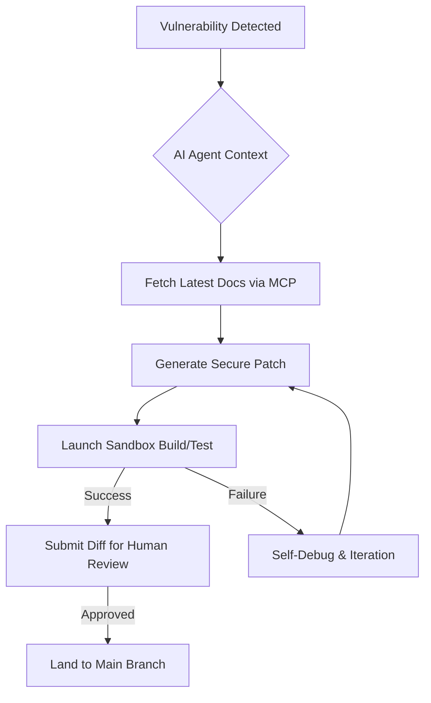

## 왜 지금 이게 문제인가
대규모 코드베이스를 운영하는 조직에서 보안 취약점 수정은 기술적 문제보다 **운영의 문제**에 가깝다. 메타와 같은 빅테크는 수백만 줄의 코드와 수천 명의 엔지니어가 얽혀 있어, 단순한 API 업데이트조차 수개월이 걸리는 거대한 작업이 된다. 특히 안드로이드 OS의 순정 API 중 일부는 보안상 취약할 수 있는데, 이를 사용하는 수많은 지점을 일일이 찾아 수정하는 것은 인적 자원의 낭비다.

기존의 방식은 정적 분석 도구로 취약점을 찾고 엔지니어에게 수정을 요청하는 '탐지 후 대응' 방식이었다. 하지만 이 방식은 두 가지 한계에 직면한다.
- **수정 지연**: 보안 팀이 가이드를 내려도 개별 서비스 팀의 우선순위에 밀려 패치가 늦어진다.
- **파편화**: 동일한 취약점이 코드베이스 곳곳에서 다른 형태로 변주되어 나타나 일괄 적용이 어렵다.

최근 메타가 공개한 **AI Codemods**와 **Ranking Engineer Agent(REA)** 사례는 이 병목을 '에이전트'가 직접 해결하는 단계로 진입했음을 보여준다. 이제 AI는 단순히 코드를 추천하는 '어시스턴트'를 넘어, 스스로 가설을 세우고 패치를 제출하며 검증까지 마치는 **자율형 에이전트**로 진화하고 있다.

## 어떻게 동작하는가
메타의 보안 전략은 **Secure-by-default 프레임워크** 구축과 **AI 기반 자동 마이그레이션**의 결합이다. 위험할 수 있는 로우레벨 API를 안전한 래퍼(Wrapper)로 감싸고, 기존 코드를 이 래퍼로 옮기는 작업을 AI 에이전트가 수행한다.

이 과정에서 핵심은 단순히 텍스트를 치환하는 것이 아니라, 코드의 문맥을 이해하고 실행 가능한 패치를 만드는 것이다. 메타의 REA(Ranking Engineer Agent)가 보여준 **Hibernate-and-wake(동면 후 깨어남)** 메커니즘은 장기 실행 작업(LRT)을 처리하는 에이전트 설계의 정수를 보여준다.



위 구조에서 주목할 점은 **Model Context Protocol(MCP)**의 활용 가능성이다. 구글이 최근 공개한 'Developer Knowledge API'와 'MCP 서버'는 AI 에이전트가 최신 문서에 실시간으로 접근할 수 있게 한다. 에이전트는 학습 데이터에 없는 최신 보안 API 명세도 MCP를 통해 호출하여 정확한 코드를 생성할 수 있다.

개념적인 AI Codemod의 동작 예시는 다음과 같다. (실제 메타 내부 API가 아닌 개념적 구현이다.)

```python
# 개념적 예시: AI 에이전트가 취약한 API를 안전한 래퍼로 교체하는 로직
def secure_migration_agent(source_code):
    # 1. 취약한 패턴 식별 (예: Context.startActivity)
    vulnerable_pattern = find_vulnerable_intent_calls(source_code)
    
    for call_site in vulnerable_pattern:
        # 2. 최신 보안 가이드라인 조회 (via Developer Knowledge API)
        secure_api_docs = mcp_client.get_docs("SecureIntentWrapper")
        
        # 3. 문맥에 맞는 패치 생성
        patch = llm.generate_patch(
            context=call_site.surrounding_code,
            target_api=secure_api_docs.markdown_content
        )
        
        # 4. 검증 및 적용
        if run_unit_tests(patch):
            apply_to_codebase(patch)
```

## 실제로 써먹을 수 있는가
이 기술은 '규모의 경제'가 작동하는 조직에서만 유효하다. 수만 개의 클래스를 가진 안드로이드 앱을 운영하는 네카라쿠배급 기업이나, 보안 규제가 엄격하여 전사적인 코드 수정이 잦은 금융권에서는 도입 가치가 높다. 하지만 일반적인 스타트업이라면 오버엔지니어링이 될 가능성이 크다.

**도입을 검토해야 하는 상황:**
- 보안 감사 결과로 인해 전사 코드베이스의 10% 이상을 수정해야 하는 '매머드급' 태스크가 발생했을 때.
- 반복적인 인프라 설정이나 라이브러리 마이그레이션으로 인해 엔지니어들의 피로도가 극에 달했을 때.
- REA 사례처럼 실험의 사이클(Hypothesis-Run-Analyze) 자체가 비즈니스의 핵심 경쟁력(광고 랭킹 등)일 때.

**운영 리스크와 트레이드오프:**
- **신뢰의 비용**: 에이전트가 제출한 PR을 사람이 리뷰하는 데 드는 시간이 직접 짜는 시간보다 길어질 수 있다. 이를 극복하려면 메타처럼 '자동 검증 파이프라인'에 대한 신뢰가 선행되어야 한다.
- **컨텍스트 오염**: AI가 생성한 패치가 비즈니스 로직의 미묘한 엣지 케이스를 깨뜨릴 위험이 있다. 특히 한국 금융권의 복잡한 보안 솔루션과 얽힌 코드라면 AI가 이를 완벽히 이해하기 어렵다.
- **인프라 요구사항**: 에이전트가 스스로 빌드하고 테스트를 돌릴 수 있는 '격리된 샌드박스' 환경 구축이 필수적이다.

구글 클라우드 넥스트 '26에서 강조된 **Agentic AI**의 핵심은 자율성이다. 메타의 REA가 3명의 엔지니어로 8개 모델의 개선안을 도출(과거엔 모델당 2명 필요)했다는 수치는 매력적이지만, 이는 고도로 표준화된 ML 플랫폼 위에서만 가능하다. 한국 실무 환경에서는 전사적인 표준 인프라(PaaS)가 갖춰지지 않은 상태에서 에이전트 도입을 서두르면, 오히려 관리해야 할 '똑똑한 쓰레기'만 늘어날 뿐이다.

보조 레퍼런스인 구글의 Developer Knowledge API는 이 퍼즐의 마지막 조각을 채워준다. AI가 과거 데이터에 매몰되지 않고 '지금 이 순간'의 정답을 참조하게 함으로써 할루시네이션을 억제하는 장치가 마련되었기 때문이다.

## 한 줄로 남기는 생각
> AI 에이전트는 코드 작성을 자동화하는 도구가 아니라, 조직의 '운영 부채'를 자율적으로 상환하는 무인 자동화 엔진으로 해석해야 한다.

---
*참고자료*
- [Meta Engineering: AI Codemods for Secure-by-Default Android Apps](https://engineering.fb.com/2026/03/13/android/ai-codemods-secure-by-default-android-apps-meta-tech-podcast/)
- [Meta Engineering: Ranking Engineer Agent (REA)](https://engineering.fb.com/2026/03/17/developer-tools/ranking-engineer-agent-rea-autonomous-ai-system-accelerating-meta-ads-ranking-innovation/)
- [Google Developers: Introducing the Developer Knowledge API and MCP Server](https://developers.googleblog.com/introducing-the-developer-knowledge-api-and-mcp-server/)