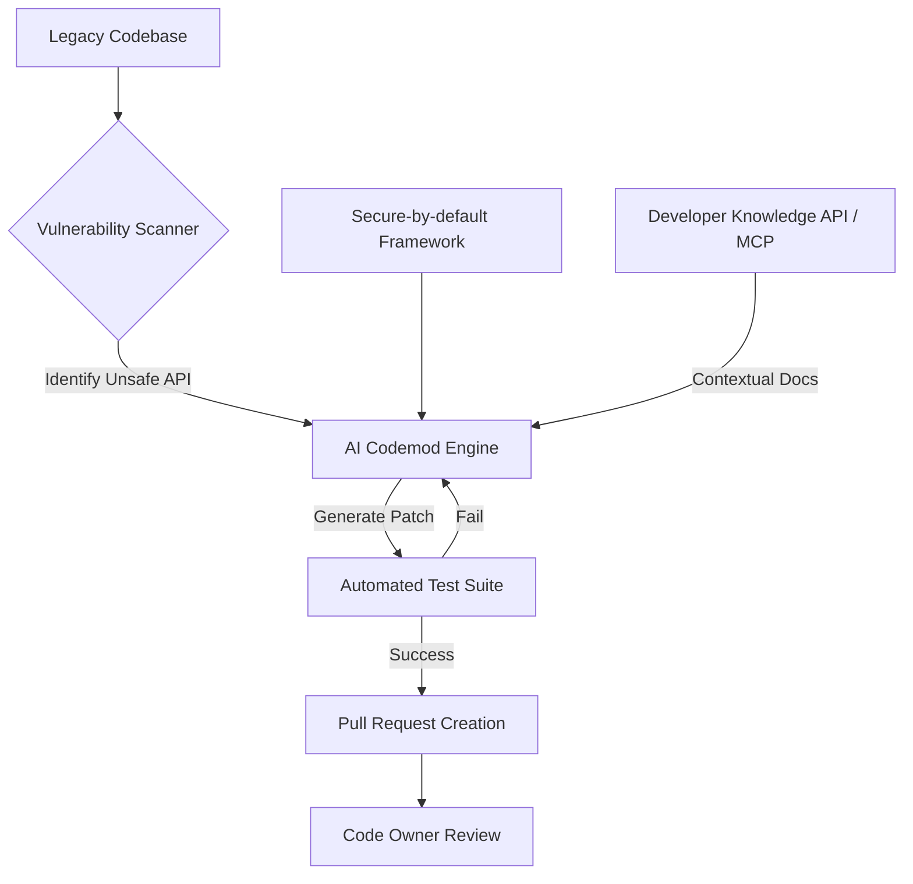

## 왜 지금 이게 문제인가

수백만 라인의 코드를 보유한 조직에서 특정 API를 전수 교체하는 작업은 단순한 '수정'이 아니라 '재난 복구'에 가깝다. Meta가 공개한 **AI Codemods** 사례는 단순히 코드를 예쁘게 짜는 도구가 아니라, 수천 명의 개발자가 흩뿌려놓은 보안 취약점을 강제로 수거하기 위한 청소 도구의 성격을 띤다. 보안 사고는 늘 '패치되지 않은 단 하나의 콜사이트(Call-site)'에서 시작되기 때문이다.

기존의 정적 분석 도구나 단순 정규표현식 기반의 `Find & Replace`는 한계가 명확했다.
- **문맥 파악의 부재**: 동일한 함수명이라도 객체의 타입이나 비즈니스 로직의 흐름에 따라 교체 방식이 달라져야 하는데, 기존 도구는 이를 구분하지 못한다.
- **커스텀 프레임워크로의 전환**: Android 표준 API를 그대로 쓰는 것이 아니라, 조직 내부의 **Secure-by-default** 래퍼(Wrapper)로 옮겨야 할 때 발생하는 복잡한 의존성을 수동으로 해결하기 어렵다.
- **커뮤니케이션 비용**: 수백 개의 팀에 "이 API는 위험하니 다음 스프린트까지 고치세요"라고 공지하고 확인하는 과정 자체가 엔지니어링 리소스의 엄청난 낭비다.

지금 이 시점에 Meta가 AI를 강조하는 이유는 명확하다. LLM이 코드의 시맨틱(Semantic)을 이해하기 시작하면서, 인간이 일일이 가이드를 주지 않아도 "이 코드는 위험한 패턴이니 우리 회사의 안전한 라이브러리로 바꿔라"라는 추론이 가능해졌기 때문이다. Google이 최근 **Developer Knowledge API**와 **MCP(Model Context Protocol) Server**를 발표하며 AI에게 최신 문서를 실시간으로 공급하려는 움직임도 같은 맥락이다. AI가 단순히 코드를 짜는 단계를 넘어, 거대 코드베이스의 유지보수와 보안 컴플라이언스를 책임지는 '에이전트'로 진화하고 있다.

## 어떻게 동작하는가

Meta의 시스템은 단순히 코드를 제안하는 수준을 넘어, **제안-검증-적용**의 루프를 자동화한다. 핵심은 위험한 Android OS API를 직접 호출하는 대신, 보안팀이 검증한 자체 프레임워크로 강제 이주시키는 것이다. 이 과정에서 AI는 레거시 코드의 인자를 분석하여 새로운 API에 맞는 형태로 변환하는 역할을 수행한다.



동작 원리를 구체화하면 다음과 같은 단계로 나뉜다.
1. **패턴 정의**: 보안팀이 교체 대상이 되는 위험 API와 목표가 되는 보안 프레임워크를 지정한다.
2. **컨텍스트 주입**: Google의 **Developer Knowledge API** 같은 도구를 통해 해당 API의 최신 사용법과 제약 사항을 AI에게 전달한다. 이는 AI가 낡은 학습 데이터에 의존해 잘못된 코드를 짜는 '환각(Hallucination)'을 방지한다.
3. **추론 및 변환**: LLM은 주변 코드를 읽고 데이터 흐름을 파악하여, 단순히 함수 이름만 바꾸는 게 아니라 필요한 파라미터를 새로 생성하거나 기존 로직을 재구성한다.

아래는 Meta가 지향하는 Secure-by-default 전환의 개념적 예시다.

```java
// [개념 예시] 레거시 코드: 보안에 취약한 직접적인 Intent 실행
void startUserActivity(Context context, Intent intent) {
    // 외부에서 주입된 Intent를 필터링 없이 실행 (취약점 발생 가능)
    context.startActivity(intent);
}

// [개념 예시] AI Codemod가 제안하는 보안 패치
void startUserActivity(Context context, Intent intent) {
    // Meta의 가상 보안 프레임워크 'SecureIntent' 사용
    // AI가 문맥을 파악해 해당 Intent가 내부용인지 외부용인지 판단 후 적절한 래퍼 적용
    SecureIntent.builder(intent)
        .requireInternalSignature() // 내부 앱 서명 확인 강제
        .build()
        .start(context);
}
```

이 과정에서 Google의 **FunctionGemma** 같은 경량화 모델(270M parameters)이 온디바이스(On-device) 혹은 로컬 환경에서 실행될 수 있다. 이는 보안이 민감한 소스 코드를 외부 클라우드로 전송하지 않고도 코드 수정 에이전트를 가동할 수 있는 기술적 토대가 된다.

## 실제로 써먹을 수 있는가

Meta의 사례는 매력적이지만, 한국의 실무 환경에 그대로 대입하기엔 몇 가지 넘어야 할 산이 있다. 특히 네카라쿠배와 같은 대형 IT 기업과 금융권, 혹은 이제 막 성장하는 스타트업은 처한 상황이 완전히 다르다.

### 도입하면 좋은 상황
- **기술 부채가 산더미인 대규모 모노레포**: 수년 전 작성된 코드가 너무 많아 어디서 어떤 취약 API가 쓰이는지 전수 조사가 불가능할 때, AI Codemod는 유일한 현실적 대안이다.
- **컴플라이언스가 엄격한 금융권**: 보안 가이드라인이 바뀔 때마다 수백 개의 마이크로서비스(MSA)를 일일이 수정해야 하는 환경에서, 자동화된 패치 생성은 인적 오류를 획기적으로 줄여준다.
- **라이브러리 메이저 업데이트**: 대규모 프레임워크 전환(예: Spring Boot 2 to 3, Vue 2 to 3) 시 발생하는 반복적인 코드 수정 작업에 최적이다.

### 굳이 도입 안 해도 되는 상황
- **테스트 커버리지가 낮은 조직**: AI가 만든 패치의 안전성을 검증할 자동화된 테스트 슈트가 없다면, 보안을 잡으려다 서비스 가용성을 날려먹는 대참사가 일어난다.
- **도메인 복잡도가 극도로 높은 비즈니스 로직**: API 호출 하나에 수십 개의 사이드 이펙트가 걸려 있는 복잡한 스파게티 코드라면 AI도 손을 들 확률이 높다.
- **소규모 팀**: AI 에이전트를 세팅하고 검증 파이프라인을 구축하는 오버헤드가 수동 수정 비용보다 클 수 있다.

| 항목 | 수동 마이그레이션 | AI Codemod (Meta 방식) |
| :--- | :--- | :--- |
| **속도** | 개발자 일정에 의존 (느림) | 파이프라인 가동 즉시 (매우 빠름) |
| **일관성** | 개발자마다 구현 방식 다름 | 정의된 보안 정책에 따라 획일화 |
| **비용** | 인건비 및 커뮤니케이션 비용 발생 | 초기 구축 비용 + 추론 인프라 비용 |
| **리스크** | 휴먼 에러 가능성 | 로직 왜곡 가능성 (테스트 필수) |

운영 리스크 측면에서 가장 큰 고민은 **"AI가 고친 코드를 누가 승인할 것인가"**이다. Meta는 코드 오너에게 PR을 날려 최종 승인을 받게 함으로써 책임을 분산했다. 한국 정서상 "AI가 짠 코드니까 문제없겠지"라는 안일한 태도가 만연해지면, 오히려 보안 사고의 책임을 묻기 모호해지는 회색 지대가 발생할 수 있다. 또한, Google Next '26에서 강조된 것처럼 **Agentic AI**가 CI/CD에 깊숙이 개입할수록, 엔지니어는 코드를 '쓰는 사람'에서 AI가 쓴 코드를 '검토하는 감별사'로 역할이 강제 전환된다. 이 변화에 적응하지 못한 팀은 AI가 쏟아내는 패치 물량에 매몰될 위험이 크다.

## 한 줄로 남기는 생각
> AI는 새로운 코드를 짜는 마술 지팡이가 아니라, 인간이 감당 못 할 수준으로 비대해진 레거시라는 쓰레기장을 청소하기 위한 고성능 진공청소기다.

---
*참고자료*
- [Meta Engineering: AI Codemods for Secure-by-Default Android Apps](https://engineering.fb.com/2026/03/13/android/ai-codemods-secure-by-default-android-apps-meta-tech-podcast/)
- [Google Developers: Introducing the Developer Knowledge API and MCP Server](https://developers.googleblog.com/introducing-the-developer-knowledge-api-and-mcp-server/)
- [Google Developers: On-Device Function Calling in Google AI Edge Gallery](https://developers.googleblog.com/on-device-function-calling-in-google-ai-edge-gallery/)