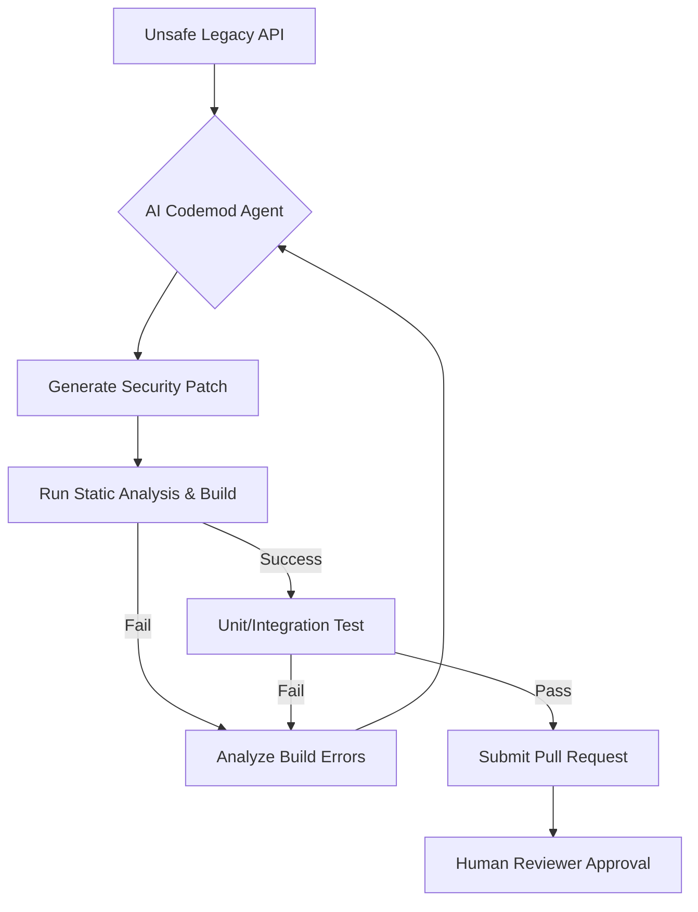

## 왜 지금 이게 문제인가

대규모 코드베이스에서 보안 취약점은 복리처럼 쌓인다. 메타(Meta)와 같은 빅테크가 수백만 라인의 안드로이드 코드를 관리할 때, 특정 API의 보안 허점 하나가 수천 개의 호출 지점(Call site)에 퍼져 있는 것은 흔한 일이다. 이를 사람이 일일이 수정하는 것은 불가능에 가깝고, 단순한 정규표현식 기반의 치환은 문맥을 놓쳐 런타임 에러를 유발하기 십상이다.

한국의 '네카라쿠배'나 대형 금융 앱 환경도 다르지 않다. 서비스가 고도화될수록 레거시 API는 도처에 깔리고, 보안 컴플라이언스 대응을 위해 수천 개의 클래스를 전수 조사해야 하는 상황이 빈번하게 발생한다. 개발자는 비즈니스 로직 개발보다 보안 패치와 라이브러리 마이그레이션 같은 반복 작업에 더 많은 에너지를 소모하게 된다.

단순히 "보안 가이드를 잘 지키자"는 선언은 실무에서 작동하지 않는다. 개발자가 실수하고 싶어도 실수할 수 없는 구조, 즉 **Secure-by-default** 환경으로 강제 전환하는 자동화 기전이 절실해진 시점이다. 메타는 이를 위해 생성형 AI와 코드모드(Codemod)를 결합하여, 보안 프레임워크로의 전환을 자동화하는 실험을 성공시켰다.

- **확장성 한계**: 수천 명의 엔지니어가 작성한 수백만 라인의 코드에서 보안 패턴을 일관되게 유지하는 것은 인적 자원만으로는 불가능하다.
- **마이그레이션 지연**: 새로운 보안 API가 나와도 기존 코드를 교체하는 데 수개월에서 수년이 걸리며, 그 사이 취약점은 방치된다.
- **도구의 한계**: 기존의 정적 분석 도구는 문제를 '지적'할 뿐 '해결'하지 못하며, 단순 스크립트는 복잡한 의존성 관계를 해결하지 못한다.

## 어떻게 동작하는가

메타의 접근 방식은 단순히 AI에게 "코드를 고쳐줘"라고 부탁하는 수준이 아니다. 먼저 안전하지 않은 안드로이드 OS API를 감싸는(Wrap) **보안 기본 프레임워크**를 설계한다. 그 후 생성형 AI가 기존의 위험한 API 호출 패턴을 분석하여, 새로운 보안 프레임워크를 사용하는 코드로 자동 변환(Codemod)하는 파이프라인을 구축했다.

핵심은 AI가 단순히 코드를 생성하는 것이 아니라, 전체 ML 라이프사이클을 자율적으로 수행하는 에이전트(REA, Ranking Engineer Agent)의 개념을 코드 수정에 도입했다는 점이다. AI는 가설을 세우고, 수정안을 제안하며, 빌드 실패 시 로그를 분석해 다시 코드를 수정하는 'Self-healing' 과정을 거친다.



구체적인 마이그레이션 예시는 다음과 같다. 아래는 보안에 취약할 수 있는 원시 API를 메타의 보안 래퍼로 교체하는 과정을 개념적으로 보여준다.

```java
// [개념 예시] 기존의 위험한 인텐트 처리 (Unsafe)
Intent intent = getIntent();
String url = intent.getStringExtra("url");
webView.loadUrl(url); // 검증되지 않은 URL 로딩 위험

// [개념 예시] AI Codemod에 의해 변환된 코드 (Secure-by-default)
// Meta의 보안 프레임워크인 'SecureWebView'와 'IntentSanitizer'를 사용하도록 강제 전환
Intent intent = getIntent();
String safeUrl = MetaSecurityChecker.sanitizeUrl(intent, "url"); 
if (safeUrl != null) {
    secureWebView.loadUrl(safeUrl);
}
```

이 과정에서 구글이 최근 발표한 **Developer Knowledge API**와 같은 도구는 AI 에이전트에게 최신 API 문서와 보안 베스트 프렉티스를 Markdown 형태로 실시간 제공하는 '지식 창고' 역할을 한다. LLM이 과거 학습 데이터에만 의존하지 않고, 최신 안드로이드 보안 가이드라인을 바탕으로 코드를 수정할 수 있게 돕는 것이다.

## 실제로 써먹을 수 있는가

메타는 이 방식을 통해 엔지니어 생산성을 5배 높였고, 모델 정확도(Ads Ranking 기준)를 2배 개선하는 등 실질적인 성과를 냈다. 하지만 이를 한국의 일반적인 개발 환경에 그대로 이식하기에는 몇 가지 뚜렷한 **트레이드오프**가 존재한다.

### 도입하면 좋은 상황
- **대규모 모노레포 환경**: 관리해야 할 코드 라인 수가 100만 라인을 넘어가고, 동일한 패턴의 보안 취약점이 반복적으로 발견되는 조직에 적합하다.
- **강력한 테스트 자동화 보유**: AI가 생성한 패치를 자동으로 검증할 수 있는 단위 테스트와 통합 테스트 커버리지가 80% 이상 확보되어 있어야 한다. 검증되지 않은 자동화는 대형 장애의 지름길이다.
- **플랫폼 팀의 존재**: 개별 서비스 개발자가 아닌, 공통 프레임워크를 설계하고 배포하는 'Platform' 또는 'DevSecOps' 팀이 주도할 수 있는 구조여야 한다.

### 굳이 도입 안 해도 되는 상황
- **비즈니스 로직 변동성이 극심한 스타트업**: 보안 패턴보다 비즈니스 규칙 자체가 매주 바뀌는 환경에서는 AI 에이전트를 학습시키고 파이프라인을 유지보수하는 비용이 더 크다.
- **코드베이스가 작은 경우**: 사람이 며칠 내로 수정할 수 있는 수준이라면, 생성형 AI의 할루시네이션(환각) 리스크를 감수하면서까지 자동화를 도입할 이유가 없다.
- **레거시 의존성이 파편화된 경우**: 표준화된 보안 래퍼를 만들기 어려울 정도로 라이브러리 버전이 제각각이라면 AI도 제대로 된 수정안을 내놓지 못한다.

### 운영 리스크와 고려사항
가장 큰 리스크는 **미묘한 동작 차이(Subtle behavioral changes)**다. 보안을 위해 추가한 샌드박싱이나 검증 로직이 기존 앱의 특정 에지 케이스(Edge case)를 깨뜨릴 수 있다. 메타는 이를 위해 '비동기 워크플로우(Hibernate-and-wake)' 메커니즘을 사용하여 AI가 며칠에 걸쳐 실험하고 결과를 분석하게 하지만, 일반 기업에서 이런 인프라를 구축하는 데는 상당한 비용이 든다.

또한, 구글 클라우드 넥스트(Google Cloud Next '26)에서 강조된 것처럼 이제는 AI를 단순 채팅 도구가 아닌 **CI/CD 파이프라인의 구성 요소**로 봐야 한다. AI 에이전트가 코드를 수정하고 PR을 올리는 행위 자체를 하나의 '엔지니어링 프로세스'로 편입시키기 위해서는 조직의 문화적 수용성과 강력한 코드 리뷰 체계가 선행되어야 한다.

## 한 줄로 남기는 생각
> 보안은 더 이상 교육과 가이드의 영역이 아니라, AI 에이전트가 상시 가동되는 코드 수정 파이프라인의 영역으로 넘어가고 있다.

---
*참고자료*
- [Meta Engineering: AI Codemods for Secure-by-Default Android Apps](https://engineering.fb.com/2026/03/13/android/ai-codemods-secure-by-default-android-apps-meta-tech-podcast/)
- [Meta Engineering: Ranking Engineer Agent (REA)](https://engineering.fb.com/2026/03/17/developer-tools/ranking-engineer-agent-rea-autonomous-ai-system-accelerating-meta-ads-ranking-innovation/)
- [Google Developers: Introducing the Developer Knowledge API and MCP Server](https://developers.googleblog.com/introducing-the-developer-knowledge-api-and-mcp-server/)