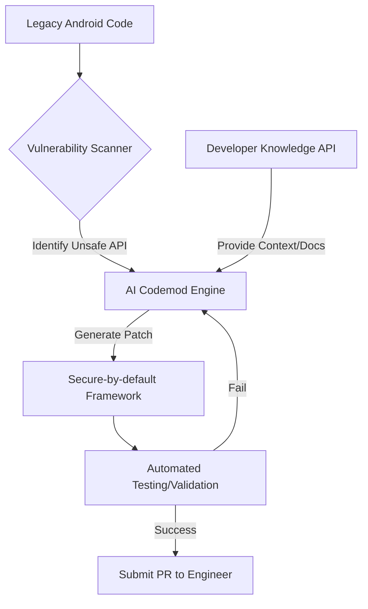

## 왜 지금 이게 문제인가

수백만 라인의 코드베이스를 가진 거대 조직에서 특정 보안 취약점을 해결하는 작업은 단순히 '수정'의 영역을 넘어선다. 안드로이드 OS의 순정 API 중 일부는 설계 결함이나 과거의 관성 때문에 보안상 위험한 경로를 기본값으로 제공하는 경우가 많다. 개발자가 실수하기 쉬운 지점이 코드 전체에 수천 군데 흩어져 있다면, 이를 일일이 찾아 고치는 것은 물리적으로 불가능에 가깝다.

- **보안 부채의 기하급수적 증가**: 서비스 규모가 커질수록 취약점 패치 속도가 신규 코드 생성 속도를 따라잡지 못한다.
- **API 오용의 반복**: 보안 가이드를 배포해도 개발자는 가장 익숙하고 짧은 코드를 선택하려는 경향이 있다.
- **매뉴얼 패치의 한계**: 수천 명의 엔지니어가 각기 다른 맥락에서 작성한 코드를 일관성 있게 마이그레이션하는 과정에서 휴먼 에러가 반드시 발생한다.

메타(Meta)가 직면한 지점은 바로 여기다. 단순히 '보안 교육'이나 '정적 분석'만으로는 해결되지 않는 거대한 규모의 레거시를 어떻게 안전하게 전환할 것인가에 대한 답으로 그들은 **AI Codemods**를 선택했다. 이는 단순히 코드를 생성하는 수준을 넘어, 보안이 내재화된(Secure-by-default) 프레임워크로의 강제 이주를 자동화하겠다는 선언이다.

## 어떻게 동작하는가

이 시스템의 핵심은 '안전하지 않은 API'를 '안전한 래퍼(Wrapper) API'로 대체하는 과정을 AI가 주도하는 것이다. 단순히 텍스트를 치환하는 정규표현식 수준이 아니라, 코드의 문맥을 파악하고 적절한 인자를 매핑하는 고도의 추론이 필요하다.

메타는 두 가지 축을 결합한다. 첫째는 위험한 OS API를 감싸서 안전한 경로만 노출하는 **Secure-by-default 프레임워크**를 구축하는 것이다. 둘째는 기존의 위험한 호출부를 찾아내어 이 프레임워크를 사용하도록 코드를 변환하는 **LLM 기반의 Codemod** 엔진이다.



동작 원리를 구체적인 단계로 나누면 다음과 같다.

1.  **패턴 식별**: 보안 팀이 정의한 위험 API 호출 지점을 전수 조사한다.
2.  **문맥 주입**: **Developer Knowledge API**와 같은 도구를 통해 최신 보안 가이드라인과 프레임워크 문서를 AI 모델에게 실시간으로 제공한다. 이는 모델이 훈련 데이터에만 의존하지 않고 최신 API 명세를 바탕으로 코드를 생성하게 만든다.
3.  **코드 변환**: AI는 기존 인자를 분석하여 새로운 안전 API의 파라미터로 재배치한다.
4.  **검증 루프**: 생성된 패치가 빌드를 깨뜨리지 않는지, 기존 테스트를 통과하는지 자동화된 파이프라인에서 확인한다.

아래는 이해를 돕기 위한 **개념적 예시** 코드다.

```kotlin
// [Before] 위험한 순정 Android API 사용 (Path Traversal 위험)
val file = File(context.filesDir, userInputPath)
val inputStream = FileInputStream(file)

// [After] AI Codemod가 제안하는 Secure-by-default 프레임워크 적용
// 내부적으로 경로 검증 및 샌드박스 처리가 강제됨
val safeInputStream = MetaSecureFileFactory.openFileInput(context, userInputPath)
```

이 과정에서 **FunctionGemma**와 같은 경량화된 모델이 CI/CD 파이프라인 내부에서 특정 함수 호출 최적화나 간단한 로직 변환을 담당할 수 있다. 대규모 언어 모델이 전체 맥락을 잡는다면, 온디바이스나 로컬 인프라에서 돌아가는 작은 모델들이 반복적인 함수 호출 패턴을 교정하는 역할을 맡는 구조다.

## 실제로 써먹을 수 있는가

메타의 사례는 매력적이지만, 한국의 일반적인 개발 환경에 그대로 대입하기에는 몇 가지 명확한 트레이드오프가 존재한다.

| 구분 | 도입 권장 상황 | 도입 비권장 상황 |
| :--- | :--- | :--- |
| **조직 규모** | 수백 명 이상의 엔지니어가 단일 모노레포를 공유할 때 | 소규모 팀이 빠른 기능 출시(MVP)에 집중할 때 |
| **코드 특성** | 보안 규제가 엄격한 금융권/커머스 앱의 공통 모듈 | 비즈니스 로직이 수시로 변하는 초기 스타트업 서비스 |
| **인프라 역량** | 자체적인 CI/CD 자동화 및 정적 분석 파이프라인 보유 | 수동 배포 위주의 환경 및 테스트 코드가 부재한 경우 |

### 1. 운영 리스크와 '리뷰 피로도'
AI가 수천 개의 PR(Pull Request)을 생성한다고 가정해 보자. 아무리 자동 검증을 거쳤더라도 최종 승인은 결국 사람이 해야 한다. 한국의 많은 개발 팀은 이미 만성적인 인력 부족에 시달리고 있다. AI가 던지는 수많은 보안 패치가 오히려 엔지니어들에게는 '업무 방해'로 느껴질 수 있으며, 이는 대충 승인하고 넘어가는 **리뷰 피로도(Review Fatigue)** 문제를 야기한다.

### 2. 'Secure-by-default' 프레임워크의 선행 조건
AI Codemod가 의미를 가지려면, 먼저 '대안이 되는 안전한 프레임워크'가 완벽하게 구축되어 있어야 한다. 한국의 많은 중견 기업이나 스타트업은 공통 프레임워크 팀이 없거나 약하다. 기반 시설 없이 AI에게 "코드를 안전하게 고쳐줘"라고 시키는 것은 환각(Hallucination)을 정중히 부탁하는 것과 다름없다.

### 3. 한국적 맥락: 금융 보안 가이드라인과의 연결
국내 금융권 앱은 금융보안원의 가이드라인을 준수해야 한다. 예를 들어, 루팅 감지나 소스코드 난독화, 민감 정보 노출 방지 등 한국 특유의 보안 요건이 존재한다. 메타의 방식처럼 AI에게 **Developer Knowledge API**를 통해 국내 보안 규정(전자금융감독규정 등)을 학습시킨다면, 컴플라이언스 대응을 위한 코드 수정 시간을 획기적으로 줄일 수 있을 것이다. 이는 매년 반복되는 보안 점검 후 조치 기간을 단축하는 실무적인 해법이 될 수 있다.

### 4. 기술적 허들: 모델의 신뢰성
아무리 **Gemini**나 **Gemma** 같은 모델이 발전해도, 보안 패치에서 0.1%의 오류는 치명적이다. 메타는 이를 대규모 자동화 테스트로 해결한다고 하지만, 한국의 많은 프로젝트는 테스트 커버리지가 낮다. 테스트 코드가 빈약한 상태에서 AI Codemod를 도입하는 것은 브레이크 없는 고속 열차에 올라타는 것과 같다.

## 한 줄로 남기는 생각
> AI Codemod는 마법의 지팡이가 아니라, 잘 설계된 내부 프레임워크라는 목적지로 레거시를 강제 이주시추는 거대한 견인차일 뿐이다.

---
*참고자료*
- [Meta Engineering: AI Codemods for Secure-by-default Android Apps](https://engineering.fb.com/2026/03/13/android/ai-codemods-secure-by-default-android-apps-meta-tech-podcast/)
- [Google Developers: Introducing the Developer Knowledge API and MCP Server](https://developers.googleblog.com/introducing-the-developer-knowledge-api-and-mcp-server/)
- [Google Developers: On-Device Function Calling in Google AI Edge Gallery](https://developers.googleblog.com/on-device-function-calling-in-google-ai-edge-gallery/)