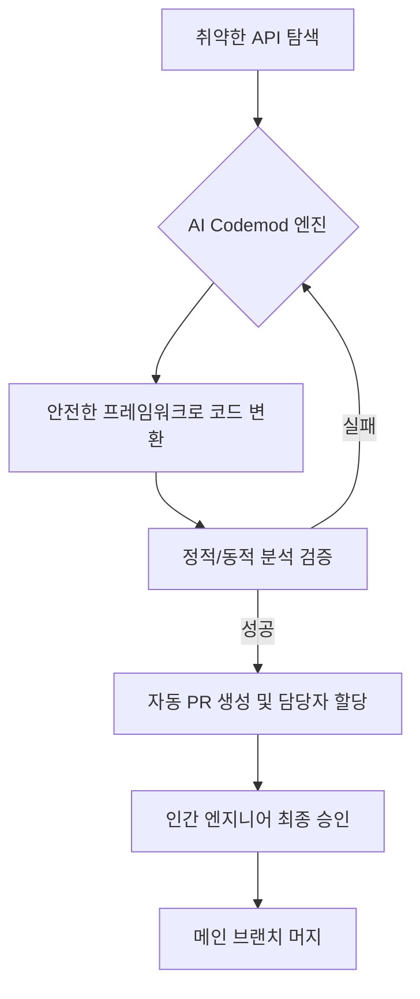

## 왜 지금 이게 문제인가
대규모 코드베이스를 운영하는 조직에서 보안 취약점 대응은 늘 '사후 약방문'에 그치기 쉽다. 안드로이드 OS의 취약한 API 하나를 교체하려 해도 수천 명의 개발자가 작성한 수백만 줄의 코드 속에 박힌 호출부(Call sites)를 일일이 찾아 수정하는 것은 물리적으로 불가능에 가깝다. 특히 메타와 같은 거대 환경에서는 특정 취약점 패턴이 전 서비스에 걸쳐 복제되어 나타나기 때문에, 단순한 가이드라인 배포만으로는 해결이 안 된다.

- **프레임워크 수준의 강제성 부족**: 개발자에게 "보안 API를 쓰세요"라고 권고하는 방식은 휴먼 에러를 막지 못한다.
- **마이그레이션 병목**: 보안팀이 안전한 래퍼(Wrapper) 프레임워크를 만들어도, 기존 레거시 코드를 옮기는 작업에 수개월이 소요된다.
- **엔지니어링 리소스 고갈**: 단순 반복적인 API 교체 작업에 시니어 엔지니어의 시간을 쓰는 것은 기회비용 측면에서 매우 비효율적이다.

메타가 AI Codemod를 들고 나온 이유는 명확하다. 사람이 직접 수정해서는 절대로 보안 부채의 속도를 따라잡을 수 없다는 판단이다. 이제는 AI가 스스로 취약한 패턴을 탐색하고, 안전한 프레임워크로 코드를 변환하며, 검증까지 마쳐서 PR(Pull Request)을 날리는 '에이전틱(Agentic) 워크플로우'가 선택이 아닌 생존의 문제가 되었다.

## 어떻게 동작하는가
메타의 보안 자동화는 단순히 '찾기 및 바꾸기'가 아니다. **Secure-by-default** 원칙을 가진 프레임워크를 먼저 설계하고, Generative AI를 활용해 기존 코드를 이 프레임워크로 이주(Migration)시키는 구조다. 여기에 더해 광고 랭킹 모델 최적화에 쓰이는 REA(Ranking Engineer Agent)의 메커니즘을 보면, AI가 가설을 세우고 실험을 돌린 뒤 실패하면 디버깅까지 직접 수행한다.



이 과정에서 핵심은 **상태 유지형 에이전트**의 동작 방식이다. 구글이 발표한 Developer Knowledge API나 MCP(Model Context Protocol) 서버를 연동하면, AI는 최신 공식 문서와 내부 프레임워크 규격을 실시간으로 참조하며 코드를 짠다. 다음은 AI가 보안 래퍼를 적용하는 가상의 개념적 예시다.

```java
// [개념 예시] 기존 취약한 API 호출 방식
Intent intent = new Intent(context, TargetActivity.class);
context.startActivity(intent); // 잠재적 Intent Redirection 취약점 존재

// [개념 예시] AI Codemod가 변환한 Secure-by-default 방식
// Meta의 내부 보안 라이브러리인 SecureIntentWrapper를 자동 적용
SecureIntentWrapper wrapper = SecureIntentWrapper.builder()
    .setContext(context)
    .setTarget(TargetActivity.class)
    .build();
wrapper.startActivitySafe(); 
```

메타의 REA 시스템은 'Hibernate-and-wake' 메커니즘을 사용한다. 수일에서 수주가 걸리는 비동기 워크플로우를 AI가 관리하며, 학습 작업이 끝나거나 에러가 나면 스스로 깨어나 다음 단계를 결정한다. 엔지니어는 전략적인 결정 포인트에서만 개입하면 된다.

## 실제로 써먹을 수 있는가
결론부터 말하자면, 이 기술은 **'표준화된 거대 코드베이스'**를 가진 팀에게는 축복이지만, **'빠르게 변하는 스타트업'**에게는 오버엔지니어링이다. 메타가 거둔 '엔지니어링 출력 5배 향상'이나 '모델 정확도 2배 개선' 같은 수치는 그만큼 자동화할 대상이 방대하고 정형화되어 있기에 가능한 결과다.

### 도입 시 고려해야 할 트레이드오프

| 구분 | 도입 권장 상황 (Go) | 도입 비권장 상황 (Stop) |
| :--- | :--- | :--- |
| **코드 규모** | 수백만 라인 이상의 모노레포 | 단일 서비스 위주의 소규모 레포 |
| **보안 요구치** | 금융, 의료 등 규제 준수가 필수인 경우 | 빠른 기능 출시가 최우선인 초기 단계 |
| **인프라 역량** | CI/CD 파이프라인과 정적 분석 도구가 완비됨 | 수동 배포가 잦고 테스트 자동화가 부족함 |
| **데이터 품질** | 내부 프레임워크 문서화가 완벽함 | "코드가 곧 문서"인 주구장창 바뀌는 환경 |

### 운영 리스크와 한국적 맥락
국내 '네카라쿠배' 급 기업들이라면 이 모델을 적극 검토해야 한다. 특히 금융권이나 핀테크 기업처럼 보안 컴플라이언스가 엄격한 환경에서는 AI Codemod가 훌륭한 '보안 감사 대응 도구'가 될 수 있다. 하지만 한국 특유의 '빨리빨리' 문화에서 AI가 생성한 PR을 시니어 개발자가 일일이 리뷰할 시간이 확보될지가 관건이다. 

- **할루시네이션(Hallucination)의 공포**: 보안 관련 코드를 AI가 수정할 때, 미묘한 로직 오류로 서비스 장애를 일으킬 리스크가 존재한다.
- **러닝 커브**: 단순히 툴을 도입하는 게 아니라, AI가 이해하기 쉬운 '기계 판독 가능한(Machine-readable)' 문서 체계(구글의 MCP 서버 같은)를 먼저 구축해야 한다.
- **인간의 역할 변화**: 이제 엔지니어는 코드를 짜는 사람에서, AI가 짠 코드의 '보안 정책'을 설계하고 '최종 승인'하는 관리자로 변모해야 한다.

구글 클라우드 넥스트 '26에서 강조했듯, 이제 에이전틱 AI는 실험실을 넘어 CI/CD 파이프라인의 핵심 구성 요소로 들어오고 있다. 하지만 메타의 사례처럼 3명의 엔지니어가 8개 모델의 개선을 주도하는 수준에 이르려면, 조직 전체의 엔지니어링 표준화 수준이 극도로 높아야 한다. 준비되지 않은 상태에서의 도입은 오히려 AI가 뱉어내는 '쓰레기 코드 PR'의 홍수에 시달리는 결과만 초래할 것이다.

## 한 줄로 남기는 생각
> AI는 더 이상 새로운 코드를 짜기 위한 도구가 아니라, 인간이 과거에 저지른 기술 부채와 보안 허점을 청소하기 위한 '자율 주행 진공청소기'로 진화하고 있다.

---
*참고자료*
- [Meta Engineering: AI Codemods for Secure-by-Default Android Apps](https://engineering.fb.com/2026/03/13/android/ai-codemods-secure-by-default-android-apps-meta-tech-podcast/)
- [Meta Engineering: Ranking Engineer Agent (REA)](https://engineering.fb.com/2026/03/17/developer-tools/ranking-engineer-agent-rea-autonomous-ai-system-accelerating-meta-ads-ranking-innovation/)
- [Google Developers: Developer Knowledge API and MCP Server](https://developers.googleblog.com/introducing-the-developer-knowledge-api-and-mcp-server/)