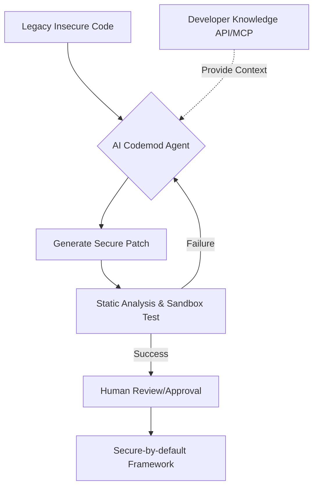

## 왜 지금 이게 문제인가
- **규모의 경제가 만든 기술 부채의 임계점**: 메타처럼 수백만 라인의 코드와 수천 명의 엔지니어가 얽힌 조직에서 보안 취약점 하나를 수정하는 것은 단순한 '패치'가 아닌 '대이주(Migration)'에 가깝다.
- **인간의 인지 능력 한계**: 안드로이드 OS의 원시 API는 보안상 위험한 경로를 허용하는 경우가 많으며, 이를 전사적으로 안전한 래퍼(Wrapper) API로 교체하는 작업은 수동으로 진행할 경우 수개월이 소요된다.
- **실험의 병목 현상**: ML 모델 최적화 역시 가설 설정부터 디버깅까지 엔지니어의 수동 개입이 필수적이었으나, 모델의 복잡도가 증가하며 사람이 직접 반복문을 돌리는 방식으로는 성능 개선 속도를 따라잡을 수 없게 되었다.
- **맥락의 파편화**: AI 어시스턴트가 존재해도 최신 문서와 실제 코드 베이스 사이의 간극 때문에 생성된 코드가 '할루시네이션(환각)'을 일으키거나 보안 정책에 위배되는 코드를 제안하는 일이 잦아졌다.

## 어떻게 동작하는가
메타의 'Secure-by-default' 전략은 위험한 API를 직접 쓰지 못하게 막는 내부 프레임워크를 구축하고, **AI Codemods**를 통해 기존 레거시 코드를 이 프레임워크로 자동 전환하는 것이 핵심이다. 여기에 **REA(Ranking Engineer Agent)**와 같은 자율 에이전트가 결합되어 가설 수립부터 배포까지의 사이클을 스스로 반복한다.



이 프로세스는 단순히 코드를 바꾸는 것에 그치지 않고 다음과 같은 단계로 구체화된다:

1.  **Context Grounding**: Google의 MCP(Model Context Protocol) 서버나 Developer Knowledge API를 통해 최신 보안 가이드라인과 API 문서를 실시간으로 참조한다.
2.  **Autonomous Iteration**: REA가 적용한 'Hibernate-and-wake' 매커니즘을 통해, 훈련이나 빌드처럼 오래 걸리는 비동기 작업 중에는 에이전트가 상태를 저장하고 작업 완료 시 다시 깨어나 다음 단계를 수행한다.
3.  **Verification Loop**: 생성된 패치는 정적 분석 도구와 샌드박스 테스트를 거치며, 실패 시 에이전트가 로그를 분석하여 스스로 코드를 수정한다.

아래는 메타의 Codemod가 레거시 네트워킹 코드를 보안 래퍼로 교체하는 방식을 묘사한 **개념 예시**다.

```python
# [개념 예시] 레거시 API를 Secure-by-default 프레임워크로 전환하는 에이전트 로직
def secure_migration_agent(source_code):
    # 1. 취약한 패턴 식별 (예: 암호화되지 않은 HTTP 통신)
    unsafe_pattern = "DefaultHttpClient()"
    
    if unsafe_pattern in source_code:
        # 2. 최신 보안 가이드라인(MCP 기반) 조회
        secure_api = knowledge_api.get_canonical_wrapper("networking")
        
        # 3. AI 기반 코드 수정 제안
        patch = ai_engine.generate_patch(
            original=source_code,
            target_api=secure_api,
            context="Ensure TLS 1.3 and certificate pinning"
        )
        
        # 4. 검증 루프 실행
        if run_static_analysis(patch) and run_unit_tests(patch):
            return patch
    return source_code
```

## 실제로 써먹을 수 있는가
메타의 사례는 경이롭지만, 한국의 일반적인 개발 환경에 그대로 대입하기에는 몇 가지 거대한 장벽이 존재한다.

### 도입하면 좋은 상황
- **금융권 및 엔터프라이즈 레거시**: 보안 규정이 까다롭고 수년 전 작성된 PHP나 Java 코드가 산적한 은행/보험사의 경우, 보안 취약점 일괄 대응을 위한 AI Codemod 도입은 비용 효율성이 매우 높다.
- **플랫폼 엔지니어링 팀**: 사내 공통 라이브러리를 운영하며 전사적인 버전 업데이트나 API Deprecation을 강제해야 하는 '네카라쿠배' 급의 기술 조직에 적합하다.
- **MLOps 고도화**: 수많은 모델 가설을 검증해야 하지만 시니어 ML 엔지니어가 부족한 스타트업이라면 REA와 같은 자율 에이전트로 엔지니어 1인당 생산성을 극대화할 수 있다.

### 굳이 도입 안 해도 되는 상황
- **비즈니스 로직 중심의 소규모 스타트업**: 코드 베이스가 작고 변화가 잦은 곳에서는 에이전트를 위한 인프라와 검증 루프를 구축하는 비용(Cost)이 수동 수정 비용보다 클 수 있다.
- **문서화가 전무한 조직**: AI 에이전트는 '신뢰할 수 있는 소스'를 기반으로 움직인다. 사내 API 문서나 보안 정책이 코드와 따로 노는 조직에서 AI를 돌리면 오히려 정교하게 망가진 코드를 대량 생산하게 된다.

### 운영 리스크와 트레이드오프
| 구분 | 리스크 및 고려사항 | 비판적 판단 |
| :--- | :--- | :--- |
| **신뢰성** | 할루시네이션으로 인한 런타임 오류 | 보안 패치가 오히려 백도어가 될 위험이 있으므로 최종 승인 단계의 인간 개입은 필수적이다. |
| **비용** | LLM 토큰 비용 및 연산 자원 | 수백만 라인을 스캔하고 수정하는 비용이 엔지니어 인건비보다 저렴한지 'ROI'를 따져야 한다. |
| **기술 부채** | 내부 래퍼(Wrapper)에 대한 종속성 | 메타처럼 독자적인 프레임워크를 쓰면 외부 라이브러리 업데이트 시 이중으로 대응해야 하는 락인(Lock-in)이 발생한다. |

### 한국 맥락에서의 재해석
한국의 개발 문화는 '빠른 실행'에 치우쳐 있어 보안이나 아키텍처 일관성이 뒷전이 되기 쉽다. 특히 금융권의 경우 '망 분리'라는 특수 환경 때문에 외부 클라우드 기반의 최신 AI 에이전트(Google Cloud Next '26에서 강조된 Agentic AI 등)를 그대로 쓰기 어렵다.

결국 한국형 실무에 적용하려면 **온프레미스 LLM을 활용한 폐쇄형 Codemod 환경** 구축이 선행되어야 한다. 또한, 단순히 코드를 고치는 AI를 넘어 Google의 MCP처럼 '회사의 정책(Policy)'을 기계가 읽을 수 있는 형태로 관리하는 **Policy-as-Code**가 먼저 정착되어야 메타와 같은 자동화가 의미를 갖는다.

## 한 줄로 남기는 생각
> AI 에이전트는 게으른 엔지니어를 대신해 코드를 짜주는 도구가 아니라, 완벽주의 엔지니어가 설계한 '안전한 감옥'으로 레거시를 강제 이주시추는 집행관이다.

---
**보조 레퍼런스 및 관련 링크**
- [Meta Engineering: Ranking Engineer Agent (REA)](https://engineering.fb.com/2026/03/17/developer-tools/ranking-engineer-agent-rea-autonomous-ai-system-accelerating-meta-ads-ranking-innovation/)
- [Google Developers: Introducing the Developer Knowledge API and MCP Server](https://developers.googleblog.com/introducing-the-developer-knowledge-api-and-mcp-server/)
- [Google Developers: A developer's guide to Google Cloud Next '26](https://developers.googleblog.com/you-cant-stream-the-energy-a-developers-guide-to-google-cloud-next-26-in-vegas/)