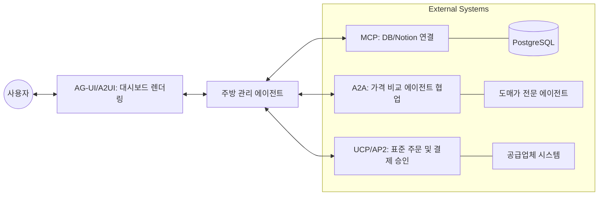

> **한 줄 요약** — AI 에이전트가 데이터에 접근하고 상호작용하는 방식을 표준화하는 MCP, A2A, UCP 등 6가지 핵심 프로토콜의 작동 원리와 실무 적용 방안을 정리했습니다.

## 이 주제를 꺼낸 이유

최근 기술 블로그나 커뮤니티를 보면 MCP, A2A, UCP 같은 낯선 약어들이 쏟아지고 있습니다. 단순히 새로운 라이브러리가 나온 수준이 아니라, 에이전트가 외부 세계와 소통하는 규약 자체가 변하고 있다는 신호입니다.

지금까지는 에이전트를 만들 때마다 특정 서비스의 API 명세서를 읽고 전용 도구(Tool)를 일일이 개발해야 했습니다. 서비스가 10개면 10개의 커스텀 통합 코드를 짜고 유지보수해야 하는 셈인데, 이는 확장성 측면에서 큰 걸림돌이 됩니다.

구글이 제시한 이 가이드는 에이전트 간의 대화, 상거래 처리, 결제 승인, UI 렌더링까지 모든 과정을 표준화하려는 시도를 담고 있습니다. 복잡한 통합 코드의 늪에서 벗어나 비즈니스 로직에 집중하고 싶은 개발자라면 반드시 이해해야 할 흐름입니다.

## 핵심 내용 정리

가이드의 핵심은 에이전트 개발 키트(ADK, Agent Development Kit)를 활용해 주방 관리 에이전트를 구축하는 시나리오를 통해 각 프로토콜의 역할을 설명하는 것입니다. 모델이 단순히 텍스트를 생성하는 수준을 넘어 실제 재고를 확인하고 결제까지 마치는 과정을 단계별로 확인할 수 있습니다.

### 데이터 연결의 표준, 모델 컨텍스트 프로토콜(MCP)

모델 컨텍스트 프로토콜(MCP, Model Context Protocol)은 에이전트가 데이터 소스나 도구에 연결되는 방식을 표준화합니다. 과거에는 PostgreSQL 데이터베이스나 Notion 페이지에 접근하기 위해 각각의 API 래퍼를 작성해야 했지만, MCP를 사용하면 표준 연결 패턴 하나로 수많은 서버에 접속할 수 있습니다.

```python
from google.adk.agents import Agent
from google.adk.tools.mcp_tool import McpToolset
from google.adk.tools.mcp_tool.mcp_session_manager import StdioConnectionParams
from mcp import StdioServerParameters

# Notion MCP를 사용하여 레시피와 공급업체 연락처 조회
notion_tools = McpToolset(connection_params=StdioConnectionParams(
    server_params=StdioServerParameters(
        command="npx",
        args=["-y", "@notionhq/notion-mcp-server"],
        env={"NOTION_TOKEN": "YOUR_TOKEN"}),
    timeout=30))

kitchen_agent = Agent(
    model="gemini-3-flash-preview",
    name="kitchen_manager",
    instruction="재고를 확인하고 레시피를 찾아 공급업체에 이메일을 보내세요.",
    tools=[notion_tools],
)
```

이 방식의 장점은 도구를 제공하는 팀이 MCP 서버를 유지보수하므로, 개발자는 API 엔드포인트가 바뀔 때마다 코드를 수정할 필요가 없다는 점입니다.

### 에이전트 간 협업, A2A 프로토콜

주방 관리 에이전트가 재고는 알 수 있어도 실시간 도매 시장 가격이나 물류 상태까지 다 알 수는 없습니다. 이때 전문성을 가진 다른 에이전트에게 협업을 요청해야 하는데, 이를 표준화한 것이 에이전트 투 에이전트(A2A, Agent2Agent) 프로토콜입니다.

각 에이전트는 특정 경로(`/.well-known/agent-card.json`)에 자신의 능력치를 설명하는 에이전트 카드를 게시합니다. 주방 에이전트는 이 카드를 읽고 어떤 에이전트에게 질문을 던질지 런타임에 결정합니다. 새로운 전문가 에이전트를 추가할 때 별도의 코드 수정 없이 URL만 등록하면 되는 구조입니다.

### 상거래와 결제의 규약, UCP와 AP2

에이전트가 실제로 물건을 주문하려면 범용 커머스 프로토콜(UCP, Universal Commerce Protocol)이 필요합니다. 공급업체마다 제각각인 체크아웃 로직을 하나의 통일된 스키마로 묶어주는 역할입니다.

여기에 에이전트 결제 프로토콜(AP2, Agent Payments Protocol)이 더해지면 보안이 완성됩니다. 에이전트가 무분별하게 법인 카드를 긁지 못하도록, 승인된 가맹점인지, 예산 범위 내인지, 유효 기간이 남았는지를 암호화된 위임장(Mandate) 형태로 검증합니다.

### 인터페이스와 스트리밍, A2UI 및 AG-UI

에이전트의 작업 결과가 단순히 텍스트로만 나오면 사용자는 답답함을 느낍니다. A2UI(Agent-to-UI)와 AG-UI(Agentic UI)는 에이전트가 대시보드나 대화형 위젯을 사용자 브라우저에 직접 렌더링할 수 있게 해줍니다. 특히 데이터가 준비되는 대로 화면을 업데이트하는 스트리밍 인터페이스를 통해 사용자 경험을 개선합니다.



## 내 생각 & 실무 관점

가이드에서 제시한 프로토콜들은 사실상 에이전트 운영체제(Agent OS)의 시스템 콜(System Call)을 정의하려는 시도로 보입니다. 실무에서 에이전트 기반 시스템을 설계하다 보면 항상 부딪히는 지점이 있습니다. 바로 신뢰와 제어입니다.

### 통합 비용의 드라마틱한 감소

현업에서 외부 API를 연동할 때 가장 짜증 나는 순간은 상대방 API가 예고 없이 필드명을 바꾸거나 인증 방식이 변경될 때입니다. MCP 구조를 채택하면 이런 변화에 대응하는 주체가 클라이언트 개발자가 아닌 도구 제공자가 됩니다. 이는 에이전트의 기능을 확장할 때 드는 공수를 획기적으로 줄여줄 것입니다.

### 보안과 거버넌스의 중요성

AP2 프로토콜에서 언급된 위임장(Mandate) 개념은 실무적으로 매우 중요합니다. 실제로 에이전트에게 결제 권한을 주는 것은 경영진 입장에서 매우 공포스러운 일입니다. 하지만 암호화된 증명과 함께 예산 한도가 설정된 프로토콜이 있다면 도입을 설득하기 훨씬 수월해집니다.

다만, 이 모든 프로토콜이 제대로 작동하려면 에이전트가 생성한 결과물을 검증하는 과정이 필수입니다. 구글의 컨덕터(Conductor) 같은 도구가 주목받는 이유도 여기에 있습니다. 에이전트가 짠 코드가 스타일 가이드를 준수하는지, 보안 취약점은 없는지 자동화된 리뷰(Automated Reviews)를 거치는 단계가 반드시 병행되어야 합니다.

### 트레이드오프: 유연성 vs 표준화

모든 표준이 그렇듯, 초기에는 자유도가 떨어지는 느낌을 받을 수 있습니다. 특정 서비스만의 독특한 기능을 UCP 스키마에 담기 어려울 수도 있습니다. 하지만 장기적으로 에이전트 생태계가 파편화되는 것을 막으려면 이러한 불편함을 감수하고서라도 표준 규격을 따르는 것이 유리합니다. 마치 우리가 HTTP 프로토콜의 제약 안에서 웹의 폭발적인 성장을 목격했듯이 말입니다.

## 정리

AI 에이전트는 이제 단순한 챗봇을 넘어 복잡한 워크플로우를 스스로 수행하는 실행 주체로 진화하고 있습니다. MCP로 데이터를 연결하고, A2A로 협업하며, UCP와 AP2로 경제 활동을 수행하는 흐름은 거스를 수 없는 대세가 될 것입니다.

당장 모든 시스템을 이 프로토콜로 바꿀 수는 없겠지만, 새로 개발하는 에이전트 도구에 MCP를 적용해 보거나 에이전트 간의 소통 방식을 A2A 패턴으로 설계해 보는 것부터 시작해 보길 권합니다. 표준을 먼저 이해하는 개발자가 에이전트 중심의 개발 환경에서 더 큰 주도권을 갖게 될 것입니다.

## 참고 자료
- [원문] [Developer’s Guide to AI Agent Protocols](https://developers.googleblog.com/developers-guide-to-ai-agent-protocols/) — Google Developers
- [관련] Introducing Wednesday Build Hour — Google Developers
- [관련] Unleash Your Development Superpowers: Refining the Core Coding Experience — Google Developers
- [관련] Conductor Update: Introducing Automated Reviews — Google Developers