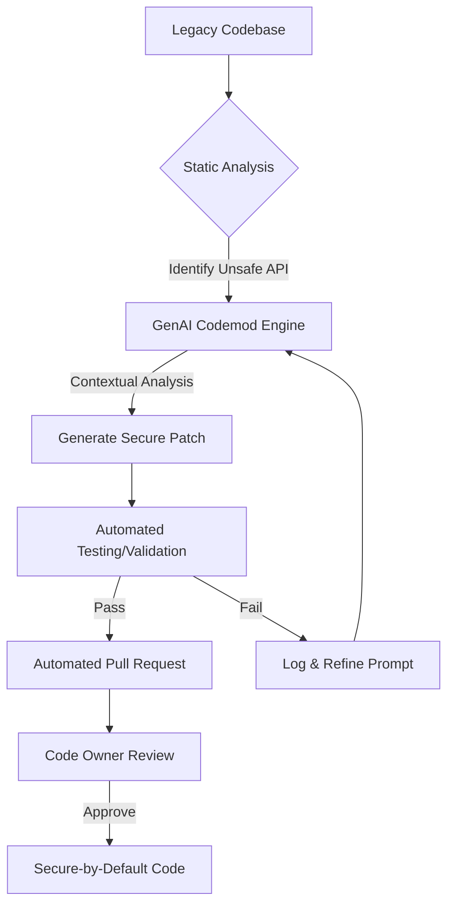

> **TL;DR** — 메타(Meta)는 수백만 라인의 안드로이드 코드베이스에서 발생하는 보안 취약점을 해결하기 위해 **기본 보안 프레임워크(Secure-by-Default Frameworks)**와 **생성형 AI 기반 코드 수정(AI Codemods)** 기술을 결합했습니다. 이를 통해 개발자의 개입을 최소화하면서도 안전하지 않은 OS API를 보안이 강화된 내부 API로 대규모 자동 마이그레이션하는 시스템을 구축했습니다.

## 배경과 문제 정의

수천 명의 엔지니어가 협업하고 수백만 라인의 코드가 복잡하게 얽힌 메타의 안드로이드 앱 환경에서, 단순한 API 업데이트조차 거대한 도전 과제가 됩니다. 특히 보안 관련 변경 사항은 더욱 까다롭습니다.

안드로이드 OS가 제공하는 기본 API 중 일부는 설계상 보안에 취약할 수 있는 지점을 포함하고 있습니다. 이러한 **취약한 API 호출 패턴(Vulnerability Class)**이 광범위한 코드베이스 곳곳에 흩어져 있을 경우, 단일 보안 패치로는 문제를 근본적으로 해결하기 어렵습니다. 

메타의 제품 보안(Product Security) 팀은 이 문제를 해결하기 위해 두 가지 핵심 과제에 직면했습니다.
- **확장성(Scalability)**: 수백 개의 호출 지점을 일일이 수동으로 수정하는 것은 불가능에 가깝습니다.
- **지속성(Sustainability)**: 보안 패치를 적용하더라도, 새로운 코드가 다시 취약한 API를 사용하면 문제는 반복됩니다.

## 핵심 내용

메타는 이 문제를 해결하기 위해 **"보안이 기본인 경로가 가장 쉬운 경로가 되어야 한다"**는 철학을 바탕으로 두 단계 전략을 수립했습니다.

### 1. 기본 보안 프레임워크 (Secure-by-Default Frameworks)
안전하지 않을 수 있는 안드로이드 OS API를 직접 사용하는 대신, 이를 안전하게 감싼(Wrap) 메타만의 보안 프레임워크를 설계했습니다. 이 프레임워크는 개발자가 별도의 보안 설정을 고민하지 않아도 기본적으로 가장 안전한 옵션을 선택하도록 유도합니다.

### 2. 생성형 AI를 활용한 코드 모드 (AI Codemods)
기존에 작성된 방대한 코드를 새로운 보안 프레임워크로 옮기는 과정에서 생성형 AI를 투입했습니다. 과거의 코드 수정 도구(Codemod)는 정적인 규칙(Rule-based)에 의존하여 복잡한 문맥을 파악하는 데 한계가 있었으나, 생성형 AI는 코드의 의도를 이해하고 적절한 보안 패치를 제안합니다.

**AI Codemod의 작동 워크플로우**
1. **취약점 식별**: 정적 분석 도구를 통해 안전하지 않은 API 호출 지점을 탐색합니다.
2. **패치 생성**: 생성형 AI가 해당 코드의 문맥을 분석하여 보안 프레임워크를 적용한 수정안을 만듭니다.
3. **검증 및 제출**: 자동화된 테스트를 통해 수정된 코드의 안정성을 확인한 후, 해당 코드를 소유한 엔지니어에게 코드 리뷰(PR) 형태로 제안합니다.

### 기술적 상세: 왜 생성형 AI인가?
기존의 추상 구문 트리(AST, Abstract Syntax Tree) 기반 변환 도구는 코드의 구조가 조금만 달라져도 적용이 어려웠습니다. 반면, 생성형 AI는 다음과 같은 이점을 제공합니다.
- **문맥 파악(Context Awareness)**: 단순히 함수명을 바꾸는 것을 넘어, 주변 로직에 맞춰 인자값을 조정하거나 예외 처리를 추가할 수 있습니다.
- **낮은 마찰력(Low Friction)**: AI가 생성한 패치는 품질이 높아서, 코드를 소유한 엔지니어가 큰 수정 없이 바로 승인할 수 있는 수준을 유지합니다.
- **대규모 자동화**: 수백 개의 서로 다른 컴포넌트에 흩어진 코드를 동시에 안전한 버전으로 마이그레이션할 수 있습니다.

## 실무 적용 포인트

메타의 이러한 접근 방식을 실무에 적용할 때 고려해야 할 핵심 사항들입니다.

### 도입 시 고려사항
- **인간 중심의 자동화(Human-in-the-loop)**: AI가 코드를 직접 수정하여 배포하는 것이 아니라, 반드시 해당 코드의 소유자(Owner)가 리뷰하고 승인하는 단계를 두어 안정성을 확보해야 합니다.
- **고충실도(High Fidelity) 검증**: 자동화된 패치가 기능을 망가뜨리지 않도록 유닛 테스트와 통합 테스트 커버리지가 충분히 확보된 환경에서 효과적입니다.
- **점진적 마이그레이션**: 한꺼번에 모든 코드를 수정하기보다는, 가장 위험도가 높은 API부터 우선순위를 정해 AI Codemod를 적용하는 것이 권장됩니다.

### 도입하면 좋은 상황 vs 불필요한 상황
- **좋은 상황**:
    - 전사적으로 표준화된 새로운 라이브러리나 프레임워크를 도입해야 할 때
    - 특정 보안 취약점 패턴이 코드베이스 전반에 걸쳐 반복적으로 발견될 때
    - 수동으로 대응하기에는 코드 수정 지점이 너무 많을 때
- **불필요한 상황**:
    - 코드베이스 규모가 작아 수동 수정이 더 빠르고 정확할 때
    - 비즈니스 로직이 매우 특이하여 일반적인 패턴화가 불가능할 때
    - 테스트 자동화가 거의 되어 있지 않아 자동 수정의 부작용을 감당하기 어려울 때

### 트레이드오프와 운영 리스크
- **AI의 환각(Hallucination)**: AI가 보안상 더 위험한 코드를 생성하거나, 문법적으로는 맞지만 로직이 틀린 코드를 만들 위험이 있습니다. 이를 방지하기 위한 강력한 정적 분석 및 테스트 파이프라인이 필수적입니다.
- **학습 비용**: 보안 팀은 단순히 패치를 만드는 것을 넘어, AI가 올바른 보안 패턴을 학습하고 적용할 수 있도록 고품질의 프롬프트와 예시 코드를 관리해야 합니다.

## 마치며
> 보안은 더 이상 엔지니어의 주의력에만 의존할 수 있는 영역이 아닙니다. 메타는 **보안이 기본이 되는 프레임워크**를 구축하고, **생성형 AI를 통해 대규모 코드베이스의 기술 부채를 자동 해결**함으로써 '보안과 개발 속도'라는 두 마리 토끼를 잡고 있습니다. 이는 대규모 시스템을 운영하는 모든 엔지니어링 조직에 자동화된 보안 운영(DevSecOps)의 새로운 이정표를 제시합니다.

---
> **출처**: 이 글은 [Meta Engineering](https://engineering.fb.com/2026/03/13/android/ai-codemods-secure-by-default-android-apps-meta-tech-podcast/)의 원문을 한국어로 번역·재구성한 글입니다.
> 원문의 저작권은 원저자에게 있으며, 이 글은 학습과 정보 공유 목적으로 작성되었습니다.

*참고자료*
- 원문: [Patch Me If You Can: AI Codemods for Secure-by-Default Android Apps](https://engineering.fb.com/2026/03/13/android/ai-codemods-secure-by-default-android-apps-meta-tech-podcast/)
- [Ranking Engineer Agent (REA): The Autonomous AI Agent Accelerating Meta’s Ads Ranking Innovation](https://engineering.fb.com/2026/03/17/developer-tools/ranking-engineer-agent-rea-autonomous-ai-system-accelerating-meta-ads-ranking-innovation/)
- [Friend Bubbles: Enhancing Social Discovery on Facebook Reels](https://engineering.fb.com/2026/03/18/ml-applications/friend-bubbles-enhancing-social-discovery-on-facebook-reels/)