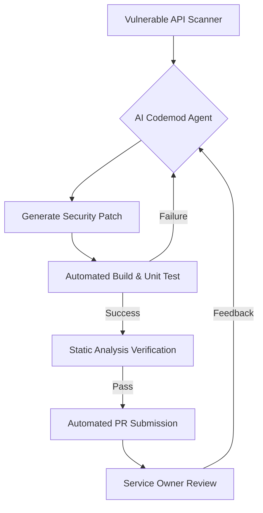

## 왜 지금 이게 문제인가

대규모 서비스에서 보안 취약점 하나를 해결하는 것은 단순히 코드 한 줄을 고치는 문제가 아니다. 메타처럼 수백만 라인의 코드와 수천 명의 엔지니어가 얽혀 있는 환경에서는 안드로이드 OS의 특정 API 하나를 보안상 안전한 래퍼(Wrapper)로 교체하는 작업조차 수개월이 걸리는 거대 프로젝트가 된다. 보안 팀이 취약점을 발견해도 각 제품 팀의 백로그 우선순위에 밀려 방치되는 사이, 서비스의 공격 표면은 계속 넓어진다.

*   **파편화된 호출부**: 안드로이드 OS API는 보안상 취약할 수 있는 지점이 많지만, 이를 사용하는 수천 개의 호출 지점을 수동으로 수정하는 것은 불가능에 가깝다.
*   **개발자 경험(DX)의 저하**: 보안 가이드를 배포해도 개발자들은 '마감 기한'과 '보안 준수' 사이에서 갈등하며, 결국 익숙하지만 위험한 기존 방식을 답습한다.
*   **사후 처리의 한계**: 정적 분석 도구로 취약점을 찾아내도, 이를 수정할 '주인'을 찾아 할당하고 검증하는 과정에서 엄청난 엔지니어링 리소스가 낭비된다.

한국의 '네카라쿠배'나 금융권 환경도 다르지 않다. 특히 금융권은 보안 컴플라이언스 준수가 필수적인데, 레거시 시스템의 API를 일괄 전환하는 과정에서 발생하는 사이드 이펙트 공포 때문에 위험한 코드를 '예외 처리'로 덮어두는 경우가 허다하다. 메타는 이 지점에서 "사람이 고치게 하지 말고, AI가 안전한 프레임워크로 코드를 강제 이주(Migration)시키게 하자"는 전략을 택했다.

## 어떻게 동작하는가

메타의 접근 방식은 단순한 '코드 추천'이 아니다. **Secure-by-default 프레임워크**를 먼저 설계하고, 기존의 위험한 API 호출을 이 프레임워크로 자동 전환하는 **AI Codemods** 파이프라인을 구축했다. 이는 개발자가 보안을 '선택'하는 것이 아니라, 시스템이 보안을 '기본값'으로 강제하는 구조다.

핵심은 AI가 단순히 코드를 생성하는 데 그치지 않고, 수정된 코드가 빌드 가능한지, 테스트를 통과하는지, 그리고 보안 정책을 충족하는지 검증하는 루프를 자동화했다는 점이다. 이는 최근 메타가 발표한 광고 랭킹 모델 최적화 에이전트인 **REA(Ranking Engineer Agent)**의 철학과도 궤를 같이한다. REA가 가설 설정부터 학습, 디버깅까지 스스로 수행하듯, 보안 Codemod 역시 패치 생성부터 검증까지 에이전트 방식으로 동작한다.



이 과정에서 사용되는 핵심 개념 예시는 다음과 같다. (실제 메타의 내부 API가 아닌 개념적 구현이다.)

```java
// [개념 예시] 기존의 위험한 안드로이드 Intent 처리 코드
Intent intent = getIntent();
String url = intent.getStringExtra("target_url");
webView.loadUrl(url); // 피싱이나 권한 상승 취약점 노출 위험

// [개념 예시] AI Codemod가 제안하는 Secure-by-default 프레임워크 전환 코드
// Meta의 내부 보안 래퍼 클래스를 사용하도록 자동 변경
SecureIntent secureIntent = SecureIntent.wrap(getIntent());
String validatedUrl = secureIntent.getSafeUrlExtraOrThrow("target_url");
MetaWebView.loadUrlSecurely(this, validatedUrl); 
```

## 실제로 써먹을 수 있는가

메타의 사례는 매력적이지만, 한국 실무 환경에서 이를 곧바로 적용하기에는 몇 가지 현실적인 트레이드오프가 존재한다. 특히 AI가 생성한 보안 패치를 얼마나 신뢰할 수 있는가의 문제는 단순한 기술적 이슈를 넘어선다.

| 구분 | 도입이 필요한 상황 | 도입을 재고해야 하는 상황 |
| :--- | :--- | :--- |
| **코드 규모** | 수백 개 이상의 마이크로서비스나 거대 모노레포를 운영할 때 | 단일 코드베이스이며 개발자가 10명 내외인 경우 |
| **보안 요구사항** | 특정 보안 패턴(예: 데이터 암호화, API 인증)의 전사적 강제가 필요할 때 | 비즈니스 로직의 변동성이 너무 커서 프레임워크 추상화가 불가능할 때 |
| **인프라 역량** | CI/CD 파이프라인 내에 자동화된 검증 도구가 완비된 경우 | 수동 빌드와 수동 배포에 의존하고 있는 환경 |

### 운영 리스크와 고려사항

1.  **검증의 병목 현상**: AI는 초당 수천 개의 패치를 만들 수 있지만, 이를 최종 승인하는 것은 결국 사람이다. 메타는 이를 해결하기 위해 **REA**에서 선보인 'Hibernate-and-wake' 메커니즘처럼, AI가 긴 호흡의 작업을 수행하다가 결정적인 순간에만 사람의 개입을 요청하는 방식을 채택했다. 한국 기업에서도 시니어 개발자가 모든 PR을 검토하는 구조라면, AI Codemod는 오히려 검토 피로도만 높이는 독이 될 수 있다.
2.  **프레임워크의 경직성**: 'Secure-by-default'를 위해 만든 래퍼 프레임워크가 OS의 새로운 기능을 따라가지 못하면, 개발자들은 다시 우회로를 찾게 된다. 이는 구글이 **Google Cloud Next '26**에서 강조한 'Agentic AI'의 방향성, 즉 도구가 단순히 규칙을 따르는 것을 넘어 맥락을 이해하고 인프라 현대화를 도와야 한다는 점과 연결된다.
3.  **학습 데이터의 편향**: 내부 프레임워크에 특화된 AI 패치를 만들려면, 회사의 자체 코드베이스로 튜닝된 모델이 필요하다. 단순히 GPT-4를 쓰는 것만으로는 메타가 달성한 '5배의 엔지니어링 생산성(REA 기준)'이나 '모델 정확도 2배 향상'과 같은 성과를 내기 어렵다.

### 한국적 맥락에서의 해석

국내 금융권이나 대기업 공통 플랫폼 팀이라면, 전사 공통 라이브러리의 보안 업데이트 시 이 모델을 참고해볼 만하다. 예를 들어, Log4j 사태와 같은 긴급 보안 패치 상황에서 AI Codemod는 수천 개의 서비스에 대한 대응 속도를 획기적으로 줄일 수 있다. 하지만 이를 위해서는 먼저 **"보안은 개발자의 책임이 아니라 플랫폼의 책임"**이라는 인식의 전환과 함께, 모든 코드를 자동 검증할 수 있는 강력한 테스트 커버리지가 선행되어야 한다.

또한, 메타의 **Friend Bubbles** 사례에서 보듯 소셜 그래프 신호를 활용해 관계의 친밀도를 측정하고 개인화된 경험을 주는 것처럼, 개발자 환경에서도 '어떤 팀의 코드가 가장 위험한지', '어떤 엔지니어가 보안 패치를 가장 잘 수용하는지'에 대한 데이터 기반의 접근이 병행될 때 AI Codemod의 실효성이 극대화될 것이다.

## 한 줄로 남기는 생각
> 보안은 더 이상 사람이 지키는 수칙이 아니라, 에이전트가 밀어붙이는 강제된 리팩토링의 결과물이어야 한다.

---
*참고자료*
- [Meta Engineering: AI Codemods for Secure-by-Default Android Apps](https://engineering.fb.com/2026/03/13/android/ai-codemods-secure-by-default-android-apps-meta-tech-podcast/)
- [Meta Engineering: Ranking Engineer Agent (REA)](https://engineering.fb.com/2026/03/17/developer-tools/ranking-engineer-agent-rea-autonomous-ai-system-accelerating-meta-ads-ranking-innovation/)
- [Google Developers: A developer's guide to Google Cloud Next '26](https://developers.googleblog.com/you-cant-stream-the-energy-a-developers-guide-to-google-cloud-next-26-in-vegas/)