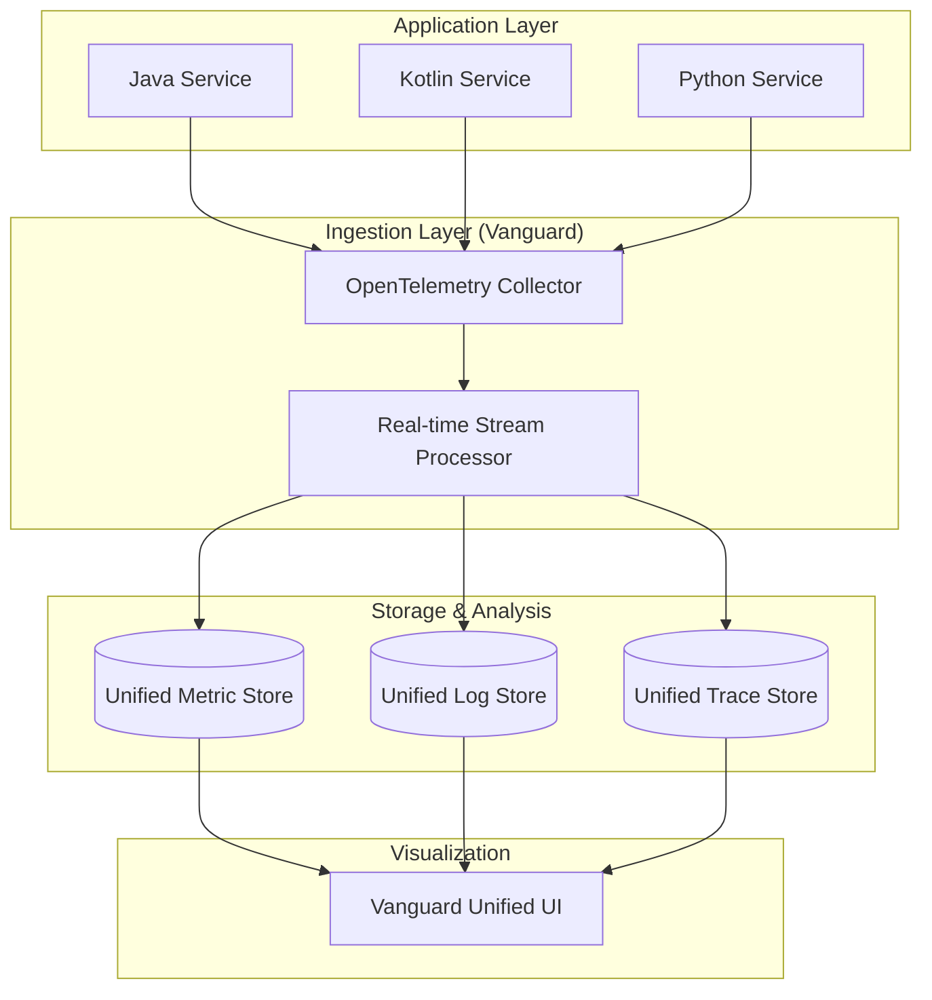

에어비앤비(Airbnb)가 최근 발표한 기술 블로그를 읽으면서 깊은 공감을 느꼈습니다. 14년 넘게 자바와 코틀린 기반의 백엔드 시스템을 운영하며 가장 골머리를 앓았던 지점이 바로 옵저버빌리티(Observability)였기 때문입니다. 처음에는 간단히 외부 벤더사의 솔루션을 도입해 해결하려 하지만, 서비스 규모가 커지면 결국 비용과 데이터 파편화라는 거대한 벽에 부딪히게 됩니다. 에어비앤비는 이 문제를 해결하기 위해 뱅가드(Vanguard)라는 자체 플랫폼을 구축하며 주도권을 되찾아왔습니다.

## 왜 에어비앤비는 잘 쓰던 외부 솔루션을 버렸을까?

대부분의 스타트업이나 중견 기업은 데이터독(Datadog)이나 뉴렐릭(New Relic) 같은 서비스형 소프트웨어(SaaS) 솔루션으로 옵저버빌리티를 시작합니다. 저 역시 과거 여러 프로젝트에서 이런 도구들을 적극적으로 활용했습니다. 설치가 쉽고 UI가 미려하며 초기에는 관리 부담이 거의 없기 때문입니다. 하지만 에어비앤비가 지적했듯, 기업이 성숙해질수록 벤더사의 비즈니스 모델과 기업의 기술적 요구사항은 서로 다른 방향으로 흐르기 마련입니다.

가장 큰 문제는 비용의 비효율성입니다. 에어비앤비처럼 트래픽이 거대한 곳에서는 메트릭(Metrics), 로그(Logs), 트레이스(Traces) 데이터의 양이 기하급수적으로 늘어납니다. 벤더사는 보통 데이터 보존 기간이나 수집량에 따라 과금하는데, 이는 엔지니어들이 시스템을 깊게 들여다보려 할수록 더 많은 돈을 내야 한다는 뜻이 됩니다. 결국 비용 때문에 로그 수준을 낮추거나 트레이싱 샘플링 비율을 줄이는 타협을 하게 되는데, 이는 옵저버빌리티의 본질을 해치는 행위입니다.

데이터가 서로 단절되어 있다는 점도 큰 걸림돌입니다. 특정 메트릭에서 이상 징후를 발견했을 때, 그와 연관된 로그와 트레이스를 즉시 연결해서 보는 것은 장애 대응의 핵심입니다. 하지만 여러 벤더 도구를 섞어 쓰다 보면 데이터 간의 맥락(Context)이 끊어집니다. 에어비앤비는 엔지니어들이 도구 사이를 넘나들며 시간을 허비하는 대신, 하나의 통합된 환경에서 문제를 해결할 수 있는 환경이 필요하다고 판단했습니다.

## 통합 플랫폼 Vanguard가 지향하는 구조

에어비앤비가 구축한 뱅가드 플랫폼의 핵심은 데이터의 표준화와 통합입니다. 이들은 오픈텔레메트리(OpenTelemetry)를 기반으로 수집 레이어를 단일화했습니다. 제가 실무에서 겪었던 가장 고통스러운 순간 중 하나가 서로 다른 라이브러리들이 내뱉는 메트릭 형식이 달라서 이를 가공하는 데 시간을 다 쓰는 상황이었습니다. 에어비앤비는 이를 원천적으로 차단하기 위해 수집 단계부터 통합된 파이프라인을 설계했습니다.

위 구조에서 주목할 부분은 통합 UI입니다. 에어비앤비는 메트릭을 보다가 클릭 한 번으로 해당 시점의 로그와 트레이스를 바로 확인할 수 있는 사용자 경험을 제공했습니다. 이는 단순히 도구를 하나로 합친 것을 넘어, 장애 전파 경로를 추적하는 시간을 획기적으로 줄여줍니다. 핀터레스트(Pinterest)가 10만 개 이상의 분석 테이블 사이에서 의도를 파악하기 위해 텍스트 투 SQL(Text-to-SQL) 모델을 고도화한 것처럼, 에어비앤비 역시 방대한 데이터 속에서 엔지니어가 길을 잃지 않게 만드는 데 집중했습니다.

## 14년 차 개발자가 본 마이그레이션의 현실적인 난관

에어비앤비의 사례를 읽으며 제가 가장 크게 공감했던 대목은 기술적인 구현보다 마이그레이션 과정의 고충이었습니다. 기존에 사용하던 수만 개의 대시보드와 알람 설정을 새로운 플랫폼으로 옮기는 일은 결코 쉽지 않습니다. 우리 팀에서도 예전에 프로메테우스(Prometheus) 기반의 모니터링 시스템을 구축할 때, 각 팀이 작성한 커스텀 메트릭을 표준화하는 데만 수개월이 걸렸던 기억이 납니다.

에어비앤비는 이를 해결하기 위해 소유권(Ownership)이라는 개념을 도입했습니다. 각 서비스 팀이 직접 자신의 옵저버빌리티 데이터를 관리하도록 독려하되, 중앙 플랫폼 팀은 이를 쉽게 할 수 있는 도구와 가이드라인을 제공하는 방식입니다. 이는 구글 클라우드 넥스트(Google Cloud Next)에서 강조하는 에이전틱 AI(Agentic AI)의 흐름과도 일맥상통합니다. 인프라 팀이 모든 것을 다 해주는 시대는 지났습니다. 대신 개발자가 스스로 인프라와 관측 가능성을 제어할 수 있는 자율성을 부여하는 것이 현대 아키텍처의 핵심입니다.

실무 관점에서 볼 때, 인하우스 플랫폼 구축의 가장 큰 리스크는 운영 부담입니다. 벤더사에 돈을 지불하는 대신, 이제는 플랫폼 자체를 운영할 엔지니어들의 인건비와 인프라 비용이 발생합니다. 에어비앤비 정도의 규모라면 이 비용이 벤더사 비용보다 훨씬 저렴하겠지만, 중소규모 기업이라면 이야기가 달라집니다. 따라서 무작정 에어비앤비를 따라 하기보다는, 우리 서비스의 데이터 성장 속도와 엔지니어링 리소스를 냉정하게 계산해 봐야 합니다.

## 옵저버빌리티 주도권을 되찾기 위한 제언

에어비앤비의 여정은 단순히 툴을 바꾼 기록이 아니라, 시스템에 대한 통제권을 어떻게 되찾아왔는지에 대한 기록입니다. 저 역시 연차가 쌓일수록 느끼는 점은, 우리가 만든 시스템이 어떻게 돌아가고 있는지 정확히 모르는 상태에서 코드를 짜는 것만큼 위험한 일은 없다는 사실입니다.

지금 운영 중인 시스템에서 특정 API의 응답 시간이 늦어졌을 때, 그 원인이 데이터베이스 쿼리인지, 외부 API 호출인지, 아니면 가비지 컬렉션(GC) 때문인지 1분 안에 파악할 수 없다면 여러분의 옵저버빌리티는 개선이 필요한 상태입니다. 에어비앤비처럼 거대한 플랫폼을 당장 만들 수는 없더라도, 최소한 데이터 간의 연결 고리를 만드는 작업부터 시작해야 합니다.

가장 먼저 해볼 수 있는 일은 오픈텔레메트리 표준을 우리 프로젝트에 도입해 보는 것입니다. 특정 벤더사에 종속적인 라이브러리 대신 표준 SDK를 사용하면, 나중에 플랫폼을 옮기더라도 코드 수정 없이 설정만으로 대응할 수 있습니다. 시스템의 내부를 투명하게 들여다보는 능력은 이제 시니어 엔지니어에게 선택이 아닌 필수 역량입니다.

정리하자면, 옵저버빌리티는 단순히 그래프를 그리는 작업이 아닙니다. 그것은 서비스의 신뢰성을 담보하고 개발자의 생산성을 높이는 핵심 인프라입니다. 에어비앤비의 사례처럼 비용 효율적이고 통합된 관측 환경을 구축하는 것은 장기적으로 비즈니스의 민첩성을 결정짓는 중요한 승부처가 될 것입니다. 여러분의 팀에서도 지금 당장 우리 시스템의 가시성이 충분한지, 데이터가 파편화되어 있지는 않은지 점검해 보시길 권합니다.