## 왜 지금 이게 문제인가

"Pod가 Pending 상태로 멈춰 있습니다." Kubernetes를 운영하는 팀이라면 한 번쯤 들어본 문장이다. 대부분의 경우 리소스 부족이 원인이지만, 클러스터가 1,000노드를 넘어가고 GPU 워크로드가 섞이기 시작하면 이야기가 완전히 달라진다. **스케줄러가 병목**이 되는 것이다.

국내에서 AI 워크로드가 폭증하면서 이 문제는 더 이상 해외 빅테크만의 이야기가 아니다. 네이버 클라우드 HyperCLOVA 학습 클러스터, 카카오 클라우드의 GPU 인스턴스 풀, 그리고 수많은 스타트업의 A100/H100 클러스터에서 스케줄러 성능은 인프라 비용과 직결된다. GPU 한 장이 시간당 수만 원인 환경에서 스케줄링 지연 10초는 곧 돈이다.

- **기본 스케줄러의 한계**: kube-scheduler는 범용 설계다. GPU topology-aware 배치, gang scheduling(여러 Pod를 동시에 배치), bin-packing 최적화 같은 요구사항에는 기본값이 부족하다.
- **커스텀 스케줄러의 함정**: 직접 만들면 해결될 것 같지만, 스케줄링 프레임워크를 제대로 이해하지 못하면 race condition과 데드락의 늪에 빠진다.
- **한국적 맥락**: 국내 MLOps 팀 상당수가 Volcano나 Kueue 같은 batch 스케줄러를 도입하고 있지만, 기본 스케줄러의 동작 원리를 모른 채 플러그인을 얹으면 디버깅이 불가능해진다.

## 어떻게 동작하는가

kube-scheduler는 단순한 "빈 노드 찾기"가 아니다. 정교한 파이프라인을 거치는 의사결정 엔진이다.

### 스케줄링 프레임워크: 파이프라인 해부

Kubernetes 1.19부터 도입된 Scheduling Framework는 스케줄링 과정을 **확장 포인트(Extension Points)**로 분리했다. 각 단계에 플러그인을 끼워 넣을 수 있는 구조다.

```mermaid
graph LR
    A[QueueSort] --> B[PreFilter]
    B --> C[Filter]
    C --> D[PostFilter]
    D --> E[PreScore]
    E --> F[Score]
    F --> G[NormalizeScore]
    G --> H[Reserve]
    H --> I[Permit]
    I --> J[PreBind]
    J --> K[Bind]
    K --> L[PostBind]

    style C fill:#e74c3c,color:#fff
    style F fill:#2ecc71,color:#fff
    style H fill:#3498db,color:#fff
```



핵심 단계를 정리하면:

1. **PreFilter/Filter**: 후보 노드를 걸러낸다. 리소스 부족, taint/toleration 불일치, affinity 위반 노드를 제거한다. 5,000노드 클러스터에서 이 단계가 후보를 수십 개로 줄인다.
2. **PreScore/Score**: 남은 후보에 점수를 매긴다. `LeastRequestedPriority`(리소스 여유가 많은 노드 선호), `BalancedResourceAllocation`(CPU/메모리 비율 균형) 등이 기본 플러그인이다.
3. **Reserve/Bind**: 최고 점수 노드를 예약하고 실제로 Pod를 바인딩한다. 이 단계에서 실패하면 Unreserve가 호출되어 롤백된다.

### 필터링과 스코어링: 노드 선택의 수학

Filter 단계는 boolean이다. 통과하거나 탈락하거나. 하지만 Score 단계는 0-100 사이의 정수를 반환하며, 각 플러그인의 점수에 **가중치(weight)**를 곱해 합산한다.

```
최종 점수 = Σ (plugin_score × plugin_weight)
```

기본 스케줄러는 `MostRequestedPriority`와 `LeastRequestedPriority`를 상황에 따라 사용한다. 클라우드 환경에서는 bin-packing(MostRequested)이 비용 효율적이고, 온프레미스에서는 spread(LeastRequested)가 안정적이다.

아래는 커스텀 Score 플러그인의 Go 구현 예시다. GPU 메모리 여유를 기준으로 점수를 매긴다:

```go
package gpuscore

import (
	"context"
	"k8s.io/kubernetes/pkg/scheduler/framework"
)

type GPUMemoryScore struct{}

func (pl *GPUMemoryScore) Name() string {
	return "GPUMemoryScore"
}

func (pl *GPUMemoryScore) Score(
	ctx context.Context,
	state *framework.CycleState,
	pod *v1.Pod,
	nodeName string,
) (int64, *framework.Status) {
	nodeInfo, err := state.Read("nodeinfo-" + nodeName)
	if err != nil {
		return 0, framework.AsStatus(err)
	}
	// GPU 메모리 여유량이 많을수록 높은 점수
	gpuFree := getGPUMemoryFree(nodeInfo)
	gpuTotal := getGPUMemoryTotal(nodeInfo)
	if gpuTotal == 0 {
		return 0, nil
	}
	score := int64((gpuFree * 100) / gpuTotal)
	return score, nil
}

func (pl *GPUMemoryScore) ScoreExtensions() framework.ScoreExtensions {
	return nil
}
```

### 프리엠션과 우선순위: 누가 먼저인가

모든 노드가 Filter를 통과하지 못하면 **PostFilter** 단계에서 프리엠션이 발동한다. 낮은 우선순위의 Pod를 쫓아내고 자리를 확보하는 것이다.

프리엠션의 동작 순서:
1. PriorityClass가 낮은 Pod를 후보로 선정
2. 해당 Pod를 퇴거(evict)시켰을 때 새 Pod가 배치 가능한지 시뮬레이션
3. **가장 적은 수의 Pod를 쫓아내는** 노드를 선택
4. 퇴거 대상 Pod에 `nominatedNodeName`을 설정하고 graceful termination 시작

이 과정에서 `PodDisruptionBudget`을 위반하는 퇴거는 발생하지 않는다. 하지만 PDB를 설정하지 않은 서비스가 GPU 노드에서 돌고 있다면? AI 학습 Job이 프리엠션으로 추론 서비스를 죽이는 사고가 벌어진다.

## 실제로 써먹을 수 있는가

### 커스텀 스케줄러가 필요한 순간

| 구분 | 기본 스케줄러 | 커스텀 스케줄러/플러그인 |
|------|-------------|----------------------|
| 일반 웹 서비스 | 충분함 | 불필요 |
| GPU 학습 (단일 Pod) | affinity로 해결 가능 | 불필요 |
| 분산 학습 (gang scheduling) | 불가능 | **Volcano/Kueue 필수** |
| GPU topology-aware 배치 | 미지원 | NVIDIA GPU Operator + 커스텀 플러그인 |
| 멀티 테넌트 공정 분배 | ResourceQuota로 제한적 | Kueue의 ClusterQueue 추천 |
| 비용 최적화 bin-packing | 기본 플러그인 존재 | 가중치 튜닝으로 충분 |

### 굳이 건드리지 않아도 되는 상황

솔직히 말하면, **90%의 클러스터는 기본 스케줄러로 충분하다.** Node affinity, taint/toleration, topology spread constraints 세 가지만 제대로 설정해도 대부분의 배치 요구사항은 해결된다. 커스텀 스케줄러를 만들겠다는 팀에게 먼저 물어야 할 질문: "scheduling profile 설정을 다 시도해봤는가?"

### 운영 리스크

1. **GPU 스케줄링 파편화**: 네이버 클라우드나 카카오 클라우드에서 GPU 노드를 운영할 때, device plugin과 스케줄러의 리소스 뷰가 불일치하는 경우가 발생한다. `nvidia.com/gpu` 리소스가 실제 가용 GPU와 맞지 않으면 스케줄러는 존재하지 않는 GPU에 Pod를 배치한다.

2. **스케줄러 throughput 병목**: 기본 스케줄러는 초당 약 100-200 Pod를 처리한다. AI 학습 파이프라인에서 수백 개의 Pod를 동시에 생성하면 스케줄링 큐에 병목이 생긴다. `percentageOfNodesToScore` 파라미터를 50% 이하로 낮추면 throughput은 올라가지만 배치 품질이 떨어진다.

3. **프리엠션 연쇄 반응**: PriorityClass를 세밀하게 나누지 않으면 프리엠션이 연쇄적으로 발생한다. 국내 MLOps 환경에서 흔히 보는 패턴: 학습 Job이 추론 서비스를 밀어내고, 추론 서비스가 모니터링 Pod를 밀어내는 도미노 현상.

4. **멀티 스케줄러 충돌**: 기본 스케줄러와 Volcano를 동시에 운영하면 같은 노드에 대해 두 스케줄러가 경쟁적으로 바인딩을 시도한다. `schedulerName` 필드로 명확히 분리하지 않으면 Pod가 영원히 Pending 상태에 빠진다.

## 한 줄로 남기는 생각

> 스케줄러를 커스터마이징하기 전에, 기본 스케줄러의 파이프라인을 끝까지 읽어본 엔지니어가 몇 명인지 먼저 세어보라.

---
*참고자료*
- [Kubernetes Scheduling Framework 공식 문서](https://kubernetes.io/docs/concepts/scheduling-eviction/scheduling-framework/)
- [kube-scheduler 소스코드 (GitHub)](https://github.com/kubernetes/kubernetes/tree/master/pkg/scheduler)
- [Volcano: Kubernetes Native Batch System](https://volcano.sh/)
- [Kueue: Kubernetes-native Job Queueing](https://kueue.sigs.k8s.io/)
- [NVIDIA GPU Operator 문서](https://docs.nvidia.com/datacenter/cloud-native/gpu-operator/overview.html)
- [Scheduling at Scale - Kubernetes Enhancement Proposals](https://github.com/kubernetes/enhancements/tree/master/keps/sig-scheduling)
