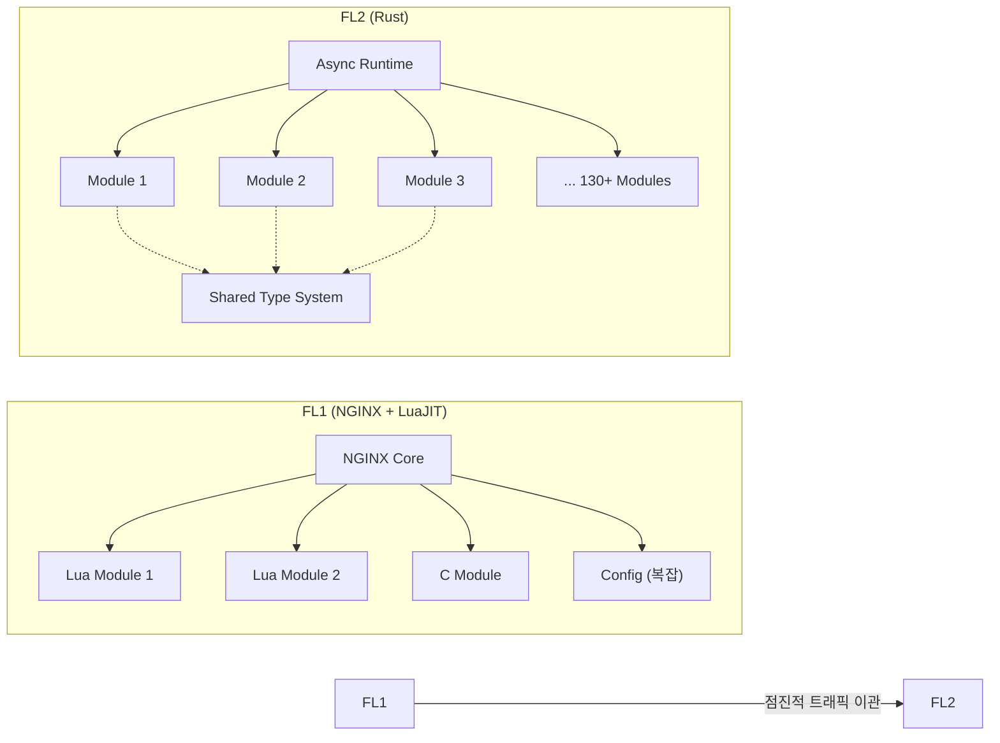
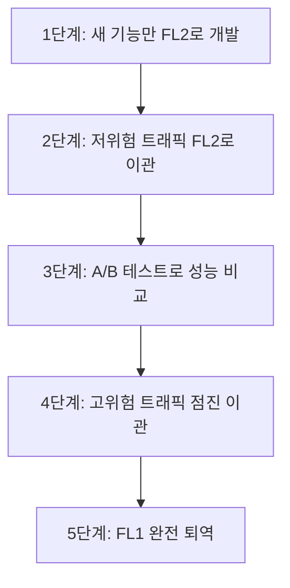

## 왜 지금 이게 문제인가

전 세계 인터넷 트래픽의 약 20%가 Cloudflare를 경유한다. 이 거대한 트래픽을 처리하는 핵심 프록시가 **NGINX + LuaJIT** 조합(내부 코드명 FL1)으로 10년 이상 운영되어 왔다. 그리고 Cloudflare는 이것을 **Rust로 완전히 재작성(FL2)**하는 데 성공했다.

"동작하는 코드를 왜 다시 짜는가?"라는 질문에 대한 답은 명확하다.

- **메모리 안전성의 한계**: C/C++ 기반의 NGINX는 버퍼 오버플로우, Use-after-free 같은 메모리 취약점의 온상이다. 보안 회사가 자체 프록시에서 메모리 버그를 내는 것은 존재론적 위협이다.
- **확장성의 벽**: NGINX의 모놀리식 구조 위에 LuaJIT으로 비즈니스 로직을 붙이는 방식은 기능이 늘어날수록 유지보수가 기하급수적으로 어려워졌다. 새 기능 하나를 추가하려면 Lua, C, 설정 파일 세 곳을 동시에 건드려야 했다.
- **성능 천장**: LuaJIT의 GC(가비지 컬렉션)가 예측 불가능한 레이턴시 스파이크를 일으켰고, NGINX의 스레딩 모델은 현대적인 비동기 I/O 패턴과 맞지 않았다.

Cloudflare의 재작성은 "Rust가 좋으니까"가 아니라, **기존 시스템의 기술적 부채가 사업적 리스크가 되는 시점**에서 내린 결정이다. 100명 이상의 엔지니어가 130개 이상의 모듈을 작성하여 점진적으로 트래픽을 이관한, 대규모 시스템 마이그레이션의 교과서적 사례다.

## 어떻게 동작하는가

### 아키텍처 전환: 모놀리스에서 모듈러로

FL2의 설계 원칙은 세 가지다.

1. **모듈 격리**: 각 기능(WAF, 캐싱, 로드밸런싱, DDoS 방어 등)이 독립적인 Rust 크레이트(crate)로 분리된다. 한 모듈의 버그가 전체 프록시를 죽이지 않는다.
2. **타입 시스템 활용**: Rust의 컴파일 타임 타입 검사가 런타임 에러를 사전에 차단한다. NGINX에서는 설정 파일 오타 하나가 프로덕션에서 터졌다면, FL2에서는 컴파일 단계에서 잡힌다.
3. **제로코스트 추상화**: Rust의 소유권 시스템 덕분에 GC 없이 메모리를 관리한다. LuaJIT의 GC 스파이크가 원천적으로 사라졌다.

### 성능 개선 수치

| 지표 | FL1 (NGINX) | FL2 (Rust) | 개선폭 |
| :--- | :--- | :--- | :--- |
| **응답 시간 (중간값)** | 40ms | 30ms | **25% 단축** |
| **CPU 사용량** | 기준 | -50% 이상 | **절반 이하** |
| **메모리 사용량** | 기준 | -50% 이상 | **절반 이하** |
| **메모리 안전 버그** | 주기적 발생 | 구조적 불가능 | **원천 차단** |

CPU와 메모리를 절반 이하로 줄였다는 것은, 같은 하드웨어로 2배 이상의 트래픽을 처리할 수 있다는 의미다. Cloudflare 규모에서 이는 연간 수백만 달러의 인프라 비용 절감으로 직결된다.

### 점진적 마이그레이션 전략

Cloudflare가 가장 잘한 점은 **빅뱅 전환을 하지 않은 것**이다.

새로 추가되는 기능은 FL2에서만 개발하고, 기존 트래픽은 비율을 조절하며 점진적으로 이관했다. 문제가 발생하면 즉시 FL1으로 롤백할 수 있는 구조를 유지했다. 이 과정에서 FL1과 FL2가 동시에 트래픽을 처리하는 기간이 수년간 지속되었다.

## 실제로 써먹을 수 있는가

### 도입하면 좋은 상황
- **C/C++ 레거시가 보안 리스크인 경우**: 금융권이나 통신사처럼 메모리 안전 취약점이 직접적인 규제 리스크로 이어지는 산업에서, 핵심 네트워크 컴포넌트를 Rust로 재작성하는 것은 기술적 우위와 컴플라이언스를 동시에 달성하는 전략이다.
- **GC 레이턴시가 SLA를 위협하는 경우**: Java/Go의 GC 일시 정지가 p99 레이턴시를 올리고 있다면, 지연에 민감한 컴포넌트만 선별적으로 Rust로 재작성하는 것을 고려할 수 있다.
- **인프라 비용이 매출을 압박하는 경우**: 트래픽 규모가 큰 서비스에서 CPU/메모리 50% 절감은 연간 수억 원의 차이를 만든다.

### 굳이 도입 안 해도 되는 상황
- **비즈니스 로직 중심의 웹 서비스**: CRUD 위주의 백엔드를 Rust로 짤 이유가 없다. 개발 속도가 2~3배 느려지고, Rust 개발자 채용이 한국에서는 극도로 어렵다.
- **프로토타입이나 MVP 단계**: Rust의 엄격한 컴파일러는 "일단 돌아가게 만들자"는 접근법과 정면 충돌한다. Go나 Python이 10배 빠르게 결과를 낸다.
- **팀에 시스템 프로그래밍 경험이 없는 경우**: Rust의 소유권, 라이프타임, 트레이트 시스템은 학습 곡선이 가파르다. 6개월 이상의 온보딩 기간을 각오해야 한다.

### 운영 리스크와 트레이드오프

**1. 인력 수급의 현실**
한국에서 프로덕션 Rust 경험이 있는 엔지니어는 극소수다. Cloudflare는 100명 이상의 Rust 엔지니어를 글로벌에서 확보했지만, 국내 기업이 이를 따라하기는 현실적으로 불가능에 가깝다. "Rust로 재작성"을 결심하기 전에 **"Rust 엔지니어를 5명 이상 확보할 수 있는가"**를 먼저 따져야 한다.

**2. 점진적 마이그레이션의 비용**
FL1과 FL2를 동시에 운영하는 기간 동안 두 시스템의 동작 일관성을 보장해야 한다. 이 병행 운영(Parallel Run) 기간이 길어질수록 운영 복잡성과 인건비가 늘어난다. Cloudflare처럼 수년간의 병행 운영을 감당할 체력이 있는지 냉정하게 판단해야 한다.

**3. 에코시스템의 성숙도**
Rust의 웹/네트워크 생태계(tokio, hyper, axum 등)는 빠르게 성장 중이지만, Java(Spring)나 Go의 생태계와 비교하면 서드파티 라이브러리, 모니터링 도구, APM 통합 등에서 아직 간극이 있다. 필요한 라이브러리가 없어서 직접 만들어야 하는 상황이 생길 수 있다.

## 한 줄로 남기는 생각
> "Rust로 다시 짜면 빨라진다"는 결론이 아니라, "기존 시스템의 기술 부채가 사업 리스크가 되는 시점을 정확히 포착하고, 점진적으로 전환하는 실행력"이 이 사례의 진짜 교훈이다.

---
*참고자료*
- [Cloudflare Blog: Cloudflare Just Got Faster and More Secure, Powered by Rust](https://blog.cloudflare.com/20-percent-internet-upgrade/)
- [Cloudflare Blog: How We Built Pingora, the Proxy That Connects Cloudflare to the Internet](https://blog.cloudflare.com/how-we-built-pingora-the-proxy-that-connects-cloudflare-to-the-internet/)
