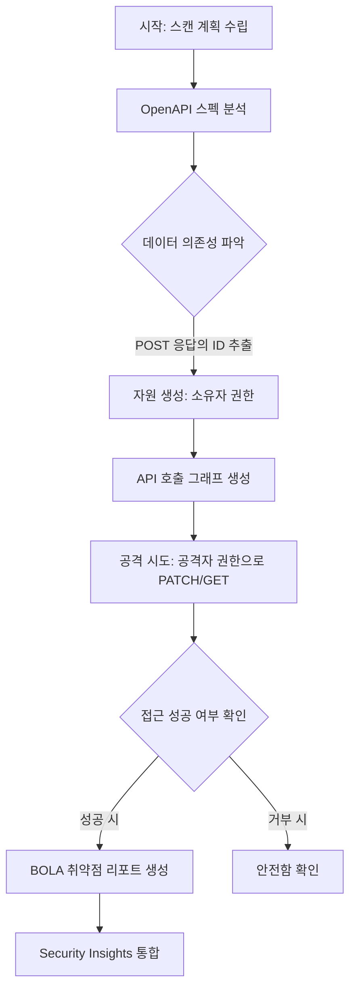

> **TL;DR** — Cloudflare가 API의 로직 결함을 사전에 탐지하는 **웹 및 API 취약점 스캐너(Web and API Vulnerability Scanner)**를 출시했습니다. 이 도구는 API 호출 간의 의존성을 이해하는 **상태 기반(Stateful) 테스트**와 **API 호출 그래프(Call Graph)** 기술을 활용하여, 기존 WAF가 방어하기 어려웠던 BOLA(Broken Object Level Authorization)와 같은 복잡한 권한 취약점을 자동으로 식별합니다.

## 배경과 문제 정의

전통적인 보안은 성벽을 쌓고 문을 지키는 '방어'의 영역이었습니다. 웹 애플리케이션 방화벽(WAF, Web Application Firewall)은 데이터가 있어야 할 자리에 코드가 삽입되는 SQL 인젝션(SQL Injection)이나 크로스 사이트 스크립팅(XSS) 같은 **구문 오류(Syntax Error)** 형태의 공격을 차단하는 데 매우 효과적입니다. 이러한 공격은 명확한 서명(Signature)이 존재하기 때문입니다.

하지만 API 보안의 양상은 완전히 다릅니다. 오늘날 가장 위험한 API 취약점은 구문 오류가 아니라 **비즈니스 로직 결함(Logic Flaw)**에서 발생합니다. 공격자는 프로토콜과 애플리케이션 사양을 완벽히 준수하는 '정상적인' HTTP 요청을 보냅니다. 겉보기에 이 요청은 아무런 문제가 없으므로 전통적인 WAF는 이를 그대로 통과시킵니다.

대표적인 예가 OWASP API Top 10 중 1위로 꼽히는 **BOLA(객체 수준 권한 위반)**입니다. 공격자가 자신의 유효한 인증 토큰을 사용하면서, 요청 본문의 ID 값만 타인의 것으로 바꿔 타인의 정보를 수정하거나 탈취하는 수법입니다. 시스템 입장에서는 "인증된 사용자가 정상적인 형식으로 요청했다"고 판단하기 때문에, 애플리케이션 내부에서 명시적인 권한 검증 로직이 누락되어 있다면 속수무책으로 당할 수밖에 없습니다.

## 핵심 내용: 상태 기반 스캐닝과 API 호출 그래프

Cloudflare의 새로운 취약점 스캐너는 단순히 개별 요청을 검사하는 수준을 넘어, API의 전체적인 문맥을 파악하는 **동적 애플리케이션 보안 테스트(DAST, Dynamic Application Security Testing)** 방식을 채택했습니다.

### 1. 로직 결함을 찾는 '공격자 컨텍스트' 시뮬레이션
이 스캐너는 두 가지 서로 다른 사용자 컨텍스트를 사용하여 API를 테스트합니다. '소유자(Owner)' 컨텍스트로 자원을 생성한 뒤, 별도의 유효한 인증 정보를 가진 '공격자(Attacker)' 컨텍스트로 해당 자원에 접근을 시도합니다. 만약 공격자 권한으로 소유자의 데이터를 읽거나 수정, 삭제하는 데 성공하면 이를 권한 위반 취약점으로 리포팅합니다.

### 2. API 호출 그래프(API Call Graph)의 자동 생성
기존의 DAST 도구들은 각 요청을 독립적으로 처리하기 때문에 요청 간의 연결 고리를 파악하지 못했습니다. Cloudflare는 **OpenAPI 스펙**을 분석하여 API 간의 데이터 의존성을 모델링하는 호출 그래프를 자동으로 생성합니다.

예를 들어, 주문을 수정하는 `PATCH /api/v1/orders/{order_id}` 요청을 테스트하려면 먼저 주문을 생성하는 `POST /api/v1/orders` 요청이 선행되어야 합니다. 스캐너는 POST 응답에서 반환된 `id` 값이 PATCH 경로의 `{order_id}`로 전달되어야 함을 지능적으로 파악합니다.



### 3. 모호한 스키마 해결 기술
API 문서(OpenAPI)가 부정확하거나 필드 이름이 모호한 경우(예: `id`와 `order_id`가 혼용됨)에도 대응합니다. Cloudflare의 스캐너는 속성 이름, 데이터 타입, 그리고 실제 트래픽 패턴을 분석하여 어떤 값이 어떤 엔드포인트의 입력값으로 쓰이는지 추론합니다. 이를 통해 수동 설정 없이도 복잡한 API 체인을 자동으로 구성할 수 있습니다.

### 4. 코드 스니펫: 취약한 API의 전형적인 모습
아래는 BOLA 취약점이 존재하는 전형적인 API 서버 로직과 이를 수정하기 위한 보안 코드를 보여줍니다.

```javascript
// [취약한 코드 예시]
// 단순히 URL의 order_id만 보고 데이터를 수정함
app.patch('/api/v1/orders/:order_id', async (req, res) => {
  const orderId = req.params.order_id;
  const updateData = req.body;
  
  // 인증은 통과했지만, '누가' 이 주문의 주인인지는 확인하지 않음
  await db.orders.update(orderId, updateData);
  res.status(200).send({ message: "Order updated" });
});

// [보안이 강화된 코드 예시]
// 요청한 사용자가 해당 객체의 소유자인지 반드시 검증해야 함
app.patch('/api/v1/orders/:order_id', async (req, res) => {
  const orderId = req.params.order_id;
  const userId = req.user.id; // 인증 미들웨어에서 추출한 사용자 ID
  
  const order = await db.orders.findById(orderId);
  
  // 로직 검증: 주문의 소유자와 현재 요청자가 일치하는가?
  if (order.ownerId !== userId) {
    return res.status(403).send({ error: "Unauthorized access to this object" });
  }
  
  await db.orders.update(orderId, req.body);
  res.status(200).send({ message: "Order updated" });
});
```

## 실무 적용 포인트

### 도입 시 고려해야 할 트레이드오프
*   **환경의 분리**: 스캐너는 실제 '수정(PATCH)'이나 '삭제(DELETE)' 요청을 발생시킵니다. 따라서 운영(Production) 환경에서 직접 실행하기보다는 스테이징(Staging)이나 테스트 환경에서 먼저 실행하는 것이 안전합니다.
*   **인증 정보 관리**: 정확한 테스트를 위해서는 소유자와 공격자 역할을 할 두 세트의 유효한 API 토큰(Bearer Token 등)을 제공해야 합니다. 이 토큰들의 만료 주기를 관리하는 운영 공수가 발생할 수 있습니다.
*   **OpenAPI 문서의 중요성**: 초기 베타 버전에서는 수동으로 업로드한 OpenAPI 스펙을 기반으로 작동합니다. 문서가 최신화되어 있지 않으면 스캔의 정확도가 떨어질 수 있습니다.

### 도입하면 좋은 상황
*   **마이크로서비스 아키텍처(MSA)**: 수많은 엔드포인트가 서로 얽혀 있어 수동으로 권한 로직을 전수 조사하기 어려운 경우.
*   **빠른 배포 주기**: CI/CD 파이프라인 내에서 보안 테스트를 자동화하여 '데브섹옵스(DevSecOps)'를 구현하고자 할 때.
*   **규제 준수**: 금융이나 의료 데이터처럼 객체 수준의 엄격한 접근 제어(RBAC/ABAC)가 필수적인 산업군.

### 운영 리스크 및 대응
스캐닝 과정에서 생성된 테스트 데이터가 데이터베이스에 쌓일 수 있습니다. 이를 방지하기 위해 테스트용 데이터베이스를 별도로 운용하거나, 스캔 완료 후 특정 패턴(예: `test_` 접두사가 붙은 데이터)을 삭제하는 클린업 프로세스를 병행하는 것이 좋습니다.

## 마치며
> API 보안의 핵심은 단순한 '침입 차단'을 넘어, 정상적인 요청 속에 숨겨진 '논리적 모순'을 찾아내는 능동적인 방어(Active Defense)로 패러다임을 전환하는 데 있습니다.

Cloudflare의 이번 취약점 스캐너 출시는 보안 팀이 공격자의 시각에서 자사의 API를 지속적으로 점검할 수 있는 강력한 수단을 제공합니다. 특히 API Shield와 통합되어 수동적인 트래픽 분석과 능동적인 취약점 스캐닝을 한 곳에서 관리할 수 있다는 점은 운영 효율성 측면에서 큰 이점입니다. 앞으로 더 많은 취약점 유형이 추가됨에 따라, 개발자들은 코드 한 줄을 작성할 때마다 보안 전문가의 피드백을 받는 것과 같은 효과를 누리게 될 것입니다.