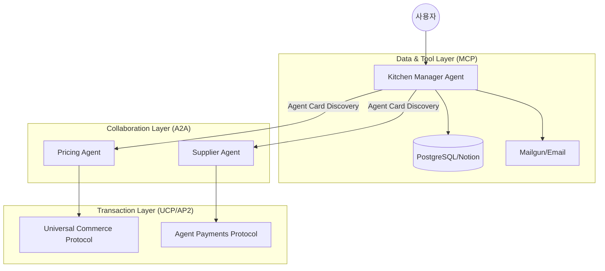

## 왜 지금 이게 문제인가

지금까지의 LLM 연동은 대부분 '커스텀 접착제(Glue Code)'를 바르는 작업이었다. 특정 DB에 접근하려면 전용 API를 짜고, 외부 툴을 쓰려면 해당 벤더의 SDK를 일일이 학습시켜 툴 콜링(Tool Calling)을 구현해야 했다. 이 방식은 서비스 규모가 커지고 연동되는 시스템이 늘어날수록 유지보수 비용이 기하급수적으로 증가하는 임계점에 도달했다.

특히 한국의 '네카라쿠배'급 거대 서비스나 복잡한 레거시를 가진 금융권 환경에서는 다음과 같은 한계가 명확하다.

*   **통합의 파편화**: 서비스마다 LLM이 도구에 접근하는 방식이 제각각이라 공통 라이브러리화가 어렵다.
*   **컨텍스트 오염**: 에이전트에게 너무 많은 커스텀 도구 정의를 주입하면 추론 성능이 떨어지고 할루시네이션(Hallucination) 비중이 높아진다.
*   **보안 및 권한 통제 부재**: 에이전트가 수행하는 결제나 데이터 접근에 대한 표준화된 검증 프로토콜이 없어, 매번 개별 비즈니스 로직으로 방어 코드를 짜야 한다.

구글이 제시한 MCP(Model Context Protocol)나 A2A(Agent2Agent) 같은 프로토콜은 이 '접착제 코드'를 표준 규격으로 대체하겠다는 시도다. 이는 개별 API 명세서를 읽고 코드를 짜는 시대에서, 에이전트가 스스로 '에이전트 카드'를 읽고 협업하는 시대로의 전환을 의미한다.

## 어떻게 동작하는가

핵심은 에이전트가 외부 세계와 소통하는 방식을 **계층화된 프로토콜 스택**으로 정의하는 데 있다. 데이터 접근은 MCP가, 에이전트 간 협업은 A2A가, 상거래와 결제는 UCP와 AP2가 담당한다. 

전체적인 에이전트 협업 구조를 시각화하면 다음과 같다.



실제 구현 관점에서 가장 체감되는 변화는 `McpToolset`의 도입이다. 기존처럼 `requests.get()`을 일일이 매핑하는 대신, 표준화된 서버 파라미터를 통해 도구를 자동 발견(Discovery)한다.

```python
# 개념 예시: MCP를 활용한 도구 자동 구성 (Agent Development Kit 기반)
from google.adk.agents import Agent
from google.adk.tools.mcp_tool import McpToolset
from google.adk.tools.mcp_tool.mcp_session_manager import StdioConnectionParams
from mcp import StdioServerParameters

# 1. 특정 DB나 서비스에 특화된 MCP 서버 연결 정의
# 개별 API 엔드포인트를 정의할 필요 없이 서버가 제공하는 툴을 자동 인식함
inventory_tools = McpToolset(
    connection_params=StdioConnectionParams(
        server_params=StdioServerParameters(
            command="npx",
            args=["-y", "@modelcontextprotocol/server-postgres"],
            env={"DATABASE_URL": "postgresql://localhost/kitchen"}
        )
    )
)

# 2. 에이전트 선언 시 툴셋 주입
# 에이전트는 이제 스스로 어떤 쿼리를 날릴지, 어떤 테이블을 볼지 MCP 규격에 따라 판단
kitchen_agent = Agent(
    model="gemini-3-flash-preview",
    name="kitchen_manager",
    instruction="재고를 확인하고 부족한 식재료를 발주하세요.",
    tools=[inventory_tools]
)
```

이 구조에서 에이전트는 더 이상 하드코딩된 API 가이드를 읽지 않는다. 대신 `/.well-known/agent-card.json`과 같은 표준 경로에서 상대방 에이전트의 명세를 확인하고, UCP 규격에 맞춰 결제 요청을 던진다.

## 실제로 써먹을 수 있는가

기술적으로는 우아하지만, 한국 실무 환경에서 그대로 적용하기에는 몇 가지 뚜렷한 **트레이드오프**가 존재한다.

### 도입하면 좋은 상황
*   **사내 백오피스 통합**: 전사적으로 수십 개의 내부 관리 도구가 흩어져 있는 경우, 각 팀이 MCP 서버만 띄워두면 중앙 에이전트가 이를 즉시 활용할 수 있다. 
*   **에이전트 기반 B2B 서비스**: 자사 서비스의 기능을 외부 AI 에이전트에게 노출해야 할 때, 커스텀 API 대신 A2A 프로토콜을 지원하면 생태계 편입이 빨라진다.
*   **복잡한 승인 절차가 필요한 금융 도메인**: AP2(Agent Payments Protocol)의 Mandate 개념은 '누가, 언제, 얼마만큼 승인했는지'에 대한 비수정 증명을 제공하므로 감사(Audit) 대응에 유리하다.

### 굳이 도입 안 해도 되는 상황 (및 리스크)
*   **성능 최적화가 극도로 중요한 서비스**: 프로토콜 계층이 추가될수록 오버헤드가 발생한다. 단순한 툴 콜링 한두 개가 전부라면 기존 방식이 훨씬 빠르고 가볍다.
*   **보안 규제가 엄격한 망분리 환경**: 외부 MCP 서버나 에이전트 카드를 조회하기 위해 외부 통신이 잦아질 경우, 한국 금융권의 망분리 규제와 충돌할 가능성이 높다.
*   **팀 역량 부족**: MCP나 A2A는 아직 초기 단계 표준이다. 라이브러리의 버그나 명세 변경에 직접 대응할 수 있는 시니어급 엔지니어가 없다면 도입 비용이 운영 비용을 압도할 것이다.

특히 구글이 제안한 **'Auto Approve Mode'**는 양날의 검이다. Gemini Code Assist에서 에이전트가 코드를 직접 수정하고 자동 승인까지 하는 기능은 생산성을 극대화하지만, 한국의 깐깐한 코드 리뷰 문화에서는 "AI가 짠 코드를 누가 책임질 것인가"라는 거버넌스 문제에 직면한다. 

이를 보완하기 위해 **Conductor** 같은 자동 리뷰 도구를 병행해야 한다. `plan.md`에 정의된 요구사항과 실제 생성된 코드가 일치하는지, 보안 취약점은 없는지 기계적으로 검증하는 'Verify' 단계가 강제되지 않는다면, 자동 승인은 기술 부채를 양산하는 지름길이 될 것이다.

| 구분 | 프로토콜 기반 (MCP/A2A) | 기존 커스텀 API 기반 |
| :--- | :--- | :--- |
| **확장성** | 매우 높음 (규격만 맞으면 즉시 연동) | 낮음 (매번 신규 연동 코드 작성) |
| **유지보수** | 프로토콜 업데이트에 의존 | 내부 로직 변경 시 직접 수정 |
| **자율성** | 에이전트가 도구를 능동적으로 탐색 | 정의된 도구만 수동적으로 호출 |
| **안정성** | 추상화 계층으로 인한 디버깅 난이도 상승 | 명확한 호출 스택 확인 가능 |

## 한 줄로 남기는 생각
> 에이전트 프로토콜은 '코딩의 종말'이 아니라 '인터페이스 표준화 전쟁'의 시작이며, 무지성 도입보다는 내부 시스템의 추상화 수준을 먼저 점검하는 것이 우선이다.

---
*참고자료*
- [Google Developers: Developer’s Guide to AI Agent Protocols](https://developers.googleblog.com/developers-guide-to-ai-agent-protocols/)
- [Google Developers: Refining the Core Coding Experience](https://developers.googleblog.com/unleash-your-development-superpowers-refining-the-core-coding-experience/ )
- [Google Developers: Conductor Update - Automated Reviews](https://developers.googleblog.com/conductor-update-introducing-automated-reviews/)