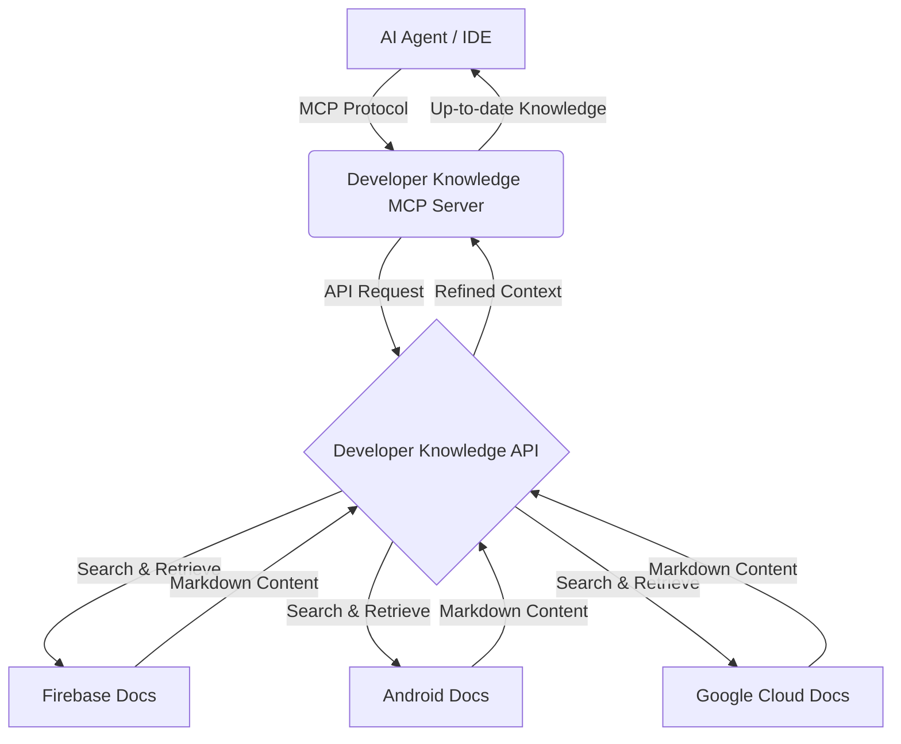

구글이 제공하는 공식 문서를 AI 에이전트가 실시간으로 검색하고 읽을 수 있게 해주는 Developer Knowledge API와 모델 컨텍스트 프로토콜(Model Context Protocol, MCP) 서버가 공개되었습니다. 이 도구들을 활용하면 AI가 생성하는 코드의 정확도를 높이고, 최신 SDK나 API 변경 사항을 반영하지 못해 발생하는 할루시네이션(Hallucination) 문제를 근본적으로 해결할 수 있습니다.

## 왜 공식 문서 API가 필요한가?

자바와 코틀린 기반의 백엔드 시스템을 10년 넘게 운영하다 보면 가장 골치 아픈 지점이 바로 라이브러리 버전 업데이트와 그에 따른 문서 파편화입니다. 특히 구글 클라우드(Google Cloud)나 파이어베이스(Firebase)처럼 변화 속도가 빠른 플랫폼을 다룰 때, 구글링으로 찾은 예제 코드가 이미 디프리케이트(Deprecated)된 경우를 수없이 겪었습니다. 

최근에는 개발 과정에서 LLM(Large Language Models)의 도움을 많이 받지만, 모델의 학습 데이터 커트라인(Knowledge Cutoff) 때문에 작년 혹은 재작년 기준의 코드를 제안받는 일이 흔합니다. 개발자가 일일이 공식 문서를 찾아보며 AI가 만든 코드를 교정하는 과정은 생각보다 큰 비용이 듭니다. 

구글이 이번에 내놓은 Developer Knowledge API는 이러한 간극을 메워줍니다. 단순히 웹 페이지를 긁어오는 스크레이핑 방식이 아니라, 구글이 직접 관리하는 문서 저장소에서 정제된 마크다운(Markdown) 형태로 데이터를 제공합니다. 이는 AI 에이전트가 사람이 읽는 문서를 기계적인 방식으로 정확하게 소화할 수 있는 통로가 열렸음을 의미합니다.

## Developer Knowledge API와 MCP 서버의 작동 원리

이 시스템의 핵심은 두 가지입니다. 하나는 구글의 방대한 기술 문서를 검색하고 추출하는 API이고, 다른 하나는 이 API를 AI 에이전트가 쉽게 사용할 수 있도록 연결해 주는 MCP 서버입니다.

모델 컨텍스트 프로토콜(MCP)은 AI 어시스턴트가 외부 데이터 소스나 도구에 안전하게 접근할 수 있도록 설계된 개방형 표준입니다. 과거에는 특정 서비스의 API를 AI에게 연결하기 위해 매번 커스텀 연동 코드를 작성해야 했지만, MCP 서버를 이용하면 표준화된 패턴으로 수많은 도구를 즉시 연결할 수 있습니다.

이 구조를 통해 AI는 다음과 같은 과정을 거쳐 답변을 생성합니다.
- 사용자의 질문이 들어오면 AI 에이전트가 MCP 서버를 통해 관련 문서를 검색합니다.
- API는 firebase.google.com, developer.android.com 등에서 최신 정보를 마크다운으로 가져옵니다.
- 24시간 이내에 업데이트된 최신 인덱싱 데이터를 바탕으로 가장 정확한 가이드를 제공합니다.

실제로 적용하려면 구글 클라우드 프로젝트에서 API 키를 생성한 뒤, gcloud CLI를 통해 서버를 활성화하면 됩니다.

gcloud beta services mcp enable developerknowledge.googleapis.com --project=PROJECT_ID

이후 mcp_config.json 같은 설정 파일에 해당 서버를 등록하면 젬나이(Gemini)나 다른 AI 도구들이 구글의 공식 지식을 내재화한 상태로 동작하게 됩니다.

## 실무에서 마주하는 컨텍스트의 한계와 해결책

14년 차 개발자로서 팀원들의 코드를 리뷰하다 보면, AI가 짜준 코드를 그대로 복사 붙여넣기 해서 발생하는 논리적 오류를 자주 봅니다. 특히 비동기 처리(Asynchronous)나 보안 관련 설정에서 최신 베스트 프랙티스를 놓치는 경우가 많습니다. 

우리 팀에서도 최근 안드로이드 API 레벨을 올리면서 비슷한 고민을 했습니다. 기존 학습 데이터에만 의존하는 AI는 변경된 권한 모델을 제대로 반영하지 못했습니다. 하지만 이런 실시간 지식 API가 연동된다면 상황이 달라집니다. AI가 "공식 문서에 따르면 이 방식은 이제 권장되지 않으며, 대신 X API를 사용해야 합니다"라고 먼저 제안할 수 있기 때문입니다.

보조 레퍼런스에서 언급된 컨덕터(Conductor)의 자동 리뷰(Automated Reviews) 기능과 이 API가 결합된다면 파급력은 더 커질 것입니다. AI 에이전트가 코드를 작성한 뒤, 스스로 공식 문서 API를 조회하여 최신 가이드라인과 일치하는지 검증하는 루프를 만들 수 있습니다. 이는 단순히 코드를 짜는 것을 넘어, 아키텍처의 정합성을 유지하는 수준으로 진화하는 과정입니다.

## 도입 시 고려해야 할 트레이드오프

물론 이 방식이 만능은 아닙니다. 실무 도입을 검토할 때 염두에 두어야 할 몇 가지 포인트가 있습니다.

첫째는 지연 시간(Latency)입니다. 매번 API를 호출하여 문서를 검색하고 읽어오는 과정은 순수하게 로컬에서 모델을 돌리는 것보다 느릴 수밖에 없습니다. 따라서 모든 질문에 대해 API를 호출하기보다는, 특정 키워드나 복잡한 구현 체계가 필요한 시점에만 활성화하는 전략이 필요합니다.

둘째는 데이터의 구조화 수준입니다. 현재 퍼블릭 프리뷰 단계에서는 비정형 마크다운 텍스트를 주로 제공합니다. 하지만 실제 개발에서는 특정 메서드의 파라미터 타입이나 리턴 값 같은 정형화된 API 레퍼런스 데이터가 더 절실할 때가 많습니다. 구글이 향후 계획으로 밝힌 구조화된 코드 샘플과 API 엔티티 지원이 기다려지는 이유입니다.

셋째는 비용과 할당량(Quota) 관리입니다. 상용 서비스 수준의 복잡한 에이전트를 운영한다면, 수많은 API 호출이 발생할 것입니다. 이를 효율적으로 캐싱하거나 꼭 필요한 컨텍스트만 추출해서 모델에게 전달하는 최적화 작업이 병행되어야 합니다.

## 기술 부채를 줄이는 AI 워크플로우

과거에는 기술 부채를 줄이기 위해 개발자가 매일같이 블로그와 공식 문서를 뒤져야 했습니다. 이제는 그 역할을 AI 에이전트에게 맡기되, 에이전트가 엉뚱한 소리를 하지 않도록 정확한 소스를 제공하는 것이 시니어 개발자의 새로운 역할이 되고 있습니다.

Developer Knowledge API와 MCP 서버의 등장은 AI를 단순한 코드 생성기에서 신뢰할 수 있는 기술 파트너로 격상시키는 중요한 발걸음입니다. 지금 바로 자신의 개발 환경이나 팀 내 AI 도구에 이 MCP 서버를 연동해 보길 권합니다. 할루시네이션 때문에 AI의 코드를 의심하며 보냈던 시간의 상당 부분을 실제 비즈니스 로직을 고민하는 시간으로 바꿀 수 있을 것입니다.

참고 자료
- [원문] Introducing the Developer Knowledge API and MCP Server — Google Developers
- [관련] Conductor Update: Introducing Automated Reviews — Google Developers
- [관련] Developer’s Guide to AI Agent Protocols — Google Developers
- [관련] Introducing Finish Changes and Outlines, now available in Gemini Code Assist — Google Developers