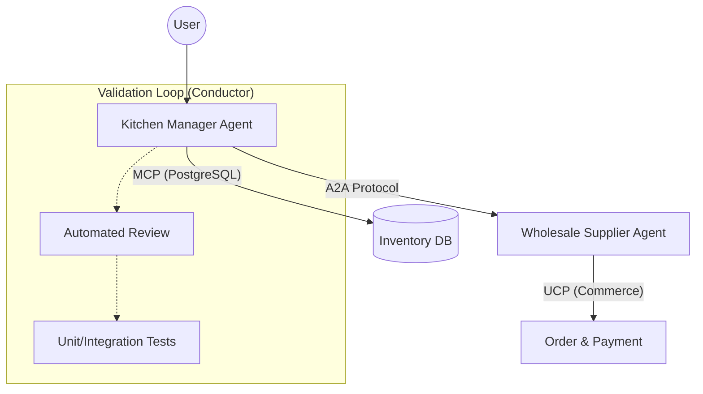

## 왜 지금 이게 문제인가

LLM을 단순한 챗봇이 아니라 '에이전트'로 활용하려는 시도가 늘어나면서 백엔드 엔지니어들은 새로운 형태의 통합 지옥(Integration Hell)에 빠졌다. 기존에는 서비스마다 제각각인 REST API 명세에 맞춰 툴(Tool)을 정의하고, 프롬프트에 수십 개의 함수 명세를 때려 넣는 노가다를 반복해 왔다.

*   **툴 관리의 비대해짐**: 에이전트가 처리할 도메인이 넓어질수록 `tools[]` 리스트는 관리 불가능한 수준으로 길어지고, 이는 곧 컨텍스트 윈도우 낭비와 모델의 추론 성능 저하로 이어진다.
*   **표준의 부재**: 서로 다른 팀이나 회사가 만든 에이전트끼리 협업하려면, 결국 또 사람이 개입해서 API 스펙을 맞추고 인증 로직을 새로 짜야 한다.
*   **신뢰와 보안의 트레이드오프**: 에이전트에게 실행 권한을 줄수록 보안 리스크는 커지며, 특히 금융권이나 대규모 커머스처럼 '무결성'이 중요한 한국 실무 환경에서 'Auto-Approve' 같은 기능은 기술적 부채보다 무서운 운영 리스크가 된다.

구글이 제시한 MCP(Model Context Protocol)와 A2A(Agent-to-Agent) 등의 프로토콜은 이 파편화된 연결 고리를 표준화하겠다는 선언이다. 이제 에이전트는 직접 API를 호출하는 대신, 표준화된 프로토콜을 통해 데이터에 접근하고 다른 에이전트에게 업무를 위임한다.

## 어떻게 동작하는가

핵심은 에이전트가 스스로 동료를 찾고(Discovery), 규격화된 방식으로 데이터를 주고받는(Protocol) 구조를 만드는 것이다. MCP는 데이터 소스와 에이전트 사이의 인터페이스를, A2A는 에이전트 간의 통신 규약을 담당한다.



동작의 핵심은 `Agent Card`와 `McpToolset`이다. 에이전트는 특정 도메인의 전문가(Remote Agent)를 찾기 위해 `/.well-known/agent-card.json`을 조회하며, 이는 마치 마이크로서비스 아키텍처(MSA)에서 Service Discovery가 동작하는 방식과 유사하다.

```python
# 개념 예시: A2A 프로토콜을 통한 원격 에이전트 연결 및 실행
from google.adk.agents import Agent
from a2a.client.client_factory import ClientFactory

async def delegate_to_specialist():
    # 1. 원격 에이전트의 '명함(Agent Card)'을 통해 기능을 동적으로 파악
    client = await ClientFactory.connect("http://supplier-agent:8001")
    card = await client.get_card()
    
    # 2. 에이전트가 스스로 필요한 스킬(예: 도매 가격 조회)이 있는지 확인
    if "pricing" in [skill.id for skill in card.skills]:
        # 3. 규격화된 메시지 객체로 요청 전달
        msg = create_text_message_object(content="연어 10kg 최저가 확인해줘")
        async for response in client.send_message(msg):
            print(f"Supplier Response: {response}")

# 4. 내부 데이터는 MCP를 통해 SQL 노가다 없이 접근
# McpToolset은 DB 스키마를 에이전트가 이해할 수 있는 도구로 자동 변환
inventory_tools = ToolboxToolset(server_url="http://internal-db-toolbox:8080")
```

## 실제로 써먹을 수 있는가

구글의 이번 발표는 기술적으로 우아하지만, 한국의 실무 환경에 대입해 보면 몇 가지 명확한 한계와 적용 조건이 보인다.

### 도입하면 좋은 상황
*   **내부 플랫폼 팀이 존재하는 대형 조직**: 네카라쿠배처럼 사내 마이크로서비스가 수백 개에 달하는 경우, 각 서비스팀이 MCP 서버를 운영하게 하면 에이전트 개발팀은 API 명세서를 일일이 읽지 않고도 도구를 확장할 수 있다.
*   **복잡한 공급망 관리(SCM) 시스템**: 여러 벤더사의 에이전트가 협업해야 하는 B2B 환경에서는 A2A 프로토콜이 강력한 인터페이스 역할을 할 수 있다.
*   **코드 품질 관리가 엄격한 팀**: `Conductor`를 활용한 자동 리뷰(Automated Reviews)는 사람이 일일이 확인하기 힘든 에이전트의 생성 코드를 테스트 수트와 연동해 검증하므로, 'AI가 짠 코드의 신뢰성' 문제를 일부 해결해 준다.

### 굳이 도입 안 해도 되는 상황 (혹은 위험한 상황)
*   **단일 DB 기반의 스타트업**: 서비스 규모가 작다면 MCP 서버를 별도로 띄우는 것 자체가 오버헤드다. 단순한 `sql_db_toolkit` 정도면 충분하다.
*   **금융권 등 엄격한 망 분리 환경**: `/.well-known/` 경로를 통한 동적 디스커버리는 보안 정책상 허용되지 않을 가능성이 높다. 화이트리스트 기반의 정적 연결이 차라리 속 편하다.
*   **Auto-Approve의 환상**: 구글은 'Auto Approve Mode'를 제안하지만, 한국의 장애 대응 문화에서 에이전트가 스스로 인프라 변경이나 결제를 승인하게 두는 것은 엔지니어의 목숨을 건 도박이다. 'Inline Diff View'를 통한 수동 승인 단계를 반드시 유지해야 한다.

### 운영 리스크와 러닝커브
가장 큰 리스크는 **디버깅의 난해함**이다. 에이전트 A가 에이전트 B에게 요청을 보냈는데 결과가 이상하다면, 문제는 A의 프롬프트인가, B의 도구 정의인가, 아니면 프로토콜 변환 과정의 버그인가? 분산 시스템의 추적(Tracing) 기술이 에이전트 프로토콜에도 깊숙이 이식되지 않는다면, 운영 단계에서 지옥을 맛보게 될 것이다.

또한, `Conductor`와 같은 도구가 'Plan Compliance(계획 준수 여부)'를 체크한다고 하지만, 이는 결국 또 다른 LLM이 검증하는 방식이다. 검증용 모델이 실행용 모델보다 똑똑하지 않다면 '눈 가리고 아웅' 식이 될 위험이 크다.

## 한 줄로 남기는 생각
> 에이전트 프로토콜은 '연결의 표준'이지 '지능의 보증'이 아니며, 한국적 맥락에서는 Auto-Approve보다 Conductor 기반의 검증 자동화가 훨씬 시급한 과제다.

---
*참고자료*
- [Developer’s Guide to AI Agent Protocols](https://developers.googleblog.com/developers-guide-to-ai-agent-protocols/)
- [Unleash Your Development Superpowers: Refining the Core Coding Experience](https://developers.googleblog.com/unleash-your-development-superpowers-refining-the-core-coding-experience/)
- [Conductor Update: Introducing Automated Reviews](https://developers.googleblog.com/conductor-update-introducing-automated-reviews/)