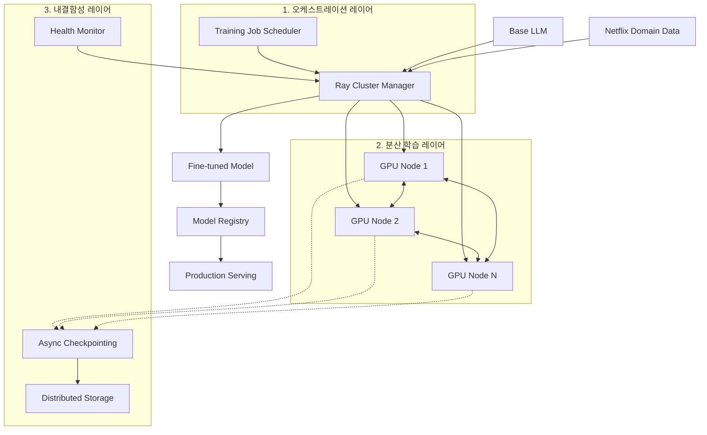

## 왜 지금 이게 문제인가

"GPT-4를 그냥 API로 쓰면 되지 않나?" 많은 기업이 이 질문에서 출발하지만, 넷플릭스는 다른 답을 내렸다. 범용 LLM은 넷플릭스의 콘텐츠 카탈로그, 추천 알고리즘, 사용자 행동 패턴을 모른다. "이 영화가 한국 30대 남성에게 왜 매력적인가"를 GPT-4에게 물어봐야 일반론만 돌아온다.

넷플릭스 AI 플랫폼 팀은 범용 모델을 가져다가 자사 데이터로 **Post-Training(사후 학습)**하는 내부 프레임워크를 구축했다. 이는 단순한 파인튜닝을 넘어, 프로덕션에서 추천·검색·개인화에 직접 투입되는 모델을 대규모로 생산하는 **LLM 공장**이다.

- **API 의존의 한계**: 외부 LLM API는 자사 데이터로 학습되지 않았고, 모델 업데이트 시점을 통제할 수 없으며, 민감한 사용자 데이터를 외부로 보내야 한다. 넷플릭스 규모에서 이 세 가지는 모두 수용 불가능하다.
- **파인튜닝의 인프라 복잡성**: 수십~수백 대의 GPU 노드에서 분산 학습을 돌리는 것은 모델 코드를 짜는 것보다 10배 어렵다. 노드 하나가 죽으면 수일간의 학습이 날아가고, 체크포인팅은 네트워크 대역폭을 잡아먹으며, GPU 메모리 관리는 악몽이다.
- **한국적 맥락**: 쿠팡, 토스, 카카오 같은 데이터 기반 서비스가 "우리만의 LLM을 만들어야 하나"를 고민 중이다. 넷플릭스의 사례는 Pre-training(처음부터 학습)이 아닌 Post-Training(기존 모델 위에 학습)이라는 현실적 경로를 보여준다.

## 어떻게 동작하는가

넷플릭스의 Post-Training Framework는 세 개의 레이어로 구성된다.

### 아키텍처 개요



### Ray 기반 분산 학습

넷플릭스는 분산 학습 프레임워크로 **Ray**를 선택했다. PyTorch의 DDP(DistributedDataParallel)나 FSDP(Fully Sharded Data Parallel)를 직접 쓸 수도 있지만, Ray를 택한 이유는 명확하다.

```python
# 개념 예시: Ray 기반 분산 파인튜닝 워크플로우
import ray
from ray.train.torch import TorchTrainer

def train_func(config):
    model = load_base_model(config["base_model"])
    dataset = load_netflix_dataset(config["domain"])  # 추천/검색/개인화

    # FSDP로 모델을 GPU 노드들에 분산 배치
    model = FSDP(model, sharding_strategy=ShardingStrategy.FULL_SHARD)

    for epoch in range(config["epochs"]):
        for batch in dataset:
            loss = model(batch)
            loss.backward()
            optimizer.step()

        # 비동기 체크포인팅: 학습을 멈추지 않고 백그라운드로 저장
        ray.train.report(metrics={"loss": loss.item()})

trainer = TorchTrainer(
    train_func,
    scaling_config=ScalingConfig(
        num_workers=32,           # 32 GPU 노드
        use_gpu=True,
        resources_per_worker={"GPU": 8}  # 노드당 8 GPU
    ),
    run_config=RunConfig(
        # 노드 장애 시 자동 복구
        failure_config=FailureConfig(max_failures=5)
    ),
)
result = trainer.fit()
```

Ray를 선택한 핵심 이유는 다음과 같다.

| 기능 | PyTorch 직접 사용 | Ray Train |
| :--- | :--- | :--- |
| **노드 장애 복구** | 수동으로 재시작 | 자동 복구 (max_failures 설정) |
| **체크포인팅** | 학습 중단 후 동기 저장 | 비동기, 학습 계속 진행 |
| **리소스 관리** | 직접 SLURM/K8s 관리 | Ray가 클러스터 자동 스케일링 |
| **실험 추적** | 별도 MLflow 등 통합 | ray.train.report로 통합 |

### 내결함성: 체크포인팅의 공학

대규모 분산 학습에서 가장 값비싼 실패는 **노드 하나가 죽어서 전체 학습이 날아가는 것**이다. 넷플릭스는 이를 세 가지 메커니즘으로 해결한다.

1. **비동기 체크포인팅(Async Checkpointing)**: 모델 파라미터를 저장하는 동안 학습을 멈추지 않는다. 체크포인트를 별도 스레드에서 분산 스토리지로 전송하여 GPU idle time을 최소화한다.
2. **탄력적 재스케줄링(Elastic Rescheduling)**: 노드가 죽으면 남은 노드에서 학습을 이어가거나, 새 노드를 할당받아 자동 복구한다. 전체 작업을 처음부터 다시 시작하지 않는다.
3. **계층적 스토리지**: 체크포인트를 로컬 NVMe → 네트워크 파일시스템 → 오브젝트 스토리지로 계층적으로 저장하여 복구 속도와 내구성을 동시에 확보한다.

### 학습과 서빙의 분리

파인튜닝된 모델은 즉시 프로덕션에 투입되지 않는다. 모델 레지스트리에 등록된 후, A/B 테스트를 거쳐 기존 모델보다 핵심 지표(클릭률, 시청 시간, 이탈률 등)가 개선되었을 때만 점진적으로 배포된다. 학습 인프라와 서빙 인프라를 완전히 분리하여, 학습 실험이 프로덕션 안정성을 위협하지 않도록 설계했다.

## 실제로 써먹을 수 있는가

### 도입하면 좋은 상황
- **자사 도메인 데이터가 차별화 요소인 서비스**: 커머스의 상품 리뷰, 금융의 거래 패턴, 헬스케어의 진료 기록 등 범용 모델이 알 수 없는 데이터를 가진 기업에서 Post-Training은 명확한 ROI를 만든다.
- **GPU 클러스터를 이미 운영 중인 팀**: 추천/검색에 이미 GPU를 쓰고 있다면, 유휴 시간에 파인튜닝을 돌릴 수 있다. 신규 인프라 투자 없이 시작할 수 있는 범위다.
- **데이터 보안이 최우선인 환경**: 금융·의료·공공 분야에서 사용자 데이터를 외부 API로 보낼 수 없다면, 자체 파인튜닝이 유일한 선택지다.

### 굳이 도입 안 해도 되는 상황
- **데이터 양이 충분하지 않은 경우**: 파인튜닝에 최소 수만 건의 고품질 라벨 데이터가 필요하다. 데이터가 부족하면 오히려 과적합(Overfitting)되어 범용 모델보다 성능이 떨어진다.
- **비용 대비 효과가 불분명한 경우**: GPU 클러스터 운영 비용은 월 수천만 원에서 수억 원에 달한다. "GPT-4 API 비용 vs 자체 파인튜닝 인프라 비용"을 냉정하게 비교해야 한다. 월 API 비용이 1,000만 원 이하라면 자체 인프라가 오히려 비쌀 수 있다.
- **모델 운영 역량이 없는 팀**: 분산 학습, 체크포인팅, 모델 서빙, A/B 테스트를 운영할 MLOps 엔지니어가 최소 2~3명은 있어야 한다. 없다면 API부터 시작하는 것이 맞다.

### 운영 리스크

**1. GPU 자원 경쟁**
학습과 서빙이 같은 GPU 풀을 공유하면, 파인튜닝 작업이 프로덕션 추론 성능을 떨어뜨릴 수 있다. 넷플릭스처럼 학습/서빙 클러스터를 물리적으로 분리하거나, 우선순위 기반 스케줄링을 적용해야 한다.

**2. 모델 드리프트(Model Drift)**
파인튜닝된 모델은 학습 시점의 데이터 분포에 최적화된다. 사용자 행동이 바뀌면(예: 새 시즌 공개, 계절 변화) 모델 성능이 서서히 하락한다. 정기적인 재학습 파이프라인과 성능 모니터링이 필수다.

**3. 평가 지표의 함정**
"Loss가 낮아졌으니 좋은 모델이다"는 위험한 판단이다. 넷플릭스는 오프라인 평가(벤치마크) → 온라인 A/B 테스트 → 점진적 배포의 3단계를 거친다. 오프라인에서 좋았던 모델이 프로덕션에서 되려 지표를 떨어뜨리는 사례는 흔하다.

## 한 줄로 남기는 생각
> LLM 경쟁력은 "더 큰 모델"이 아니라 "우리 데이터로 길들인 모델"에서 나오며, 그 길들이기를 안정적으로 반복할 수 있는 인프라가 진짜 해자(moat)다.

---
*참고자료*
- [Netflix Tech Blog: Scaling LLM Post-Training at Netflix](https://netflixtechblog.com/scaling-llm-post-training-at-netflix-0046f8790194)
- [Ray Documentation: Distributed Training](https://docs.ray.io/en/latest/train/train.html)
