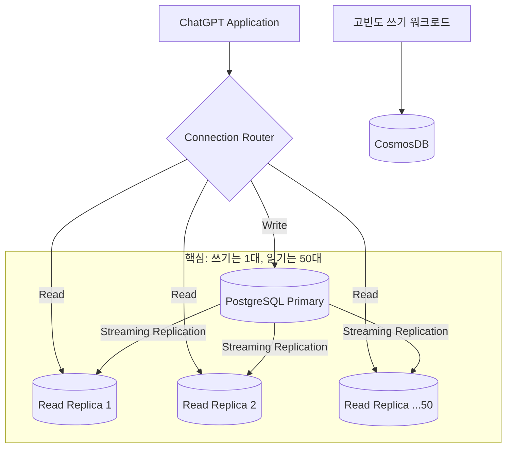

## 왜 지금 이게 문제인가

"PostgreSQL은 스타트업 DB 아닌가?" 많은 한국 개발자들이 대규모 트래픽을 언급할 때 당연하게 NoSQL이나 NewSQL을 먼저 떠올린다. 그런데 세계에서 가장 폭발적으로 성장한 서비스인 ChatGPT가 **단일 PostgreSQL 프라이머리 인스턴스**를 핵심 데이터 저장소로 사용하고 있다는 사실은 업계의 통념을 정면으로 뒤집는다.

OpenAI는 1년 만에 트래픽이 10배 증가하는 상황에서도 PostgreSQL을 포기하지 않았다. 대신 약 50대의 읽기 복제본(Read Replica)을 배치하고, 쓰기 부하가 큰 워크로드만 선별적으로 CosmosDB로 분리하는 전략을 택했다. 결과는 p99 레이턴시 두 자릿수 밀리초, 가용성 99.999%.

- **기술 선택의 관성**: 많은 팀이 "트래픽이 늘면 NoSQL로 전환해야 한다"는 공식을 의심 없이 따른다. OpenAI의 사례는 기존 RDBMS를 극한까지 최적화하는 것이 마이그레이션보다 합리적일 수 있음을 보여준다.
- **복잡성의 비용**: 분산 DB로 전환하면 트랜잭션 보장, 스키마 관리, 운영 도구 전환 등 보이지 않는 비용이 폭발한다. 익숙한 도구를 깊이 파는 것이 때로는 더 싸다.
- **한국적 맥락**: 국내 커머스/핀테크 서비스 중 상당수가 Aurora PostgreSQL이나 RDS를 쓰고 있다. "우리도 언젠간 NoSQL로 가야 하나"라는 고민 중이라면 이 사례가 강력한 반론이 된다.

## 어떻게 동작하는가

OpenAI의 전략은 "마법 같은 신기술"이 아니라, PostgreSQL의 기본 메커니즘을 극한까지 활용한 엔지니어링의 승리다.

### 읽기/쓰기 분리와 복제본 전략



핵심 원칙은 단순하다.

1. **쓰기(Write)는 단일 프라이머리에 집중**: 트랜잭션 일관성을 포기하지 않는다. ACID가 보장되는 단일 노드가 모든 쓰기를 처리한다.
2. **읽기(Read)는 50대 복제본에 분산**: 대부분의 요청은 읽기다. 사용자의 대화 이력 조회, 설정 로딩 등을 복제본으로 분산하면 프라이머리의 부하를 극적으로 줄일 수 있다.
3. **쓰기 집중 워크로드만 선별 분리**: 텔레메트리, 로깅, 세션 상태 같이 초당 수만 건의 쓰기가 발생하지만 강한 일관성이 불필요한 데이터만 CosmosDB로 분리했다.

### 복제 지연(Replication Lag) 관리

50대의 복제본을 운영하면 반드시 마주치는 문제가 **복제 지연**이다. 사용자가 메시지를 보낸 직후 대화 목록을 새로고침하면, 방금 보낸 메시지가 아직 복제본에 도달하지 않아 빠져 보일 수 있다.

```python
# 개념 예시: 쓰기 직후 읽기의 라우팅 전략
class QueryRouter:
    def route(self, query: Query, session: Session) -> str:
        if query.is_write:
            return "primary"

        # 직전에 쓰기가 발생한 세션이면 프라이머리에서 읽기
        if session.last_write_at and (now() - session.last_write_at) < REPLICA_LAG_THRESHOLD:
            return "primary"  # Read-your-own-writes 보장

        return self._select_least_loaded_replica()
```

OpenAI는 "Read-your-own-writes" 패턴을 적용하여, 쓰기 직후 일정 시간은 프라이머리에서 읽도록 라우팅한다. 이 임계값을 너무 길게 잡으면 프라이머리 부하가 늘고, 너무 짧게 잡으면 데이터 불일치가 보인다. 이 균형점을 찾는 것이 운영의 핵심이다.

### 커넥션 풀링과 프라이머리 보호

수만 개의 애플리케이션 인스턴스가 동시에 DB에 연결하면 커넥션 폭주로 프라이머리가 죽는다. OpenAI는 PgBouncer와 같은 커넥션 풀러를 앞단에 배치하여 실제 PostgreSQL 커넥션 수를 수백 개 수준으로 제한한다.

| 전략 | 역할 | 효과 |
| :--- | :--- | :--- |
| **Read Replica 50대** | 읽기 부하 분산 | 프라이머리 CPU 90% 이상 절감 |
| **커넥션 풀링** | 커넥션 수 제한 | 프라이머리 안정성 확보 |
| **쓰기 워크로드 분리** | CosmosDB로 오프로드 | 프라이머리의 WAL 쓰기 부담 감소 |
| **Read-your-writes** | 쓰기 직후 프라이머리 읽기 | 데이터 일관성 보장 |

## 실제로 써먹을 수 있는가

### 도입하면 좋은 상황
- **Aurora PostgreSQL을 이미 쓰고 있는 팀**: AWS Aurora는 읽기 복제본 추가가 간단하다. OpenAI의 패턴을 거의 그대로 적용할 수 있으며, Aurora Auto Scaling으로 복제본 수를 트래픽에 따라 자동 조절할 수 있다.
- **트랜잭션 일관성이 중요한 서비스**: 결제, 주문, 재고 관리처럼 "두 번 차감되면 안 되는" 데이터는 RDBMS의 ACID가 여전히 최선이다. NoSQL로 갈 이유가 없다.
- **읽기 비율이 80% 이상인 서비스**: 대부분의 웹/앱 서비스가 여기 해당한다. 쇼핑몰의 상품 조회, 뉴스 피드 로딩, 사용자 프로필 조회 등.

### 굳이 도입 안 해도 되는 상황
- **쓰기 비율이 50%를 넘는 경우**: IoT 센서 데이터, 실시간 채팅 메시지 저장 등 쓰기가 지배적이면 단일 프라이머리가 병목이 된다. 이 경우 Cassandra나 ScyllaDB 같은 분산 쓰기 DB가 적합하다.
- **스키마 변경이 극도로 빈번한 초기 스타트업**: PostgreSQL의 `ALTER TABLE`은 테이블 락을 유발할 수 있다. 데이터 모델이 매주 바뀌는 MVP 단계에서는 유연한 스키마가 오히려 유리하다.
- **글로벌 멀티리전 요구**: 서울과 미국 동부에 동시에 쓰기가 필요하다면 단일 프라이머리 모델은 물리적 한계에 부딪힌다. CockroachDB나 Spanner 같은 분산 SQL이 필요하다.

### 운영 리스크

**1. 프라이머리 단일 장애점(SPOF)**
아무리 복제본이 50대여도, 프라이머리가 죽으면 모든 쓰기가 멈춘다. OpenAI는 Azure의 고가용성 구성에 의존하지만, 자체 인프라를 운영하는 한국 기업이라면 자동 페일오버(Patroni, pg_auto_failover)를 반드시 구축해야 한다. 페일오버 시 몇 초간의 쓰기 중단은 감수해야 한다.

**2. 복제본 관리 오버헤드**
50대의 복제본은 각각 모니터링, 패치, 스토리지 관리가 필요하다. 특정 복제본의 복제 지연이 비정상적으로 늘어나면 해당 노드를 자동으로 라우팅에서 제외하는 헬스체크 로직이 필수다.

**3. "우리는 OpenAI가 아니다" 함정**
OpenAI는 Azure의 엔터프라이즈급 PostgreSQL 매니지드 서비스를 쓰고, 전담 DBA 팀이 있다. 중소 규모 팀이 50대 복제본을 직접 운영하면 오히려 운영 부담이 커질 수 있다. **5~10대 복제본에서 시작하고, 모니터링이 충분히 성숙한 후에 확장**하는 것이 현실적이다.

## 한 줄로 남기는 생각
> "PostgreSQL로는 안 된다"가 아니라 "PostgreSQL을 제대로 써본 적이 없다"가 대부분의 스케일링 실패의 진짜 원인이다.

---
*참고자료*
- [OpenAI Engineering: Scaling PostgreSQL to Power 800 Million ChatGPT Users](https://openai.com/index/scaling-postgresql/)
- [Azure Database for PostgreSQL – Flexible Server](https://learn.microsoft.com/en-us/azure/postgresql/)
