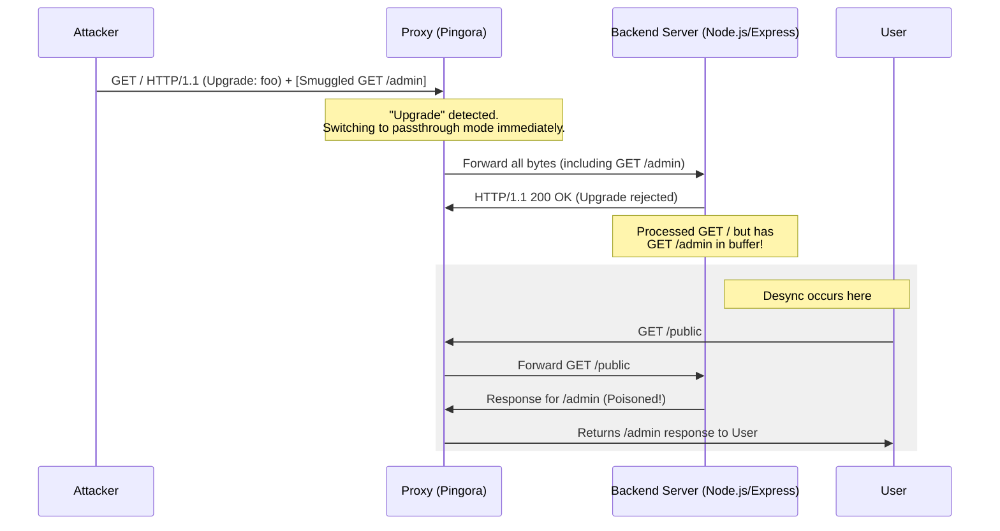

프록시 서버와 백엔드 간의 해석 차이를 이용해 보안 통제권을 무력화하는 리퀘스트 스머글링(Request Smuggling) 취약점이 최근 Rust 기반 프레임워크인 핑고라(Pingora) OSS에서 발견되었습니다.

## 프록시 보안 취약점을 왜 지금 살펴봐야 할까

클라우드플레어(Cloudflare)가 Nginx를 대체하기 위해 만든 핑고라는 최근 백엔드 인프라 업계에서 가장 뜨거운 오픈소스 프로젝트 중 하나입니다. 자바나 코틀린 기반의 마이크로서비스 아키텍처를 운영하는 시니어 개발자 입장에서, 프록시 계층의 보안은 서비스 전체의 생존과 직결되는 문제입니다.

우리가 구축한 API 게이트웨이나 인그레스 프록시(Ingress Proxy)가 외부의 악의적인 요청을 잘못 해석한다면, 그 뒤에 있는 스프링 부트(Spring Boot) 서버가 아무리 견고해도 소용이 없기 때문입니다. 이번에 공개된 CVE-2026-2833, CVE-2026-2835, CVE-2026-2836 취약점은 단순한 버그를 넘어 HTTP 프로토콜을 처리하는 프록시 설계의 근본적인 어려움을 보여줍니다.

특히 레거시 시스템을 함께 운영해야 하는 실무 환경에서는 호환성을 위해 프로토콜 해석을 느슨하게 설정하는 경우가 많은데, 이러한 관용이 어떻게 치명적인 보안 구멍으로 변하는지 이해할 필요가 있습니다.

## 핑고라 OSS에서 발견된 세 가지 핵심 취약점

이번에 보고된 취약점들은 크게 세 가지 시나리오로 나뉩니다. 첫 번째는 HTTP 업그레이드(Upgrade) 과정에서 발생하는 조기 패스스루 문제입니다.

원래 RFC 9110 표준에 따르면 프록시는 클라이언트의 업그레이드 요청을 받은 뒤, 백엔드로부터 101 Switching Protocols 응답을 확인한 이후에야 커넥션을 스트림 모드로 전환해야 합니다. 하지만 핑고라 0.8.0 이전 버전은 백엔드의 응답을 기다리지 않고 즉시 다음 바이트들을 데이터 스트림으로 간주하여 전달했습니다.

공격자는 이를 이용해 업그레이드 요청 바로 뒤에 별도의 HTTP 요청을 붙여 보낼 수 있습니다. 프록시는 이를 하나의 업그레이드 데이터로 보지만, 백엔드는 업그레이드를 거절(200 OK 등)한 뒤 뒤따라온 데이터를 새로운 HTTP 요청으로 해석하게 됩니다.

두 번째는 HTTP/1.0과 전송 인코딩(Transfer-Encoding)의 혼용 문제입니다. 핑고라는 HTTP/1.0 요청에 Transfer-Encoding 헤더가 포함된 경우, 이를 잘못 해석하여 커넥션 종료 시점을 오판했습니다.

세 번째는 기본 캐시 키(CacheKey) 생성 방식의 결함입니다. 기본 설정이 호스트(Host) 헤더라 스킴(Scheme)을 고려하지 않고 URI 경로만으로 캐시를 생성했기 때문에, 서로 다른 도메인 간에 캐시 데이터가 섞일 위험이 있었습니다.

## 실무에서 마주하는 프록시 보안과 트레이드오프

지난 14년 동안 다양한 자바 백엔드 시스템을 운영하면서 저 역시 비슷한 고민을 수없이 해왔습니다. 특히 오래된 클라이언트 앱이나 외부 파트너사의 비표준 API 요청을 수용해야 할 때가 가장 곤혹스럽습니다.

표준을 엄격하게 적용하면 서비스 장애가 발생하고, 그렇다고 포스텔의 법칙(Postel's Law)에 따라 관대하게 수용하면 이번 핑고라 사례처럼 보안 취약점에 노출됩니다. 실제 실무에서는 특정 헤더가 중복되거나 대소문자가 섞여 들어오는 등 RFC 규격에 어긋나는 요청이 드물지 않게 들어옵니다.

우리 팀에서도 예전에 Nginx 뒤에 위치한 톰캣(Tomcat) 서버 간의 HTTP 파싱 방식 차이로 인해 간헐적인 인증 우회 이슈를 겪은 적이 있습니다. 당시 원인은 프록시가 처리하지 못한 특정 유니코드 문자를 백엔드가 경로 구분자로 인식했기 때문이었습니다.

이런 경험을 비추어 볼 때, 핑고라가 클라우드플레어의 거대한 레거시 트래픽을 처리하기 위해 프로토콜 해석을 다소 느슨하게 가져갔던 결정은 이해가 갑니다. 하지만 오픈소스로 배포되어 일반적인 인그레스 프록시로 사용될 때는 이야기가 달라집니다. 클라우드플레어 내부망과 달리 일반적인 배포 환경에서는 보안 필터링을 거치지 않은 가공되지 않은 트래픽이 직접 유입되기 때문입니다.

## 프록시 설정 시 반드시 점검해야 할 요소

이번 사건을 통해 우리가 얻어야 할 교훈은 명확합니다. 인프라의 핵심 구성 요소인 프록시 서버는 단순히 트래픽을 전달하는 파이프가 아니라, 가장 강력한 보안 경계선이어야 합니다.

첫째, 프록시와 백엔드 간의 프로토콜 해석 일관성을 확보해야 합니다. 가능하다면 프록시 계층에서 비표준 헤더나 모호한 요청(Ambiguous requests)을 사전에 차단하는 엄격한 모드(Strict mode)를 활성화하는 것이 좋습니다.

둘째, 캐시 키 설계는 보수적으로 접근해야 합니다. 핑고라의 사례처럼 URI 경로만으로 캐싱을 수행하는 것은 멀티 테넌트 환경에서 매우 위험합니다. 호스트, 프로토콜, 그리고 경우에 따라 주요 인증 헤더까지 캐시 키에 포함하는 설계를 기본으로 가져가야 합니다.

셋째, 최신 보안 패치의 신속한 적용입니다. 핑고라 0.8.0 버전은 이러한 취약점들을 해결하고 보안을 강화했습니다. 핑고라를 직접 빌드해서 사용 중인 팀이라면 즉시 업데이트를 검토해야 합니다.

여러분의 시스템에서 운영 중인 프록시는 지금 어떤 기준으로 요청을 검증하고 있습니까? 혹시 호환성이라는 이름 아래 잠재적인 스머글링 위협을 방치하고 있지는 않은지 다시 한번 점검해 볼 시점입니다.

## 정리

핑고라 OSS에서 발견된 리퀘스트 스머글링 취약점은 프록시와 백엔드 간의 미묘한 해석 차이가 어떻게 보안 위협으로 이어지는지를 잘 보여주는 사례입니다. 복잡한 현대의 백엔드 아키텍처에서 인프라 보안은 결코 한 번의 설정으로 끝나지 않습니다.

지금 당장 여러분이 운영 중인 리버스 프록시의 설정 파일에서 HTTP/1.1 업그레이드 처리 방식과 캐시 키 생성 로직을 확인해 보시기 바랍니다. 작은 설정 차이가 서비스 전체의 보안 수준을 결정합니다.

## 참고 자료
- [원문] [Fixing request smuggling vulnerabilities in Pingora OSS deployments](https://blog.cloudflare.com/pingora-oss-smuggling-vulnerabilities/) — Cloudflare Blog
- [관련] Complexity is a choice. SASE migrations shouldn’t take years. — Cloudflare Blog
- [관련] From legacy architecture to Cloudflare One — Cloudflare Blog