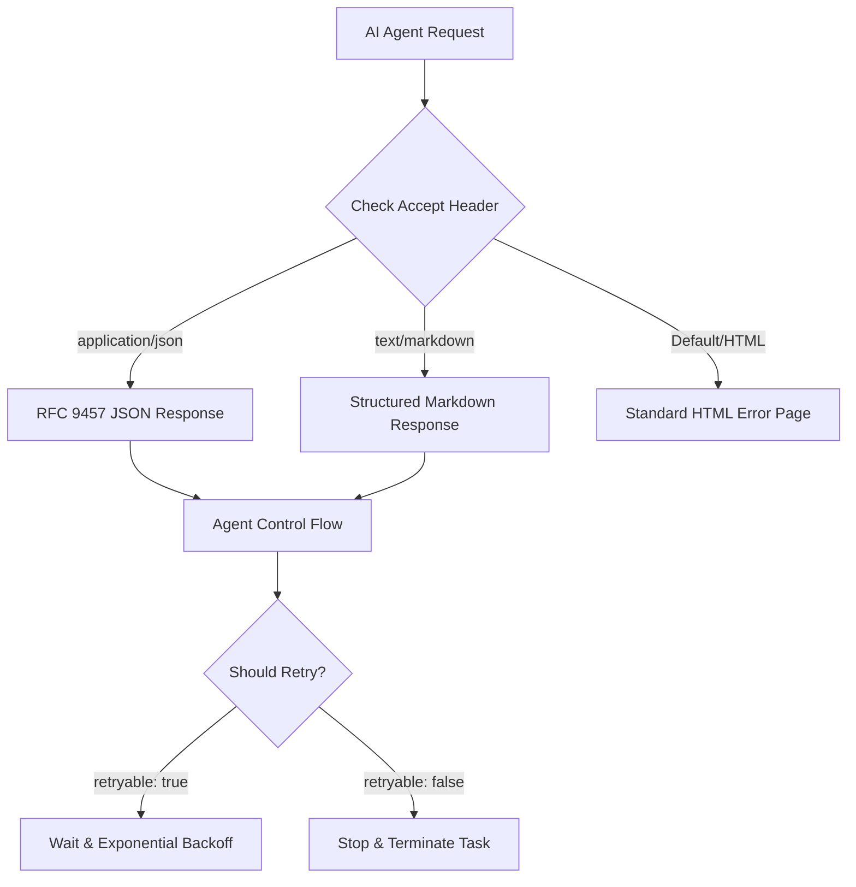

AI 에이전트(AI Agents)가 웹을 탐색하며 데이터를 수집하거나 API를 호출하는 비중이 급격히 늘어나고 있습니다. 하지만 네트워크 에러나 보안 차단이 발생했을 때 에이전트가 마주하는 응답은 여전히 사람을 위한 HTML 페이지인 경우가 대부분입니다. 클라우드플레어(Cloudflare)가 최근 도입한 RFC 9457 기반의 구조화된 에러 응답은 이러한 비효율을 해결하고 토큰 비용을 98% 이상 절감하는 실질적인 대안을 제시합니다.

> AI 에이전트가 읽기 힘든 무거운 HTML 에러 페이지 대신 RFC 9457 표준을 따르는 가벼운 JSON과 마크다운(Markdown)을 제공하여 토큰 소모를 줄이고 에이전트의 판단 정확도를 높입니다.

## 왜 AI 에이전트에게 기존 에러 페이지가 독이 될까?

에이전트가 웹 사이트에 접근하다가 속도 제한(Rate Limit)에 걸리거나 방화벽에 차단되면 서버는 보통 4xx 또는 5xx 상태 코드와 함께 에러 페이지를 반환합니다. 이 페이지는 브라우저에서 사람이 읽도록 설계되어 수백 줄의 CSS와 레이아웃을 위한 HTML 태그를 포함합니다.

에이전트 입장에서 이러한 데이터는 해석하기 어려운 노이즈에 불과합니다. LLM(Large Language Model) 기반 에이전트는 이 HTML을 이해하기 위해 수천 개의 토큰을 소비해야 하며, 그 과정에서 에러의 원인이 무엇인지, 다시 시도해도 되는지 판단하는 데 어려움을 겪습니다.

특히 실무에서 복잡한 워크플로우를 수행하는 에이전트가 여러 단계에서 이러한 무거운 에러 응답을 받게 되면 전체 운영 비용이 기하급수적으로 상승합니다. 에이전트에게 필요한 것은 화려한 디자인이 아니라 기계가 즉시 해석할 수 있는 명확한 지침입니다.

## RFC 9457 표준을 활용한 기계 판독형 에러 응답

클라우드플레어는 이 문제를 해결하기 위해 HTTP API의 에러 보고 표준인 RFC 9457(Problem Details for HTTP APIs)을 채택했습니다. 이제 에이전트가 요청 헤더의 Accept 항목에 특정 타입을 지정하면 그에 맞는 구조화된 응답을 보냅니다.

- **Accept: application/json**: 표준화된 JSON 객체로 에러 정보를 반환합니다.
- **Accept: text/markdown**: 모델이 이해하기 쉬운 구조화된 마크다운 형식을 반환합니다.
- **Accept: application/problem+json**: RFC 9457을 엄격히 준수하는 라이브러리용 응답을 제공합니다.

이러한 방식은 에이전트가 에러의 종류를 분류하고 이후 행동을 결정하는 로직을 단순화합니다. 예를 들어 일시적인 제한인지, 아니면 절대 접근할 수 없는 차단인지 응답 필드만 보고 즉시 파악할 수 있습니다.



## 구조화된 응답이 제공하는 핵심 필드와 역할

새로운 에러 응답 체계는 단순히 형식을 바꾸는 것에 그치지 않고 에이전트의 제어 흐름(Control Flow)에 필요한 구체적인 데이터를 제공합니다.

- **retryable**: 해당 에러가 일시적인지 알려줍니다. 에이전트가 무의미한 재시도를 반복하지 않게 막아줍니다.
- **retry_after**: 재시도 전 대기해야 하는 초 단위 시간입니다. 지수 백오프(Exponential Backoff) 전략을 세울 때 유용합니다.
- **error_category**: 보안, 속도 제한, DNS 문제 등 에러의 성격을 정의합니다.
- **what_you_should_do**: 에이전트가 다음에 취해야 할 행동을 자연어로 설명한 가이드입니다.

예를 들어 1015(Rate Limit) 에러가 발생했을 때 JSON 응답은 아래와 같은 형태를 가집니다.

```json
{
  "type": "https://developers.cloudflare.com/support/troubleshooting/http-status-codes/cloudflare-1xxx-errors/error-1015/",
  "title": "Error 1015: You are being rate limited",
  "status": 429,
  "detail": "You are being rate-limited by the website owner's configuration.",
  "error_code": 1015,
  "retryable": true,
  "retry_after": 30,
  "owner_action_required": false,
  "what_you_should_do": "Wait 30 seconds and retry with exponential backoff."
}
```

## 토큰 사용량 98% 절감의 실질적 가치

클라우드플레어의 측정 결과에 따르면 기존 HTML 에러 페이지는 약 46,645바이트(14,252토큰)를 소모하는 반면, 마크다운 응답은 798바이트(221토큰), JSON 응답은 970바이트(256토큰) 수준에 불과합니다.

이는 단순히 데이터 크기가 줄어든 것을 넘어 비용 효율성 측면에서 엄청난 차이를 만듭니다. 수천 개의 요청을 처리하는 에이전트 운영 환경에서 에러 발생 시마다 불필요한 토큰 비용이 나가는 것을 막아주기 때문입니다.

실무에서 에이전트가 웹 스크레이핑이나 자동화 업무를 수행할 때 에러 응답을 파싱(Parsing)하기 위해 정규표현식을 쓰거나 LLM에게 요약을 시키는 과정이 필요 없어집니다. 구조화된 필드를 직접 읽어 들이는 것만으로도 충분하므로 시스템의 견고함(Resiliency)이 대폭 향상됩니다.

## 실무 관점에서 본 에이전트 친화적 인프라

현업에서 에이전트 시스템을 설계하다 보면 가장 골치 아픈 부분이 예외 처리입니다. 특히 클라우드플레어 같은 보안 계층에서 발생하는 차단은 애플리케이션 로그에 남지 않는 경우도 많아 원인 파악이 어렵습니다.

이번 업데이트는 인프라 수준에서 에이전트와의 규약을 정의했다는 점에서 큰 의미가 있습니다. 사이트 소유자가 별도의 설정을 하지 않아도 클라우드플레어 네트워크 단에서 자동으로 에이전트에게 최적화된 응답을 준다는 점이 매력적입니다.

다만 주의할 점도 있습니다. 에이전트를 개발할 때 반드시 Accept 헤더를 명시적으로 설정하는 습관을 들여야 합니다. 기본값으로 요청을 보내면 여전히 HTML 응답을 받게 되어 최적화 혜택을 누릴 수 없기 때문입니다. 또한 RFC 9457의 확장 필드들을 에이전트의 재시도 로직에 유연하게 결합하는 설계가 병행되어야 합니다.

과거에는 사람이 웹을 읽었지만 이제는 기계가 웹을 읽는 시대입니다. 클라우드플레어의 이번 행보는 인터넷 인프라가 인간뿐만 아니라 AI라는 새로운 주체를 수용하기 위해 어떻게 진화해야 하는지를 잘 보여줍니다.

## 정리

클라우드플레어의 RFC 9457 기반 에러 응답은 AI 에이전트 시대에 필수적인 인프라 혁신입니다. 토큰 비용을 획기적으로 줄이면서도 에이전트의 판단 정확도를 높여주는 이 방식은 앞으로 다른 인프라 서비스들도 따라가야 할 표준이 될 가능성이 높습니다.

지금 바로 에이전트의 요청 헤더에 `Accept: application/json` 또는 `Accept: text/markdown`을 추가해 보세요. 불필요한 비용 지출을 막고 더 똑똑한 에러 처리를 구현할 수 있습니다.

## 참고 자료
- [원문] [Slashing agent token costs by 98% with RFC 9457-compliant error responses](https://blog.cloudflare.com/rfc-9457-agent-error-pages/) — Cloudflare Blog
- [관련] Introducing Custom Regions for precision data control — Cloudflare Blog
- [관련] Ending the "silent drop": how Dynamic Path MTU Discovery makes the Cloudflare One Client more resilient — Cloudflare Blog