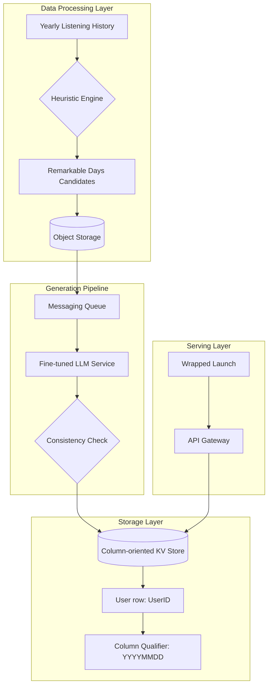

> **TL;DR** — 스포티파이(Spotify)는 2025년 'Wrapped'를 통해 3억 5천만 명의 사용자에게 개인화된 음악 여정 이야기를 제공하기 위해 14억 개의 LLM 리포트를 생성했습니다. 대규모 데이터 파이프라인과 모델 증류(Distillation), 그리고 동시성 문제를 해결한 정교한 스토리지 설계를 통해 전 세계 동시 출시라는 극단적인 트래픽 요구사항을 성공적으로 해결했습니다.

## 배경과 문제 정의

매년 전 세계 수억 명의 리스너에게 제공되는 'Wrapped'는 스포티파이의 가장 상징적인 캠페인입니다. 2025년에는 단순한 통계 수치를 넘어, 사용자의 청취 기록 속에 숨겨진 특별한 순간들을 하나의 이야기로 들려주는 'Wrapped Archive' 기능을 기획했습니다.

이 프로젝트의 핵심 도전 과제는 **'규모(Scale)'**와 **'정확성(Accuracy)'**이었습니다. 3억 5천만 명 이상의 적격 사용자마다 최대 5개의 특별한 날을 선정하고, 이에 대한 창의적이면서도 데이터에 기반한 서사를 생성해야 했습니다. 총 14억 개에 달하는 리포트를 할루시네이션(Hallucination, 환각 현상) 없이 생성하고, 이를 전 세계 사용자가 접속하는 '빅뱅(Big Bang)' 출시 시점에 안정적으로 서빙하는 것이 엔지니어링의 핵심 목표였습니다.

## 핵심 내용

### 1. 데이터 기반의 '특별한 날' 선정 알고리즘

수조 개의 청취 이벤트를 분석하여 각 사용자에게 의미 있는 날을 찾기 위해 우선순위가 지정된 **휴리스틱(Heuristics)** 세트를 설계했습니다.

- **단순 지표**: 가장 많이 음악/팟캐스트를 들은 날, 처음 듣는 아티스트를 가장 많이 발견한 날(Discovery Day).
- **복잡 지표**: 평소 취향에서 가장 크게 벗어난 날(Unusual Listening Day), 과거 곡이나 추억의 음악 청취가 급증한 날(Nostalgic Day).
- **컨텍스트 앵커**: 생일, 새해 첫날 등 사용자 맥락과 연결된 날.

이러한 후보군을 내러티브 잠재력과 통계적 강도에 따라 랭킹화하여 사용자당 최종 5일을 선정했습니다. 이 데이터는 분산 데이터 파이프라인을 통해 집계되어 오브젝트 스토리지(Object Storage)에 저장되었으며, 이후 메시징 큐를 통해 비동기적으로 LLM 생성 단계로 전달되었습니다.

### 2. LLM 전략: 프롬프트 엔지니어링과 모델 증류

14억 개의 리포트를 고성능 모델(Frontier Model)로 직접 생성하는 것은 비용과 속도 측면에서 불가능했습니다. 이를 해결하기 위해 **모델 증류(Model Distillation)** 파이프라인을 구축했습니다.

#### 프롬프트 레이어 설계
프롬프트는 일관성을 위해 두 개의 레이어로 분리했습니다.
- **시스템 프롬프트(System Prompt)**: 창의적 계약 정의. 모든 통찰은 실제 데이터에 기반해야 하며, 브랜드 톤앤매너(위트 있고 진지한)를 유지하고 안전 가이드라인(약물, 폭력 등 금지)을 준수하도록 설정했습니다.
- **사용자 프롬프트(User Prompt)**: 모호성 제거. 해당 일자의 상세 청취 로그, LLM의 취약점인 계산을 보완하기 위한 요약 통계 블록, 국가별 맞춤 어휘 등을 포함했습니다.

#### 모델 최적화 과정
1. **골드 데이터셋(Gold Dataset) 구축**: 고성능 모델이 생성한 출력물 중 엄격한 검토를 거친 최상위 결과물을 선별했습니다.
2. **미세 조정(Fine-tuning)**: 선별된 데이터셋을 바탕으로 더 작고 빠른 프로덕션 모델을 학습시켰습니다.
3. **DPO(Direct Preference Optimization)**: A/B 테스트 기반의 인간 평가 데이터를 활용해 모델의 선호도를 최적화했습니다. 이를 통해 작은 모델로도 고성능 모델 수준의 품질을 확보했습니다.

### 3. 대규모 생성 엔진과 동시성 제어

생성 엔진은 4일 동안 쉬지 않고 가동되며 초당 수천 건의 요청을 처리했습니다. 이 과정에서 발생할 수 있는 데이터 정합성 문제를 해결하기 위해 스토리지 계층에서 정교한 설계가 도입되었습니다.

#### 아키텍처 다이어그램 (Wrapped Archive 시스템 구조)

#### 동시성 설계를 위한 컬럼 퀄리파이어(Column Qualifier) 활용
사용자 한 명당 최대 5개의 리포트가 독립적으로 생성되는데, 이를 동시에 쓰기 작업할 때 **경쟁 상태(Race Condition)**가 발생할 수 있습니다. 스포티파이는 이를 애플리케이션 로직이 아닌 데이터 모델링으로 해결했습니다.

- **기존 방식**: 사용자 로우(Row) 하나를 읽고(Read), 업데이트하고(Modify), 다시 쓰는(Write) 방식은 락(Lock)이 필요해 성능이 저하됩니다.
- **개선 방식**: 분산 컬럼 지향 키-값 데이터베이스를 사용했습니다. 각 리포트의 날짜(YYYYMMDD)를 **컬럼 퀄리파이어(Column Qualifier)**로 지정했습니다. 예를 들어 '20250315'와 '20250622' 리포트는 동일한 사용자 로우 내에서도 서로 다른 셀(Cell)에 기록되므로 락이나 조정 없이 완전히 병렬로 쓰기가 가능해졌습니다.

### 4. '빅뱅' 출시를 위한 사전 확장(Pre-scaling)

Wrapped는 점진적 배포(Gradual Rollout)가 없습니다. 전 세계 모든 사용자가 동시에 접속하는 특성상 자동 확장(Auto-scaling)은 속도가 너무 느립니다.

- **사전 확장(Pre-scaling)**: 출시 수 시간 전부터 컴퓨팅 파드(Pod)와 데이터베이스 노드 용량을 최대 예상치로 미리 확장했습니다.
- **합성 부하 테스트(Synthetic Load Tests)**: 실제 트래픽이 유입되기 전, 모든 리전에서 가상 트래픽을 발생시켜 커넥션 풀(Connection Pool)과 데이터베이스 블록 캐시(Block Cache)를 미리 '예열(Warming up)'했습니다. 덕분에 실제 런칭 시 콜드 스타트(Cold Start)로 인한 지연 시간을 방지할 수 있었습니다.

### 5. 신뢰성 보장을 위한 자동화된 평가

14억 개의 리포트를 사람이 전수 조사하는 것은 불가능합니다. 이를 위해 **LLM-as-a-judge** 프레임워크를 구축했습니다.

- 약 16만 5천 개의 샘플을 무작위 추출하여 대형 모델이 평가하도록 했습니다.
- 평가 차원은 정확성(Accuracy), 안전성(Safety), 톤(Tone), 형식(Formatting)의 4가지입니다.
- 평가 모델이 최종 점수를 매기기 전 반드시 **'추론 과정(Reasoning)'**을 먼저 생성하도록 유도하여 일관성을 높였습니다.

## 실무 적용 포인트

### 1. 대규모 생성형 AI 서비스 도입 시 고려사항
단순히 API를 호출하는 것을 넘어, 대규모 데이터셋에서는 **모델 증류**가 경제성과 성능의 유일한 해법이 될 수 있습니다. 고성능 모델로 기준점을 잡고, 작은 모델을 학습시켜 비용을 최적화하는 전략이 유효합니다.

### 2. 동시성 문제 해결의 관점 전환
병렬 처리가 극심한 환경에서는 복잡한 분산 락(Distributed Lock)을 구현하기보다, 스포티파이처럼 데이터베이스의 스키마 구조(예: 컬럼 퀄리파이어 활용)를 활용해 **동시성 충돌 자체를 구조적으로 방지**하는 것이 운영 리스크를 줄이는 길입니다.

### 3. 트래픽 스파이크 대응
이벤트성 대규모 트래픽이 예상되는 경우, 반응형 스케일링에 의존하기보다 **캐시 예열과 사전 확장**이 필수적입니다. 특히 데이터베이스 캐시가 비어 있는 상태에서 갑작스러운 트래픽은 시스템 전체의 연쇄적 장애(Cascading Failure)를 일으킬 수 있음을 명심해야 합니다.

## 마치며
> 14억 개의 개인화된 이야기를 안정적으로 전달한 핵심은 강력한 LLM 그 자체가 아니라, 이를 뒷받침한 정교한 데이터 파이프라인과 '동시성 락' 없는 스토리지 설계, 그리고 철저한 사전 예열 전략에 있었습니다.