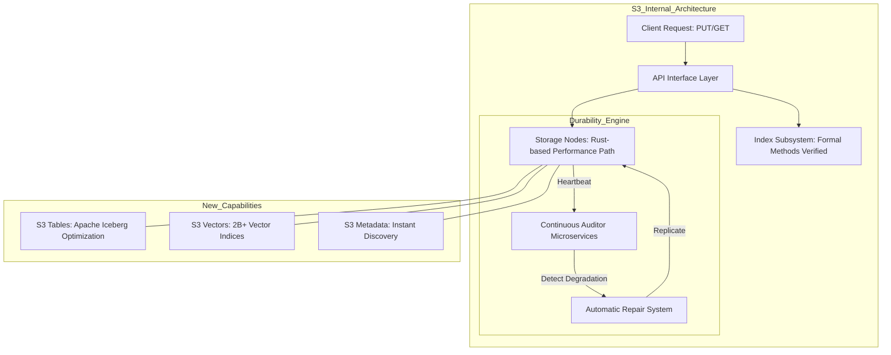

> **한 줄 요약** — Amazon S3는 20년 동안 API 하위 호환성을 유지하며 단순 저장소에서 AI와 데이터 분석을 위한 통합 플랫폼으로 진화했습니다.

## 이 주제를 꺼낸 이유

현대적인 클라우드 기반 애플리케이션을 개발하면서 Amazon S3(Simple Storage Service)를 거치지 않기란 불가능에 가깝습니다. 정적 웹 사이트 호스팅부터 대규모 데이터 레이크 구축, 그리고 최근의 생성형 AI를 위한 데이터셋 관리까지 S3는 언제나 그 중심에 있었습니다.

최근 S3 출시 20주년을 맞아 공개된 기술적 회고와 향후 비전은 단순한 기념사를 넘어섭니다. 20년 전 작성한 코드가 수정 없이 여전히 작동한다는 사실은 변동성이 심한 테크 업계에서 경이로운 수준의 신뢰를 보여줍니다. 특히 S3 Tables나 S3 Vectors 같은 신규 기능은 객체 스토리지가 앞으로 어떤 방향으로 확장될지 명확한 힌트를 줍니다.

개발자로서 매일 사용하는 서비스의 이면에 숨겨진 엔지니어링 철학을 이해하는 것은 중요합니다. 시스템의 확장성(Scalability)과 내구성(Durability)을 극단적으로 추구했을 때 어떤 결과가 나오는지, 그리고 그것이 실무 환경에서 우리에게 어떤 이점을 주는지 다시금 짚어보고자 합니다.

## 핵심 내용 정리

Amazon S3는 2006년 3월 14일, 아주 간단한 인터페이스인 PUT과 GET을 들고 세상에 나왔습니다. 당시 약 15Gbps의 대역폭과 1PB 수준이었던 전체 용량은 현재 수백 EB(엑사바이트) 규모로 커졌습니다. 저장된 객체 수는 500조 개를 넘어섰고, 초당 2억 건 이상의 요청을 처리하는 거대한 시스템이 되었습니다.

이러한 성장을 뒷받침하는 것은 서비스 설계 초기부터 유지해 온 5가지 핵심 원칙입니다. 보안, 내구성, 가용성, 성능, 그리고 탄력성입니다. 특히 내구성은 11 nines(99.999999999%)를 목표로 설계되었습니다. 이는 데이터가 손실될 확률이 사실상 제로에 수렴한다는 것을 의미하며, 이를 위해 S3는 내부적으로 끊임없이 데이터를 검사하고 복구하는 마이크로서비스 군단을 운영합니다.

S3의 기술적 진화에서 눈에 띄는 부분은 성능 최적화를 위해 핵심 경로의 코드를 Rust로 재작성하고 있다는 점입니다. 또한 포멀 메소드(Formal Methods)와 자동화된 추론을 사용하여 시스템의 일관성을 수학적으로 증명하며 운영합니다. 최근에는 단순한 파일 저장소를 넘어 데이터 관리의 효율성을 극대화하는 방향으로 나아가고 있습니다.

최근 발표된 주요 기능들은 S3를 단순한 객체 저장소에서 데이터베이스의 영역으로 확장시키고 있습니다.

- S3 Tables: Apache Iceberg 형식을 지원하며 쿼리 효율성을 자동으로 최적화하는 관리형 테이블 서비스입니다.
- S3 Vectors: 시맨틱 검색과 RAG(Retrieval-Augmented Generation)를 위해 최대 20억 개의 벡터를 100ms 미만의 지연 시간으로 처리합니다.
- S3 Metadata: 수십억 개의 객체가 담긴 버킷에서 특정 데이터를 찾기 위해 재귀적으로 리스팅할 필요 없이 즉각적인 검색을 가능하게 합니다.

## 내 생각 & 실무 관점

원문을 읽으며 가장 인상 깊었던 대목은 2006년에 작성된 코드가 지금도 그대로 동작한다는 점입니다. 실무에서 라이브러리 버전 하나만 올려도 기존 기능이 깨지는 상황을 자주 겪는 엔지니어 입장에서, 20년이라는 긴 세월 동안 API 하위 호환성을 유지해 온 것은 엄청난 약속입니다. 이는 단순히 기술적인 성취를 넘어 사용자에게 이 시스템 위에서는 내 코드가 영원히 안전할 것이라는 강력한 심리적 안정감을 제공합니다.

실제로 인프라를 운영하다 보면 저장소 비용 문제는 늘 골칫거리입니다. 원문에서 언급된 S3 Intelligent-Tiering을 통한 60억 달러 규모의 비용 절감 사례는 현업에서도 체감하는 바가 큽니다. 데이터의 액세스 패턴을 일일이 분석해서 라이프사이클 정책을 세우는 것은 공수가 많이 드는 작업인데, 이를 시스템이 알아서 처리해 준다는 것만으로도 운영 리소스가 크게 줄어듭니다.

S3 Tables와 S3 Metadata의 등장은 데이터 엔지니어링 아키텍처를 근본적으로 바꿀 수 있다고 봅니다. 지금까지는 수많은 작은 파일들이 쌓이면 리스팅 속도가 느려져서 별도의 데이터 카탈로그나 인덱스 레이어를 따로 관리해야 했습니다. 이 과정에서 ETL(Extract, Transform, Load) 복잡도가 증가하고 데이터 정합성 문제가 발생하곤 했습니다. 하지만 S3가 메타데이터를 직접 관리하고 테이블 포맷을 기본 지원하게 되면, 별도의 데이터베이스 없이 S3만으로도 고성능 데이터 레이크를 구축할 수 있는 길이 열립니다.

다만 이러한 신규 기능들을 도입할 때는 트레이드오프를 고려해야 합니다. 예를 들어 S3 Vectors는 전용 벡터 데이터베이스에 비해 관리 포인트가 적다는 장점이 있지만, 매우 복잡한 필터링 쿼리나 고도화된 튜닝이 필요한 경우에는 여전히 전용 솔루션이 유리할 수 있습니다. 그럼에도 불구하고 데이터 이동 없이(Zero-ETL) S3 안에서 모든 분석과 AI 연산이 가능해진다는 점은 아키텍처 단순화 측면에서 거부하기 힘든 유혹입니다.

엔지니어링 관점에서 Rust로의 전환도 흥미로운 지점입니다. 가비지 컬렉션(GC)으로 인한 멈춤 현상(Stop-the-world)이 없는 Rust는 S3처럼 초당 수억 건의 요청을 처리하는 시스템에서 레이턴시의 일관성을 확보하는 데 최적의 선택이었을 것입니다. 이는 우리가 고성능 시스템을 설계할 때 언어의 특성이 런타임 안정성에 어떤 영향을 미치는지 다시금 생각하게 만듭니다.

## 정리

Amazon S3의 20년 역사는 단순한 기술 성장을 넘어, 기본에 충실하면서도 시대의 요구(AI, 빅데이터)에 기민하게 대응하는 플랫폼의 정석을 보여줍니다. 11 nines의 내구성과 API의 일관성은 인프라의 기본 덕목이며, 그 위에 쌓아 올린 신규 데이터 서비스들은 개발자들이 더 이상 데이터 이동과 관리에 에너지를 쏟지 않도록 도와줍니다.

현업에서 S3를 단순히 파일 업로드 용도로만 쓰고 있다면, 이제는 이를 데이터 플랫폼의 기반으로 바라볼 때입니다. 특히 대규모 로그 분석이나 AI 모델용 데이터셋을 다루고 있다면, S3 Tables나 S3 Metadata를 활용해 기존의 복잡한 카탈로그 관리 로직을 얼마나 단순화할 수 있을지 검토해 보는 것을 추천합니다. 

단순함이 주는 힘은 생각보다 강력하며, S3는 지난 20년 동안 그 가치를 증명해 왔습니다.

## 참고 자료
- [원문] [Twenty years of Amazon S3 and building what’s next](https://aws.amazon.com/blogs/aws/twenty-years-of-amazon-s3-and-building-whats-next/) — AWS Blog
- [관련] [AWS Weekly Roundup: Amazon S3 turns 20](https://aws.amazon.com/blogs/aws/aws-weekly-roundup-amazon-s3-turns-20-amazon-route-53-global-resolver-general-availability-and-more-march-16-2026/) — AWS Blog
- [관련] [20 years in the AWS Cloud – how time flies!](https://aws.amazon.com/blogs/aws/20-years-in-the-aws-cloud-how-time-flies/) — AWS Blog