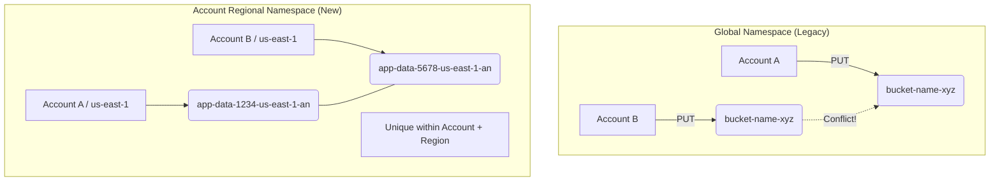

> **한 줄 요약** — Amazon S3 일반 용도 버킷(General Purpose Buckets) 생성 시 계정 ID와 리전 정보가 포함된 고유 접미사를 붙여, 전역 네임스페이스 중복 문제 없이 버킷 이름을 자유롭게 선점할 수 있게 되었습니다.

## 이 주제를 꺼낸 이유

AWS를 사용하면서 가장 먼저 마주하는 난관 중 하나가 Amazon S3 버킷 이름을 정하는 일입니다. S3는 서비스 초기부터 전역 네임스페이스(Global Namespace)를 사용해 왔기에, 내가 원하는 이름이 이미 전 세계 누군가에 의해 사용 중이라면 해당 이름을 쓸 수 없었습니다. `test-bucket`이나 `my-data` 같은 평범한 이름은 고사하고, 회사 프로젝트 이름을 포함한 조합조차 중복 오류를 뱉어내기 일쑤였습니다.

최근 S3 출시 20주년을 맞아 발표된 계정 지역 네임스페이스(Account Regional Namespaces) 기능은 이러한 고질적인 불편함을 해결합니다. 이제 더 이상 버킷 이름을 짓기 위해 뒤에 무작위 숫자를 붙이거나, 중복 확인을 위해 여러 번 시도할 필요가 없습니다. 인프라를 코드로 관리(IaC)하는 환경에서 특히 반가운 소식이라 자세히 정리해 보았습니다.

## 핵심 내용 정리

이번 업데이트의 핵심은 버킷 이름의 유일성 판단 기준이 전 세계(Global)에서 내 계정과 특정 리전(Account + Region) 단위로 좁혀졌다는 점입니다. 이를 위해 AWS는 계정 고유의 접미사(Suffix)를 활용하는 방식을 도입했습니다.

### 계정 지역 네임스페이스의 구조

새로운 방식을 사용하면 버킷 이름은 다음과 같은 형식을 갖게 됩니다.

- 형식: `[사용자 정의 이름]-[계정 ID]-[리전 코드]-an`
- 예시: `my-app-data-123456789012-us-east-1-an`

여기서 `-an`은 Account-level Namespace를 의미하는 고정된 접미사입니다. 이 규칙을 따르면 다른 계정에서 동일한 사용자 정의 이름을 사용하더라도 계정 ID와 리전 코드가 다르기 때문에 충돌이 발생하지 않습니다. 다른 계정에서 내 계정 ID가 포함된 접미사를 사용해 버킷을 생성하려고 시도하면 요청이 자동으로 거절됩니다.

### 네임스페이스 동작 방식 비교

기존 방식과 새로운 방식의 차이점을 다이어그램으로 표현하면 다음과 같습니다.



### 구현 방법: CLI 및 SDK

AWS CLI를 사용해 계정 지역 네임스페이스 버킷을 생성할 때는 `--bucket-namespace` 옵션을 명시해야 합니다.

```bash
aws s3api create-bucket \
  --bucket my-project-data-123456789012-us-east-1-an \
  --bucket-namespace account-regional \
  --region us-east-1
```

Python(Boto3)을 사용하는 경우 `CreateBucket` API 호출 시 `BucketNamespace` 파라미터를 추가합니다.

```python
import boto3

s3 = boto3.client('s3')
s3.create_bucket(
    Bucket='my-project-data-123456789012-us-east-1-an',
    BucketNamespace='account-regional',
    CreateBucketConfiguration={'LocationConstraint': 'us-east-1'}
)
```

### 인프라 자동화와 가이드라인 강제

AWS CloudFormation에서는 `BucketNamePrefix` 속성을 지원합니다. 이를 사용하면 접미사를 수동으로 계산할 필요 없이 접두사만 입력하면 됩니다. AWS가 내부적으로 계정 ID와 리전 정보를 조합해 전체 이름을 완성해 줍니다.

또한 전사적 거버넌스를 위해 IAM 정책이나 조직 서비스 제어 정책(SCP)에서 `s3:x-amz-bucket-namespace` 조건 키를 사용할 수 있습니다. 이를 통해 조직 내의 모든 버킷이 반드시 계정 지역 네임스페이스를 사용하도록 강제함으로써, 이름 중복으로 인한 배포 실패를 원천 차단할 수 있습니다.

## 내 생각 & 실무 관점

실무에서 멀티 계정 전략을 사용하는 경우, 각 환경(Dev, Staging, Prod)마다 동일한 이름의 버킷을 생성해야 할 때가 많습니다. 기존에는 이를 위해 `my-app-logs-dev-ap-northeast-2` 처럼 수동으로 규칙을 정해 관리해 왔습니다. 하지만 이조차도 다른 회사에서 우연히 같은 이름을 먼저 선점했다면 사용할 수 없었습니다.

### IaC 환경에서의 예측 가능성

테라폼(Terraform)이나 CloudFormation으로 인프라를 배포할 때, 버킷 이름 충돌은 꽤 짜증 나는 장애 요소입니다. 특히 오픈소스 솔루션을 배포하거나 사내 표준 템플릿을 배포할 때, 특정 리전에서 이름이 이미 사용 중이라 배포가 실패하는 경험을 해본 적이 있을 것입니다. 이번 업데이트로 인해 인프라 코드의 재사용성과 예측 가능성이 획기적으로 높아졌습니다. 이제는 템플릿에 `AccountID`와 `Region` 변수만 적절히 조합하면 이름 충돌 걱정 없이 어디든 배포가 가능합니다.

### 보안 및 관리적 측면의 트레이드오프

다만 주의할 점도 있습니다. 버킷 이름에 계정 ID가 명시적으로 드러난다는 점입니다. 보안 관점에서 계정 ID 자체는 비밀 정보가 아니지만, 버킷 도메인 이름(URL)에 계정 ID가 노출되는 것을 꺼리는 조직이 있을 수 있습니다.

또한 버킷 이름의 길이는 여전히 63자로 제한됩니다. 계정 ID(12자)와 리전 코드(예: `ap-northeast-2`, 14자), 그리고 접미사(`-an`, 3자)와 하이픈들을 합치면 약 30자 이상이 고정적으로 사용됩니다. 따라서 사용자가 지정할 수 있는 접두사(Prefix)의 길이가 상대적으로 짧아질 수 있다는 점을 설계 시 고려해야 합니다.

### 기존 리소스와의 호환성

이미 운영 중인 전역 네임스페이스 기반의 버킷을 계정 지역 네임스페이스로 직접 전환하는 기능은 제공되지 않습니다. 신규 프로젝트부터 적용하거나, 데이터를 새 버킷으로 마이그레이션해야 합니다. 하지만 S3 테이블 버킷(S3 Tables)이나 벡터 버킷(Vector Buckets)이 이미 계정 레벨 네임스페이스를 사용하고 있었던 흐름을 보면, 앞으로의 표준은 이 방식으로 수렴할 것으로 보입니다.

현업에서 비슷한 고민을 하다 보면 결국 네이밍 컨벤션을 유지하는 것이 가장 큰 비용이 듭니다. 이번 기능을 통해 시스템적으로 네이밍 규칙을 강제할 수 있게 된 점은 관리 효율성 측면에서 큰 이득입니다.

## 정리

Amazon S3의 계정 지역 네임스페이스는 20년 동안 이어져 온 전역 이름 중복 문제를 해결하는 실무적인 업데이트입니다. 계정 ID와 리전 코드를 조합한 고유 접미사를 통해 버킷 이름 선점 경쟁에서 벗어날 수 있게 되었습니다.

당장 시도해 볼 수 있는 것은 새로 생성하는 개발 환경의 버킷부터 이 네임스페이스를 적용해 보는 것입니다. 특히 CloudFormation의 `BucketNamePrefix`를 활용해 코드의 복잡도를 줄이고, IAM 정책으로 팀원들이 이 새로운 표준을 따르도록 가이드를 제시해 보시기 바랍니다.

## 참고 자료
- [원문] [Introducing account regional namespaces for Amazon S3 general purpose buckets](https://aws.amazon.com/blogs/aws/introducing-account-regional-namespaces-for-amazon-s3-general-purpose-buckets/) — AWS Blog
- [관련] Twenty years of Amazon S3 and building what’s next — AWS Blog
- [관련] AWS Weekly Roundup: Amazon S3 turns 20 (March 16, 2026) — AWS Blog