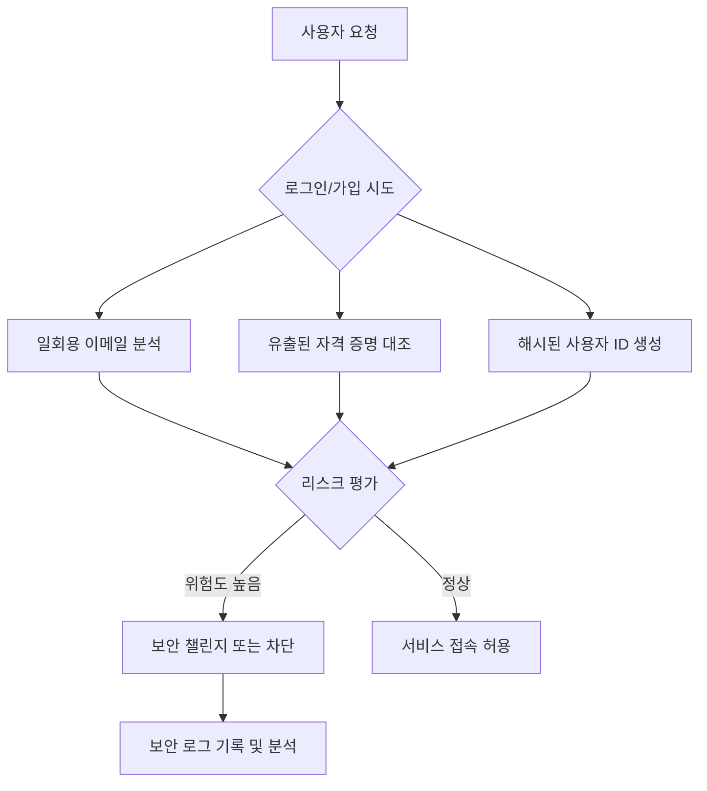

> **한 줄 요약** — 클라우드플레어(Cloudflare)가 발표한 계정 남용 방지(Account Abuse Protection)는 봇 차단을 넘어 일회용 이메일 탐지와 해시된 사용자 ID를 통해 인간과 봇이 결합된 복합적인 사기 공격을 원천 차단합니다.

## 이 주제를 꺼낸 이유

웹 서비스 운영 시 가장 골치 아픈 지점은 단순한 봇(Bot)의 공격이 아닙니다. 봇처럼 보이지 않으려는 정교한 인간의 의도와 자동화 도구가 결합된 계정 남용(Account Abuse) 문제입니다.

실제로 서비스를 운영하다 보면 신규 가입자의 절반 이상이 프로모션 혜택만 챙기고 사라지는 가짜 계정이거나, 유출된 계정 정보를 이용해 초당 수천 번의 로그인을 시도하는 상황을 마주하게 됩니다. 기존의 IP 기반 차단은 공격자가 주거용 프록시(Residential Proxy)를 사용해 IP를 계속 바꾸면 대응하기 어렵다는 한계가 명확했습니다.

이번에 클라우드플레어가 공개한 계정 남용 방지 솔루션은 이러한 실무적 고민을 정확히 관통하고 있습니다. 단순히 네트워크 계층의 신호를 보는 것이 아니라, 이메일의 평판과 사용자 식별자를 활용해 공격의 의도를 파악하겠다는 접근 방식이 인상적입니다.

## 핵심 내용 정리

클라우드플레어의 새로운 계정 남용 방지 기능은 가입 단계부터 로그인, 그리고 활동 단계까지 전 과정에 걸쳐 다중 방어 체계를 구축합니다. 주요 기능은 크게 세 가지로 요약할 수 있습니다.

첫 번째는 일회용 이메일 확인(Disposable email check)과 이메일 리스크(Email risk) 평가입니다. 공격자들은 가짜 계정을 대량으로 만들기 위해 일회용 이메일 서비스를 주로 사용합니다. 클라우드플레어는 가입 단계에서 해당 이메일이 일회용인지, 혹은 인프라 구조상 위험도가 높은지 분석하여 점수를 부여합니다.

두 번째는 해시된 사용자 ID(Hashed User IDs) 도입입니다. 이는 개인정보를 보호하면서도 동일한 공격자가 여러 IP를 바꿔가며 수행하는 활동을 추적할 수 있게 해줍니다. 사용자 이름을 암호화된 해시값으로 변환해 도메인별 식별자를 생성하고, 이를 기반으로 비정상적인 활동 패턴을 감지합니다.

세 번째는 유출된 자격 증명(Leaked credentials) 탐지 및 계정 탈취(Account Takeover, ATO) 방어입니다. 클라우드플레어 네트워크 전체에서 수집된 데이터를 바탕으로 이미 유출된 비밀번호를 사용하는 로그인을 식별하고, 비정상적인 로그인 패턴을 보이는 봇의 공격을 실시간으로 차단합니다.

## 내 생각 & 실무 관점

현업에서 보안 정책을 수립하다 보면 항상 트레이드오프(Trade-off) 상황에 직면합니다. 보안을 강화하면 정상적인 사용자의 편의성이 떨어지고, 편의성을 강조하면 보안 구멍이 생깁니다.

클라우드플레어의 이번 발표에서 가장 눈에 띄는 부분은 해시된 사용자 ID를 활용한 추적입니다. 실무에서 공격자가 수만 개의 IP를 돌려가며 API를 호출할 때, IP 기반의 속도 제한(Rate Limiting)은 사실상 무용지물이 되는 경우가 많습니다.

하지만 사용자 ID라는 상위 계층의 식별자를 보안 규칙에 결합할 수 있다면 이야기가 달라집니다. IP가 바뀌더라도 특정 사용자 ID가 수행하는 비정상적인 행동을 묶어서 볼 수 있기 때문입니다. 이는 주거용 프록시를 사용하는 현대적인 공격 기법에 대응할 수 있는 매우 현실적인 대안이라고 생각합니다.

또한 일회용 이메일 차단 기능은 마케팅 부서와의 협업에서도 큰 의미가 있습니다. 가짜 가입자로 인해 마케팅 비용이 낭비되는 것을 방지하고, 실제 잠재 고객 데이터의 품질을 높일 수 있기 때문입니다. 다만 이 과정에서 특정 국가나 특정 서비스에서 흔히 사용하는 이메일 도메인이 오탐(False Positive)으로 차단되지 않도록 정교한 리스크 티어링(Risk Tiering)이 필수적입니다.

실제로 이런 시스템을 도입할 때는 다음과 같은 주의가 필요합니다.

- 오탐 관리: 정상적인 사용자가 일회용 이메일과 유사한 형태의 자체 도메인 메일을 쓸 때 어떻게 구제할 것인가에 대한 시나리오가 필요합니다.
- 데이터 프라이버시: 해시된 ID를 사용하더라도 해당 데이터가 내부 보안 규정에 위배되지 않는지 검토해야 합니다.
- 단계적 적용: 처음부터 차단(Block) 모드를 쓰기보다는 로그 전용(Log Only) 또는 챌린지(Challenge) 모드로 운영하며 패턴을 먼저 분석하는 것이 안전합니다.

## 정리

클라우드플레어의 계정 남용 방지 솔루션은 봇 관리(Bot Management)의 영역을 비즈니스 로직과 사용자 식별의 영역으로 확장시켰습니다. 이제 보안 팀은 단순히 패킷을 막는 것을 넘어, 서비스의 진정성(Authenticity)을 검증하는 역할을 수행해야 합니다.

현업 보안 담당자나 서비스 운영자라면 지금 바로 자사 서비스의 가입 및 로그인 엔드포인트에서 발생하는 트래픽 중 얼마나 많은 비중이 일회용 이메일이나 유출된 계정 정보를 사용하고 있는지 로그를 통해 점검해 볼 것을 권장합니다. 클라우드플레어의 보안 분석(Security Analytics) 대시보드를 활용하면 이러한 지표를 시각적으로 확인하는 것부터 시작할 수 있습니다.

## 참고 자료

- [원문] [Announcing Cloudflare Account Abuse Protection: prevent fraudulent attacks from bots and humans](https://blog.cloudflare.com/account-abuse-protection/) — Cloudflare Blog
- [관련] Translating risk insights into actionable protection — Cloudflare Blog
- [관련] Investigating multi-vector attacks in Log Explorer — Cloudflare Blog
- [관련] From the endpoint to the prompt: a unified data security vision in Cloudflare One — Cloudflare Blog