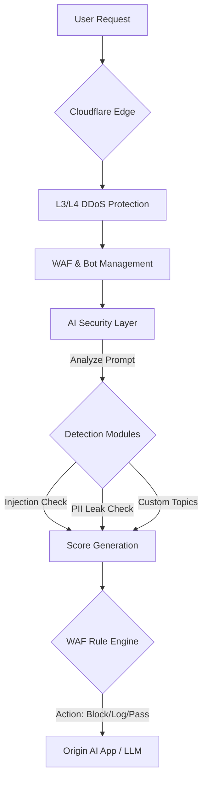

> **한 줄 요약** — 클라우드플레어(Cloudflare)가 출시한 AI Security for Apps는 기업 내부에 숨겨진 섀도우 AI를 찾아내고, 프롬프트 인젝션과 민감 데이터 유출 같은 새로운 유형의 위협을 WAF 계층에서 실시간으로 방어합니다.

## 왜 지금 AI 보안을 고민해야 할까

최근 사내 개발팀이나 현업 부서에서 독자적으로 AI 모델을 도입하는 속도가 보안 정책이 수립되는 속도를 훨씬 앞지르고 있습니다. 기존의 웹 애플리케이션은 정해진 규칙에 따라 동작하는 결정론적(Deterministic) 구조였기 때문에 특정 패턴을 막는 것만으로도 충분한 보안 효과를 거둘 수 있었습니다.

하지만 대규모 언어 모델(LLM)을 기반으로 하는 서비스는 자연어를 입력으로 받으며, 그 결과 또한 확률적(Probabilistic)으로 생성됩니다. 이는 기존의 시그니처 기반 보안 장비로는 대응하기 어려운 새로운 공격 표면이 생겼음을 의미합니다.

특히 AI가 단순히 답변을 생성하는 수준을 넘어 API를 호출하거나 데이터를 수정하는 에이전트(Agent) 기능을 갖추게 되면서, 단 한 번의 악의적인 프롬프트가 시스템 전체의 보안 사고로 이어질 위험이 커졌습니다. 이러한 배경에서 클라우드플레어의 AI Security for Apps 정식 출시 소식은 실무자들에게 매우 현실적인 해결책을 제시합니다.

## AI Security for Apps의 핵심 기능과 작동 원리

클라우드플레어는 전 세계 인터넷 트래픽의 약 20%를 처리하는 거대 네트워크를 활용해 AI 애플리케이션을 보호합니다. 이 서비스는 크게 발견(Discovery), 탐지(Detection), 방어(Mitigation) 세 단계로 구성됩니다.

### 1. 섀도우 AI를 찾아내는 자동 발견 기능
보안의 시작은 가시성 확보입니다. 많은 보안 팀이 사내 어디에서 AI 모델이 사용되고 있는지 완벽하게 파악하지 못하고 있습니다.

- 동작 기반 식별: 단순히 /chat 같은 경로명(Path)을 찾는 것이 아니라, 엔드포인트의 통신 패턴과 동작 방식을 분석해 AI 서비스임을 식별합니다.
- 무료 제공: 이 발견 기능은 유료 요금제뿐만 아니라 프리(Free), 프로(Pro), 비즈니스 요금제 사용자에게도 무료로 제공되어 누구나 자신의 웹 자산 내 AI 사용 현황을 확인할 수 있습니다.

### 2. 프롬프트 인젝션 및 데이터 유출 탐지
AI 전용 보안 계층은 유입되는 모든 프롬프트를 실시간으로 검사합니다.

- 프롬프트 인젝션(Prompt Injection): 모델의 지침을 무시하고 악의적인 행동을 유도하는 공격을 감지합니다.
- PII(개인식별정보) 노출 방지: 주민등록번호, 신용카드 번호 등 민감한 정보가 프롬프트에 포함되어 외부 모델로 전송되는 것을 차단합니다.
- 커스텀 토픽 탐지: 기업마다 금기시하는 주제가 다를 수 있습니다. 금융사는 특정 종목 언급을, 유통사는 경쟁사 제품 비교를 제한하고 싶어 할 때 직접 주제를 정의하고 점수를 매겨 관리할 수 있습니다.

### 3. WAF와 결합된 강력한 방어 체계
탐지된 위협은 기존의 웹 애플리케이션 방화벽(WAF) 규칙 엔진과 결합됩니다. 단순히 프롬프트 내용만 보는 것이 아니라, 해당 요청을 보낸 IP의 평판, 봇 여부, 브라우저 지문(Fingerprint) 등을 종합적으로 판단해 차단 여부를 결정합니다.

## 실무 관점에서 본 AI 보안의 한계와 기회

현업에서 AI 보안 솔루션을 검토하다 보면 가장 먼저 부딪히는 문제가 오탐(False Positive)과 성능 저하(Latency)입니다. 클라우드플레어의 이번 발표에서 눈에 띄는 대목은 프롬프트 추출 방식의 고도화입니다.

### 정교한 프롬프트 추출의 필요성
AI 모델마다 API 구조가 제각각입니다. OpenAI는 $.messages[*].content 형식을 쓰고, 앤스로픽(Anthropic)이나 구글 제미나이(Gemini)는 또 다른 구조를 가집니다. 만약 보안 솔루션이 요청 본문(Request Body) 전체를 단순 텍스트로 읽어버리면, 프롬프트가 아닌 일반 메타데이터 필드에 포함된 민감 정보까지 탐지하여 정상적인 요청을 차단하는 문제가 발생합니다.

실제로 비슷한 고민을 하다 보면 JSONPath를 통해 정확히 어느 필드가 AI 모델로 전달되는 프롬프트인지 지정하는 기능이 얼마나 절실한지 알게 됩니다. 클라우드플레어가 곧 지원할 예정인 커스텀 JSONPath 정의 기능은 이러한 실무적인 페인 포인트를 정확히 짚고 있습니다.

### 에이전트 환경에서의 보안 거버넌스
최근에는 단순히 챗봇을 넘어 시스템 권한을 가진 AI 에이전트 도입이 늘고 있습니다. 구글이 발표한 컨덕터(Conductor)의 자동 리뷰 기능처럼 AI가 생성한 코드를 검증하는 프로세스도 중요하지만, 실행 시점(Runtime)에서의 방어막은 필수적입니다.

현업에서는 다음과 같은 상황을 자주 겪습니다.
- 개발자가 테스트 목적으로 승인되지 않은 외부 LLM API를 코드에 심어두는 경우
- 내부 지식 창고(RAG)를 조회하는 과정에서 권한이 없는 사용자가 교묘한 질문으로 기밀 정보를 빼내려는 경우

이런 상황에서 네트워크 계층의 AI 보안은 애플리케이션 코드 수정 없이도 전사적인 가드레일을 칠 수 있다는 점에서 효율적입니다.

### 데이터 주권과 컴플라이언스
보안만큼이나 중요한 것이 데이터가 처리되는 위치입니다. 클라우드플레어의 커스텀 리전(Custom Regions) 기능과 연계한다면, AI 보안 검사를 특정 국가나 지역 내에서만 수행하도록 강제할 수 있습니다. 이는 유럽의 GDPR이나 국내 개인정보보호법을 준수해야 하는 기업에게는 기술적 보안 이상의 법적 방어 기제가 됩니다.

## AI 시대의 새로운 보안 표준을 향해

AI Security for Apps의 등장은 보안의 영역이 네트워크와 인프라를 넘어 의미론적(Semantic) 영역으로 확장되고 있음을 보여줍니다. 이제는 악성 페이로드가 포함된 패킷을 막는 것을 넘어, 악의적인 의도가 담긴 문장을 막아야 하는 시대입니다.

실무적으로 당장 고려해볼 수 있는 접근법은 다음과 같습니다.

- 가시성 확보: 클라우드플레어 대시보드의 Security -> Web Assets 메뉴를 확인하여 나도 모르게 운영 중인 AI 엔드포인트가 있는지 점검하십시오.
- 단계적 적용: 처음부터 차단(Block) 모드를 적용하기보다는 로그(Log) 모드로 운영하며 우리 서비스 특유의 프롬프트 패턴과 오탐 가능성을 먼저 파악하는 것이 좋습니다.
- 통합 보안 사고: AI 보안을 별도의 도구로 관리하기보다는 기존 WAF와 통합된 형태로 관리하여 관리 복잡도를 줄여야 합니다.

기술의 발전 속도가 빠를수록 보안은 그 속도를 늦추는 장애물이 아니라, 더 안전하게 가속 페달을 밟을 수 있게 해주는 브레이크 시스템이 되어야 합니다. 이번 클라우드플레어의 GA 소식은 그 브레이크 시스템이 한층 정교해졌음을 의미합니다.

## 참고 자료
- [원문] [AI Security for Apps is now generally available](https://blog.cloudflare.com/ai-security-for-apps-ga/) — Cloudflare Blog
- [관련] Introducing Custom Regions for precision data control — Cloudflare Blog
- [관련] Conductor Update: Introducing Automated Reviews — Google Developers