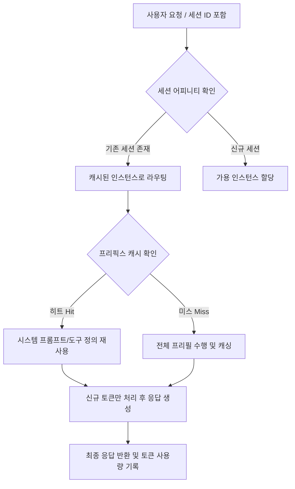

> **한 줄 요약** — Cloudflare Workers AI가 Kimi K2.5 같은 대형 모델 지원을 시작하며, 인프라 최적화와 프리픽스 캐싱을 통해 에이전트 실행 비용을 77%까지 절감할 수 있는 통합 플랫폼으로 진화했습니다.

## 대형 언어 모델이 서버리스 환경으로 들어온 이유
LLM 에이전트(Agents)를 구축할 때 가장 큰 걸림돌은 모델의 추론 능력과 인프라의 파편화입니다. 단순히 프롬프트를 던지는 것을 넘어, 상태를 유지하고(Durable Objects) 긴 작업을 수행하며(Workflows) 안전한 환경에서 코드를 실행하는(Sandbox) 일련의 과정이 필요합니다.

그동안 Cloudflare Workers AI는 가벼운 모델 위주로 서비스되어 복잡한 추론이 필요한 에이전트 구현에는 한계가 있었습니다. 이번에 공개된 Kimi K2.5는 256k의 거대한 컨텍스트 윈도우(Context Window)와 멀티턴 도구 호출(Tool Calling)을 지원하며, 이를 서버리스 환경에서 직접 실행할 수 있게 되었습니다.

실무에서 에이전트를 운영하다 보면 모델의 지능만큼이나 중요한 것이 실행 위치와 데이터의 거리입니다. 모델이 데이터가 흐르는 네트워크 에지(Edge)에서 직접 돌아가면 지연 시간이 줄어들고 보안 정책을 적용하기 훨씬 수월해집니다.

## Kimi K2.5와 Workers AI 추론 스택의 핵심
Kimi K2.5는 단순한 오픈소스 모델 이상의 의미를 가집니다. Cloudflare는 이 모델을 효율적으로 돌리기 위해 자체적인 추론 엔진인 Infire 위에 커스텀 커널(Custom Kernels)을 설계했습니다.

대형 모델을 서버리스로 제공하려면 단순한 배포를 넘어 고도의 최적화 기술이 들어갑니다. 텐서 병렬화(Tensor Parallelism)나 전문가 병렬화(Expert Parallelism) 같은 기법은 물론, 프리필(Prefill) 단계와 생성 단계를 분리하여 GPU 효율을 극대화하는 디스어그리게이티드 프리필(Disaggregated Prefill) 전략이 적용되었습니다.

이런 기술적 복잡성을 개발자가 직접 관리하지 않고 API 호출 한 번으로 해결할 수 있다는 점이 이번 업데이트의 핵심입니다. 아래 다이어그램은 Workers AI 환경에서 에이전트가 요청을 처리할 때 프리픽스 캐싱이 작동하는 구조를 보여줍니다.

## 비용을 77% 절감하는 프리픽스 캐싱 기술
에이전트 환경에서는 매번 수천 개의 토큰으로 구성된 시스템 프롬프트나 도구 정의를 모델에 전달해야 합니다. 이는 추론 비용을 급격히 높이는 원인이 됩니다. 프리픽스 캐싱(Prefix Caching)은 이전에 처리한 입력 토큰의 텐서 값을 캐시에 저장해 두었다가 다음 요청에서 재사용하는 기술입니다.

Cloudflare는 여기서 한발 더 나아가 `x-session-affinity` 헤더를 도입했습니다. 이 헤더를 사용하면 특정 세션의 요청이 동일한 모델 인스턴스로 라우팅될 확률이 높아져 캐시 히트율(Cache Hit Rate)이 극대화됩니다.

- 프리픽스 캐싱 효과: 첫 토큰 생성 시간(TTFT) 단축 및 초당 토큰 처리량(TPS) 향상
- 경제적 이점: 캐시된 토큰에 대해 할인된 요금 적용
- 실제 사례: 내부 보안 리뷰 에이전트에 적용 시 연간 240만 달러 규모의 비용을 77% 절감

현업에서 유사한 고민을 하다 보면 성능과 비용 사이의 타협점을 찾기 마련인데, 인프라 레벨에서 캐싱을 지원하면 개발자는 비즈니스 로직에만 집중할 수 있습니다.

## 실무 관점에서 본 서버리스 AI의 한계와 비동기 API
서버리스 추론은 사용한 만큼만 비용을 내기 때문에 경제적이지만, 트래픽이 몰릴 때 용량 부족(Out of Capacity) 오류를 겪을 위험이 늘 존재합니다. Cloudflare는 이를 해결하기 위해 비동기 API(Asynchronous API)를 재설계했습니다.

동기식 요청으로 처리하기 힘든 대량의 배치 작업이나 긴 추론이 필요한 에이전트 작업은 비동기 큐에 쌓아두고 처리할 수 있습니다. 이는 시스템의 가용성을 보장하는 안전장치 역할을 합니다.

실제로 대규모 코드베이스를 분석하거나 수십억 개의 토큰을 처리해야 하는 보안 감사 도구의 경우, 즉각적인 응답보다는 작업의 완결성이 중요합니다. 이때 비동기 API를 활용하면 인프라 제약 없이 안정적인 워크플로우를 유지할 수 있습니다.

## 내 생각 & 실무 관점
이번 업데이트를 보며 인상 깊었던 점은 모델의 크기가 커짐에 따라 발생하는 비용 문제를 플랫폼 차원에서 정면으로 돌파하려 한다는 것입니다. 상용 폐쇄형 모델(Proprietary Models)은 성능이 뛰어나지만, 수천 명의 직원이 각자의 에이전트를 24시간 가동하는 환경에서는 비용 감당이 불가능합니다.

- 오픈소스 모델의 역습: Kimi K2.5 같은 모델이 상용 모델에 근접한 성능을 내면서, 기업들은 점차 통제 가능한 오픈 소스 기반 인프라로 눈을 돌릴 것입니다.
- 플랫폼의 결합력: 단순히 모델 API만 제공하는 곳보다 데이터 저장소, 워크플로우 엔진, 네트워크 보안이 결합된 플랫폼이 에이전트 구축에 훨씬 유리합니다.
- 트레이드오프 고려: 프리픽스 캐싱과 세션 어피니티를 사용하면 성능은 좋아지지만, 특정 노드에 부하가 쏠리는 현상이 발생할 수 있습니다. Cloudflare가 이를 얼마나 유연하게 부하 분산(Load Balancing)하는지가 운영의 핵심이 될 것입니다.

SASE(Secure Access Service Edge) 마이그레이션이 과거에는 하드웨어 교체 위주였다면, 이제는 보안과 AI가 소프트웨어적으로 결합되는 추세입니다. 복잡한 설정을 걷어내고 수도나 전기처럼 AI 기능을 가져다 쓰는 시대가 생각보다 빨리 오고 있다는 느낌을 받습니다.

## 정리
Cloudflare Workers AI에 Kimi K2.5가 탑재된 것은 대형 모델을 활용한 에이전트 구축의 진입장벽을 크게 낮추는 사건입니다. 특히 프리픽스 캐싱과 세션 어피니티 헤더를 통한 비용 절감은 실무자에게 매우 강력한 유인책이 됩니다.

지금 당장 해볼 수 있는 것은 기존에 사용하던 긴 시스템 프롬프트나 API 도구 정의를 `x-session-affinity` 헤더와 함께 Workers AI에 올려보는 것입니다. 실제 캐시 히트율이 얼마나 나오는지, 그에 따라 비용이 얼마나 줄어드는지 측정해 보는 것만으로도 의미 있는 시도가 될 것입니다.

## 참고 자료
- [원문] [Powering the agents: Workers AI now runs large models, starting with Kimi K2.5](https://blog.cloudflare.com/workers-ai-large-models/) — Cloudflare Blog
- [관련] Introducing Custom Regions for precision data control — Cloudflare Blog
- [관련] Complexity is a choice. SASE migrations shouldn’t take years. — Cloudflare Blog