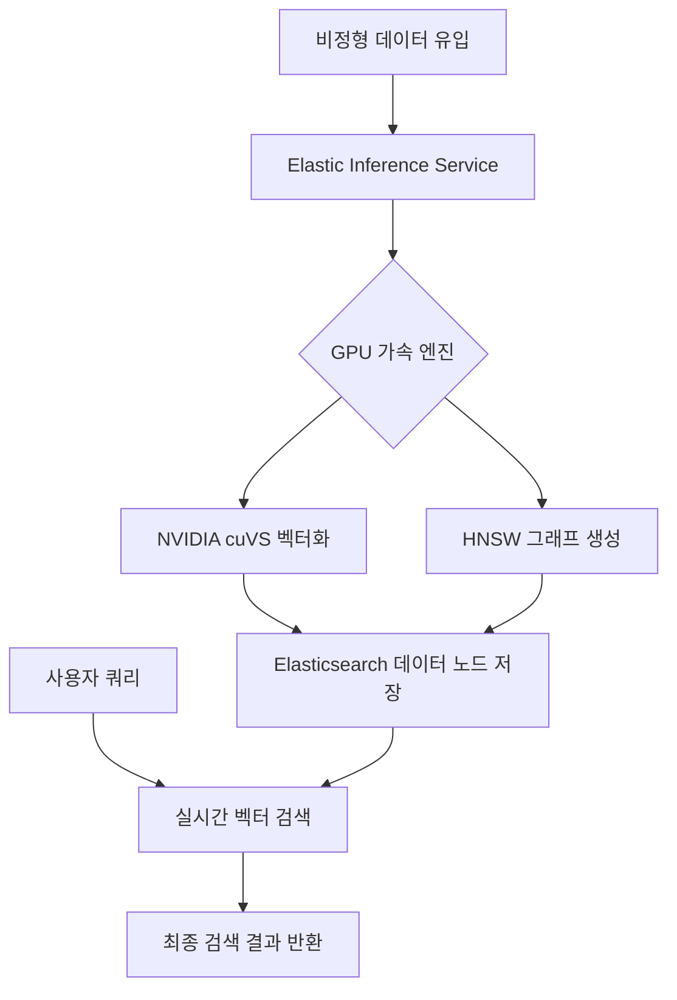

> **한 줄 요약** — Elastic과 NVIDIA cuVS의 통합은 GPU 가속을 통해 벡터 인덱싱 속도를 12배 향상시키며, 대규모 엔터프라이즈 RAG 환경에서 발생하는 인프라 병목 현상을 해결하는 핵심 열쇠가 됩니다.

## 왜 대규모 벡터 인덱싱 성능에 집중해야 할까?

최근 검색 증강 생성(RAG, Retrieval Augmented Generation)을 실무에 도입하려는 시도가 늘어나면서, 단순히 모델의 성능뿐만 아니라 데이터를 벡터로 변환하고 저장하는 과정의 효율성이 큰 숙제로 떠올랐습니다. 데이터 양이 적을 때는 체감하기 어렵지만, 기업 내부의 페타바이트급 비정형 데이터를 실시간으로 처리해야 하는 상황에서는 기존의 CPU 기반 인덱싱 방식이 명확한 한계를 드러내기 때문입니다.

실무에서 벡터 검색 엔진을 운영하다 보면 가장 먼저 마주치는 벽은 인덱스 구축 시간입니다. 특히 데이터가 지속적으로 업데이트되는 환경에서는 새로운 데이터를 벡터화하고 인덱스에 반영하는 과정에서 발생하는 지연 시간이 전체 서비스의 신선도를 떨어뜨립니다. 이러한 배경에서 Elastic과 NVIDIA의 cuVS 통합 소식은 대규모 AI 인프라를 고민하는 엔지니어들에게 매우 현실적인 해결책을 제시합니다.

이번 글에서는 Elastic과 NVIDIA cuVS의 기술적 결합이 엔터프라이즈 AI 환경을 어떻게 변화시키는지, 그리고 실무적인 관점에서 우리가 준비해야 할 부분은 무엇인지 깊이 있게 짚어보겠습니다.

## Elasticsearch와 NVIDIA cuVS 통합의 핵심 메커니즘

Elastic은 NVIDIA와 협력하여 GPU 가속 벡터 인덱싱 기능을 도입했습니다. 핵심은 NVIDIA cuVS 라이브러리를 Elasticsearch 내부에 통합한 것입니다. cuVS는 벡터 검색 및 클러스터링 알고리즘을 GPU에서 최적화하여 실행할 수 있도록 설계된 라이브러리입니다.

### 12배 빠른 인덱싱과 7배 빠른 포스 머지

가장 눈에 띄는 지표는 성능 향상 폭입니다. 원문에 따르면 NVIDIA cuVS를 활용할 경우 CPU 기반 접근 방식보다 최대 12배 빠른 벡터 인덱싱 처리량을 보여줍니다. 또한 인덱스 생명주기 관리에서 중요한 역할을 하는 포스 머지(Force Merge) 작업은 최대 7배까지 빨라집니다.

현업에서 대량의 데이터를 수집(Ingestion)하다 보면 인덱스 세그먼트가 파편화되어 검색 성능이 저하되는 현상을 자주 겪습니다. 이를 해결하기 위해 포스 머지를 수행하지만, 이 과정 자체가 막대한 CPU 자원을 소모하여 운영 중인 서비스에 영향을 주기도 합니다. GPU 가속은 이러한 연산 집약적인 작업을 하드웨어 레벨에서 분리하여 처리함으로써 전체 시스템의 안정성을 높입니다.

### 비용 효율성과 리소스 최적화

단순히 속도만 빠른 것이 아니라 비용 측면에서도 이점이 큽니다. 동일한 비용을 투입했을 때 GPU 가속 인덱싱은 CPU 대비 약 5배 높은 처리량을 제공합니다. 이는 서버 대수를 무작정 늘리는 수평적 확장(Scale-out) 대신, 적절한 GPU 인프라를 도입함으로써 데이터 센터의 상면 비용과 전력 소모를 줄일 수 있음을 의미합니다.

### 아키텍처 흐름도: GPU 가속 벡터 데이터 처리

Elasticsearch와 NVIDIA cuVS가 결합된 환경에서 데이터가 어떻게 흐르는지 구조화하면 다음과 같습니다.

## 실무에서 마주하는 인덱싱 병목 현상과 해결책

실제로 대규모 로그 분석이나 실시간 지식 베이스를 구축하다 보면, 벡터 인덱스 생성이 전체 파이프라인의 병목이 되는 경우가 많습니다. HNSW(Hierarchical Navigable Small World) 알고리즘은 검색 속도는 빠르지만, 인덱스를 구축할 때 각 벡터 간의 거리를 계산하고 그래프를 구성하는 과정에서 수많은 산술 연산이 발생합니다.

### CPU 자원 고갈 문제

현업에서 비슷한 고민을 하다 보면, 인덱싱 작업이 몰릴 때 검색 쿼리 응답 속도가 함께 느려지는 현상을 목격하게 됩니다. CPU가 인덱스 생성과 쿼리 처리를 동시에 수행하면서 자원 경합이 발생하기 때문입니다. NVIDIA cuVS 통합은 이러한 산술 연산을 GPU로 오프로딩(Offloading)함으로써 CPU가 본연의 역할인 검색 엔진 로직과 쿼리 조율에 집중할 수 있게 만듭니다.

### 데이터 최신성(Freshness) 확보

RAG 시스템에서 가장 중요한 것 중 하나는 최신 데이터를 얼마나 빨리 검색 결과에 반영하느냐입니다. 뉴스 기사나 실시간 이벤트 로그를 기반으로 답변을 생성하는 AI 에이전트라면 인덱싱 지연은 치명적입니다. 12배 빠른 인덱싱 성능은 데이터가 시스템에 입력된 후 검색 가능한 상태가 되기까지의 시간을 획기적으로 단축해 줍니다.

## 엔터프라이즈 AI 팩토리를 위한 전략적 접근

Elastic은 단순히 엔진의 성능만 개선하는 것이 아니라, Dell이나 Red Hat 같은 주요 인프라 파트너와 함께 AI 팩토리라는 개념으로 생태계를 확장하고 있습니다. 이는 기업이 온프레미스(On-premises)나 하이브리드 클라우드 환경에서도 일관된 성능을 낼 수 있도록 돕습니다.

### 하이브리드 클라우드와 소버린 AI(Sovereign AI)

보조 레퍼런스에서 언급된 Red Hat OpenShift와의 통합은 보안이 중요한 기업들에게 시사하는 바가 큽니다. 민감한 내부 데이터를 외부 API로 전송하지 않고, 자체적인 GPU 인프라 위에서 Elasticsearch를 구동하여 데이터 주권(Data Sovereignty)을 유지하면서도 고성능 AI 서비스를 운영할 수 있기 때문입니다.

### 트레이드오프와 고려해야 할 지점

물론 GPU 가속 도입이 항상 정답은 아닙니다. 고려해야 할 몇 가지 측면이 있습니다.

- **인프라 복잡성**: GPU 노드를 관리하기 위한 쿠버네티스(Kubernetes) 설정이나 드라이버 업데이트 등 운영 공수가 추가될 수 있습니다.
- **초기 도입 비용**: 초기 GPU 장비 구매나 클라우드 GPU 인스턴스 비용이 CPU 위주 환경보다 높을 수 있습니다. 하지만 처리량 대비 비용을 따져보면 대규모 환경일수록 GPU가 유리해집니다.
- **버전 호환성**: cuVS 통합은 현재 기술 프리뷰 단계이며, Elastic 9.4 버전에서 정식 지원될 예정입니다. 따라서 프로덕션 도입 전 충분한 테스트가 선행되어야 합니다.

## 검색을 넘어 실행하는 AI 에이전트로의 진화

이번 통합의 궁극적인 지향점은 단순히 검색 결과를 잘 보여주는 것을 넘어, 시스템이 스스로 사고하고 행동하는 에이전틱 AI(Agentic AI) 구현에 있습니다. 효율적인 벡터 검색 인프라가 뒷받침되어야 AI 에이전트가 방대한 지식 속에서 필요한 맥락을 실시간으로 찾아내고 다음 행동을 결정할 수 있기 때문입니다.

### 자율형 IT 플랫폼과의 연결

관측성(Observability) 분야에서도 이러한 변화가 감지됩니다. 자율형 IT 플랫폼은 로그와 메트릭 데이터를 실시간으로 분석하여 장애를 감지하고 스스로 복구합니다. 여기서 Elastic의 고성능 벡터 검색은 수많은 과거 사례 중 현재 문제와 가장 유사한 근본 원인을 찾아내는 핵심 엔진 역할을 수행하게 됩니다.

## 실천을 위한 제언

지금 바로 고가의 GPU 서버를 구매할 필요는 없습니다. 하지만 우리 서비스의 데이터 성장 속도와 현재 인덱싱 성능을 점검해보는 과정은 반드시 필요합니다.

1. **인덱싱 지연 측정**: 현재 시스템에서 데이터가 유입되어 검색 가능해지기까지 걸리는 시간(Latency)을 측정해 보십시오.
2. **CPU 부하 분석**: 인덱싱 작업 중 CPU 사용률이 임계치를 넘는지, 그로 인해 검색 쿼리 성능이 저하되는지 모니터링하십시오.
3. **9.4 버전 로드맵 확인**: 2026년 4월로 예정된 Elastic 9.4 정식 버전에 대비하여, 현재 사용 중인 인프라에서 GPU 가속 노드를 추가할 수 있는 구조인지 검토하십시오.

기술의 발전은 우리가 해결할 수 없다고 믿었던 제약 조건들을 하나씩 제거해 줍니다. 페타바이트급 데이터를 실시간으로 벡터화하는 것이 더 이상 불가능한 영역이 아니라는 사실을 인지하고, 다음 단계의 아키텍처를 설계해야 할 시점입니다.

## 참고 자료

- [원문] [Powering enterprise AI at scale: The Elastic and NVIDIA cuVS integration](https://www.elastic.co/blog/elastic-nvidia-cuvs-integration) — Elastic Blog
- [관련] Elastic and Dell AI Data Platform: The foundation for high-velocity enterprise search — Elastic Blog
- [관련] Elastic and Red Hat: Scaling the sovereign AI factory with NVIDIA GPU acceleration — Elastic Blog
- [관련] Take the next steps for observability with autonomous IT platforms and Elastic — Elastic Blog