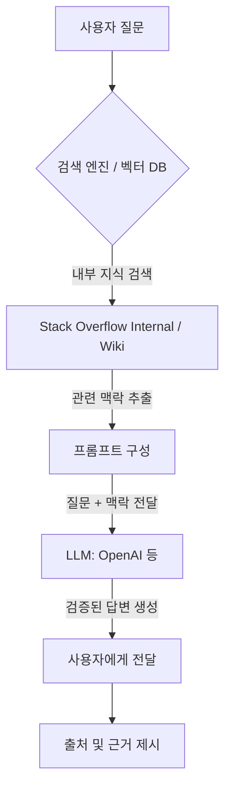

> **한 줄 요약** — 기업용 AI가 데모 수준을 넘어 실질적인 생산성을 내려면 범용 모델의 지능보다 우리 회사만의 고유한 맥락(Context)을 학습시키는 데이터 계층이 필수적입니다.

## 왜 엔터프라이즈 AI는 데모에서만 완벽할까?

최신 대규모 언어 모델(LLM)에게 리액트(React) 드롭다운 컴포넌트를 만들어달라고 하면 몇 초 만에 수준 높은 코드를 내놓습니다. 하지만 우리 회사의 내부 인증 API를 사용해 코드를 짜달라고 하거나, 지난 분기에 왜 특정 라이브러리를 사용 중단(Deprecated)했는지 물어보면 상황이 달라집니다.

범용 모델은 존재하지 않는 엔드포인트를 자신 있게 제안하거나, 우리 회사의 아키텍처 가이드라인에 정면으로 위배되는 패턴을 권장하며 환각(Hallucination) 현상을 보입니다. 이는 모델이 오픈소스 데이터와 공용 문서로 학습되었을 뿐, 우리 조직의 내부 사정과 비즈니스 맥락(Context)은 전혀 모르기 때문입니다.

실무에서 AI 어시스턴트를 도입할 때 가장 먼저 맞닥뜨리는 장벽이 바로 이 지점입니다. 범용적인 기술 질문에는 훌륭한 답변을 내놓지만, 정작 업무 시간을 가장 많이 잡아먹는 내부 시스템 관련 질문에는 무용지물이 되는 현상을 해결하지 못하면 AI 도입은 단순한 실험에 그칠 수밖에 없습니다.

## 기업용 AI의 핵심인 맥락(Context)이란 무엇인가

엔터프라이즈 환경에서 맥락은 단순히 문서 몇 장을 의미하지 않습니다. 이는 조직이 수년에 걸쳐 쌓아온 집단 지성이자 의사결정의 역사입니다. 여기에는 다음과 같은 요소들이 포함됩니다.

- 내부 API 명세 및 마이크로서비스 아키텍처(MSA) 구조
- 조직 고유의 코딩 표준과 스타일 가이드
- 과거에 특정 기술을 도입했다가 포기한 이유와 그 배경(ADR: Architectural Decision Records)
- 특정 서비스가 가진 취약점이나 운영 시 주의사항
- 산업군 특유의 보안 요구사항과 컴플라이언스(Compliance) 제약

범용 파운데이션 모델(Foundation Models)은 공개된 데이터셋으로 학습되었기에 이러한 내부 정보를 알 길이 없습니다. 이 간극을 메우기 위해 최근 많은 기업이 선택하는 방식이 검색 증강 생성(RAG, Retrieval-Augmented Generation)입니다.

위 다이어그램처럼 사용자의 질문이 들어오면 곧바로 AI에게 보내는 것이 아니라, 내부 지식 저장소에서 관련 정보를 먼저 찾습니다. 찾아낸 맥락을 질문과 함께 AI에게 전달함으로써, AI가 우리 회사의 규칙 안에서 답변하도록 강제하는 구조입니다.

## 우버(Uber)의 지니(Genie)가 보여주는 실제 사례

우버는 사내 슬랙(Slack)에서 동작하는 AI 어시스턴트 지니를 통해 이 문제를 해결했습니다. 지니는 엔지니어들의 기술적인 질문에 자동으로 답하고, 지원 티켓 채널을 모니터링하며 스스로 이슈를 해결하기도 합니다.

이 시스템의 핵심은 스택 오버플로 엔터프라이즈(Stack Overflow Internal)를 지식 기반으로 활용했다는 점입니다. 수천 명의 엔지니어가 활동하며 검증한 내부 Q&A 데이터가 AI의 뇌 역할을 합니다. 지니가 실질적인 가치를 제공할 수 있었던 이유는 다음과 같습니다.

- 인간이 검증한 정확성: AI가 확률적으로 생성한 답변이 아니라, 사내 전문가들이 이미 검증한 지식을 바탕으로 답합니다.
- 반복적인 질문 제거: 시니어 개발자들이 슬랙에서 똑같은 질문에 수십 번 답해야 했던 리소스를 획기적으로 줄였습니다.
- 투명성과 추적 가능성: AI의 답변이 어디서 왔는지 출처를 명확히 밝히므로, 개발자가 직접 원문을 확인하고 신뢰할 수 있습니다.

단순히 AI 모델 성능이 좋아서가 아니라, AI가 참고할 수 있는 내부 지식의 품질이 높았기 때문에 성공한 사례입니다. 이는 현업에서 AI 도입을 고민할 때 모델 선정보다 데이터 정제가 훨씬 중요하다는 점을 시사합니다.

## 실무에서 마주하는 맥락 계층의 트레이드오프

실제로 RAG 기반의 시스템을 구축하다 보면 이론과 다른 현실적인 문제들에 부딪히게 됩니다. 가장 큰 고민은 내부 데이터의 파편화입니다. 위키(Wiki), 슬랙 메시지, 지라(Jira) 티켓, 소스 코드 주석 등 지식이 사방에 흩어져 있으면 AI에게 제대로 된 맥락을 제공하기 어렵습니다.

또한, 낡은 정보의 문제입니다. 2년 전에는 정답이었던 설계 방식이 지금은 안티 패턴이 되었을 때, AI가 과거의 문서를 읽고 잘못된 가이드를 줄 위험이 있습니다. 결국 AI 시스템의 성능은 모델의 파라미터 개수가 아니라, 내부 지식 저장소를 얼마나 최신 상태로 유지하느냐에 달려 있습니다.

현업에서 비슷한 고민을 하다 보면 결국 사람이 직접 관리하는 지식의 가치가 더 커진다는 역설적인 결론에 도달합니다. AI가 답변을 잘하게 만들려면, 역설적으로 사람들이 내부 기술 블로그를 열심히 쓰고 Q&A를 활발히 기록해야 합니다. AI는 그 기록을 효율적으로 전달하는 인터페이스일 뿐입니다.

## 왜 단순한 문서 저장소로는 부족할까?

많은 조직이 사내 위키나 노션에 문서를 쌓아두지만, 정작 필요한 순간에 원하는 정보를 찾기는 어렵습니다. 문서는 작성되는 순간부터 낡기 시작하며, 검색 결과가 너무 많으면 무엇이 최신인지 판단하기 힘듭니다.

스택 오버플로와 같은 Q&A 형식이 기업용 AI의 맥락 계층으로 주목받는 이유는 커뮤니티 기반의 검증 기전 때문입니다. 답변에 달린 추천(Upvote)이나 댓글, 채택 표시 등은 AI가 어떤 정보가 더 신뢰할만한지 판단하는 중요한 메타데이터가 됩니다.

단순히 텍스트 뭉치를 AI에게 던져주는 것보다, 전문가들의 상호작용이 포함된 데이터를 제공할 때 AI의 답변 품질은 비약적으로 상승합니다. 이것이 바로 단순한 문서화(Documentation)와 지식 관리(Knowledge Management)의 차이입니다.

## AI 도입 전에 반드시 점검해야 할 질문들

우리 조직에 AI 어시스턴트를 도입하기로 했다면, 어떤 모델을 쓸지 결정하기 전에 다음 질문들에 답할 수 있어야 합니다.

1. 신입 개발자가 들어왔을 때 가장 먼저 읽어야 할 필독 문서가 잘 정리되어 있는가?
2. 우리 회사의 핵심 시스템 아키텍처와 결정 사유가 텍스트 형태로 기록되어 있는가?
3. 사내 전문가들이 반복되는 질문에 지치지 않도록 지식을 공유하는 문화가 정착되어 있는가?

만약 위 질문들에 대한 답이 부정적이라면, 아무리 뛰어난 LLM을 가져와도 AI는 환각에 빠진 주니어 개발자처럼 행동할 것입니다. AI는 마법 지팡이가 아니라, 우리가 가진 지식을 증폭해주는 도구라는 점을 잊지 말아야 합니다.

## 정리하며

기업용 AI의 성패는 파운데이션 모델의 크기가 아니라, 그 모델이 발을 딛고 서 있는 맥락의 깊이에 결정됩니다. 오픈소스 라이브러리 사용법은 챗GPT(ChatGPT)에게 물어봐도 충분하지만, 우리 회사 코드베이스에서 그 라이브러리를 어떻게 안전하게 배포할지는 우리만의 지식 저장소에 답이 있습니다.

지금 당장 할 수 있는 가장 효과적인 AI 전략은 사내의 파편화된 지식을 한데 모으고, 무엇이 옳은 정보인지 전문가들이 검증할 수 있는 시스템을 구축하는 것입니다. 탄탄한 맥락 계층이 마련되었을 때, 비로소 AI는 단순한 챗봇을 넘어 팀의 생산성을 견인하는 동료가 될 수 있습니다.

## 참고 자료
- [원문] [The context problem: Why enterprise AI needs more than foundation models](https://stackoverflow.blog/2026/03/12/enterprise-ai-needs-more-than-foundation-models/) — Stack Overflow Blog
- [관련] Domain expertise still wanted: the latest trends in AI-assisted knowledge for developers — Stack Overflow Blog
- [관련] Building brains for bulldozers — Stack Overflow Blog