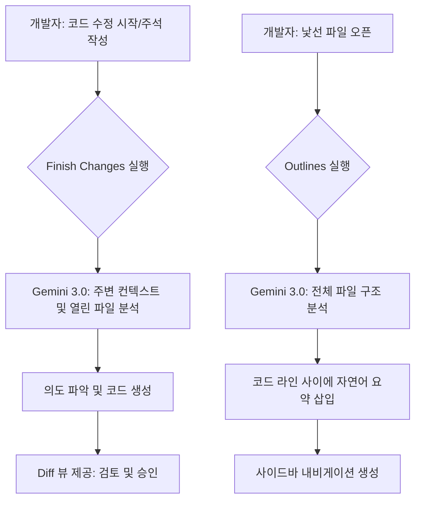

AI 어시스턴트에게 내가 원하는 바를 구구절절 설명하는 과정 자체가 또 다른 업무처럼 느껴질 때가 있습니다. 구글이 최근 Gemini Code Assist에 도입한 Finish Changes와 Outlines 기능은 이러한 프롬프트 작성의 피로도를 낮추고 개발자가 에디터를 떠나지 않고도 흐름을 유지하도록 돕는 데 집중하고 있습니다.

> **한 줄 요약** — Gemini Code Assist의 신규 기능은 명시적인 프롬프트 없이도 개발자의 수정 의도를 파악해 코드를 완성하고, 복잡한 코드 구조를 자연어 요약으로 실시간 시각화하여 탐색 효율을 극대화합니다.

## 이 주제를 꺼낸 이유

개발 도중 AI의 도움을 받으려면 채팅창을 열고 현재 상황을 설명하거나, 정교한 프롬프트를 작성해야 합니다. 이 과정에서 사고의 흐름이 끊기는 경우가 많고, 때로는 프롬프트를 쓰는 시간보다 직접 타이핑하는 게 빠르겠다는 생각이 들기도 합니다.

특히 대규모 프로젝트에서 특정 패턴을 반복해서 수정하거나, 처음 보는 복잡한 파일을 분석해야 할 때 AI와의 상호작용은 생각보다 매끄럽지 않습니다. 구글이 내놓은 이번 업데이트는 개발자가 코드를 작성하는 자연스러운 행위 자체를 AI가 이해하도록 설계했다는 점에서 실무적인 가치가 큽니다.

## 핵심 내용 정리

이번 업데이트의 핵심은 Gemini 3.0 모델을 기반으로 한 두 가지 기능인 Finish Changes와 Outlines입니다. 이 기능들은 IntelliJ와 VS Code 확장 프로그램에서 바로 사용할 수 있으며, 프롬프트 엔지니어링에 들어가는 에너지를 줄이는 데 목적을 둡니다.

### Finish Changes: 보여주면 알아서 완성하는 AI

Finish Changes는 말 그대로 개발자가 시작한 작업을 AI가 끝마쳐주는 기능입니다. 긴 문장으로 명령을 내리는 대신, 코드의 일부를 수정하거나 의사코드(Pseudocode)를 적어두면 Gemini가 나머지 맥락을 짚어냅니다.

- **의사코드 구현**: 한글이나 영어로 대략적인 로직을 주석처럼 적으면 실제 구동 가능한 코드로 변환합니다.
- **패턴 확산**: 파일 내에서 반복적인 수정이 필요할 때, 한 곳만 고치고 기능을 실행하면 파일 전체의 유사한 패턴을 찾아 일괄 적용합니다.
- **주석 기반 명령**: // TODO: 이 함수의 에러 핸들링을 강화해줘 같은 주석을 남기면 해당 위치의 코드를 즉시 개선합니다.

실제 사용 시에는 현재 열려 있는 다른 파일들의 컨텍스트까지 함께 고려하기 때문에, 프로젝트 고유의 스타일이나 내부 API 호출 방식이 자연스럽게 반영됩니다. 제안된 코드는 Diff 형태로 표시되어 개발자가 한눈에 변경 사항을 검토하고 수락할 수 있습니다.

### Outlines: 코드 사이사이에 배치되는 요약 지도

Outlines는 복잡한 소스 코드 파일의 구조를 자연어로 요약하여 코드 라인 사이에 삽입해주는 기능입니다. 단순히 함수 목록을 보여주는 수준을 넘어, 각 코드 블록이 어떤 역할을 하는지 설명해주는 일종의 동적인 설계 문서 역할을 합니다.

- **인라인 요약**: 코드 사이사이에 설명문이 배치되어 읽기 흐름을 방해하지 않으면서도 로직을 빠르게 파악하게 돕습니다.
- **상호작용 내비게이션**: 사이드바에 생성된 요약 항목을 클릭하면 해당 코드 위치로 즉시 이동합니다.
- **실시간 동기화**: 코드가 수정되면 요약 내용도 다시 생성하여 항상 최신 상태를 유지할 수 있습니다.

이 기능은 특히 수천 줄에 달하는 레거시 코드를 파악하거나, 신규 입사자가 프로젝트에 적응해야 할 때 인지 부하를 획기적으로 줄여줍니다.

## 내 생각 & 실무 관점

현업에서 AI 도구를 쓰다 보면 가장 답답한 순간이 내가 지금 뭘 하려는지 일일이 설명해야 할 때입니다. 변수 이름을 바꾸고 그에 따른 참조를 다 수정해야 하는데, AI에게 이걸 설명하느라 시간을 쓰는 건 비효율적입니다. Finish Changes처럼 내가 한 번 보여주면(Show) 알아서 따라 하는(Do) 방식은 가장 이상적인 협업 형태라고 봅니다.

### 프롬프트에서 컨텍스트로의 전환

과거에는 좋은 프롬프트를 만드는 능력이 중요했다면, 이제는 AI가 읽어갈 수 있는 좋은 맥락(Context)을 코드에 남기는 능력이 중요해질 것입니다. 예를 들어, 명확한 의사코드를 작성하거나 일관된 수정 패턴을 한 번 보여주는 행위가 정교한 자연어 프롬프트보다 더 강력한 지시어가 됩니다.

실제로 비슷한 상황을 겪어본 입장에서 보면, 여러 파일을 동시에 수정해야 하는 리팩토링 작업에서 이 기능의 진가가 드러날 것 같습니다. 특정 라이브러리 버전을 올리면서 API 호출 규약이 바뀌었을 때, 한 군데만 제대로 고치고 나머지를 AI에게 맡길 수 있다면 단순 반복 작업 시간을 대폭 아낄 수 있습니다.

### Outlines가 해결하는 문서화의 한계

우리는 항상 최신화된 문서를 원하지만, 코드가 바뀌는 속도를 문서가 따라가는 경우는 드뭅니다. Outlines는 문서화를 별도의 작업이 아닌 코드 읽기의 연장선으로 가져왔다는 점에서 실용적입니다.

다만, AI가 생성한 요약이 실제 로직의 미묘한 예외 케이스까지 완벽하게 잡아내지 못할 위험은 있습니다. 실무에서는 Outlines를 절대적인 진리로 믿기보다는, 큰 그림을 파악하는 용도로 쓰고 세부 로직은 직접 검증하는 태도가 필요합니다. 요약문을 끄고 켤 수 있는 토글 기능을 제공하는 것도 가독성과 정확성 사이의 균형을 맞추려는 배려로 보입니다.

### 도입 시 고려할 트레이드오프

이런 강력한 도구들이 나올수록 개발자는 코드를 꼼꼼히 읽기보다 AI의 요약과 제안에 의존하려는 유혹에 빠지기 쉽습니다. Finish Changes가 제안하는 Diff를 대충 보고 승인했다가 런타임 에러가 발생하면, 원인을 찾는 데 더 많은 시간이 걸릴 수 있습니다.

또한, 보조 레퍼런스에서 언급된 것처럼 API 키 관리나 설정의 편의성(Gemini CLI extension settings)이 좋아지고 있지만, 프로젝트의 소스 코드가 외부 모델로 전송되는 것에 대한 보안 가이드라인은 여전히 조직 차원에서 엄격하게 관리되어야 합니다. 구글 클라우드의 기업용 보안 환경 내에서 이 기능들이 어떻게 격리되어 작동하는지 확인하는 과정이 선행되어야 실무 도입이 가능할 것입니다.

## 정리

Gemini Code Assist의 이번 업데이트는 AI를 도구에서 파트너로 격상시키려는 시도로 보입니다. 개발자는 더 이상 AI를 가르치기 위해 긴 글을 쓸 필요가 없으며, 단지 코드를 작성하는 행위 자체로 소통할 수 있게 되었습니다.

당장 시도해볼 수 있는 것은 자신이 사용하는 IDE의 Gemini 확장 프로그램을 최신 버전으로 업데이트하고, 반복적인 리팩토링 작업에서 `Option+F`(Mac) 또는 `Alt+F`(Windows)를 눌러보는 것입니다. AI가 내 의도를 어디까지 따라오는지 한계를 시험해보는 과정 자체가 앞으로의 개발 생산성을 결정짓는 중요한 경험이 될 것입니다.

## 참고 자료

- [원문] [Introducing Finish Changes and Outlines, now available in Gemini Code Assist extensions on IntelliJ and VS Code](https://developers.googleblog.com/introducing-finish-changes-and-outlines-now-available-in-gemini-code-assist-extensions-on-intellij-and-vs-code/) — Google Developers
- [관련] Making Gemini CLI extensions easier to use — Google Developers
- [관련] On-Device Function Calling in Google AI Edge Gallery — Google Developers