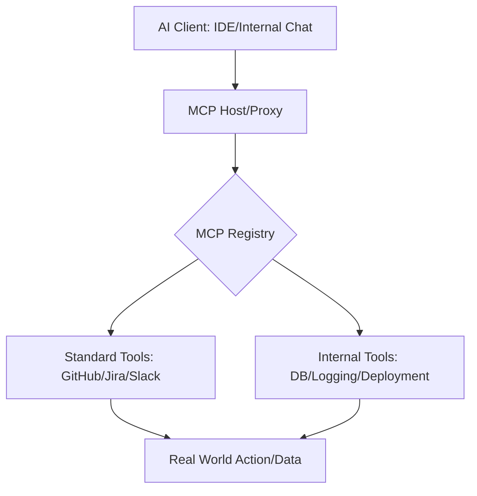

> **한 줄 요약** — 핀터레스트는 모델 컨텍스트 프로토콜(MCP)을 활용해 파편화된 AI 도구 생태계를 표준화하고, 단순 질의응답을 넘어 엔지니어링 업무를 자동화하는 에이전트 인프라를 구축했다.

## 이 주제를 꺼낸 이유

대규모 언어 모델(LLM)을 사내 데이터나 도구와 연결하려는 시도는 많지만, 매번 새로운 모델이 나올 때마다 혹은 새로운 내부 API를 붙일 때마다 개별적인 연동 코드를 짜는 것은 매우 비효율적입니다. 핀터레스트(Pinterest)가 선택한 모델 컨텍스트 프로토콜(Model Context Protocol, MCP)은 이러한 병목을 해결할 수 있는 강력한 대안으로 떠오르고 있습니다.

실무에서 AI 에이전트를 도입할 때 가장 큰 걸림돌은 보안과 도구의 파편화입니다. 핀터레스트가 어떻게 중앙 집중식 레지스트리를 구축하고 이를 IDE나 사내 채팅 환경에 녹여냈는지 그 과정을 들여다보면, 에이전트 도입을 고민하는 팀들이 겪는 실무적 고민에 대한 해답을 찾을 수 있습니다.

## 모델 컨텍스트 프로토콜(MCP) 생태계 구축의 핵심

핀터레스트는 기존의 일회성 통합 방식에서 벗어나 MCP를 기반으로 한 통합 기질(Substrate)을 구축했습니다. MCP는 앤스로픽(Anthropic)이 공개한 오픈소스 표준으로, 모델과 데이터 소스 간의 통신을 규격화합니다. 핀터레스트는 이를 통해 AI 에이전트가 안전하게 엔지니어링 작업을 자동화할 수 있는 환경을 만들었습니다.

전체 구조의 핵심은 MCP 서버, 중앙 레지스트리, 그리고 클라이언트 통합입니다. 핀터레스트는 깃허브(GitHub), 지라(Jira), 슬랙(Slack) 같은 외부 도구뿐만 아니라 내부 데이터베이스와 연동되는 자체 MCP 서버를 운영합니다. 이를 통해 모델은 어떤 도구인지에 상관없이 동일한 인터페이스로 데이터에 접근하고 기능을 실행합니다.

중앙 레지스트리는 수많은 MCP 서버를 관리하고 검색하는 역할을 수행합니다. 개별 엔지니어나 에이전트가 어떤 도구를 사용할 수 있는지 제어하고, 필요한 서버를 즉시 호출할 수 있는 허브가 됩니다. 이는 운영 환경에서 도구의 가시성을 확보하고 권한 관리를 체계화하는 데 필수적인 요소입니다.

## 실무에서 마주하는 에이전트 도입의 한계와 해결책

현업에서 에이전트 시스템을 설계하다 보면 도구 호출(Tool Calling)의 신뢰성 문제에 직면하게 됩니다. 모델이 도구를 잘못 사용하거나 권한이 없는 데이터에 접근하는 상황은 큰 리스크입니다. 핀터레스트는 이를 해결하기 위해 MCP를 단순한 통신 규약 이상으로 활용하여 안전한 자동화(Safely Automate)에 집중했습니다.

실제로 비슷한 고민을 하다 보면 각 팀마다 사용하는 기술 스택이 달라 통합이 어려워지는 경우가 많습니다. 핀터레스트는 이를 위해 IDE(VS Code 등)와 내부 채팅 인터페이스에 MCP 클라이언트를 직접 통합했습니다. 엔지니어가 평소 일하는 환경을 벗어나지 않고도 에이전트의 도움을 받을 수 있게 만든 점은 사용자 경험(UX) 측면에서 매우 영리한 접근입니다.

이러한 방식은 메타(Meta)가 메신저에서 악성 링크를 차단하기 위해 개인정보 보호 검색(Private Information Retrieval) 기술을 도입한 사례와도 맥락이 닿아 있습니다. 사용자의 데이터를 보호하면서도 필요한 기능을 수행해야 하는 엔지니어링적 도전은 MCP 생태계에서도 동일하게 나타납니다. 핀터레스트는 레지스트리를 통해 각 도구의 접근 권한을 제어함으로써 이 문제를 풀어나가고 있습니다.

## 에이전트 인프라 설계 시 고려할 트레이드오프

MCP 도입이 모든 문제를 해결하는 마법 지팡이는 아닙니다. 시스템이 복잡해질수록 관리 포인트가 늘어나는 트레이드오프가 존재합니다. 중앙 레지스트리를 운영하면 관리 효율은 올라가지만, 레지스트리 자체가 단일 장애점(Single Point of Failure)이 될 수 있습니다.

또한, 모든 내부 도구를 MCP 표준에 맞춰 감싸는(Wrapping) 작업에는 초기 비용이 발생합니다. 하지만 핀터레스트의 사례처럼 한 번 표준화된 생태계를 구축해두면, 새로운 모델이 출시될 때마다 연동 코드를 다시 짤 필요가 없습니다. 모델은 MCP 클라이언트 기능만 갖추면 즉시 모든 내부 도구와 연결될 수 있기 때문입니다.

실무적인 시각에서 볼 때, 에어비앤비(Airbnb)가 사용자에게 여행지를 추천하기 위해 복잡한 의도를 파악하는 모델을 구축한 것처럼, 에이전트 역시 사용자의 모호한 요청을 구체적인 MCP 도구 호출로 변환하는 정교한 프롬프트 엔지니어링이 병행되어야 합니다. 도구만 준비되었다고 해서 에이전트가 완벽하게 작동하는 것은 아니며, 도구의 설명(Description)을 모델이 이해하기 쉽게 표준화하는 과정이 수반되어야 합니다.

## 내 생각과 실무적 통찰

핀터레스트의 MCP 생태계 구축은 AI 에이전트가 실험실을 벗어나 실제 생산성 도구로 자리 잡기 위한 필수적인 진화 과정이라고 생각합니다. 단순히 챗봇과 대화하는 수준을 넘어, 에이전트가 코드를 수정하고 배포 상태를 확인하며 지라 티켓을 업데이트하는 등의 실질적인 액션을 수행하려면 표준화된 인터페이스가 반드시 필요합니다.

동의하는 부분은 중앙 레지스트리의 필요성입니다. 규모가 큰 조직일수록 어떤 팀이 어떤 도구를 만들었는지 파악하기 힘든데, MCP 레지스트리는 일종의 서비스 카탈로그 역할을 수행하며 중복 개발을 방지합니다. 다만 의문이 드는 점은 실시간성이 강조되는 작업에서의 오버헤드입니다. 모델과 서버 사이에 MCP 레이어가 추가되면서 발생하는 지연 시간(Latency)을 핀터레스트가 어떻게 최적화했는지에 대한 구체적인 수치가 공개되지 않은 점은 아쉽습니다.

현업에서 비슷한 시스템을 설계한다면, 처음부터 모든 도구를 MCP로 전환하기보다는 가장 자주 쓰이는 상위 3~5개 도구를 먼저 전환해 보는 전략이 유효할 것입니다. 핀터레스트도 초기에는 MCP의 가능성을 확인하는 단계에서 시작해 점진적으로 생태계를 확장했습니다.

## 정리

핀터레스트의 사례는 파편화된 AI 도구들을 MCP라는 표준으로 묶어 내부 엔지니어링 생산성을 극대화한 좋은 벤치마킹 대상입니다. 모델과 도구의 결합도를 낮추고 유연성을 높이는 이 구조는 앞으로 대규모 조직에서 AI 에이전트를 도입할 때 표준 아키텍처로 자리 잡을 가능성이 큽니다.

지금 당장 해볼 수 있는 것은 현재 운영 중인 내부 API나 도구 중 AI 에이전트가 활용했을 때 가장 파급력이 큰 것을 골라 MCP 서버 형태로 프로토타이핑해보는 것입니다. 표준화된 프로토콜이 주는 확장성의 가치를 직접 경험해보는 것이 에이전트 시대를 준비하는 첫걸음이 될 것입니다.

## 참고 자료
- [원문] [Building an MCP Ecosystem at Pinterest](https://medium.com/pinterest-engineering/building-an-mcp-ecosystem-at-pinterest-d881eb4c16f1?source=rss----4c5a5f6279b6---4) — Pinterest Engineering
- [관련] How Advanced Browsing Protection Works in Messenger — Meta Engineering
- [관련] Recommending Travel Destinations to Help Users Explore — Airbnb Tech