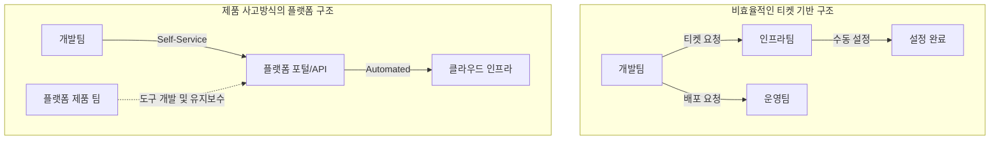

플랫폼 엔지니어링(Platform Engineering)은 단순히 최신 도구를 도입하는 기술적 여정이 아니라, 조직의 소통 구조와 아키텍처를 일치시켜 나가는 고도의 조직 설계 과정입니다.

> **한 줄 요약** — 성공적인 플랫폼 팀은 기술적 도구 구축에 매몰되지 않고, 콘웨이의 법칙을 활용해 조직의 복잡성을 관리하고 개발자의 인지 부하를 줄이는 데 집중합니다.

## 이 주제를 꺼낸 이유

많은 조직이 개발 속도를 높이기 위해 플랫폼 팀을 신설하지만, 정작 현장에서는 플랫폼이 오히려 무겁고 복잡하다는 불만이 터져 나오곤 합니다. 플랫폼이 조직의 효율을 높이는 지렛대가 아니라, 단순히 인프라 티켓을 처리하는 또 다른 병목 구간으로 전락하는 상황을 자주 목격합니다.

이러한 현상이 발생하는 근본적인 원인은 플랫폼이 해결하고자 하는 기술적 지향점과 실제 조직의 운영 방식이 충돌하기 때문입니다. 스택 오버플로(Stack Overflow)의 기사는 이 문제를 콘웨이의 법칙(Conway’s Law) 관점에서 날카롭게 분석하고 있어, 실무적인 해결책을 고민하는 분들에게 실질적인 통찰을 제공합니다.

## 왜 플랫폼 팀은 복잡성의 쓰레기통이 되는가?

플랫폼 팀의 명시적인 임무는 스트림 정렬 팀(Stream-aligned teams)의 인지 부하(Cognitive Load)를 줄이는 것입니다. 하지만 실제로는 조직 내의 온갖 지저분한 운영 업무와 기술 부채를 떠안는 복잡성 쓰레기통(Complexity sink) 역할을 하게 되는 경우가 많습니다.

이는 플랫폼이 조직이 지향하는 아키텍처가 아니라, 현재 조직의 무질서한 소통 구조를 그대로 투영하기 때문입니다. 1967년 멜빈 콘웨이가 관찰했듯, 시스템 설계는 그 조직의 소통 구조를 따라갈 수밖에 없습니다. 조직 구조가 파편화되어 있다면 플랫폼 역시 파편화된 기능을 제공하는 무거운 도구가 됩니다.

### 콘웨이의 법칙과 플랫폼 구조의 상관관계

플랫폼 엔지니어링이 실패하는 전형적인 징후는 플랫폼 팀을 제품 역량이 아닌 프로세스 단계로 정의할 때 나타납니다. 예를 들어 배포 담당 팀, 인프라 프로비저닝 팀, 모니터링 팀이 각각 나누어져 있다면, 개발자는 아이디어를 배포하기 위해 각 팀과 조율(Coordination)하는 데 대부분의 시간을 쓰게 됩니다.

이런 상황에서 인계(Handoff) 자체는 업무의 본질이 되고, 플랫폼은 관료주의의 산물이 됩니다. 2024년 DORA(State of DevOps) 보고서에 따르면, 제품 사고방식(Product mindset)이 결여된 플랫폼 구축은 오히려 처리량을 8% 감소시키고 안정성을 14% 저하시킨다는 통계가 이를 뒷받침합니다.

## 플랫폼 엔지니어링 vs 단순 인프라 운영의 차이점

기사에서 강조하는 핵심은 플랫폼을 서비스(Service)가 아닌 제품(Product)으로 바라보는 시각의 전환입니다. 단순 인프라 운영 팀은 요청이 올 때마다 수동으로 서버를 띄워주지만, 플랫폼 팀은 개발자가 스스로 서버를 띄울 수 있는 인터페이스를 제공합니다.

### 아키텍처를 유도하는 소통 구조 설계

가장 효과적인 플랫폼 조직은 현재의 혼란에 맞서 싸우기보다 이를 영리하게 이용합니다. 3년 뒤에 우리가 어떤 시스템을 갖길 원하는지 먼저 정의하고, 그 시스템을 자연스럽게 만들어낼 수 있는 소통 구조를 설계합니다.

*   역량 중심 정렬: 플랫폼 팀을 작업 단위가 아닌 인프라, 데이터, 보안 같은 역량(Capabilities) 단위로 정렬합니다.
*   명확한 상호작용: 플랫폼 팀과 제품 팀 사이의 소통은 어깨 톡톡(Shoulder taps) 같은 비공식적 요청이 아니라, 잘 정의된 API나 셀프 서비스 포털을 통해 이루어져야 합니다.
*   인지 부하 측정: 플랫폼 팀의 성공 지표는 얼마나 많은 기능을 만들었냐가 아니라, 제품 개발자의 삶이 얼마나 단순해졌는가여야 합니다.

## 내 생각 & 실무 관점

원문에서 플랫폼 팀이 복잡성 쓰레기통이 된다는 표현에 깊이 공감합니다. 실무에서 플랫폼 구축을 시작할 때 가장 먼저 맞닥뜨리는 난관은 표준화(Standardization)와 유연성(Flexibility) 사이의 줄타기입니다.

### 표준화의 함정과 유연성의 트레이드오프

모든 팀에 동일한 기술 스택과 배포 방식을 강요하면 플랫폼은 견고해지지만, 특정 제품 팀의 특수한 요구사항을 무시하게 됩니다. 반대로 모든 요구사항을 다 들어주면 플랫폼은 누더기가 되어 유지보수가 불가능해집니다.

실제로 이런 상황에서는 황금 경로(Golden Path)를 제시하는 전략이 유효합니다. 플랫폼이 권장하는 방식을 따르면 매우 쉽고 빠르게 배포할 수 있지만, 그 경로를 벗어나고 싶은 팀에게는 그에 따른 운영 책임(You build it, you run it)을 명확히 부여하는 방식입니다. 이는 플랫폼 팀이 모든 팀의 뒤처리를 담당하는 complexity sink가 되는 것을 방지하는 실질적인 방어 기제입니다.

### 플랫폼 팀의 유통기한과 진화

많은 조직이 간과하는 부분 중 하나는 플랫폼 팀의 구조가 고정적이어야 한다고 믿는 점입니다. 하지만 모놀리스(Monolith)에서 마이크로서비스(Microservices)로 전환하는 단계의 플랫폼 팀과, 이미 분산 시스템이 안정화된 단계의 플랫폼 팀은 그 역할과 구성이 달라야 합니다.

레거시 시스템을 안정화하는 팀이 분산 아키텍처를 최적화하는 팀과 동일할 필요는 없습니다. 조직의 성숙도에 따라 플랫폼 팀의 미션도 진화해야 하며, 필요하다면 팀을 해체하거나 재구성하는 유연함이 필요합니다. 팀 구조를 정적으로 유지하면서 시스템이 변하기를 바라는 것은 콘웨이의 법칙을 정면으로 거스르는 일입니다.

### 소통 비용이 곧 아키텍처 비용이다

현업에서 비슷한 고민을 하다 보면, 기술적인 문제보다 부서 간의 책임 소재를 가리는 데 더 많은 에너지를 쏟게 됩니다. 플랫폼 엔지니어링의 본질은 결국 이 책임의 경계를 코드로 명확히 긋는 작업입니다.

개발자가 인프라 설정을 위해 인프라 팀의 승인을 기다려야 한다면, 그 대기 시간은 조직의 소통 비용이자 아키텍처의 결함입니다. 이를 셀프 서비스로 전환하는 것은 단순히 편리함을 제공하는 것이 아니라, 조직의 소통 구조를 비동기(Asynchronous) 방식으로 바꾸어 아키텍처의 독립성을 확보하는 과정입니다.

## 정리

플랫폼 엔지니어링의 진정한 성과는 화려한 대시보드나 자동화 스크립트가 아니라, 조직 내부의 복잡성이 얼마나 줄어들었는가로 증명됩니다. 기술은 도구일 뿐이며, 진짜 작업(The real work)은 경계를 설정하고, 소유권을 명확히 하며, 신뢰를 구축하는 조직적 설계에 있습니다.

여러분의 조직에서 플랫폼이 무겁게 느껴진다면, 현재의 플랫폼이 혹시 과거의 낡은 소통 구조를 그대로 복제하고 있지는 않은지 자문해 보시기 바랍니다. 지금 당장 해볼 수 있는 것은 개발자들이 가장 자주 요청하는 인프라 작업 하나를 골라, 사람의 개입 없이 스스로 처리할 수 있는 셀프 서비스 인터페이스로 전환하는 것입니다.

## 참고 자료
- [원문] [Organizing productive platform teams](https://stackoverflow.blog/2026/03/09/organizing-productive-platform-teams/) — Stack Overflow Blog
- [관련] AI is becoming a second brain at the expense of your first one — Stack Overflow Blog