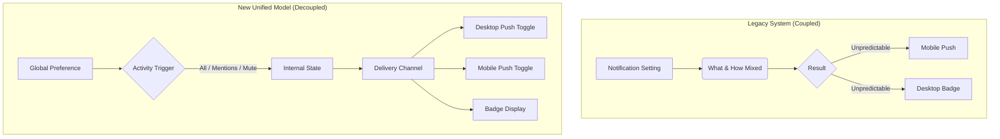

> **한 줄 요약** — 슬랙은 알림 피로도를 줄이기 위해 복잡한 레거시 설정을 단순화하고, 알림의 대상(What)과 전달 방식(How)을 완전히 분리하는 아키텍처 재설계를 단행했습니다.

## 알림 시스템이 사용자 신뢰를 무너뜨리는 방식
알림은 서비스와 사용자를 잇는 가장 강력한 고리이지만, 제대로 관리되지 않으면 가장 먼저 차단당하는 요소가 됩니다. 슬랙(Slack) 정도의 규모에서 알림 시스템은 단순히 메시지를 보내는 기능을 넘어 사용자의 집중력을 관리하는 핵심 도구입니다. 하지만 오랜 시간 기능이 덧붙여지면서 슬랙의 알림 로직은 거대한 미로처럼 변해버렸습니다.

현업에서 복잡한 시스템을 다루다 보면 기능 추가보다 어려운 것이 기존 로직의 단순화라는 점을 체감합니다. 슬랙 엔지니어링 팀이 마주했던 문제는 단순히 알림이 많이 온다는 것이 아니었습니다. 사용자가 알림 설정을 변경해도 결과가 어떻게 나타날지 예측할 수 없다는 불확실성이 본질적인 문제였습니다. 데스크톱과 모바일의 설정 모델이 서로 달랐고, 특정 설정을 끄면 의도치 않게 다른 기능까지 마비되는 결합도가 높은 구조였습니다.

이런 상황에서 사용자는 시스템을 통제할 수 없다고 느끼며, 결국 서비스 전체에 대한 피로감을 호소하게 됩니다. 슬랙은 이 문제를 해결하기 위해 시스템의 겉모습만 바꾸는 것이 아니라, 알림을 정의하는 멘탈 모델 자체를 다시 설계하기로 결정했습니다.

## 네 가지 모델에서 단 하나의 통합 모델로
재설계 전 슬랙의 알림 시스템은 네 가지의 서로 다른 설정 패러다임이 공존하고 있었습니다. 데스크톱과 모바일이 각각 독립적인 선호도 시스템을 가졌고, 그 안에서도 옵션의 명칭과 동작 방식이 제각각이었습니다. 예를 들어 모바일에서 아무것도 안 함(Nothing)을 선택했을 때의 동작이 데스크톱의 끔(Off)과 일치하지 않는 식입니다.

가장 큰 문제는 알림의 대상과 전달 수단이 강하게 결합되어 있었다는 점입니다. 특정 채널의 푸시 알림을 줄이고 싶어서 설정을 건드리면 앱 내에서의 배지 알림까지 사라져 버렸습니다. 사용자는 정보를 나중에 확인하고 싶을 뿐인데, 시스템은 정보를 아예 차단하거나 전부 다 받거나 둘 중 하나만을 강요했습니다.

슬랙은 이를 해결하기 위해 알림의 계층 구조를 새롭게 정의했습니다.

- 무엇을 알릴 것인가(What): 모든 메시지, 멘션 및 DM, 혹은 뮤트
- 어떻게 전달할 것인가(How): 푸시 알림 활성화 여부(기기별 독립 설정)
- 세부 제어(Advanced): 모바일 배지 카운트 방식 등 파워 유저용 옵션

이 구조를 통해 사용자는 모든 메시지에 대해 앱 내 배지는 유지하면서, 실제 폰으로 오는 푸시 진동은 멘션이 왔을 때만 울리도록 정교하게 설정할 수 있게 되었습니다.



## 데이터 마이그레이션의 기술적 묘수: 읽기 시점 전략
수백만 명의 활성 사용자가 있는 서비스에서 데이터베이스 스키마를 직접 수정하고 기존 값을 일괄 변경하는 작업은 위험 부담이 큽니다. 슬랙 팀은 여기서 리드 타임 전략(Read-time strategy)이라는 영리한 접근법을 사용했습니다. 데이터베이스 수준에서 기존의 끔(Off) 설정을 멘션(Mentions)으로 모두 업데이트하는 대신, 애플리케이션 로직에서 데이터를 읽어올 때 새로운 모델에 맞춰 해석하는 방식을 택했습니다.

실무에서 대규모 마이그레이션을 진행할 때 가장 두려운 것이 롤백 상황입니다. 만약 데이터 자체를 변환해버렸는데 예상치 못한 버그가 발생하면 복구가 매우 어렵습니다. 슬랙은 새로운 필드인 `desktop_push_enabled`를 도입하고, 기존에 명시적인 설정값이 없던 유저들에 대해서만 백필(Backfill)을 진행했습니다.

코드 수준에서는 다음과 같은 논리가 적용되었습니다.

```javascript
// 기존 설정 구조
// prefs: 'everything' | 'mentions' | 'nothing'

// 새로운 구조에서의 해석 로직 (Read-time logic)
function getNotificationSettings(userPrefs) {
  const activityLevel = userPrefs.desktop === 'nothing' ? 'mentions' : userPrefs.desktop;
  const isPushEnabled = userPrefs.desktop !== 'nothing';

  return {
    activity: activityLevel, // 'everything' 또는 'mentions'
    pushEnabled: isPushEnabled // 'nothing'이었던 유저는 push가 꺼진 상태로 시작
  };
}
```

이 방식의 핵심은 사용자가 체감하는 동작은 이전과 동일하게 유지하면서, 내부 아키텍처만 깔끔하게 분리된 구조로 갈아끼웠다는 점입니다. 사용자는 자신이 설정을 바꿨다고 느끼지 못하지만, 이제 시스템 내부에서는 알림의 트리거와 전달 경로가 독립적으로 작동하기 시작합니다.

## 실무 관점에서 본 자동 저장과 UI 일관성
이번 개편에서 눈에 띄는 변화 중 하나는 설정 모달에서 저장(Save) 버튼을 없애고 자동 저장(Auto-save) 방식을 도입한 것입니다. 기술적으로는 간단해 보이지만, 사용자 경험 측면에서는 엄청난 차이를 만듭니다.

일반적으로 설정 항목이 많은 페이지에서 사용자는 여러 옵션을 건드려보다가 마지막에 저장 버튼을 누르는 것을 잊어버리곤 합니다. "분명히 설정을 바꿨는데 왜 자꾸 알림이 오지?"라는 불만의 상당수가 여기서 기인합니다. 실무에서 복잡한 관리자 페이지를 설계할 때도 이런 저장 누락 문제는 항상 고객 센터의 단골 문의 소재가 됩니다.

슬랙은 React 기반의 공용 컴포넌트를 활용해 데스크톱과 모바일의 UI 구조를 통일했습니다. 특히 iOS 앱의 아주 오래된 페이지들까지 최신 아키텍처로 다시 작성했는데, 이는 단순히 보기 좋게 만들기 위함이 아닙니다. 플랫폼 간의 코드 공유를 통해 비즈니스 로직의 파편화를 막고, 어디서 설정을 변경하든 즉각적으로 다른 기기에 동기화되는 신뢰성을 확보하기 위한 기반 작업입니다.

실제로 비슷한 고민을 하다 보면 플랫폼별로 미묘하게 다른 API 응답 값이나 상태 관리 방식 때문에 동기화가 깨지는 경우가 많습니다. 슬랙은 명시적인 상태(Explicit state)를 저장하고 동기화 파라미터를 제거함으로써, 모바일이 데스크톱의 설정을 기본적으로 따르되 필요할 때만 덮어쓰는(Override) 명확한 계층 구조를 확립했습니다.

## 설계의 명확성이 가져온 비즈니스 임팩트
시스템을 어렵게 만들기는 쉽지만, 단순하게 유지하기는 어렵습니다. 슬랙의 이번 재설계가 주는 가장 큰 교훈은 기술적 영리함보다 개념적 명확성이 우선되어야 한다는 점입니다.

- 설정 참여도 5배 증가: 사용자가 시스템을 이해하기 시작하자 자신의 환경을 최적화하려는 시도가 늘어났습니다.
- 고객 지원 비용 감소: "왜 알림이 오나요?" 혹은 "어떻게 끄나요?" 같은 단순 문의가 급격히 줄어들었습니다.
- 사용자 신뢰 회복: 설정한 대로 동작한다는 믿음은 사용자가 플랫폼에 더 오래 머물게 하는 기반이 됩니다.

현업에서 알림 시스템을 설계할 때 우리가 흔히 범하는 실수는 "사용자에게 더 많은 옵션을 주면 좋아할 것"이라는 착각입니다. 하지만 슬랙의 사례에서 보듯, 중요한 것은 옵션의 개수가 아니라 옵션 간의 관계가 얼마나 논리적이고 예측 가능한가입니다.

복잡한 조건문과 플래그로 점철된 알림 로직을 가지고 있다면, 지금 당장 데이터베이스를 뒤엎기 전에 우리 시스템의 멘탈 모델이 사용자에게 어떻게 전달되고 있는지부터 점검해봐야 합니다. 기술적 부채는 코드에만 쌓이는 것이 아니라 사용자의 머릿속에도 쌓이기 때문입니다.

## 정리
슬랙의 알림 시스템 재구축은 단순한 UI 리뉴얼이 아닌 아키텍처의 근본적인 정제 과정이었습니다. 알림의 조건과 수단을 분리하고, 읽기 시점의 변환 로직을 통해 리스크를 최소화하며 마이그레이션을 완수했습니다.

지금 운영 중인 서비스의 설정 페이지를 열어보시기 바랍니다. 사용자가 버튼 하나를 누를 때 그 결과를 100% 확신할 수 있나요? 만약 그렇지 않다면, 슬랙이 했던 것처럼 시스템의 엉킨 실타래를 풀고 무엇과 어떻게를 분리하는 작업이 필요할 때일지도 모릅니다.

## 참고 자료
- [원문] [How Slack Rebuilt Notifications 📣](https://slack.engineering/how-slack-rebuilt-notifications/) — Slack Engineering
- [관련] Recommending Travel Destinations to Help Users Explore — Airbnb Tech
- [관련] Domain expertise still wanted: the latest trends in AI-assisted knowledge for developers — Stack Overflow Blog