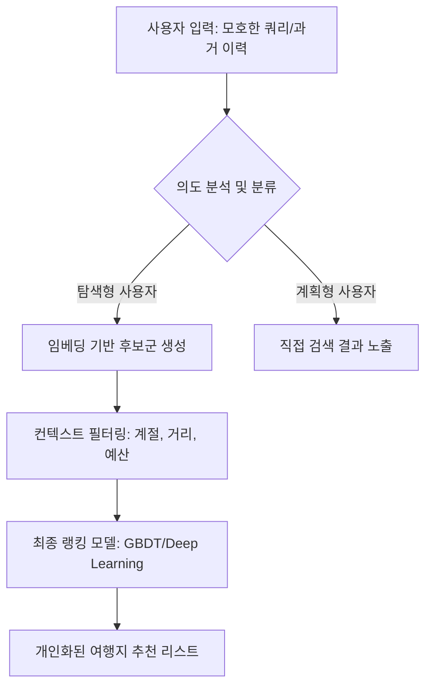

에어비앤비(Airbnb)가 목적지를 정하지 못한 탐색형 사용자를 위해 머신러닝 기반의 여행지 추천 시스템을 어떻게 구축하고 최적화했는지 그 과정과 실무적 통찰을 공유합니다.

> **한 줄 요약** — 구체적인 계획 없이 여행을 탐색하는 사용자의 모호한 의도를 파악하여, 개인화된 여행지 후보를 제안하고 예약 전환율을 높이는 추천 모델링 전략입니다.

## 이 주제를 꺼낸 이유

대부분의 커머스나 예약 플랫폼은 사용자가 무엇을 원하는지 명확히 알고 있다는 가정하에 검색 결과를 보여줍니다. 파리에 가고 싶은 사람에게 파리의 숙소를 보여주는 것은 기술적으로 명확한 문제입니다. 하지만 현실에서 많은 사용자는 "어디로든 떠나고 싶다" 혹은 "유럽 어딘가로 가고 싶다"와 같은 막연한 상태로 탐색을 시작합니다. 

이런 탐색형 사용자는 방문 빈도가 낮고 즉각적인 예약 확률도 떨어지지만, 이들에게 영감을 주고 선택지를 좁혀주는 과정은 서비스의 장기적인 성장에 필수적입니다. 에어비앤비의 이번 기술 블로그 글은 목적지가 정해지지 않은 콜드 스타트(Cold-start) 상황이나 모호한 쿼리를 어떻게 데이터로 해석하고 추천으로 연결했는지 잘 보여주고 있어 이를 깊이 있게 분석해 보았습니다.

## 핵심 내용 정리

에어비앤비는 사용자를 목적지가 명확한 계획자(Planner)와 영감을 찾는 탐색자(Explorer)로 구분했습니다. 탐색형 사용자는 프랑스 같은 국가 단위나 유럽 같은 대륙 단위의 넓은 범위를 검색하는 경향이 있습니다. 이들의 의도를 구체적인 도시나 지역 추천으로 전환하기 위해 에어비앤비는 다단계 추천 파이프라인을 구축했습니다.

첫 번째 단계는 후보군 생성(Candidate Generation)입니다. 사용자의 과거 검색 기록, 찜한 숙소(Wishlist), 클릭한 이력 등을 바탕으로 수천 개의 목적지 중 관련성이 높은 수백 개를 추려냅니다. 이때 임베딩 기반 검색(Embedding-based Retrieval)을 활용해 사용자의 잠재적인 선호도와 목적지의 특성을 동일한 벡터 공간에서 비교합니다.

두 번째 단계는 랭킹(Ranking)입니다. 추려진 후보군을 대상으로 사용자의 현재 상황(계절, 출발지, 예산 등)과 목적지의 인기도, 과거 해당 목적지에서의 예약 성공률 등을 복합적으로 계산합니다. 특히 탐색형 사용자에게는 단순히 인기 있는 곳만 보여주는 것이 아니라, 사용자가 이전에 관심을 보였던 테마(예: 해변, 산, 도시 야경)와 일치하는 장소를 우선순위에 둡니다.

이 과정에서 에어비앤비는 목적지의 계절성을 중요하게 다루었습니다. 여름에 인기 있는 휴양지와 겨울에 인기 있는 스키 리조트를 구분하여 추천하기 위해 시간적 피처(Temporal features)를 모델에 적극적으로 반영했습니다. 또한 사용자가 머무는 위치에서 너무 멀지 않은 곳을 선호하는 경향을 고려해 지리적 거리(Geographic distance)를 주요 가중치로 사용했습니다.

## 내 생각 & 실무 관점

원문에서 인상 깊었던 점은 사용자의 행동 패턴을 기반으로 추천의 목적 자체를 다르게 설정했다는 것입니다. 실무에서 추천 시스템을 설계하다 보면 모든 사용자에게 동일한 최적화 목표(예: CTR)를 적용하는 실수를 범하곤 합니다. 하지만 목적지를 찾는 단계의 사용자에게는 클릭률보다 탐색의 깊이나 체류 시간이 더 중요한 지표가 될 수 있습니다.

실제로 이런 상황에서는 모델의 성능도 중요하지만, 데이터의 품질이 결과를 좌우합니다. 에어비앤비가 사용한 임베딩 기법은 사용자가 명시적으로 표현하지 않은 취향을 잡아내는 데 탁월합니다. 현업에서 비슷한 고민을 하다 보면 사용자가 검색한 키워드에만 매몰되기 쉬운데, 검색 결과가 없는 영검색(Zero-result) 상황이나 광범위한 검색어에서는 사용자의 과거 로그를 벡터화하여 유사한 목적지를 제안하는 방식이 훨씬 유연한 사용자 경험을 제공합니다.

또한 트레이드오프 관점에서 고려해야 할 부분은 다양성(Diversity)과 정확성(Relevance)의 균형입니다. 탐색형 사용자에게 너무 정확한(이미 가봤거나 뻔한) 장소만 추천하면 발견의 즐거움이 사라집니다. 반대로 너무 생소한 곳만 추천하면 신뢰도가 떨어집니다. 에어비앤비가 랭킹 모델에서 인기도와 개인화 점수를 섞어 쓴 이유도 이 간극을 메우기 위함이었을 것입니다.

구글의 최근 온디바이스 펑션 콜링(On-device function calling) 기술이나 제미나이(Gemini)의 사례처럼, 이제는 AI가 사용자의 모호한 자연어 입력을 실행 가능한 액션으로 바꾸는 단계에 와 있습니다. 에어비앤비의 추천 모델도 단순히 리스트를 보여주는 것을 넘어, 사용자의 대화나 맥락을 실시간으로 이해하고 의도를 구체화해 나가는 에이전트 형태로 진화할 것으로 보입니다.

스택 오버플로우의 조사 결과에서도 나타나듯, AI를 활용한 학습과 탐색에서 사용자는 효율성을 가장 큰 가치로 둡니다. 여행지를 고르는 과정은 즐겁지만 동시에 피로한 작업입니다. 수많은 선택지 중에서 나에게 딱 맞는 몇 가지를 제안받아 인지적 부하(Cognitive load)를 줄여주는 것이 추천 시스템의 본질적인 역할임을 다시 한번 확인하게 됩니다.

## 정리

에어비앤비의 여행지 추천 시스템은 단순한 상품 나열이 아니라 사용자의 탐색 단계에 맞춘 정교한 의도 파악의 결과물입니다. 모호한 검색어에서 구체적인 선호를 추출하고, 이를 계절과 거리라는 현실적인 제약 조건과 결합하여 최적의 제안을 만들어냈습니다.

이 글을 읽는 분들도 본인의 서비스에서 사용자가 명확한 목표 없이 들어오는 지점이 어디인지 살펴보시길 권합니다. 그 지점에서 사용자가 느끼는 막막함을 데이터로 어떻게 해소해 줄 수 있을지 고민하는 것만으로도 추천 품질을 한 단계 높이는 시작점이 될 것입니다. 지금 바로 우리 서비스의 검색 로그를 열어보고, 가장 많이 검색되는 광범위한 키워드가 무엇인지 확인해 보는 것부터 시작해 보시기 바랍니다.

## 참고 자료
- [원문] [Recommending Travel Destinations to Help Users Explore](https://medium.com/airbnb-engineering/recommending-travel-destinations-to-help-users-explore-5fa7a81654fb?source=rss----53c7c27702d5---4) — Airbnb Tech
- [관련] Domain expertise still wanted: the latest trends in AI-assisted knowledge for developers — Stack Overflow Blog
- [관련] On-Device Function Calling in Google AI Edge Gallery — Google Developers