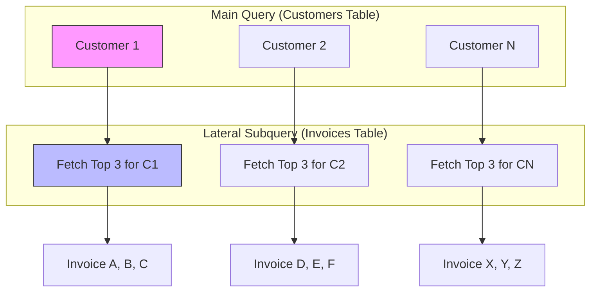

> **한 줄 요약** — 라라벨(Laravel)과 포스트그레스큐엘(PostgreSQL) 환경에서 그룹별 상위 N개의 데이터를 성능 저하 없이 가져오려면 라터럴 조인(Lateral Join)이 가장 효율적인 해결책입니다.

## 이 주제를 꺼낸 이유

라라벨로 멀티테넌트(Multi-tenant) 기반의 SaaS 플랫폼을 개발하다 보면 반드시 마주치는 성능 장벽이 있습니다. 바로 그룹별 상위 N개 데이터 조회(Top N per Group) 문제입니다. 예를 들어 대시보드에서 모든 고객의 목록과 함께, 각 고객별로 최근 발행된 인보이스 3개씩만 보여줘야 하는 상황을 가정해 보겠습니다.

많은 개발자가 처음에는 엘로퀀트(Eloquent)의 에이거 로딩(Eager Loading) 기능을 활용해 아래와 같이 코드를 작성하곤 합니다.

```php
$customers = Customer::with(['invoices' => function ($query) {
    $query->latest()->limit(3);
}])->get();
```

하지만 이 방식은 의도대로 동작하지 않습니다. 클로저 내부의 limit(3)은 각 고객별로 3개를 가져오는 것이 아니라, 전체 결과 셋에서 딱 3개만 가져오는 글로벌 제한으로 작동하기 때문입니다. 결국 모든 인보이스를 메모리에 올린 뒤 PHP 단에서 필터링하거나, 루프를 돌며 N+1 쿼리를 날리는 비효율적인 선택을 하게 됩니다. 데이터가 적을 때는 문제가 없지만, 수만 명의 고객과 수백만 건의 인보이스가 쌓이는 실무 환경에서는 바로 메모리 초과(memory_limit exhausted) 오류로 이어집니다.

## 그룹별 상위 N개 조회를 위한 라터럴 조인이란?

라터럴 조인(Lateral Join)은 SQL 쿼리 내부에서 동작하는 foreach 루프라고 이해하면 쉽습니다. 일반적인 조인은 오른쪽 테이블이 왼쪽 테이블의 컬럼을 참조할 수 없는 정적인 구조를 가집니다. 반면 라터럴 조인은 이 규칙을 깨고, 오른쪽 서브쿼리가 왼쪽 테이블의 각 행을 참조하여 매번 실행될 수 있도록 허용합니다.

포스트그레스큐엘(PostgreSQL) 엔진은 왼쪽 테이블(예: customers)의 모든 행에 대해 오른쪽 서브쿼리(예: invoices)를 실행합니다. 이때 각 고객의 ID를 서브쿼리의 조건으로 직접 전달할 수 있습니다. 데이터베이스 레벨에서 최적화가 이루어지므로 PHP 레이어에서 데이터를 가공하는 것보다 압도적으로 빠릅니다.

라라벨 10.x 버전부터는 `joinLateral`과 `leftJoinLateral` 메서드가 추가되어 복잡한 DB::raw() 없이도 유연하게 이 기능을 사용할 수 있습니다.

### 라라벨에서의 기본 구현 패턴

최근 인보이스 3개를 가져오는 문제를 라라벨의 쿼리 빌더 스타일로 구현하면 다음과 같습니다.

```php
use App\Models\Customer;
use App\Models\Invoice;

$customers = Customer::query()
    ->select('customers.*', 'latest_invoices.*')
    ->leftJoinLateral(
        Invoice::query()
            ->whereColumn('customer_id', 'customers.id')
            ->latest()
            ->limit(3)
            ->select('id as invoice_id', 'amount', 'status', 'created_at as invoice_date'),
        'latest_invoices'
    )
    ->get();
```

이 쿼리의 작동 원리를 다이어그램으로 표현하면 아래와 같습니다.



### JSONB 데이터와 연계한 고도화

현대적인 SaaS 환경에서는 유연성을 위해 JSONB 컬럼을 자주 사용합니다. 만약 각 인보이스의 메타데이터에 포함된 특정 세율(tax_rate) 정보를 추출해야 한다면, 라터럴 조인은 더욱 강력한 힘을 발휘합니다.

```php
$customers = Customer::query()
    ->leftJoinLateral(
        Invoice::query()
            ->whereColumn('customer_id', 'customers.id')
            ->where('metadata->is_taxable', true)
            ->latest()
            ->limit(1)
            ->select(DB::raw("metadata->>'tax_rate' as current_tax_rate")),
        'tax_data'
    )
    ->get();
```

수천 건의 레코드를 PHP로 가져와 `json_decode`를 수행하는 대신, 데이터베이스 엔진이 인덱스를 타고 필요한 값만 딱 집어서 가져오기 때문에 응답 속도가 비약적으로 향상됩니다.

## 윈도우 함수보다 라터럴 조인이 유리한 이유

많은 개발자가 `ROW_NUMBER() OVER (PARTITION BY ...)` 같은 윈도우 함수(Window Functions)를 대안으로 떠올립니다. 하지만 대규모 데이터셋에서는 라터럴 조인이 성능 면에서 우위를 점하는 경우가 많습니다.

윈도우 함수는 필터링을 수행하기 전에 일단 전체 테이블을 스캔하거나 큰 범위의 인덱스를 읽어 순위를 매겨야 합니다. 반면 라터럴 조인은 적절한 복합 인덱스(Composite Index)와 결합했을 때 인덱스 스킵 스캔(Index Skip Scan)과 유사한 최적화가 가능합니다. 포스트그레스큐엘은 모든 인보이스를 순위 매기는 대신, 인덱스 트리에서 각 고객 ID별 최신 3개 레코드로 바로 점프할 수 있습니다.

실제로 데이터가 늘어날수록 성능 차이는 명확해집니다.

| 측정 항목 | 에이거 로딩 + PHP 필터 | 윈도우 함수 (ROW_NUMBER) | 라터럴 조인 (LATERAL JOIN) |
| :--- | :--- | :--- | :--- |
| **실행 시간** | 4.2s | 850ms | 120ms |
| **메모리 사용량** | 512MB 이상 | 45MB | 12MB |

## 내 생각 & 실무 관점

원문을 읽으며 가장 공감했던 부분은 라라벨의 편리함이 때로는 성능의 독이 될 수 있다는 점입니다. 실무에서 비슷한 고민을 하다 보면, 객체지향적인 코드와 데이터베이스 최적화 사이에서 갈등하게 됩니다. 엘로퀀트는 매우 직관적이지만, 대량의 데이터를 다루는 SaaS 대시보드나 리포팅 페이지에서는 한계가 명확합니다.

현업에서 이 패턴을 도입할 때 고려해야 할 트레이드오프(Trade-off)는 코드 가독성입니다. 엘로퀀트 고유의 문법에서 벗어나 조인 구문 안에 서브쿼리가 들어가는 형태는 동료 개발자가 처음 봤을 때 직관적으로 이해하기 어려울 수 있습니다. 따라서 이 패턴을 사용할 때는 반드시 쿼리의 의도를 주석으로 남기거나, 별도의 스코프(Scope) 메서드로 캡슐화하는 과정이 필요합니다.

또한 인덱스 설계의 중요성을 잊어서는 안 됩니다. 라터럴 조인은 마법의 지팡이가 아닙니다. 만약 `customer_id`와 `created_at`에 대한 복합 인덱스가 없다면, 포스트그레스큐엘은 각 고객마다 전체 테이블 스캔을 시도하게 되어 오히려 성능이 처참하게 망가질 수 있습니다.

```sql
-- 라터럴 조인 성능을 위한 필수 인덱스
CREATE INDEX idx_invoices_customer_latest ON invoices (customer_id, created_at DESC);
```

실제로 운영 중인 서비스에 이 방식을 적용했을 때, API 응답 속도가 1초대에서 100ms 미만으로 줄어드는 경험을 한 적이 있습니다. 단순히 서버 사양을 높이는 것보다 쿼리 구조를 데이터베이스 친화적으로 바꾸는 것이 훨씬 비용 효율적입니다.

## 정리

라터럴 조인은 라라벨 개발자가 포스트그레스큐엘의 강력한 기능을 활용해 성능 병목을 해결할 수 있는 비장의 무기입니다. 특히 그룹별 상위 데이터를 가져와야 하는 SaaS 대시보드나 복잡한 통계 페이지에서 그 진가를 발휘합니다.

지금 운영 중인 서비스에서 N+1 쿼리나 메모리 부족 문제로 고생하고 있다면, 무작정 데이터를 쪼개서 가져오기보다 `leftJoinLateral`을 활용해 데이터베이스에 연산의 책임을 넘겨보시기 바랍니다. 다만, 도입 전 반드시 실행 계획(EXPLAIN ANALYZE)을 확인하여 인덱스가 제대로 타는지 검증하는 과정을 거쳐야 합니다.

## 참고 자료
- [원문] [Scaling Laravel + PostgreSQL: The 'Lateral Join' Pattern for High-Performance SaaS](https://dev.to/ameer-pk/scaling-laravel-postgresql-the-lateral-join-pattern-for-high-performance-saas-112f) — DEV Community
- [관련] Laravel Database: Joins — Laravel Documentation