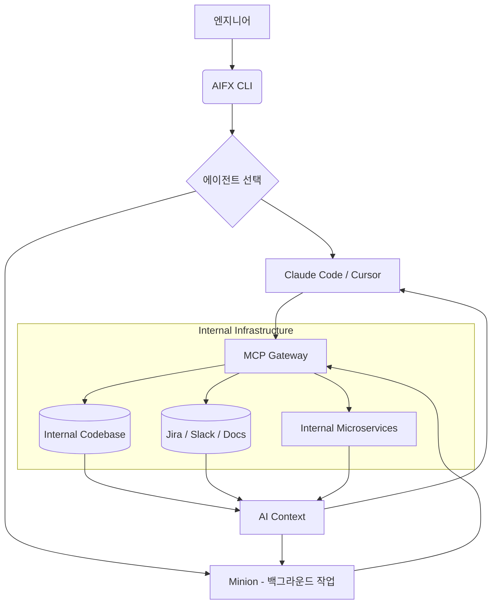

> **한 줄 요약** — 우버는 단순한 코드 완성을 넘어 자율형 에이전트(AI Agents)를 엔지니어링 워크플로우 전반에 통합하며 인프라 수준의 대응을 이어가고 있습니다.

## 우버가 에이전트 기반 개발 환경에 집중하는 이유
우버(Uber)의 엔지니어링 팀은 더 이상 AI를 단순한 자동 완성 도구로 보지 않습니다. 최근 공개된 내부 데이터에 따르면 우버 개발자의 84%가 에이전트 방식의 코딩 도구를 사용하며, IDE 내에서 생성되는 코드의 65~72%가 AI의 손을 거칩니다. 특히 클로드 코드(Claude Code)와 같은 CLI 기반 에이전트 사용량이 3개월 만에 두 배 가까이 급증했다는 점은 시사하는 바가 큽니다.

단순히 코드를 대신 써주는 수준을 넘어 복잡한 마이그레이션이나 테스트 코드 생성 같은 지루한 작업(Toil)을 AI에게 맡기려는 시도가 이어지고 있습니다. 이는 개발자가 더 창의적인 설계와 비즈니스 로직에 집중할 수 있는 환경을 만들기 위함입니다. 하지만 이러한 변화는 급격한 토큰 비용 상승과 코드 품질 관리라는 새로운 숙제를 던져주고 있습니다.

## 우버의 AI 에이전트 아키텍처와 내부 도구
우버는 AI 에이전트가 내부 데이터에 안전하고 효율적으로 접근할 수 있도록 네 가지 계층으로 구성된 에이전트 시스템(Agentic System)을 구축했습니다. 가장 핵심이 되는 부분은 모델 컨텍스트 프로토콜(MCP, Model Context Protocol) 게이트웨이입니다. 이를 통해 내부의 다양한 데이터 소스를 AI 에이전트가 이해할 수 있는 표준화된 방식으로 연결합니다.

우버가 구축한 주요 내부 도구는 다음과 같습니다.

- **MCP 게이트웨이(MCP Gateway)**: 내부의 Thrift, Protobuf, HTTP 엔드포인트를 MCP 서버로 노출하여 에이전트가 우버의 내부 서비스와 직접 소통하게 합니다.
- **미니언(Minion)**: 백그라운드에서 실행되는 에이전트 플랫폼으로, 개발자가 자리를 비운 사이에도 모노레포에 접근해 작업을 수행합니다.
- **셰퍼드(Shepherd)**: 대규모 코드 마이그레이션을 엔드 투 엔드로 관리하는 에이전트입니다.
- **uReview**: AI가 생성한 코드 리뷰 코멘트 중 유의미한 신호만 필터링하여 개발자에게 전달합니다.

### 우버의 에이전트 워크플로우 구조

우버의 개발자들은 AIFX CLI라는 통합 도구를 통해 에이전트를 프로비저닝하고 필요한 MCP 서버를 찾습니다. 과거에는 IDE 안에서 혼자 코드를 썼다면, 이제는 여러 에이전트에게 병렬적으로 작업을 지시하고 결과를 오케스트레이션(Orchestration)하는 방식으로 변하고 있습니다.

## 실무에서 마주하는 AI 도입의 명과 암
우버의 사례에서 가장 현실적으로 다가온 부분은 토큰 비용의 폭증입니다. 2024년 이후 AI 관련 비용이 6배나 뛰었다는 수치는 실무적으로 매우 뼈아픈 지점입니다. 많은 기업이 AI 도입 초기에는 생산성 향상에만 주목하지만, 실제 운영 단계에 들어서면 비용 최적화가 가장 큰 우선순위가 됩니다.

현업에서 비슷한 고민을 하다 보면 AI가 생성한 코드의 양이 늘어나는 것이 곧 생산성으로 직결되지 않는다는 것을 알게 됩니다. 우버에서도 AI 헤비 유저들이 일반 개발자보다 52% 더 많은 풀 리퀘스트(PR)를 생성한다고 하지만, 이것이 전체적인 제품의 품질 향상으로 이어졌는지는 별개의 문제입니다. 오히려 검토해야 할 코드의 양이 늘어나면서 코드 리뷰어들의 피로도가 높아지는 부작용이 발생할 수 있습니다.

실제로 아마존(Amazon)과 같은 곳에서는 AI 에이전트가 유발한 서비스 장애(SEV) 때문에 주니어 엔지니어의 AI 수정 사항에 대해 시니어의 승인을 강제하는 절차를 도입하기도 했습니다. 우버가 uReview나 Code Inbox 같은 도구를 별도로 만든 이유도 결국 AI가 만들어내는 노이즈를 제어하기 위한 고육지책이라 볼 수 있습니다.

에이전트 기반 개발로 전환할 때 주의할 점은 다음과 같습니다.

| 구분 | 고려 사항 | 실무적 관점 |
| :--- | :--- | :--- |
| 비용 관리 | 토큰 사용량 모니터링 | 무분별한 에이전트 호출은 인프라 비용의 주범이 됨 |
| 코드 품질 | AI 생성 코드의 신뢰성 | 테스트 자동화(Autocover)와 엄격한 리뷰 프로세스 필수 |
| 컨텍스트 | 내부 데이터 접근 권한 | MCP와 같은 표준 프로토콜을 통한 보안 및 권한 제어 |
| 가독성 | 기술 부채의 증가 | AI는 동작하는 코드를 짜지만 유지보수가 쉬운 코드를 짜지는 않음 |

결국 기술적 복잡성이 높아질수록 아키텍처를 설계하고 코드의 의도를 파악하는 엔지니어의 역량이 더 중요해집니다. 에이전트가 코드를 대신 작성해줄 순 있지만, 그 코드가 시스템 전체의 안정성에 어떤 영향을 미칠지 판단하는 책임은 여전히 사람에게 있기 때문입니다.

## 에이전트 시대를 준비하는 엔지니어의 자세
우버의 사례는 AI 도구를 단순히 개별 개발자가 사용하는 단계를 넘어, 기업 차원에서 에이전트 전용 인프라를 구축해야 하는 단계에 왔음을 보여줍니다. MCP 게이트웨이처럼 에이전트가 내부 시스템을 이해할 수 있는 통로를 표준화하는 작업은 앞으로 모든 테크 기업의 필수 과제가 될 가능성이 높습니다.

지금 당장 실무에 적용해볼 수 있는 것은 자신이 작성하는 코드와 문서가 AI 에이전트에게 얼마나 친화적인지 점검해보는 일입니다. 에이전트가 컨텍스트를 정확히 파악할 수 있도록 명확한 명명 규칙을 준수하고, 인터페이스 정의를 엄격히 하는 습관은 AI와 협업하는 시대에 가장 강력한 무기가 될 것입니다. 또한 늘어나는 AI 생성 코드 속에서 핵심 로직을 빠르게 간파하는 안목을 기르는 것이 무엇보다 필요합니다.

## 참고 자료
- [원문] [How Uber uses AI for development: inside look](https://newsletter.pragmaticengineer.com/p/how-uber-uses-ai-for-development) — The Pragmatic Engineer
- [관련] Are AI agents actually slowing us down? — The Pragmatic Engineer
- [관련] The Pulse: What will the Staff Engineer role look like in 2027 and beyond? — The Pragmatic Engineer
- [관련] How to Build Your First AI Agent in 2026: A Practical Guide — DEV Community